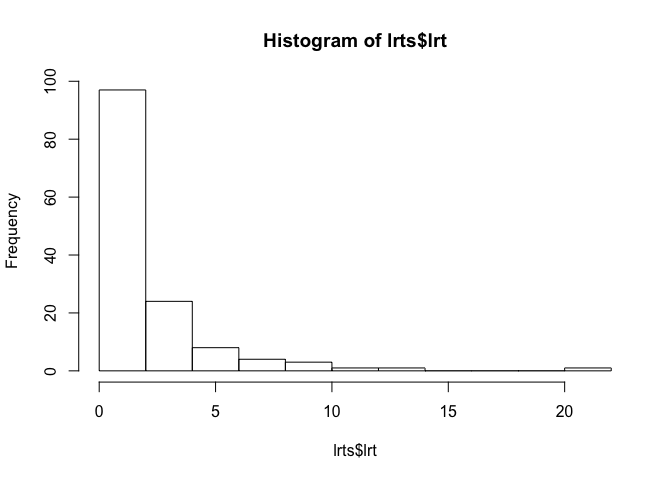

Hnf4a analysis: 139 nonlocal traits in chromosome 2 hotspot
================
Frederick Boehm
9/26/2018

``` r
library(qtl2pleio)
library(qtl2chtc)
library(tidyverse)
```

    ## ── Attaching packages ─────────────────────────────────────────────────────── tidyverse 1.2.1 ──

    ## ✔ ggplot2 3.0.0     ✔ purrr   0.2.5
    ## ✔ tibble  1.4.2     ✔ dplyr   0.7.6
    ## ✔ tidyr   0.8.1     ✔ stringr 1.3.1
    ## ✔ readr   1.1.1     ✔ forcats 0.3.0

    ## ── Conflicts ────────────────────────────────────────────────────────── tidyverse_conflicts() ──
    ## ✖ dplyr::filter() masks stats::filter()
    ## ✖ dplyr::lag()    masks stats::lag()

``` r
calc_lrt_dir("../results/pvl-run2001") -> lrts
```

``` r
lrts %>%
  arrange(desc(lrt))
```

    ## # A tibble: 139 x 2
    ##    fns                                                         lrt
    ##    <chr>                                                     <dbl>
    ##  1 pvl-run2001_124_ENSMUSG00000017950_ENSMUSG00000084099.txt 21.3 
    ##  2 pvl-run2001_93_ENSMUSG00000017950_ENSMUSG00000045281.txt  13.8 
    ##  3 pvl-run2001_128_ENSMUSG00000017950_ENSMUSG00000089906.txt 11.3 
    ##  4 pvl-run2001_121_ENSMUSG00000017950_ENSMUSG00000082180.txt  9.98
    ##  5 pvl-run2001_122_ENSMUSG00000017950_ENSMUSG00000082530.txt  8.92
    ##  6 pvl-run2001_108_ENSMUSG00000017950_ENSMUSG00000062480.txt  8.27
    ##  7 pvl-run2001_87_ENSMUSG00000017950_ENSMUSG00000042444.txt   7.94
    ##  8 pvl-run2001_81_ENSMUSG00000017950_ENSMUSG00000040420.txt   7.90
    ##  9 pvl-run2001_91_ENSMUSG00000017950_ENSMUSG00000044362.txt   6.93
    ## 10 pvl-run2001_126_ENSMUSG00000017950_ENSMUSG00000086549.txt  6.27
    ## # ... with 129 more rows

``` r
hist(lrts$lrt)
```

<!-- -->
