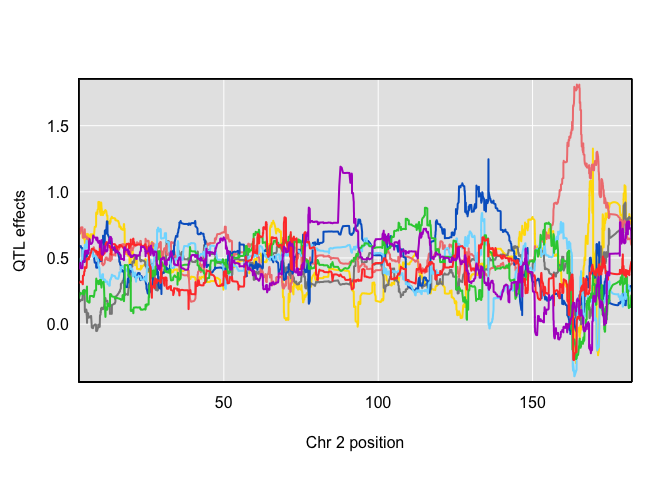
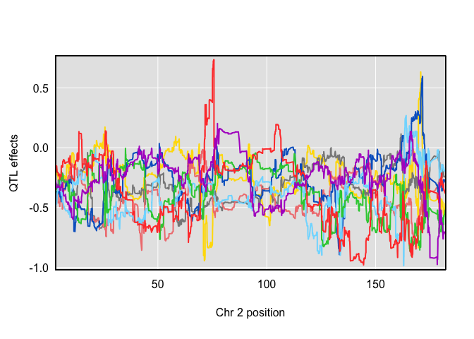

Comparing LRT for pleiotropy v separate QTL against LOD drop in
mediation analyses
================
Frederick Boehm
10/7/2018

Our goal here is to examine the relationships between pleiotropy v
separate QTL analyses and mediation analyses. We study with these
methods the chromosome 2 hotspot in the Keller et al 2018 pancreatic
islet expression
    data.

``` r
library(tidyverse)
```

    ## ── Attaching packages ────────────────────────────────────────────────────── tidyverse 1.2.1 ──

    ## ✔ ggplot2 3.1.0     ✔ purrr   0.2.5
    ## ✔ tibble  1.4.2     ✔ dplyr   0.7.7
    ## ✔ tidyr   0.8.2     ✔ stringr 1.3.1
    ## ✔ readr   1.1.1     ✔ forcats 0.3.0

    ## ── Conflicts ───────────────────────────────────────────────────────── tidyverse_conflicts() ──
    ## ✖ dplyr::filter() masks stats::filter()
    ## ✖ dplyr::lag()    masks stats::lag()

``` r
library(qtl2)
```

    ## 
    ## Attaching package: 'qtl2'

    ## The following object is masked from 'package:readr':
    ## 
    ##     read_csv

First, we load the Keller 2018 data.

``` r
load("../data-to-ignore/Attie_DO378_eQTL_viewer_v1.Rdata")
readRDS("../data/hotspot_expr_tib2_keller_chr2.rds") -> hotspot_expr
readRDS("../data/keller2018-chr2-local-expr.rds") -> local_expr
```

We get the annotation information on the genes that map to chromosome
2’s hotspot.

``` r
dataset.islet.rnaseq$annots %>%
  filter(hotspot == "chr2")
```

    ##                gene_id        symbol chr      start        end strand
    ## 1   ENSMUSG00000000544         Gpa33   1 166.130238 166.166510      1
    ## 2   ENSMUSG00000002032        Tmem25   9  44.793776  44.799307     -1
    ## 3   ENSMUSG00000003352        Cacnb3  15  98.632220  98.644530      1
    ## 4   ENSMUSG00000003360         Ddx23  15  98.645134  98.662889     -1
    ## 5   ENSMUSG00000003585       Sec14l2  11   4.097039   4.123415     -1
    ## 6   ENSMUSG00000004748         Mtfp1  11   4.091480   4.095445     -1
    ## 7   ENSMUSG00000006373        Pgrmc1   X  36.598206  36.606079      1
    ## 8   ENSMUSG00000015766          Eps8   6 137.477245 137.654876     -1
    ## 9   ENSMUSG00000017453         Pipox  11  77.880615  77.894096     -1
    ## 10  ENSMUSG00000017493        Igfbp4  11  99.041244  99.054392      1
    ## 11  ENSMUSG00000018126      Baiap2l2  15  79.258195  79.285537     -1
    ## 12  ENSMUSG00000019762           Iyd  10   3.540240   3.554877      1
    ## 13  ENSMUSG00000020182           Ddc  11  11.814101  11.898144     -1
    ## 14  ENSMUSG00000020346         Mgat1  11  49.244191  49.263030      1
    ## 15  ENSMUSG00000020614        Fam20a  11 109.669749 109.722279     -1
    ## 16  ENSMUSG00000020623        Map2k6  11 110.399122 110.525522      1
    ## 17  ENSMUSG00000020627        Klhl29  12   5.077472   5.375682     -1
    ## 18  ENSMUSG00000020733      Slc9a3r1  11 115.163341 115.181181      1
    ## 19  ENSMUSG00000020752        Recql5  11 115.892595 115.933477     -1
    ## 20  ENSMUSG00000020821         Kif1c  11  70.700548  70.731964      1
    ## 21  ENSMUSG00000020841           Cpd  11  76.778424  76.847018     -1
    ## 22  ENSMUSG00000021263         Degs2  12 108.686792 108.702306     -1
    ## 23  ENSMUSG00000021944         Gata4  14  63.198922  63.271692     -1
    ## 24  ENSMUSG00000022383         Ppara  15  85.734983  85.802819      1
    ## 25  ENSMUSG00000022824         Muc13  16  33.794037  33.819934      1
    ## 26  ENSMUSG00000023959         Clic5  17  44.188572  44.280168      1
    ## 27  ENSMUSG00000024029          Tff3  17  31.125306  31.129646     -1
    ## 28  ENSMUSG00000024331          Dsc2  18  20.030633  20.059554     -1
    ## 29  ENSMUSG00000024388         Myo7b  18  31.959234  32.036961     -1
    ## 30  ENSMUSG00000024527        Afg3l2  18  67.404767  67.449166     -1
    ## 31  ENSMUSG00000024553         Galr1  18  82.392496  82.406777     -1
    ## 32  ENSMUSG00000024777       Ppp2r5b  19   6.227765   6.235872     -1
    ## 33  ENSMUSG00000025207        Sema4g  19  44.989101  45.003397      1
    ## 34  ENSMUSG00000025422         Agap2  10 127.078907 127.093169      1
    ## 35  ENSMUSG00000026024          Als2   1  59.162926  59.237231     -1
    ## 36  ENSMUSG00000026175          Vil1   1  74.409376  74.435559      1
    ## 37  ENSMUSG00000026176        Ctdsp1   1  74.391509  74.397285      1
    ## 38  ENSMUSG00000026640        Plxna2   1 194.619829 194.816869      1
    ## 39  ENSMUSG00000027931          Npr1   3  90.450591  90.465866     -1
    ## 40  ENSMUSG00000028307         Aldob   4  49.535995  49.549546     -1
    ## 41  ENSMUSG00000028434     Epb4.1l4b   4  56.991972  57.143437     -1
    ## 42  ENSMUSG00000028649         Macf1   4 123.349633 123.684360     -1
    ## 43  ENSMUSG00000028737       Aldh4a1   4 139.622866 139.649690      1
    ## 44  ENSMUSG00000029134          Plb1   5  32.232708  32.366520      1
    ## 45  ENSMUSG00000029189        Sel1l3   5  53.107084  53.213452     -1
    ## 46  ENSMUSG00000029269       Sult1b1   5  87.513339  87.538195     -1
    ## 47  ENSMUSG00000029273       Sult1d1   5  87.554645  87.569027     -1
    ## 48  ENSMUSG00000029919         Hpgds   6  65.117293  65.144908     -1
    ## 49  ENSMUSG00000030200       Bcl2l14   6 134.396318 134.438736      1
    ## 50  ENSMUSG00000030313       Dennd5b   6 148.988071 149.101680     -1
    ## 51  ENSMUSG00000030314          Atg7   6 114.643097 114.860614      1
    ## 52  ENSMUSG00000030838         Ush1c   7  46.195350  46.238503     -1
    ## 53  ENSMUSG00000031161         Hdac6   X   7.930120   7.947889     -1
    ## 54  ENSMUSG00000031668       Eif2ak3   6  70.844515  70.905245      1
    ## 55  ENSMUSG00000031827         Cotl1   8 119.809225 119.840579     -1
    ## 56  ENSMUSG00000032091       Tmprss4   9  45.172726  45.204092     -1
    ## 57  ENSMUSG00000032246        Calml4   9  62.858104  62.875918      1
    ## 58  ENSMUSG00000032358        Fam83b   9  76.490054  76.567116     -1
    ## 59  ENSMUSG00000032359          Ctsh   9  90.054152  90.076089      1
    ## 60  ENSMUSG00000033577          Myo6   9  80.165031  80.311729      1
    ## 61  ENSMUSG00000033721          Vav3   3 109.340653 109.685698      1
    ## 62  ENSMUSG00000034295         Fhod3  18  24.709445  25.133500      1
    ## 63  ENSMUSG00000034427        Myo15b  11 115.861612 115.892603      1
    ## 64  ENSMUSG00000034570        Inpp5j  11   3.494375   3.504821     -1
    ## 65  ENSMUSG00000034687         Fras1   5  96.373955  96.784728      1
    ## 66  ENSMUSG00000034714         Ttyh2  11 114.675431 114.720977      1
    ## 67  ENSMUSG00000034918         Cdhr2  13  54.701461  54.736662      1
    ## 68  ENSMUSG00000035852          Misp  10  79.821021  79.830452      1
    ## 69  ENSMUSG00000036098          Myrf  19  10.208272  10.240748     -1
    ## 70  ENSMUSG00000036206        Sh3bp4   1  89.070415  89.155068      1
    ## 71  ENSMUSG00000036526        Card11   5 140.872999 141.000596     -1
    ## 72  ENSMUSG00000036817          Sun1   5 139.200637 139.249840      1
    ## 73  ENSMUSG00000037295       Ldlrap1   4 134.744735 134.768024     -1
    ## 74  ENSMUSG00000037400        Atp11b   3  35.754134  35.856274      1
    ## 75  ENSMUSG00000037428           Vgf   5 137.030295 137.033351      1
    ## 76  ENSMUSG00000037653         Kctd8   5  69.109285  69.341709     -1
    ## 77  ENSMUSG00000038009       Dnajc22  15  99.093170  99.104737      1
    ## 78  ENSMUSG00000038225       Ccdc111   8  46.575579  46.617212     -1
    ## 79  ENSMUSG00000038370        Pcp4l1   1 171.173262 171.196268     -1
    ## 80  ENSMUSG00000038515         Grtp1   8  13.176869  13.200624     -1
    ## 81  ENSMUSG00000039238        Zfp750  11 121.510978 121.519333     -1
    ## 82  ENSMUSG00000040420         Cdh18  15  22.549022  23.474418      1
    ## 83  ENSMUSG00000040964     Arhgef10l   4 140.514485 140.666012     -1
    ## 84  ENSMUSG00000041323           Ak7  12 105.705982 105.782447      1
    ## 85  ENSMUSG00000041372      B4galnt3   6 120.203073 120.294559     -1
    ## 86  ENSMUSG00000042078          Svop   5 114.026910 114.091570     -1
    ## 87  ENSMUSG00000042096           Dao   5 114.003703 114.025449      1
    ## 88  ENSMUSG00000042444        Fam63b   9  70.599014  70.657174     -1
    ## 89  ENSMUSG00000042476         Abcb4   5   8.893721   8.959225      1
    ## 90  ENSMUSG00000042616         Oscp1   4 126.058565 126.092195      1
    ## 91  ENSMUSG00000042638        Gucy2c   6 136.697285 136.781765     -1
    ## 92  ENSMUSG00000044362        Ccdc89   7  90.426312  90.428660      1
    ## 93  ENSMUSG00000044707         Ccnjl  11  43.528784  43.586997      1
    ## 94  ENSMUSG00000045281         Gpr20  15  73.694604  73.707505     -1
    ## 95  ENSMUSG00000045284      Dcaf12l1   X  44.786570  44.790197     -1
    ## 96  ENSMUSG00000045414 1190002N15Rik   9  94.517864  94.538081     -1
    ## 97  ENSMUSG00000048442         Smim5  11 115.899966 115.906269      1
    ## 98  ENSMUSG00000048490         Nrip1  16  76.287400  76.373827     -1
    ## 99  ENSMUSG00000048905 4930539E08Rik  17  28.896397  28.915324     -1
    ## 100 ENSMUSG00000049091        Sephs2   7 127.272561 127.273919     -1
    ## 101 ENSMUSG00000050822       Slc29a4   5 142.702101 142.722490      1
    ## 102 ENSMUSG00000050866         Clrn3   7 135.511466 135.528654     -1
    ## 103 ENSMUSG00000051375         Pcdh1  18  38.185915  38.212053     -1
    ## 104 ENSMUSG00000052353 9930013L23Rik   7  83.932857  84.086502     -1
    ## 105 ENSMUSG00000052392         Acot4  12  84.038379  84.044723      1
    ## 106 ENSMUSG00000053414          Hunk  16  90.386397  90.499553      1
    ## 107 ENSMUSG00000054693        Adam10   9  70.678997  70.780229      1
    ## 108 ENSMUSG00000057228         Aadat   8  60.506124  60.545677      1
    ## 109 ENSMUSG00000062480         Acat3  17  12.923833  12.940402     -1
    ## 110 ENSMUSG00000063626         Unc5d   8  28.646717  29.219338     -1
    ## 111 ENSMUSG00000063683         Glyat  19  12.633308  12.653911      1
    ## 112 ENSMUSG00000066687        Zbtb16   9  48.654311  48.835945     -1
    ## 113 ENSMUSG00000068854     Hist2h2be   3  96.221121  96.223738      1
    ## 114 ENSMUSG00000069520        Tmem19  10 115.340739 115.362262     -1
    ## 115 ENSMUSG00000070047          Fat1   8  44.950208  45.052257      1
    ## 116 ENSMUSG00000074063        Osgin1   8 119.434124 119.446256      1
    ## 117 ENSMUSG00000074240          Cib3   8  72.204335  72.212837     -1
    ## 118 ENSMUSG00000076431          Sox4  13  28.948919  28.953713     -1
    ## 119 ENSMUSG00000078796        Zfp541   7  16.071942  16.096328      1
    ## 120 ENSMUSG00000079363          Gbp4   5 105.115767 105.139586     -1
    ## 121 ENSMUSG00000079388 2610042L04Rik  14   4.334763   4.354687      1
    ## 122 ENSMUSG00000082180       Gm12230  11  54.947435  54.947888      1
    ## 123 ENSMUSG00000082530       Gm12168  11  46.450980  46.451347     -1
    ## 124 ENSMUSG00000083518        Gm9429   X   8.034212   8.035079      1
    ## 125 ENSMUSG00000084099       Gm12929   4 126.476302 126.476671     -1
    ## 126 ENSMUSG00000085007       Gm11549   3  36.515057  36.521813     -1
    ## 127 ENSMUSG00000086549       Gm13648   4 156.052715 156.059802     -1
    ## 128 ENSMUSG00000089678         Agxt2  15  10.358532  10.410153      1
    ## 129 ENSMUSG00000089906        Gm6428   1  36.601802  36.602146      1
    ## 130 ENSMUSG00000090872        Gm3239  14   4.664192   4.670850      1
    ## 131 ENSMUSG00000090939       Gm17147   6  65.128571  65.129002      1
    ## 132 ENSMUSG00000091568        Gm8206  14   6.016759   6.038209     -1
    ## 133 ENSMUSG00000091756        Gm3095  14   3.963547   3.970207      1
    ## 134 ENSMUSG00000093898        Gm3629  14   6.583959   6.874257     -1
    ## 135 ENSMUSG00000094628        Gm3252  14   4.726775   4.747493      1
    ## 136 ENSMUSG00000095681        Gm8281  14   5.071040   5.093318      1
    ## 137 ENSMUSG00000096793        Gm3002  14   3.810074   3.966518      1
    ## 138 ENSMUSG00000097127       Gm26886  14   3.822531   3.884087     -1
    ## 139 ENSMUSG00000097958        Gm8492  17   9.320395   9.321381     -1
    ##         middle nearest.marker.id              biotype         module
    ## 1   166.148374       1_166175328       protein_coding           grey
    ## 2    44.796542        9_44907739       protein_coding         purple
    ## 3    98.638375       15_98637786       protein_coding          black
    ## 4    98.654012       15_98654559       protein_coding        darkred
    ## 5     4.110227        11_4152329       protein_coding           grey
    ## 6     4.093462        11_4059120       protein_coding      turquoise
    ## 7    36.602142        X_36601896       protein_coding          green
    ## 8   137.566060       6_137496223       protein_coding            red
    ## 9    77.887356       11_77931903       protein_coding    greenyellow
    ## 10   99.047818       11_99061867       protein_coding    greenyellow
    ## 11   79.271866       15_79466906       protein_coding           grey
    ## 12    3.547558        10_3557254       protein_coding       darkgrey
    ## 13   11.856122       11_11852460       protein_coding          brown
    ## 14   49.253610       11_49307545       protein_coding         yellow
    ## 15  109.696014      11_109696100       protein_coding         yellow
    ## 16  110.462322      11_110473207       protein_coding           grey
    ## 17    5.226577        12_5346973       protein_coding         yellow
    ## 18  115.172261      11_115173327       protein_coding           grey
    ## 19  115.913036      11_115923957       protein_coding         purple
    ## 20   70.716256       11_70728481       protein_coding          black
    ## 21   76.812721       11_76717210       protein_coding           pink
    ## 22  108.694549      12_108722686       protein_coding           grey
    ## 23   63.235307       14_63183201       protein_coding       darkgrey
    ## 24   85.768901       15_85744532       protein_coding           grey
    ## 25   33.806986       16_33822222       protein_coding      royalblue
    ## 26   44.234370       17_44070746       protein_coding        magenta
    ## 27   31.127476       17_31127745       protein_coding           grey
    ## 28   20.045094       18_20031679       protein_coding          brown
    ## 29   31.998098       18_31966977       protein_coding    yellowgreen
    ## 30   67.426966       18_67390579       protein_coding        darkred
    ## 31   82.399636       18_82346839       protein_coding           grey
    ## 32    6.231818        19_6205523       protein_coding          black
    ## 33   44.996249       19_44938797       protein_coding         yellow
    ## 34  127.086038      10_127086625       protein_coding           grey
    ## 35   59.200078        1_59158177       protein_coding           grey
    ## 36   74.422468        1_74424810       protein_coding            red
    ## 37   74.394397        1_74388955       protein_coding         grey60
    ## 38  194.718349       1_194576403       protein_coding    saddlebrown
    ## 39   90.458228        3_90438761       protein_coding          black
    ## 40   49.542770        4_49532869       protein_coding           grey
    ## 41   57.067704        4_57069475       protein_coding           grey
    ## 42  123.516996       4_123347784       protein_coding    saddlebrown
    ## 43  139.636278       4_139638987       protein_coding         purple
    ## 44   32.299614        5_32323492       protein_coding           grey
    ## 45   53.160268        5_53154364       protein_coding         yellow
    ## 46   87.525767        5_87318825       protein_coding           grey
    ## 47   87.561836        5_87762267       protein_coding           grey
    ## 48   65.131100        6_65185132       protein_coding           grey
    ## 49  134.417527       6_134397323       protein_coding           grey
    ## 50  149.044876       6_149186501       protein_coding           grey
    ## 51  114.751856       6_114807823       protein_coding         grey60
    ## 52   46.216926        7_46280163       protein_coding           grey
    ## 53    7.939004         X_7941585       protein_coding         purple
    ## 54   70.874880        6_70877098       protein_coding darkolivegreen
    ## 55  119.824902       8_119824486       protein_coding           blue
    ## 56   45.188409        9_45210468       protein_coding         yellow
    ## 57   62.867011        9_62944510       protein_coding           grey
    ## 58   76.528585        9_76500010       protein_coding           grey
    ## 59   90.065120        9_90024007       protein_coding           grey
    ## 60   80.238380        9_80236002       protein_coding           pink
    ## 61  109.513176       3_109512586       protein_coding           grey
    ## 62   24.921472       18_25080663       protein_coding           grey
    ## 63  115.877108      11_115835369       protein_coding           grey
    ## 64    3.499598        11_3454184       protein_coding         yellow
    ## 65   96.579342        5_96572141       protein_coding  darkturquoise
    ## 66  114.698204      11_114690549       protein_coding          black
    ## 67   54.719062       13_54717917       protein_coding    greenyellow
    ## 68   79.825736       10_79831010       protein_coding        magenta
    ## 69   10.224510       19_10221349       protein_coding    greenyellow
    ## 70   89.112742        1_89083210       protein_coding darkolivegreen
    ## 71  140.936798       5_140936564       protein_coding           grey
    ## 72  139.225238       5_139215508       protein_coding           pink
    ## 73  134.756380       4_134751908       protein_coding         yellow
    ## 74   35.805204        3_35928964       protein_coding      turquoise
    ## 75  137.031823       5_137013914       protein_coding     orangered4
    ## 76   69.225497        5_69244496       protein_coding            tan
    ## 77   99.098954       15_99096703       protein_coding           grey
    ## 78   46.596396        8_46539518       protein_coding          green
    ## 79  171.184765       1_171184444       protein_coding           grey
    ## 80   13.188746        8_13209235       protein_coding          brown
    ## 81  121.515156      11_121517180       protein_coding           grey
    ## 82   23.011720       15_23040344       protein_coding    greenyellow
    ## 83  140.590248       4_140590537       protein_coding         yellow
    ## 84  105.744214      12_105722562       protein_coding           grey
    ## 85  120.248816       6_120177600       protein_coding           grey
    ## 86  114.059240       5_114111853       protein_coding          black
    ## 87  114.014576       5_114111853       protein_coding           grey
    ## 88   70.628094        9_70614608       protein_coding     lightgreen
    ## 89    8.926473         5_8931349       protein_coding          brown
    ## 90  126.075380       4_126074510       protein_coding      turquoise
    ## 91  136.739525       6_136733632       protein_coding          brown
    ## 92   90.427486        7_90450625       protein_coding           grey
    ## 93   43.557890       11_43613493       protein_coding           grey
    ## 94   73.701054       15_73659987       protein_coding           grey
    ## 95   44.788384        X_44801022       protein_coding         yellow
    ## 96   94.527972        9_94495914       protein_coding      turquoise
    ## 97  115.903118      11_115923957       protein_coding         yellow
    ## 98   76.330614       16_76344250       protein_coding           grey
    ## 99   28.905860       17_29049926       protein_coding      royalblue
    ## 100 127.273240       7_127361439       protein_coding         yellow
    ## 101 142.712296       5_142726186       protein_coding         purple
    ## 102 135.520060       7_135538209       protein_coding           grey
    ## 103  38.198984       18_38193631       protein_coding          black
    ## 104  84.009680        7_83978387       protein_coding     lightgreen
    ## 105  84.041551       12_84015575       protein_coding           grey
    ## 106  90.442975       16_90426989       protein_coding           grey
    ## 107  70.729613        9_70727937       protein_coding      royalblue
    ## 108  60.525900        8_60526333       protein_coding          brown
    ## 109  12.932118       17_12911544       protein_coding      turquoise
    ## 110  28.933028        8_29040371       protein_coding    greenyellow
    ## 111  12.643610       19_12788036       protein_coding     lightgreen
    ## 112  48.745128        9_48720706       protein_coding    greenyellow
    ## 113  96.222430        3_96110858       protein_coding          green
    ## 114 115.351500      10_115328485       protein_coding           grey
    ## 115  45.001232        8_44986539       protein_coding         purple
    ## 116 119.440190       8_119439023       protein_coding         yellow
    ## 117  72.208586        8_72329705       protein_coding           grey
    ## 118  28.951316       13_28960280       protein_coding           blue
    ## 119  16.084135        7_16070850       protein_coding           grey
    ## 120 105.127676       5_105137202       protein_coding        magenta
    ## 121   4.344725        14_4347733       protein_coding          plum1
    ## 122  54.947662       11_54909911           pseudogene           grey
    ## 123  46.451164       11_46423983           pseudogene           blue
    ## 124   8.034646         X_8061743           pseudogene           grey
    ## 125 126.476486       4_126475807           pseudogene           grey
    ## 126  36.518435        3_36522678 processed_transcript           grey
    ## 127 156.056258       4_156009474 processed_transcript           grey
    ## 128  10.384342       15_10382082       protein_coding           grey
    ## 129  36.601974        1_36564755           pseudogene           grey
    ## 130   4.667521        14_4674456       protein_coding           grey
    ## 131  65.128786        6_65185132           pseudogene           grey
    ## 132   6.027484        14_6022189       protein_coding          plum1
    ## 133   3.966877        14_3980169       protein_coding           grey
    ## 134   6.729108        14_6716476       protein_coding          plum1
    ## 135   4.737134        14_4756137       protein_coding          plum1
    ## 136   5.082179        14_5082860       protein_coding        magenta
    ## 137   3.888296        14_3898489       protein_coding          plum1
    ## 138   3.853309        14_3857648 processed_transcript          plum1
    ## 139   9.320888        17_9336600           pseudogene           grey
    ##     hotspot
    ## 1      chr2
    ## 2      chr2
    ## 3      chr2
    ## 4      chr2
    ## 5      chr2
    ## 6      chr2
    ## 7      chr2
    ## 8      chr2
    ## 9      chr2
    ## 10     chr2
    ## 11     chr2
    ## 12     chr2
    ## 13     chr2
    ## 14     chr2
    ## 15     chr2
    ## 16     chr2
    ## 17     chr2
    ## 18     chr2
    ## 19     chr2
    ## 20     chr2
    ## 21     chr2
    ## 22     chr2
    ## 23     chr2
    ## 24     chr2
    ## 25     chr2
    ## 26     chr2
    ## 27     chr2
    ## 28     chr2
    ## 29     chr2
    ## 30     chr2
    ## 31     chr2
    ## 32     chr2
    ## 33     chr2
    ## 34     chr2
    ## 35     chr2
    ## 36     chr2
    ## 37     chr2
    ## 38     chr2
    ## 39     chr2
    ## 40     chr2
    ## 41     chr2
    ## 42     chr2
    ## 43     chr2
    ## 44     chr2
    ## 45     chr2
    ## 46     chr2
    ## 47     chr2
    ## 48     chr2
    ## 49     chr2
    ## 50     chr2
    ## 51     chr2
    ## 52     chr2
    ## 53     chr2
    ## 54     chr2
    ## 55     chr2
    ## 56     chr2
    ## 57     chr2
    ## 58     chr2
    ## 59     chr2
    ## 60     chr2
    ## 61     chr2
    ## 62     chr2
    ## 63     chr2
    ## 64     chr2
    ## 65     chr2
    ## 66     chr2
    ## 67     chr2
    ## 68     chr2
    ## 69     chr2
    ## 70     chr2
    ## 71     chr2
    ## 72     chr2
    ## 73     chr2
    ## 74     chr2
    ## 75     chr2
    ## 76     chr2
    ## 77     chr2
    ## 78     chr2
    ## 79     chr2
    ## 80     chr2
    ## 81     chr2
    ## 82     chr2
    ## 83     chr2
    ## 84     chr2
    ## 85     chr2
    ## 86     chr2
    ## 87     chr2
    ## 88     chr2
    ## 89     chr2
    ## 90     chr2
    ## 91     chr2
    ## 92     chr2
    ## 93     chr2
    ## 94     chr2
    ## 95     chr2
    ## 96     chr2
    ## 97     chr2
    ## 98     chr2
    ## 99     chr2
    ## 100    chr2
    ## 101    chr2
    ## 102    chr2
    ## 103    chr2
    ## 104    chr2
    ## 105    chr2
    ## 106    chr2
    ## 107    chr2
    ## 108    chr2
    ## 109    chr2
    ## 110    chr2
    ## 111    chr2
    ## 112    chr2
    ## 113    chr2
    ## 114    chr2
    ## 115    chr2
    ## 116    chr2
    ## 117    chr2
    ## 118    chr2
    ## 119    chr2
    ## 120    chr2
    ## 121    chr2
    ## 122    chr2
    ## 123    chr2
    ## 124    chr2
    ## 125    chr2
    ## 126    chr2
    ## 127    chr2
    ## 128    chr2
    ## 129    chr2
    ## 130    chr2
    ## 131    chr2
    ## 132    chr2
    ## 133    chr2
    ## 134    chr2
    ## 135    chr2
    ## 136    chr2
    ## 137    chr2
    ## 138    chr2
    ## 139    chr2

``` r
# what is the ENSEMBL id for Hnf4a?
hnf4a_id <- "ENSMUSG00000017950"
dataset.islet.rnaseq$covar -> addcovar
```

We save the scan1 outputs, because they take some time to re-run.

``` r
s1_local <- readRDS("../data/s1_local.rds")
s1_hotspot <- readRDS("../data/s1_hotspot.rds")
```

We now search the outputs of `scan1` to identify peaks:

``` r
find_peaks(s1_local, map = map, threshold = 20) -> local_peaks
find_peaks(s1_hotspot, map = map) -> hotspot_peaks
```

``` r
map_chr2_tib <- tibble(pos = map$`2`, index = 1:length(map$`2`))
hnf4a_peak_position <- local_peaks %>%
  filter(lodcolumn == hnf4a_id) %>% 
  left_join(map_chr2_tib, by = "pos") %>%
  select(index) %>% 
  unlist() %>%
  as.numeric()
```

``` r
rna_annot <- dataset.islet.rnaseq$annots %>%
  as_tibble() %>%
  select(gene_id, symbol)
```

## Tabulating the pleiotropy v separate QTL LRT statistics

Our goal is to analyze the results of pvl scan results files from CHTC.

``` r
library(qtl2chtc)
```

``` r
dir(path = "../results/pvl-run2001/", pattern = "*.txt") -> fns
  lrt <- numeric()
  i <- 1
  for (fn in fns){
    read.table(file.path("../results/pvl-run2001/", fn)) -> scan_out
    qtl2pleio::calc_lrt_tib(scan_out) -> lrt[i]
    i <- i + 1
  }
tibble::tibble(fns, lrt) -> r2001
```

Let’s parse the file names in `r2001` into meaningful fields, like gene
names.

``` r
library(stringr)
```

``` r
splitted <- r2001$fns %>% 
  str_split(pattern = "_") 

my_split <- function(string_vec, pattern = ".txt"){
  foo <- str_split(string_vec, pattern)
  sapply(FUN = function(x)x[1], X = foo)
}
res2001 <- sapply(FUN = function(x)x[1:4], X = splitted) %>% 
  t() %>%
  as_tibble() %>%
  rename(run_num = V1, job_num = V2, local_gene_id = V3) %>%
  mutate(nonlocal_gene_id = my_split(V4)) %>%
  select(- V4) %>%
  mutate(lrt = r2001$lrt) %>%
  arrange(desc(lrt)) %>%
  left_join(rna_annot, by = c("nonlocal_gene_id" = "gene_id")) %>%
  rename(nonlocal_gene_symbol = symbol) %>%
  left_join(rna_annot, by = c("local_gene_id" = "gene_id")) %>%
  rename(local_gene_symbol = symbol)
```

``` r
hist(res2001$lrt)
```

<!-- -->

``` r
sum(res2001$lrt > 4)
```

    ## [1] 18

### run 2002: tabulating lrt statistics

``` r
dir(path = "../results/pvl-run2002/", pattern = "*.txt") -> fns
lrt <- numeric()
i <- 1
for (fn in fns){
    read.table(file.path("../results/pvl-run2002/", fn)) -> scan_out
    qtl2pleio::calc_lrt_tib(scan_out) -> lrt[i]
    i <- i + 1
}
tibble::tibble(fns, lrt) -> r2002
```

``` r
splitted <- r2002$fns %>% 
  str_split(pattern = "_") 

res2002 <- sapply(FUN = function(x)x[1:4], X = splitted) %>% 
  t() %>%
  as_tibble() %>%
  rename(run_num = V1, job_num = V2, local_gene_id = V3) %>%
  mutate(nonlocal_gene_id = my_split(V4)) %>%
  select(- V4) %>%
  mutate(lrt = r2002$lrt) %>%
  arrange(desc(lrt)) %>%
  left_join(rna_annot, by = c("nonlocal_gene_id" = "gene_id")) %>%
  rename(nonlocal_gene_symbol = symbol) %>%
  left_join(rna_annot, by = c("local_gene_id" = "gene_id")) %>%
  rename(local_gene_symbol = symbol)
```

``` r
saveRDS(res2002, "../data/pvl-lrt-run2002.rds")
```

``` r
res2002
```

    ## # A tibble: 2,780 x 7
    ##    run_num job_num local_gene_id nonlocal_gene_id   lrt nonlocal_gene_s…
    ##    <chr>   <chr>   <chr>         <chr>            <dbl> <chr>           
    ##  1 pvl-ru… 618     ENSMUSG00000… ENSMUSG00000034…  73.0 Myo15b          
    ##  2 pvl-ru… 1313    ENSMUSG00000… ENSMUSG00000034…  65.2 Myo15b          
    ##  3 pvl-ru… 558     ENSMUSG00000… ENSMUSG00000003…  59.0 Cacnb3          
    ##  4 pvl-ru… 1253    ENSMUSG00000… ENSMUSG00000003…  57.9 Cacnb3          
    ##  5 pvl-ru… 2286    ENSMUSG00000… ENSMUSG00000034…  53.7 Myo15b          
    ##  6 pvl-ru… 2226    ENSMUSG00000… ENSMUSG00000003…  52.0 Cacnb3          
    ##  7 pvl-ru… 1514    ENSMUSG00000… ENSMUSG00000084…  43.1 Gm12929         
    ##  8 pvl-ru… 201     ENSMUSG00000… ENSMUSG00000034…  41.0 Myo15b          
    ##  9 pvl-ru… 141     ENSMUSG00000… ENSMUSG00000003…  40.5 Cacnb3          
    ## 10 pvl-ru… 624     ENSMUSG00000… ENSMUSG00000036…  40.3 Myrf            
    ## # ... with 2,770 more rows, and 1 more variable: local_gene_symbol <chr>

To create a heatmap, we want to make a matrix. First, let’s add in the
Hnf4a results.

``` r
res <- res2002 %>%
  bind_rows(res2001)
```

``` r
saveRDS(res, "../data/pvl-lrt-runs-2001-and-2002.rds")
```

Let’s arrange `res` by gene symbols:

``` r
(res_ordered <- res %>% 
  arrange(local_gene_symbol, nonlocal_gene_symbol))
```

    ## # A tibble: 2,919 x 7
    ##    run_num job_num local_gene_id nonlocal_gene_id     lrt nonlocal_gene_s…
    ##    <chr>   <chr>   <chr>         <chr>              <dbl> <chr>           
    ##  1 pvl-ru… 790     ENSMUSG00000… ENSMUSG00000045…  0.0481 1190002N15Rik   
    ##  2 pvl-ru… 815     ENSMUSG00000… ENSMUSG00000079…  3.49   2610042L04Rik   
    ##  3 pvl-ru… 793     ENSMUSG00000… ENSMUSG00000048…  5.20   4930539E08Rik   
    ##  4 pvl-ru… 798     ENSMUSG00000… ENSMUSG00000052…  1.21   9930013L23Rik   
    ##  5 pvl-ru… 802     ENSMUSG00000… ENSMUSG00000057…  3.20   Aadat           
    ##  6 pvl-ru… 783     ENSMUSG00000… ENSMUSG00000042…  9.30   Abcb4           
    ##  7 pvl-ru… 803     ENSMUSG00000… ENSMUSG00000062…  5.24   Acat3           
    ##  8 pvl-ru… 799     ENSMUSG00000… ENSMUSG00000052…  6.00   Acot4           
    ##  9 pvl-ru… 801     ENSMUSG00000… ENSMUSG00000054…  2.02   Adam10          
    ## 10 pvl-ru… 724     ENSMUSG00000… ENSMUSG00000024… 12.1    Afg3l2          
    ## # ... with 2,909 more rows, and 1 more variable: local_gene_symbol <chr>

``` r
res_ordered$lrt -> res_lrt
```

We see that the first 139 rows of `res_ordered` have the same local gene
value. Therefore, in a matrix with 139 rows, we want the first 139
entries to all go in the first column.

``` r
lrt_mat <- matrix(nrow = 139, ncol = 21, data = res_lrt, byrow = FALSE)
lrt_mat[2, 1] == res_ordered$lrt[2]
```

    ## [1] TRUE

``` r
lrt_mat[10, 2] == res_ordered$lrt[139 + 10]
```

    ## [1] TRUE

``` r
(nonlocal_unique <- unique(res_ordered$nonlocal_gene_symbol))
```

    ##   [1] "1190002N15Rik" "2610042L04Rik" "4930539E08Rik" "9930013L23Rik"
    ##   [5] "Aadat"         "Abcb4"         "Acat3"         "Acot4"        
    ##   [9] "Adam10"        "Afg3l2"        "Agap2"         "Agxt2"        
    ##  [13] "Ak7"           "Aldh4a1"       "Aldob"         "Als2"         
    ##  [17] "Arhgef10l"     "Atg7"          "Atp11b"        "B4galnt3"     
    ##  [21] "Baiap2l2"      "Bcl2l14"       "Cacnb3"        "Calml4"       
    ##  [25] "Card11"        "Ccdc111"       "Ccdc89"        "Ccnjl"        
    ##  [29] "Cdh18"         "Cdhr2"         "Cib3"          "Clic5"        
    ##  [33] "Clrn3"         "Cotl1"         "Cpd"           "Ctdsp1"       
    ##  [37] "Ctsh"          "Dao"           "Dcaf12l1"      "Ddc"          
    ##  [41] "Ddx23"         "Degs2"         "Dennd5b"       "Dnajc22"      
    ##  [45] "Dsc2"          "Eif2ak3"       "Epb4.1l4b"     "Eps8"         
    ##  [49] "Fam20a"        "Fam63b"        "Fam83b"        "Fat1"         
    ##  [53] "Fhod3"         "Fras1"         "Galr1"         "Gata4"        
    ##  [57] "Gbp4"          "Glyat"         "Gm11549"       "Gm12168"      
    ##  [61] "Gm12230"       "Gm12929"       "Gm13648"       "Gm17147"      
    ##  [65] "Gm26886"       "Gm3002"        "Gm3095"        "Gm3239"       
    ##  [69] "Gm3252"        "Gm3629"        "Gm6428"        "Gm8206"       
    ##  [73] "Gm8281"        "Gm8492"        "Gm9429"        "Gpa33"        
    ##  [77] "Gpr20"         "Grtp1"         "Gucy2c"        "Hdac6"        
    ##  [81] "Hist2h2be"     "Hpgds"         "Hunk"          "Igfbp4"       
    ##  [85] "Inpp5j"        "Iyd"           "Kctd8"         "Kif1c"        
    ##  [89] "Klhl29"        "Ldlrap1"       "Macf1"         "Map2k6"       
    ##  [93] "Mgat1"         "Misp"          "Mtfp1"         "Muc13"        
    ##  [97] "Myo15b"        "Myo6"          "Myo7b"         "Myrf"         
    ## [101] "Npr1"          "Nrip1"         "Oscp1"         "Osgin1"       
    ## [105] "Pcdh1"         "Pcp4l1"        "Pgrmc1"        "Pipox"        
    ## [109] "Plb1"          "Plxna2"        "Ppara"         "Ppp2r5b"      
    ## [113] "Recql5"        "Sec14l2"       "Sel1l3"        "Sema4g"       
    ## [117] "Sephs2"        "Sh3bp4"        "Slc29a4"       "Slc9a3r1"     
    ## [121] "Smim5"         "Sox4"          "Sult1b1"       "Sult1d1"      
    ## [125] "Sun1"          "Svop"          "Tff3"          "Tmem19"       
    ## [129] "Tmem25"        "Tmprss4"       "Ttyh2"         "Unc5d"        
    ## [133] "Ush1c"         "Vav3"          "Vgf"           "Vil1"         
    ## [137] "Zbtb16"        "Zfp541"        "Zfp750"

``` r
rownames(lrt_mat) <- nonlocal_unique
colnames(lrt_mat) <- unique(res_ordered$local_gene_symbol)
```

``` r
library(d3heatmap)
```

``` r
d3heatmap(t(lrt_mat))
```

<!-- -->
In the above heatmap, it looks like 4 local transcripts: Stk4, Pabpc1l,
Pkig, and Serinc3 - all have results like those of Hnf4a.

Let’s calculate the correlation matrix for the traits.

``` r
expr_all <- hotspot_expr %>%
  left_join(local_expr) %>%
  select(- mouse_id) %>% 
  as.matrix()
```

    ## Joining, by = "mouse_id"

``` r
expr_cor <- expr_all %>%
  cor() 
expr_tib <- tibble(cor = as.vector(expr_cor), 
       gene1 = rep(rownames(expr_cor), 
                   times = nrow(expr_cor)), 
       gene2 = rep(colnames(expr_cor), 
                   each = nrow(expr_cor))
       )
```

``` r
e_tib <- expr_tib %>% 
  left_join(rna_annot, by = c("gene1" = "gene_id")) %>%
  rename(g1_symbol = symbol) %>%
  left_join(rna_annot, by = c("gene2" = "gene_id")) %>%
  rename(g2_symbol = symbol) 

e_tib %>%
  filter(g1_symbol == "Hnf4a") %>% 
  arrange(desc(cor))
```

    ## # A tibble: 160 x 5
    ##      cor gene1              gene2              g1_symbol g2_symbol
    ##    <dbl> <chr>              <chr>              <chr>     <chr>    
    ##  1 1     ENSMUSG00000017950 ENSMUSG00000017950 Hnf4a     Hnf4a    
    ##  2 0.559 ENSMUSG00000017950 ENSMUSG00000034427 Hnf4a     Myo15b   
    ##  3 0.541 ENSMUSG00000017950 ENSMUSG00000003352 Hnf4a     Cacnb3   
    ##  4 0.517 ENSMUSG00000017950 ENSMUSG00000074063 Hnf4a     Osgin1   
    ##  5 0.513 ENSMUSG00000017950 ENSMUSG00000026175 Hnf4a     Vil1     
    ##  6 0.460 ENSMUSG00000017950 ENSMUSG00000020182 Hnf4a     Ddc      
    ##  7 0.458 ENSMUSG00000017950 ENSMUSG00000025422 Hnf4a     Agap2    
    ##  8 0.448 ENSMUSG00000017950 ENSMUSG00000030200 Hnf4a     Bcl2l14  
    ##  9 0.448 ENSMUSG00000017950 ENSMUSG00000034295 Hnf4a     Fhod3    
    ## 10 0.439 ENSMUSG00000017950 ENSMUSG00000036206 Hnf4a     Sh3bp4   
    ## # ... with 150 more rows

Which local genes are correlated with Hnf4a?

``` r
e_tib %>%
  filter(g1_symbol == "Hnf4a") %>% 
  filter(g2_symbol %in% colnames(lrt_mat)) %>% # subset to only the local genes
  arrange(desc(cor))
```

    ## # A tibble: 21 x 5
    ##        cor gene1              gene2              g1_symbol g2_symbol    
    ##      <dbl> <chr>              <chr>              <chr>     <chr>        
    ##  1 1       ENSMUSG00000017950 ENSMUSG00000017950 Hnf4a     Hnf4a        
    ##  2 0.229   ENSMUSG00000017950 ENSMUSG00000054582 Hnf4a     Pabpc1l      
    ##  3 0.195   ENSMUSG00000017950 ENSMUSG00000017897 Hnf4a     Eya2         
    ##  4 0.192   ENSMUSG00000017950 ENSMUSG00000027597 Hnf4a     Ahcy         
    ##  5 0.115   ENSMUSG00000017950 ENSMUSG00000035268 Hnf4a     Pkig         
    ##  6 0.0748  ENSMUSG00000017950 ENSMUSG00000017858 Hnf4a     Ift52        
    ##  7 0.0639  ENSMUSG00000017950 ENSMUSG00000053166 Hnf4a     Cdh22        
    ##  8 0.0351  ENSMUSG00000017950 ENSMUSG00000039725 Hnf4a     2810408M09Rik
    ##  9 0.0228  ENSMUSG00000017950 ENSMUSG00000087267 Hnf4a     4933427J07Rik
    ## 10 0.00213 ENSMUSG00000017950 ENSMUSG00000017707 Hnf4a     Serinc3      
    ## # ... with 11 more rows

Compare these correlations with the test statistic values in the heatmap
above. Recall the four transcripts that have lrts like those of Hnf4a:

Stk4, Pabpc1l, Pkig, and Serinc3

Serinc3 has a correlation of 0.002 with Hnf4a.

## Heatmap when ordering the local traits by chromosomal position

``` r
(dat <- dataset.islet.rnaseq$annots %>%
  select(gene_id, middle, symbol) %>%
  right_join(res, by = c("symbol" = "local_gene_symbol")) %>%
  rename(local_gene_symbol = symbol) %>%
  select(- gene_id) %>%
  arrange(middle))
```

    ##        middle local_gene_symbol     run_num job_num      local_gene_id
    ## 1    128.9568     4933427J07Rik pvl-run2002     541 ENSMUSG00000087267
    ## 2    128.9568     4933427J07Rik pvl-run2002     464 ENSMUSG00000087267
    ## 3    128.9568     4933427J07Rik pvl-run2002     510 ENSMUSG00000087267
    ## 4    128.9568     4933427J07Rik pvl-run2002     545 ENSMUSG00000087267
    ## 5    128.9568     4933427J07Rik pvl-run2002     479 ENSMUSG00000087267
    ## 6    128.9568     4933427J07Rik pvl-run2002     508 ENSMUSG00000087267
    ## 7    128.9568     4933427J07Rik pvl-run2002     435 ENSMUSG00000087267
    ## 8    128.9568     4933427J07Rik pvl-run2002     547 ENSMUSG00000087267
    ## 9    128.9568     4933427J07Rik pvl-run2002     529 ENSMUSG00000087267
    ## 10   128.9568     4933427J07Rik pvl-run2002     520 ENSMUSG00000087267
    ## 11   128.9568     4933427J07Rik pvl-run2002     446 ENSMUSG00000087267
    ## 12   128.9568     4933427J07Rik pvl-run2002     483 ENSMUSG00000087267
    ## 13   128.9568     4933427J07Rik pvl-run2002     550 ENSMUSG00000087267
    ## 14   128.9568     4933427J07Rik pvl-run2002     428 ENSMUSG00000087267
    ## 15   128.9568     4933427J07Rik pvl-run2002     485 ENSMUSG00000087267
    ## 16   128.9568     4933427J07Rik pvl-run2002     512 ENSMUSG00000087267
    ## 17   128.9568     4933427J07Rik pvl-run2002     441 ENSMUSG00000087267
    ## 18   128.9568     4933427J07Rik pvl-run2002     474 ENSMUSG00000087267
    ## 19   128.9568     4933427J07Rik pvl-run2002     504 ENSMUSG00000087267
    ## 20   128.9568     4933427J07Rik pvl-run2002     506 ENSMUSG00000087267
    ## 21   128.9568     4933427J07Rik pvl-run2002     475 ENSMUSG00000087267
    ## 22   128.9568     4933427J07Rik pvl-run2002     449 ENSMUSG00000087267
    ## 23   128.9568     4933427J07Rik pvl-run2002     432 ENSMUSG00000087267
    ## 24   128.9568     4933427J07Rik pvl-run2002     518 ENSMUSG00000087267
    ## 25   128.9568     4933427J07Rik pvl-run2002     523 ENSMUSG00000087267
    ## 26   128.9568     4933427J07Rik pvl-run2002     473 ENSMUSG00000087267
    ## 27   128.9568     4933427J07Rik pvl-run2002     456 ENSMUSG00000087267
    ## 28   128.9568     4933427J07Rik pvl-run2002     451 ENSMUSG00000087267
    ## 29   128.9568     4933427J07Rik pvl-run2002     533 ENSMUSG00000087267
    ## 30   128.9568     4933427J07Rik pvl-run2002     494 ENSMUSG00000087267
    ## 31   128.9568     4933427J07Rik pvl-run2002     500 ENSMUSG00000087267
    ## 32   128.9568     4933427J07Rik pvl-run2002     539 ENSMUSG00000087267
    ## 33   128.9568     4933427J07Rik pvl-run2002     513 ENSMUSG00000087267
    ## 34   128.9568     4933427J07Rik pvl-run2002     425 ENSMUSG00000087267
    ## 35   128.9568     4933427J07Rik pvl-run2002     501 ENSMUSG00000087267
    ## 36   128.9568     4933427J07Rik pvl-run2002     551 ENSMUSG00000087267
    ## 37   128.9568     4933427J07Rik pvl-run2002     535 ENSMUSG00000087267
    ## 38   128.9568     4933427J07Rik pvl-run2002     462 ENSMUSG00000087267
    ## 39   128.9568     4933427J07Rik pvl-run2002     477 ENSMUSG00000087267
    ## 40   128.9568     4933427J07Rik pvl-run2002     444 ENSMUSG00000087267
    ## 41   128.9568     4933427J07Rik pvl-run2002     490 ENSMUSG00000087267
    ## 42   128.9568     4933427J07Rik pvl-run2002     514 ENSMUSG00000087267
    ## 43   128.9568     4933427J07Rik pvl-run2002     417 ENSMUSG00000087267
    ## 44   128.9568     4933427J07Rik pvl-run2002     421 ENSMUSG00000087267
    ## 45   128.9568     4933427J07Rik pvl-run2002     423 ENSMUSG00000087267
    ## 46   128.9568     4933427J07Rik pvl-run2002     468 ENSMUSG00000087267
    ## 47   128.9568     4933427J07Rik pvl-run2002     455 ENSMUSG00000087267
    ## 48   128.9568     4933427J07Rik pvl-run2002     437 ENSMUSG00000087267
    ## 49   128.9568     4933427J07Rik pvl-run2002     532 ENSMUSG00000087267
    ## 50   128.9568     4933427J07Rik pvl-run2002     538 ENSMUSG00000087267
    ## 51   128.9568     4933427J07Rik pvl-run2002     488 ENSMUSG00000087267
    ## 52   128.9568     4933427J07Rik pvl-run2002     516 ENSMUSG00000087267
    ## 53   128.9568     4933427J07Rik pvl-run2002     481 ENSMUSG00000087267
    ## 54   128.9568     4933427J07Rik pvl-run2002     442 ENSMUSG00000087267
    ## 55   128.9568     4933427J07Rik pvl-run2002     484 ENSMUSG00000087267
    ## 56   128.9568     4933427J07Rik pvl-run2002     486 ENSMUSG00000087267
    ## 57   128.9568     4933427J07Rik pvl-run2002     445 ENSMUSG00000087267
    ## 58   128.9568     4933427J07Rik pvl-run2002     522 ENSMUSG00000087267
    ## 59   128.9568     4933427J07Rik pvl-run2002     530 ENSMUSG00000087267
    ## 60   128.9568     4933427J07Rik pvl-run2002     461 ENSMUSG00000087267
    ## 61   128.9568     4933427J07Rik pvl-run2002     427 ENSMUSG00000087267
    ## 62   128.9568     4933427J07Rik pvl-run2002     525 ENSMUSG00000087267
    ## 63   128.9568     4933427J07Rik pvl-run2002     431 ENSMUSG00000087267
    ## 64   128.9568     4933427J07Rik pvl-run2002     511 ENSMUSG00000087267
    ## 65   128.9568     4933427J07Rik pvl-run2002     491 ENSMUSG00000087267
    ## 66   128.9568     4933427J07Rik pvl-run2002     452 ENSMUSG00000087267
    ## 67   128.9568     4933427J07Rik pvl-run2002     460 ENSMUSG00000087267
    ## 68   128.9568     4933427J07Rik pvl-run2002     555 ENSMUSG00000087267
    ## 69   128.9568     4933427J07Rik pvl-run2002     463 ENSMUSG00000087267
    ## 70   128.9568     4933427J07Rik pvl-run2002     544 ENSMUSG00000087267
    ## 71   128.9568     4933427J07Rik pvl-run2002     430 ENSMUSG00000087267
    ## 72   128.9568     4933427J07Rik pvl-run2002     424 ENSMUSG00000087267
    ## 73   128.9568     4933427J07Rik pvl-run2002     422 ENSMUSG00000087267
    ## 74   128.9568     4933427J07Rik pvl-run2002     493 ENSMUSG00000087267
    ## 75   128.9568     4933427J07Rik pvl-run2002     440 ENSMUSG00000087267
    ## 76   128.9568     4933427J07Rik pvl-run2002     418 ENSMUSG00000087267
    ## 77   128.9568     4933427J07Rik pvl-run2002     458 ENSMUSG00000087267
    ## 78   128.9568     4933427J07Rik pvl-run2002     496 ENSMUSG00000087267
    ## 79   128.9568     4933427J07Rik pvl-run2002     470 ENSMUSG00000087267
    ## 80   128.9568     4933427J07Rik pvl-run2002     472 ENSMUSG00000087267
    ## 81   128.9568     4933427J07Rik pvl-run2002     457 ENSMUSG00000087267
    ## 82   128.9568     4933427J07Rik pvl-run2002     505 ENSMUSG00000087267
    ## 83   128.9568     4933427J07Rik pvl-run2002     519 ENSMUSG00000087267
    ## 84   128.9568     4933427J07Rik pvl-run2002     521 ENSMUSG00000087267
    ## 85   128.9568     4933427J07Rik pvl-run2002     507 ENSMUSG00000087267
    ## 86   128.9568     4933427J07Rik pvl-run2002     549 ENSMUSG00000087267
    ## 87   128.9568     4933427J07Rik pvl-run2002     438 ENSMUSG00000087267
    ## 88   128.9568     4933427J07Rik pvl-run2002     465 ENSMUSG00000087267
    ## 89   128.9568     4933427J07Rik pvl-run2002     548 ENSMUSG00000087267
    ## 90   128.9568     4933427J07Rik pvl-run2002     476 ENSMUSG00000087267
    ## 91   128.9568     4933427J07Rik pvl-run2002     502 ENSMUSG00000087267
    ## 92   128.9568     4933427J07Rik pvl-run2002     540 ENSMUSG00000087267
    ## 93   128.9568     4933427J07Rik pvl-run2002     439 ENSMUSG00000087267
    ## 94   128.9568     4933427J07Rik pvl-run2002     534 ENSMUSG00000087267
    ## 95   128.9568     4933427J07Rik pvl-run2002     498 ENSMUSG00000087267
    ## 96   128.9568     4933427J07Rik pvl-run2002     429 ENSMUSG00000087267
    ## 97   128.9568     4933427J07Rik pvl-run2002     454 ENSMUSG00000087267
    ## 98   128.9568     4933427J07Rik pvl-run2002     426 ENSMUSG00000087267
    ## 99   128.9568     4933427J07Rik pvl-run2002     450 ENSMUSG00000087267
    ## 100  128.9568     4933427J07Rik pvl-run2002     537 ENSMUSG00000087267
    ## 101  128.9568     4933427J07Rik pvl-run2002     480 ENSMUSG00000087267
    ## 102  128.9568     4933427J07Rik pvl-run2002     503 ENSMUSG00000087267
    ## 103  128.9568     4933427J07Rik pvl-run2002     466 ENSMUSG00000087267
    ## 104  128.9568     4933427J07Rik pvl-run2002     471 ENSMUSG00000087267
    ## 105  128.9568     4933427J07Rik pvl-run2002     419 ENSMUSG00000087267
    ## 106  128.9568     4933427J07Rik pvl-run2002     478 ENSMUSG00000087267
    ## 107  128.9568     4933427J07Rik pvl-run2002     482 ENSMUSG00000087267
    ## 108  128.9568     4933427J07Rik pvl-run2002     517 ENSMUSG00000087267
    ## 109  128.9568     4933427J07Rik pvl-run2002     433 ENSMUSG00000087267
    ## 110  128.9568     4933427J07Rik pvl-run2002     436 ENSMUSG00000087267
    ## 111  128.9568     4933427J07Rik pvl-run2002     553 ENSMUSG00000087267
    ## 112  128.9568     4933427J07Rik pvl-run2002     469 ENSMUSG00000087267
    ## 113  128.9568     4933427J07Rik pvl-run2002     443 ENSMUSG00000087267
    ## 114  128.9568     4933427J07Rik pvl-run2002     467 ENSMUSG00000087267
    ## 115  128.9568     4933427J07Rik pvl-run2002     459 ENSMUSG00000087267
    ## 116  128.9568     4933427J07Rik pvl-run2002     492 ENSMUSG00000087267
    ## 117  128.9568     4933427J07Rik pvl-run2002     527 ENSMUSG00000087267
    ## 118  128.9568     4933427J07Rik pvl-run2002     531 ENSMUSG00000087267
    ## 119  128.9568     4933427J07Rik pvl-run2002     543 ENSMUSG00000087267
    ## 120  128.9568     4933427J07Rik pvl-run2002     509 ENSMUSG00000087267
    ## 121  128.9568     4933427J07Rik pvl-run2002     497 ENSMUSG00000087267
    ## 122  128.9568     4933427J07Rik pvl-run2002     536 ENSMUSG00000087267
    ## 123  128.9568     4933427J07Rik pvl-run2002     552 ENSMUSG00000087267
    ## 124  128.9568     4933427J07Rik pvl-run2002     515 ENSMUSG00000087267
    ## 125  128.9568     4933427J07Rik pvl-run2002     434 ENSMUSG00000087267
    ## 126  128.9568     4933427J07Rik pvl-run2002     542 ENSMUSG00000087267
    ## 127  128.9568     4933427J07Rik pvl-run2002     546 ENSMUSG00000087267
    ## 128  128.9568     4933427J07Rik pvl-run2002     420 ENSMUSG00000087267
    ## 129  128.9568     4933427J07Rik pvl-run2002     499 ENSMUSG00000087267
    ## 130  128.9568     4933427J07Rik pvl-run2002     448 ENSMUSG00000087267
    ## 131  128.9568     4933427J07Rik pvl-run2002     495 ENSMUSG00000087267
    ## 132  128.9568     4933427J07Rik pvl-run2002     526 ENSMUSG00000087267
    ## 133  128.9568     4933427J07Rik pvl-run2002     489 ENSMUSG00000087267
    ## 134  128.9568     4933427J07Rik pvl-run2002     447 ENSMUSG00000087267
    ## 135  128.9568     4933427J07Rik pvl-run2002     554 ENSMUSG00000087267
    ## 136  128.9568     4933427J07Rik pvl-run2002     524 ENSMUSG00000087267
    ## 137  128.9568     4933427J07Rik pvl-run2002     453 ENSMUSG00000087267
    ## 138  128.9568     4933427J07Rik pvl-run2002     487 ENSMUSG00000087267
    ## 139  128.9568     4933427J07Rik pvl-run2002     528 ENSMUSG00000087267
    ## 140  155.0669              Ahcy pvl-run2002    2626 ENSMUSG00000027597
    ## 141  155.0669              Ahcy pvl-run2002    2564 ENSMUSG00000027597
    ## 142  155.0669              Ahcy pvl-run2002    2520 ENSMUSG00000027597
    ## 143  155.0669              Ahcy pvl-run2002    2549 ENSMUSG00000027597
    ## 144  155.0669              Ahcy pvl-run2002    2632 ENSMUSG00000027597
    ## 145  155.0669              Ahcy pvl-run2002    2598 ENSMUSG00000027597
    ## 146  155.0669              Ahcy pvl-run2002    2620 ENSMUSG00000027597
    ## 147  155.0669              Ahcy pvl-run2002    2570 ENSMUSG00000027597
    ## 148  155.0669              Ahcy pvl-run2002    2595 ENSMUSG00000027597
    ## 149  155.0669              Ahcy pvl-run2002    2568 ENSMUSG00000027597
    ## 150  155.0669              Ahcy pvl-run2002    2513 ENSMUSG00000027597
    ## 151  155.0669              Ahcy pvl-run2002    2510 ENSMUSG00000027597
    ## 152  155.0669              Ahcy pvl-run2002    2531 ENSMUSG00000027597
    ## 153  155.0669              Ahcy pvl-run2002    2534 ENSMUSG00000027597
    ## 154  155.0669              Ahcy pvl-run2002    2536 ENSMUSG00000027597
    ## 155  155.0669              Ahcy pvl-run2002    2630 ENSMUSG00000027597
    ## 156  155.0669              Ahcy pvl-run2002    2517 ENSMUSG00000027597
    ## 157  155.0669              Ahcy pvl-run2002    2508 ENSMUSG00000027597
    ## 158  155.0669              Ahcy pvl-run2002    2593 ENSMUSG00000027597
    ## 159  155.0669              Ahcy pvl-run2002    2617 ENSMUSG00000027597
    ## 160  155.0669              Ahcy pvl-run2002    2504 ENSMUSG00000027597
    ## 161  155.0669              Ahcy pvl-run2002    2558 ENSMUSG00000027597
    ## 162  155.0669              Ahcy pvl-run2002    2541 ENSMUSG00000027597
    ## 163  155.0669              Ahcy pvl-run2002    2597 ENSMUSG00000027597
    ## 164  155.0669              Ahcy pvl-run2002    2586 ENSMUSG00000027597
    ## 165  155.0669              Ahcy pvl-run2002    2527 ENSMUSG00000027597
    ## 166  155.0669              Ahcy pvl-run2002    2559 ENSMUSG00000027597
    ## 167  155.0669              Ahcy pvl-run2002    2547 ENSMUSG00000027597
    ## 168  155.0669              Ahcy pvl-run2002    2585 ENSMUSG00000027597
    ## 169  155.0669              Ahcy pvl-run2002    2614 ENSMUSG00000027597
    ## 170  155.0669              Ahcy pvl-run2002    2607 ENSMUSG00000027597
    ## 171  155.0669              Ahcy pvl-run2002    2603 ENSMUSG00000027597
    ## 172  155.0669              Ahcy pvl-run2002    2635 ENSMUSG00000027597
    ## 173  155.0669              Ahcy pvl-run2002    2601 ENSMUSG00000027597
    ## 174  155.0669              Ahcy pvl-run2002    2546 ENSMUSG00000027597
    ## 175  155.0669              Ahcy pvl-run2002    2605 ENSMUSG00000027597
    ## 176  155.0669              Ahcy pvl-run2002    2502 ENSMUSG00000027597
    ## 177  155.0669              Ahcy pvl-run2002    2553 ENSMUSG00000027597
    ## 178  155.0669              Ahcy pvl-run2002    2615 ENSMUSG00000027597
    ## 179  155.0669              Ahcy pvl-run2002    2523 ENSMUSG00000027597
    ## 180  155.0669              Ahcy pvl-run2002    2522 ENSMUSG00000027597
    ## 181  155.0669              Ahcy pvl-run2002    2548 ENSMUSG00000027597
    ## 182  155.0669              Ahcy pvl-run2002    2512 ENSMUSG00000027597
    ## 183  155.0669              Ahcy pvl-run2002    2537 ENSMUSG00000027597
    ## 184  155.0669              Ahcy pvl-run2002    2578 ENSMUSG00000027597
    ## 185  155.0669              Ahcy pvl-run2002    2557 ENSMUSG00000027597
    ## 186  155.0669              Ahcy pvl-run2002    2590 ENSMUSG00000027597
    ## 187  155.0669              Ahcy pvl-run2002    2581 ENSMUSG00000027597
    ## 188  155.0669              Ahcy pvl-run2002    2529 ENSMUSG00000027597
    ## 189  155.0669              Ahcy pvl-run2002    2509 ENSMUSG00000027597
    ## 190  155.0669              Ahcy pvl-run2002    2591 ENSMUSG00000027597
    ## 191  155.0669              Ahcy pvl-run2002    2561 ENSMUSG00000027597
    ## 192  155.0669              Ahcy pvl-run2002    2589 ENSMUSG00000027597
    ## 193  155.0669              Ahcy pvl-run2002    2579 ENSMUSG00000027597
    ## 194  155.0669              Ahcy pvl-run2002    2530 ENSMUSG00000027597
    ## 195  155.0669              Ahcy pvl-run2002    2535 ENSMUSG00000027597
    ## 196  155.0669              Ahcy pvl-run2002    2565 ENSMUSG00000027597
    ## 197  155.0669              Ahcy pvl-run2002    2624 ENSMUSG00000027597
    ## 198  155.0669              Ahcy pvl-run2002    2560 ENSMUSG00000027597
    ## 199  155.0669              Ahcy pvl-run2002    2542 ENSMUSG00000027597
    ## 200  155.0669              Ahcy pvl-run2002    2618 ENSMUSG00000027597
    ## 201  155.0669              Ahcy pvl-run2002    2503 ENSMUSG00000027597
    ## 202  155.0669              Ahcy pvl-run2002    2562 ENSMUSG00000027597
    ## 203  155.0669              Ahcy pvl-run2002    2507 ENSMUSG00000027597
    ## 204  155.0669              Ahcy pvl-run2002    2608 ENSMUSG00000027597
    ## 205  155.0669              Ahcy pvl-run2002    2526 ENSMUSG00000027597
    ## 206  155.0669              Ahcy pvl-run2002    2604 ENSMUSG00000027597
    ## 207  155.0669              Ahcy pvl-run2002    2556 ENSMUSG00000027597
    ## 208  155.0669              Ahcy pvl-run2002    2575 ENSMUSG00000027597
    ## 209  155.0669              Ahcy pvl-run2002    2587 ENSMUSG00000027597
    ## 210  155.0669              Ahcy pvl-run2002    2518 ENSMUSG00000027597
    ## 211  155.0669              Ahcy pvl-run2002    2525 ENSMUSG00000027597
    ## 212  155.0669              Ahcy pvl-run2002    2640 ENSMUSG00000027597
    ## 213  155.0669              Ahcy pvl-run2002    2566 ENSMUSG00000027597
    ## 214  155.0669              Ahcy pvl-run2002    2636 ENSMUSG00000027597
    ## 215  155.0669              Ahcy pvl-run2002    2540 ENSMUSG00000027597
    ## 216  155.0669              Ahcy pvl-run2002    2521 ENSMUSG00000027597
    ## 217  155.0669              Ahcy pvl-run2002    2554 ENSMUSG00000027597
    ## 218  155.0669              Ahcy pvl-run2002    2528 ENSMUSG00000027597
    ## 219  155.0669              Ahcy pvl-run2002    2569 ENSMUSG00000027597
    ## 220  155.0669              Ahcy pvl-run2002    2539 ENSMUSG00000027597
    ## 221  155.0669              Ahcy pvl-run2002    2563 ENSMUSG00000027597
    ## 222  155.0669              Ahcy pvl-run2002    2506 ENSMUSG00000027597
    ## 223  155.0669              Ahcy pvl-run2002    2576 ENSMUSG00000027597
    ## 224  155.0669              Ahcy pvl-run2002    2599 ENSMUSG00000027597
    ## 225  155.0669              Ahcy pvl-run2002    2573 ENSMUSG00000027597
    ## 226  155.0669              Ahcy pvl-run2002    2567 ENSMUSG00000027597
    ## 227  155.0669              Ahcy pvl-run2002    2524 ENSMUSG00000027597
    ## 228  155.0669              Ahcy pvl-run2002    2571 ENSMUSG00000027597
    ## 229  155.0669              Ahcy pvl-run2002    2596 ENSMUSG00000027597
    ## 230  155.0669              Ahcy pvl-run2002    2623 ENSMUSG00000027597
    ## 231  155.0669              Ahcy pvl-run2002    2633 ENSMUSG00000027597
    ## 232  155.0669              Ahcy pvl-run2002    2545 ENSMUSG00000027597
    ## 233  155.0669              Ahcy pvl-run2002    2610 ENSMUSG00000027597
    ## 234  155.0669              Ahcy pvl-run2002    2634 ENSMUSG00000027597
    ## 235  155.0669              Ahcy pvl-run2002    2619 ENSMUSG00000027597
    ## 236  155.0669              Ahcy pvl-run2002    2516 ENSMUSG00000027597
    ## 237  155.0669              Ahcy pvl-run2002    2550 ENSMUSG00000027597
    ## 238  155.0669              Ahcy pvl-run2002    2555 ENSMUSG00000027597
    ## 239  155.0669              Ahcy pvl-run2002    2543 ENSMUSG00000027597
    ## 240  155.0669              Ahcy pvl-run2002    2544 ENSMUSG00000027597
    ## 241  155.0669              Ahcy pvl-run2002    2592 ENSMUSG00000027597
    ## 242  155.0669              Ahcy pvl-run2002    2606 ENSMUSG00000027597
    ## 243  155.0669              Ahcy pvl-run2002    2583 ENSMUSG00000027597
    ## 244  155.0669              Ahcy pvl-run2002    2629 ENSMUSG00000027597
    ## 245  155.0669              Ahcy pvl-run2002    2582 ENSMUSG00000027597
    ## 246  155.0669              Ahcy pvl-run2002    2515 ENSMUSG00000027597
    ## 247  155.0669              Ahcy pvl-run2002    2588 ENSMUSG00000027597
    ## 248  155.0669              Ahcy pvl-run2002    2514 ENSMUSG00000027597
    ## 249  155.0669              Ahcy pvl-run2002    2638 ENSMUSG00000027597
    ## 250  155.0669              Ahcy pvl-run2002    2621 ENSMUSG00000027597
    ## 251  155.0669              Ahcy pvl-run2002    2519 ENSMUSG00000027597
    ## 252  155.0669              Ahcy pvl-run2002    2602 ENSMUSG00000027597
    ## 253  155.0669              Ahcy pvl-run2002    2625 ENSMUSG00000027597
    ## 254  155.0669              Ahcy pvl-run2002    2622 ENSMUSG00000027597
    ## 255  155.0669              Ahcy pvl-run2002    2577 ENSMUSG00000027597
    ## 256  155.0669              Ahcy pvl-run2002    2594 ENSMUSG00000027597
    ## 257  155.0669              Ahcy pvl-run2002    2612 ENSMUSG00000027597
    ## 258  155.0669              Ahcy pvl-run2002    2552 ENSMUSG00000027597
    ## 259  155.0669              Ahcy pvl-run2002    2511 ENSMUSG00000027597
    ## 260  155.0669              Ahcy pvl-run2002    2505 ENSMUSG00000027597
    ## 261  155.0669              Ahcy pvl-run2002    2628 ENSMUSG00000027597
    ## 262  155.0669              Ahcy pvl-run2002    2600 ENSMUSG00000027597
    ## 263  155.0669              Ahcy pvl-run2002    2551 ENSMUSG00000027597
    ## 264  155.0669              Ahcy pvl-run2002    2616 ENSMUSG00000027597
    ## 265  155.0669              Ahcy pvl-run2002    2631 ENSMUSG00000027597
    ## 266  155.0669              Ahcy pvl-run2002    2584 ENSMUSG00000027597
    ## 267  155.0669              Ahcy pvl-run2002    2574 ENSMUSG00000027597
    ## 268  155.0669              Ahcy pvl-run2002    2627 ENSMUSG00000027597
    ## 269  155.0669              Ahcy pvl-run2002    2533 ENSMUSG00000027597
    ## 270  155.0669              Ahcy pvl-run2002    2637 ENSMUSG00000027597
    ## 271  155.0669              Ahcy pvl-run2002    2611 ENSMUSG00000027597
    ## 272  155.0669              Ahcy pvl-run2002    2580 ENSMUSG00000027597
    ## 273  155.0669              Ahcy pvl-run2002    2609 ENSMUSG00000027597
    ## 274  155.0669              Ahcy pvl-run2002    2532 ENSMUSG00000027597
    ## 275  155.0669              Ahcy pvl-run2002    2639 ENSMUSG00000027597
    ## 276  155.0669              Ahcy pvl-run2002    2572 ENSMUSG00000027597
    ## 277  155.0669              Ahcy pvl-run2002    2538 ENSMUSG00000027597
    ## 278  155.0669              Ahcy pvl-run2002    2613 ENSMUSG00000027597
    ## 279  160.8109              Zhx3 pvl-run2002    2209 ENSMUSG00000035877
    ## 280  160.8109              Zhx3 pvl-run2002    2103 ENSMUSG00000035877
    ## 281  160.8109              Zhx3 pvl-run2002    2147 ENSMUSG00000035877
    ## 282  160.8109              Zhx3 pvl-run2002    2153 ENSMUSG00000035877
    ## 283  160.8109              Zhx3 pvl-run2002    2132 ENSMUSG00000035877
    ## 284  160.8109              Zhx3 pvl-run2002    2087 ENSMUSG00000035877
    ## 285  160.8109              Zhx3 pvl-run2002    2151 ENSMUSG00000035877
    ## 286  160.8109              Zhx3 pvl-run2002    2215 ENSMUSG00000035877
    ## 287  160.8109              Zhx3 pvl-run2002    2184 ENSMUSG00000035877
    ## 288  160.8109              Zhx3 pvl-run2002    2203 ENSMUSG00000035877
    ## 289  160.8109              Zhx3 pvl-run2002    2119 ENSMUSG00000035877
    ## 290  160.8109              Zhx3 pvl-run2002    2117 ENSMUSG00000035877
    ## 291  160.8109              Zhx3 pvl-run2002    2178 ENSMUSG00000035877
    ## 292  160.8109              Zhx3 pvl-run2002    2085 ENSMUSG00000035877
    ## 293  160.8109              Zhx3 pvl-run2002    2140 ENSMUSG00000035877
    ## 294  160.8109              Zhx3 pvl-run2002    2118 ENSMUSG00000035877
    ## 295  160.8109              Zhx3 pvl-run2002    2129 ENSMUSG00000035877
    ## 296  160.8109              Zhx3 pvl-run2002    2096 ENSMUSG00000035877
    ## 297  160.8109              Zhx3 pvl-run2002    2213 ENSMUSG00000035877
    ## 298  160.8109              Zhx3 pvl-run2002    2100 ENSMUSG00000035877
    ## 299  160.8109              Zhx3 pvl-run2002    2190 ENSMUSG00000035877
    ## 300  160.8109              Zhx3 pvl-run2002    2176 ENSMUSG00000035877
    ## 301  160.8109              Zhx3 pvl-run2002    2188 ENSMUSG00000035877
    ## 302  160.8109              Zhx3 pvl-run2002    2181 ENSMUSG00000035877
    ## 303  160.8109              Zhx3 pvl-run2002    2122 ENSMUSG00000035877
    ## 304  160.8109              Zhx3 pvl-run2002    2197 ENSMUSG00000035877
    ## 305  160.8109              Zhx3 pvl-run2002    2110 ENSMUSG00000035877
    ## 306  160.8109              Zhx3 pvl-run2002    2141 ENSMUSG00000035877
    ## 307  160.8109              Zhx3 pvl-run2002    2169 ENSMUSG00000035877
    ## 308  160.8109              Zhx3 pvl-run2002    2104 ENSMUSG00000035877
    ## 309  160.8109              Zhx3 pvl-run2002    2114 ENSMUSG00000035877
    ## 310  160.8109              Zhx3 pvl-run2002    2125 ENSMUSG00000035877
    ## 311  160.8109              Zhx3 pvl-run2002    2172 ENSMUSG00000035877
    ## 312  160.8109              Zhx3 pvl-run2002    2093 ENSMUSG00000035877
    ## 313  160.8109              Zhx3 pvl-run2002    2124 ENSMUSG00000035877
    ## 314  160.8109              Zhx3 pvl-run2002    2144 ENSMUSG00000035877
    ## 315  160.8109              Zhx3 pvl-run2002    2150 ENSMUSG00000035877
    ## 316  160.8109              Zhx3 pvl-run2002    2095 ENSMUSG00000035877
    ## 317  160.8109              Zhx3 pvl-run2002    2120 ENSMUSG00000035877
    ## 318  160.8109              Zhx3 pvl-run2002    2218 ENSMUSG00000035877
    ## 319  160.8109              Zhx3 pvl-run2002    2173 ENSMUSG00000035877
    ## 320  160.8109              Zhx3 pvl-run2002    2180 ENSMUSG00000035877
    ## 321  160.8109              Zhx3 pvl-run2002    2136 ENSMUSG00000035877
    ## 322  160.8109              Zhx3 pvl-run2002    2187 ENSMUSG00000035877
    ## 323  160.8109              Zhx3 pvl-run2002    2106 ENSMUSG00000035877
    ## 324  160.8109              Zhx3 pvl-run2002    2207 ENSMUSG00000035877
    ## 325  160.8109              Zhx3 pvl-run2002    2174 ENSMUSG00000035877
    ## 326  160.8109              Zhx3 pvl-run2002    2191 ENSMUSG00000035877
    ## 327  160.8109              Zhx3 pvl-run2002    2186 ENSMUSG00000035877
    ## 328  160.8109              Zhx3 pvl-run2002    2105 ENSMUSG00000035877
    ## 329  160.8109              Zhx3 pvl-run2002    2142 ENSMUSG00000035877
    ## 330  160.8109              Zhx3 pvl-run2002    2109 ENSMUSG00000035877
    ## 331  160.8109              Zhx3 pvl-run2002    2206 ENSMUSG00000035877
    ## 332  160.8109              Zhx3 pvl-run2002    2161 ENSMUSG00000035877
    ## 333  160.8109              Zhx3 pvl-run2002    2111 ENSMUSG00000035877
    ## 334  160.8109              Zhx3 pvl-run2002    2200 ENSMUSG00000035877
    ## 335  160.8109              Zhx3 pvl-run2002    2091 ENSMUSG00000035877
    ## 336  160.8109              Zhx3 pvl-run2002    2219 ENSMUSG00000035877
    ## 337  160.8109              Zhx3 pvl-run2002    2198 ENSMUSG00000035877
    ## 338  160.8109              Zhx3 pvl-run2002    2201 ENSMUSG00000035877
    ## 339  160.8109              Zhx3 pvl-run2002    2123 ENSMUSG00000035877
    ## 340  160.8109              Zhx3 pvl-run2002    2130 ENSMUSG00000035877
    ## 341  160.8109              Zhx3 pvl-run2002    2101 ENSMUSG00000035877
    ## 342  160.8109              Zhx3 pvl-run2002    2126 ENSMUSG00000035877
    ## 343  160.8109              Zhx3 pvl-run2002    2098 ENSMUSG00000035877
    ## 344  160.8109              Zhx3 pvl-run2002    2148 ENSMUSG00000035877
    ## 345  160.8109              Zhx3 pvl-run2002    2137 ENSMUSG00000035877
    ## 346  160.8109              Zhx3 pvl-run2002    2112 ENSMUSG00000035877
    ## 347  160.8109              Zhx3 pvl-run2002    2170 ENSMUSG00000035877
    ## 348  160.8109              Zhx3 pvl-run2002    2158 ENSMUSG00000035877
    ## 349  160.8109              Zhx3 pvl-run2002    2149 ENSMUSG00000035877
    ## 350  160.8109              Zhx3 pvl-run2002    2143 ENSMUSG00000035877
    ## 351  160.8109              Zhx3 pvl-run2002    2145 ENSMUSG00000035877
    ## 352  160.8109              Zhx3 pvl-run2002    2162 ENSMUSG00000035877
    ## 353  160.8109              Zhx3 pvl-run2002    2128 ENSMUSG00000035877
    ## 354  160.8109              Zhx3 pvl-run2002    2179 ENSMUSG00000035877
    ## 355  160.8109              Zhx3 pvl-run2002    2139 ENSMUSG00000035877
    ## 356  160.8109              Zhx3 pvl-run2002    2090 ENSMUSG00000035877
    ## 357  160.8109              Zhx3 pvl-run2002    2099 ENSMUSG00000035877
    ## 358  160.8109              Zhx3 pvl-run2002    2113 ENSMUSG00000035877
    ## 359  160.8109              Zhx3 pvl-run2002    2182 ENSMUSG00000035877
    ## 360  160.8109              Zhx3 pvl-run2002    2168 ENSMUSG00000035877
    ## 361  160.8109              Zhx3 pvl-run2002    2193 ENSMUSG00000035877
    ## 362  160.8109              Zhx3 pvl-run2002    2092 ENSMUSG00000035877
    ## 363  160.8109              Zhx3 pvl-run2002    2154 ENSMUSG00000035877
    ## 364  160.8109              Zhx3 pvl-run2002    2156 ENSMUSG00000035877
    ## 365  160.8109              Zhx3 pvl-run2002    2086 ENSMUSG00000035877
    ## 366  160.8109              Zhx3 pvl-run2002    2164 ENSMUSG00000035877
    ## 367  160.8109              Zhx3 pvl-run2002    2189 ENSMUSG00000035877
    ## 368  160.8109              Zhx3 pvl-run2002    2134 ENSMUSG00000035877
    ## 369  160.8109              Zhx3 pvl-run2002    2146 ENSMUSG00000035877
    ## 370  160.8109              Zhx3 pvl-run2002    2089 ENSMUSG00000035877
    ## 371  160.8109              Zhx3 pvl-run2002    2171 ENSMUSG00000035877
    ## 372  160.8109              Zhx3 pvl-run2002    2212 ENSMUSG00000035877
    ## 373  160.8109              Zhx3 pvl-run2002    2094 ENSMUSG00000035877
    ## 374  160.8109              Zhx3 pvl-run2002    2152 ENSMUSG00000035877
    ## 375  160.8109              Zhx3 pvl-run2002    2107 ENSMUSG00000035877
    ## 376  160.8109              Zhx3 pvl-run2002    2135 ENSMUSG00000035877
    ## 377  160.8109              Zhx3 pvl-run2002    2175 ENSMUSG00000035877
    ## 378  160.8109              Zhx3 pvl-run2002    2108 ENSMUSG00000035877
    ## 379  160.8109              Zhx3 pvl-run2002    2216 ENSMUSG00000035877
    ## 380  160.8109              Zhx3 pvl-run2002    2131 ENSMUSG00000035877
    ## 381  160.8109              Zhx3 pvl-run2002    2166 ENSMUSG00000035877
    ## 382  160.8109              Zhx3 pvl-run2002    2199 ENSMUSG00000035877
    ## 383  160.8109              Zhx3 pvl-run2002    2159 ENSMUSG00000035877
    ## 384  160.8109              Zhx3 pvl-run2002    2217 ENSMUSG00000035877
    ## 385  160.8109              Zhx3 pvl-run2002    2223 ENSMUSG00000035877
    ## 386  160.8109              Zhx3 pvl-run2002    2133 ENSMUSG00000035877
    ## 387  160.8109              Zhx3 pvl-run2002    2208 ENSMUSG00000035877
    ## 388  160.8109              Zhx3 pvl-run2002    2211 ENSMUSG00000035877
    ## 389  160.8109              Zhx3 pvl-run2002    2138 ENSMUSG00000035877
    ## 390  160.8109              Zhx3 pvl-run2002    2205 ENSMUSG00000035877
    ## 391  160.8109              Zhx3 pvl-run2002    2202 ENSMUSG00000035877
    ## 392  160.8109              Zhx3 pvl-run2002    2127 ENSMUSG00000035877
    ## 393  160.8109              Zhx3 pvl-run2002    2221 ENSMUSG00000035877
    ## 394  160.8109              Zhx3 pvl-run2002    2195 ENSMUSG00000035877
    ## 395  160.8109              Zhx3 pvl-run2002    2214 ENSMUSG00000035877
    ## 396  160.8109              Zhx3 pvl-run2002    2177 ENSMUSG00000035877
    ## 397  160.8109              Zhx3 pvl-run2002    2097 ENSMUSG00000035877
    ## 398  160.8109              Zhx3 pvl-run2002    2088 ENSMUSG00000035877
    ## 399  160.8109              Zhx3 pvl-run2002    2102 ENSMUSG00000035877
    ## 400  160.8109              Zhx3 pvl-run2002    2165 ENSMUSG00000035877
    ## 401  160.8109              Zhx3 pvl-run2002    2163 ENSMUSG00000035877
    ## 402  160.8109              Zhx3 pvl-run2002    2204 ENSMUSG00000035877
    ## 403  160.8109              Zhx3 pvl-run2002    2116 ENSMUSG00000035877
    ## 404  160.8109              Zhx3 pvl-run2002    2183 ENSMUSG00000035877
    ## 405  160.8109              Zhx3 pvl-run2002    2167 ENSMUSG00000035877
    ## 406  160.8109              Zhx3 pvl-run2002    2157 ENSMUSG00000035877
    ## 407  160.8109              Zhx3 pvl-run2002    2194 ENSMUSG00000035877
    ## 408  160.8109              Zhx3 pvl-run2002    2220 ENSMUSG00000035877
    ## 409  160.8109              Zhx3 pvl-run2002    2160 ENSMUSG00000035877
    ## 410  160.8109              Zhx3 pvl-run2002    2210 ENSMUSG00000035877
    ## 411  160.8109              Zhx3 pvl-run2002    2185 ENSMUSG00000035877
    ## 412  160.8109              Zhx3 pvl-run2002    2192 ENSMUSG00000035877
    ## 413  160.8109              Zhx3 pvl-run2002    2222 ENSMUSG00000035877
    ## 414  160.8109              Zhx3 pvl-run2002    2196 ENSMUSG00000035877
    ## 415  160.8109              Zhx3 pvl-run2002    2115 ENSMUSG00000035877
    ## 416  160.8109              Zhx3 pvl-run2002    2155 ENSMUSG00000035877
    ## 417  160.8109              Zhx3 pvl-run2002    2121 ENSMUSG00000035877
    ## 418  162.0916             Ptprt pvl-run2002     402 ENSMUSG00000053141
    ## 419  162.0916             Ptprt pvl-run2002     346 ENSMUSG00000053141
    ## 420  162.0916             Ptprt pvl-run2002     325 ENSMUSG00000053141
    ## 421  162.0916             Ptprt pvl-run2002     344 ENSMUSG00000053141
    ## 422  162.0916             Ptprt pvl-run2002     340 ENSMUSG00000053141
    ## 423  162.0916             Ptprt pvl-run2002     296 ENSMUSG00000053141
    ## 424  162.0916             Ptprt pvl-run2002     396 ENSMUSG00000053141
    ## 425  162.0916             Ptprt pvl-run2002     408 ENSMUSG00000053141
    ## 426  162.0916             Ptprt pvl-run2002     289 ENSMUSG00000053141
    ## 427  162.0916             Ptprt pvl-run2002     310 ENSMUSG00000053141
    ## 428  162.0916             Ptprt pvl-run2002     293 ENSMUSG00000053141
    ## 429  162.0916             Ptprt pvl-run2002     377 ENSMUSG00000053141
    ## 430  162.0916             Ptprt pvl-run2002     278 ENSMUSG00000053141
    ## 431  162.0916             Ptprt pvl-run2002     312 ENSMUSG00000053141
    ## 432  162.0916             Ptprt pvl-run2002     313 ENSMUSG00000053141
    ## 433  162.0916             Ptprt pvl-run2002     383 ENSMUSG00000053141
    ## 434  162.0916             Ptprt pvl-run2002     322 ENSMUSG00000053141
    ## 435  162.0916             Ptprt pvl-run2002     374 ENSMUSG00000053141
    ## 436  162.0916             Ptprt pvl-run2002     317 ENSMUSG00000053141
    ## 437  162.0916             Ptprt pvl-run2002     280 ENSMUSG00000053141
    ## 438  162.0916             Ptprt pvl-run2002     406 ENSMUSG00000053141
    ## 439  162.0916             Ptprt pvl-run2002     333 ENSMUSG00000053141
    ## 440  162.0916             Ptprt pvl-run2002     307 ENSMUSG00000053141
    ## 441  162.0916             Ptprt pvl-run2002     334 ENSMUSG00000053141
    ## 442  162.0916             Ptprt pvl-run2002     284 ENSMUSG00000053141
    ## 443  162.0916             Ptprt pvl-run2002     311 ENSMUSG00000053141
    ## 444  162.0916             Ptprt pvl-run2002     288 ENSMUSG00000053141
    ## 445  162.0916             Ptprt pvl-run2002     343 ENSMUSG00000053141
    ## 446  162.0916             Ptprt pvl-run2002     371 ENSMUSG00000053141
    ## 447  162.0916             Ptprt pvl-run2002     366 ENSMUSG00000053141
    ## 448  162.0916             Ptprt pvl-run2002     373 ENSMUSG00000053141
    ## 449  162.0916             Ptprt pvl-run2002     286 ENSMUSG00000053141
    ## 450  162.0916             Ptprt pvl-run2002     337 ENSMUSG00000053141
    ## 451  162.0916             Ptprt pvl-run2002     369 ENSMUSG00000053141
    ## 452  162.0916             Ptprt pvl-run2002     329 ENSMUSG00000053141
    ## 453  162.0916             Ptprt pvl-run2002     354 ENSMUSG00000053141
    ## 454  162.0916             Ptprt pvl-run2002     362 ENSMUSG00000053141
    ## 455  162.0916             Ptprt pvl-run2002     393 ENSMUSG00000053141
    ## 456  162.0916             Ptprt pvl-run2002     297 ENSMUSG00000053141
    ## 457  162.0916             Ptprt pvl-run2002     379 ENSMUSG00000053141
    ## 458  162.0916             Ptprt pvl-run2002     391 ENSMUSG00000053141
    ## 459  162.0916             Ptprt pvl-run2002     380 ENSMUSG00000053141
    ## 460  162.0916             Ptprt pvl-run2002     303 ENSMUSG00000053141
    ## 461  162.0916             Ptprt pvl-run2002     323 ENSMUSG00000053141
    ## 462  162.0916             Ptprt pvl-run2002     305 ENSMUSG00000053141
    ## 463  162.0916             Ptprt pvl-run2002     361 ENSMUSG00000053141
    ## 464  162.0916             Ptprt pvl-run2002     315 ENSMUSG00000053141
    ## 465  162.0916             Ptprt pvl-run2002     411 ENSMUSG00000053141
    ## 466  162.0916             Ptprt pvl-run2002     390 ENSMUSG00000053141
    ## 467  162.0916             Ptprt pvl-run2002     335 ENSMUSG00000053141
    ## 468  162.0916             Ptprt pvl-run2002     285 ENSMUSG00000053141
    ## 469  162.0916             Ptprt pvl-run2002     283 ENSMUSG00000053141
    ## 470  162.0916             Ptprt pvl-run2002     298 ENSMUSG00000053141
    ## 471  162.0916             Ptprt pvl-run2002     339 ENSMUSG00000053141
    ## 472  162.0916             Ptprt pvl-run2002     332 ENSMUSG00000053141
    ## 473  162.0916             Ptprt pvl-run2002     357 ENSMUSG00000053141
    ## 474  162.0916             Ptprt pvl-run2002     324 ENSMUSG00000053141
    ## 475  162.0916             Ptprt pvl-run2002     318 ENSMUSG00000053141
    ## 476  162.0916             Ptprt pvl-run2002     381 ENSMUSG00000053141
    ## 477  162.0916             Ptprt pvl-run2002     304 ENSMUSG00000053141
    ## 478  162.0916             Ptprt pvl-run2002     306 ENSMUSG00000053141
    ## 479  162.0916             Ptprt pvl-run2002     299 ENSMUSG00000053141
    ## 480  162.0916             Ptprt pvl-run2002     336 ENSMUSG00000053141
    ## 481  162.0916             Ptprt pvl-run2002     367 ENSMUSG00000053141
    ## 482  162.0916             Ptprt pvl-run2002     294 ENSMUSG00000053141
    ## 483  162.0916             Ptprt pvl-run2002     394 ENSMUSG00000053141
    ## 484  162.0916             Ptprt pvl-run2002     365 ENSMUSG00000053141
    ## 485  162.0916             Ptprt pvl-run2002     279 ENSMUSG00000053141
    ## 486  162.0916             Ptprt pvl-run2002     341 ENSMUSG00000053141
    ## 487  162.0916             Ptprt pvl-run2002     363 ENSMUSG00000053141
    ## 488  162.0916             Ptprt pvl-run2002     302 ENSMUSG00000053141
    ## 489  162.0916             Ptprt pvl-run2002     355 ENSMUSG00000053141
    ## 490  162.0916             Ptprt pvl-run2002     400 ENSMUSG00000053141
    ## 491  162.0916             Ptprt pvl-run2002     330 ENSMUSG00000053141
    ## 492  162.0916             Ptprt pvl-run2002     412 ENSMUSG00000053141
    ## 493  162.0916             Ptprt pvl-run2002     301 ENSMUSG00000053141
    ## 494  162.0916             Ptprt pvl-run2002     351 ENSMUSG00000053141
    ## 495  162.0916             Ptprt pvl-run2002     338 ENSMUSG00000053141
    ## 496  162.0916             Ptprt pvl-run2002     384 ENSMUSG00000053141
    ## 497  162.0916             Ptprt pvl-run2002     416 ENSMUSG00000053141
    ## 498  162.0916             Ptprt pvl-run2002     342 ENSMUSG00000053141
    ## 499  162.0916             Ptprt pvl-run2002     282 ENSMUSG00000053141
    ## 500  162.0916             Ptprt pvl-run2002     316 ENSMUSG00000053141
    ## 501  162.0916             Ptprt pvl-run2002     345 ENSMUSG00000053141
    ## 502  162.0916             Ptprt pvl-run2002     386 ENSMUSG00000053141
    ## 503  162.0916             Ptprt pvl-run2002     399 ENSMUSG00000053141
    ## 504  162.0916             Ptprt pvl-run2002     349 ENSMUSG00000053141
    ## 505  162.0916             Ptprt pvl-run2002     352 ENSMUSG00000053141
    ## 506  162.0916             Ptprt pvl-run2002     319 ENSMUSG00000053141
    ## 507  162.0916             Ptprt pvl-run2002     375 ENSMUSG00000053141
    ## 508  162.0916             Ptprt pvl-run2002     300 ENSMUSG00000053141
    ## 509  162.0916             Ptprt pvl-run2002     409 ENSMUSG00000053141
    ## 510  162.0916             Ptprt pvl-run2002     372 ENSMUSG00000053141
    ## 511  162.0916             Ptprt pvl-run2002     347 ENSMUSG00000053141
    ## 512  162.0916             Ptprt pvl-run2002     395 ENSMUSG00000053141
    ## 513  162.0916             Ptprt pvl-run2002     320 ENSMUSG00000053141
    ## 514  162.0916             Ptprt pvl-run2002     321 ENSMUSG00000053141
    ## 515  162.0916             Ptprt pvl-run2002     410 ENSMUSG00000053141
    ## 516  162.0916             Ptprt pvl-run2002     292 ENSMUSG00000053141
    ## 517  162.0916             Ptprt pvl-run2002     331 ENSMUSG00000053141
    ## 518  162.0916             Ptprt pvl-run2002     382 ENSMUSG00000053141
    ## 519  162.0916             Ptprt pvl-run2002     397 ENSMUSG00000053141
    ## 520  162.0916             Ptprt pvl-run2002     405 ENSMUSG00000053141
    ## 521  162.0916             Ptprt pvl-run2002     368 ENSMUSG00000053141
    ## 522  162.0916             Ptprt pvl-run2002     358 ENSMUSG00000053141
    ## 523  162.0916             Ptprt pvl-run2002     295 ENSMUSG00000053141
    ## 524  162.0916             Ptprt pvl-run2002     291 ENSMUSG00000053141
    ## 525  162.0916             Ptprt pvl-run2002     326 ENSMUSG00000053141
    ## 526  162.0916             Ptprt pvl-run2002     364 ENSMUSG00000053141
    ## 527  162.0916             Ptprt pvl-run2002     281 ENSMUSG00000053141
    ## 528  162.0916             Ptprt pvl-run2002     328 ENSMUSG00000053141
    ## 529  162.0916             Ptprt pvl-run2002     359 ENSMUSG00000053141
    ## 530  162.0916             Ptprt pvl-run2002     398 ENSMUSG00000053141
    ## 531  162.0916             Ptprt pvl-run2002     378 ENSMUSG00000053141
    ## 532  162.0916             Ptprt pvl-run2002     414 ENSMUSG00000053141
    ## 533  162.0916             Ptprt pvl-run2002     401 ENSMUSG00000053141
    ## 534  162.0916             Ptprt pvl-run2002     290 ENSMUSG00000053141
    ## 535  162.0916             Ptprt pvl-run2002     388 ENSMUSG00000053141
    ## 536  162.0916             Ptprt pvl-run2002     404 ENSMUSG00000053141
    ## 537  162.0916             Ptprt pvl-run2002     370 ENSMUSG00000053141
    ## 538  162.0916             Ptprt pvl-run2002     287 ENSMUSG00000053141
    ## 539  162.0916             Ptprt pvl-run2002     353 ENSMUSG00000053141
    ## 540  162.0916             Ptprt pvl-run2002     392 ENSMUSG00000053141
    ## 541  162.0916             Ptprt pvl-run2002     327 ENSMUSG00000053141
    ## 542  162.0916             Ptprt pvl-run2002     413 ENSMUSG00000053141
    ## 543  162.0916             Ptprt pvl-run2002     376 ENSMUSG00000053141
    ## 544  162.0916             Ptprt pvl-run2002     356 ENSMUSG00000053141
    ## 545  162.0916             Ptprt pvl-run2002     360 ENSMUSG00000053141
    ## 546  162.0916             Ptprt pvl-run2002     309 ENSMUSG00000053141
    ## 547  162.0916             Ptprt pvl-run2002     407 ENSMUSG00000053141
    ## 548  162.0916             Ptprt pvl-run2002     387 ENSMUSG00000053141
    ## 549  162.0916             Ptprt pvl-run2002     403 ENSMUSG00000053141
    ## 550  162.0916             Ptprt pvl-run2002     350 ENSMUSG00000053141
    ## 551  162.0916             Ptprt pvl-run2002     415 ENSMUSG00000053141
    ## 552  162.0916             Ptprt pvl-run2002     308 ENSMUSG00000053141
    ## 553  162.0916             Ptprt pvl-run2002     385 ENSMUSG00000053141
    ## 554  162.0916             Ptprt pvl-run2002     314 ENSMUSG00000053141
    ## 555  162.0916             Ptprt pvl-run2002     348 ENSMUSG00000053141
    ## 556  162.0916             Ptprt pvl-run2002     389 ENSMUSG00000053141
    ## 557  162.6641     9430021M05Rik pvl-run2002    2070 ENSMUSG00000054457
    ## 558  162.6641     9430021M05Rik pvl-run2002    2008 ENSMUSG00000054457
    ## 559  162.6641     9430021M05Rik pvl-run2002    2014 ENSMUSG00000054457
    ## 560  162.6641     9430021M05Rik pvl-run2002    1948 ENSMUSG00000054457
    ## 561  162.6641     9430021M05Rik pvl-run2002    2045 ENSMUSG00000054457
    ## 562  162.6641     9430021M05Rik pvl-run2002    1946 ENSMUSG00000054457
    ## 563  162.6641     9430021M05Rik pvl-run2002    2012 ENSMUSG00000054457
    ## 564  162.6641     9430021M05Rik pvl-run2002    1964 ENSMUSG00000054457
    ## 565  162.6641     9430021M05Rik pvl-run2002    1979 ENSMUSG00000054457
    ## 566  162.6641     9430021M05Rik pvl-run2002    1993 ENSMUSG00000054457
    ## 567  162.6641     9430021M05Rik pvl-run2002    1981 ENSMUSG00000054457
    ## 568  162.6641     9430021M05Rik pvl-run2002    2064 ENSMUSG00000054457
    ## 569  162.6641     9430021M05Rik pvl-run2002    1978 ENSMUSG00000054457
    ## 570  162.6641     9430021M05Rik pvl-run2002    2001 ENSMUSG00000054457
    ## 571  162.6641     9430021M05Rik pvl-run2002    1957 ENSMUSG00000054457
    ## 572  162.6641     9430021M05Rik pvl-run2002    1985 ENSMUSG00000054457
    ## 573  162.6641     9430021M05Rik pvl-run2002    1956 ENSMUSG00000054457
    ## 574  162.6641     9430021M05Rik pvl-run2002    1975 ENSMUSG00000054457
    ## 575  162.6641     9430021M05Rik pvl-run2002    1951 ENSMUSG00000054457
    ## 576  162.6641     9430021M05Rik pvl-run2002    1961 ENSMUSG00000054457
    ## 577  162.6641     9430021M05Rik pvl-run2002    2076 ENSMUSG00000054457
    ## 578  162.6641     9430021M05Rik pvl-run2002    1997 ENSMUSG00000054457
    ## 579  162.6641     9430021M05Rik pvl-run2002    2030 ENSMUSG00000054457
    ## 580  162.6641     9430021M05Rik pvl-run2002    2051 ENSMUSG00000054457
    ## 581  162.6641     9430021M05Rik pvl-run2002    2000 ENSMUSG00000054457
    ## 582  162.6641     9430021M05Rik pvl-run2002    2007 ENSMUSG00000054457
    ## 583  162.6641     9430021M05Rik pvl-run2002    2025 ENSMUSG00000054457
    ## 584  162.6641     9430021M05Rik pvl-run2002    1965 ENSMUSG00000054457
    ## 585  162.6641     9430021M05Rik pvl-run2002    2034 ENSMUSG00000054457
    ## 586  162.6641     9430021M05Rik pvl-run2002    1990 ENSMUSG00000054457
    ## 587  162.6641     9430021M05Rik pvl-run2002    1980 ENSMUSG00000054457
    ## 588  162.6641     9430021M05Rik pvl-run2002    2063 ENSMUSG00000054457
    ## 589  162.6641     9430021M05Rik pvl-run2002    2002 ENSMUSG00000054457
    ## 590  162.6641     9430021M05Rik pvl-run2002    2074 ENSMUSG00000054457
    ## 591  162.6641     9430021M05Rik pvl-run2002    2048 ENSMUSG00000054457
    ## 592  162.6641     9430021M05Rik pvl-run2002    1952 ENSMUSG00000054457
    ## 593  162.6641     9430021M05Rik pvl-run2002    2042 ENSMUSG00000054457
    ## 594  162.6641     9430021M05Rik pvl-run2002    2039 ENSMUSG00000054457
    ## 595  162.6641     9430021M05Rik pvl-run2002    1991 ENSMUSG00000054457
    ## 596  162.6641     9430021M05Rik pvl-run2002    2011 ENSMUSG00000054457
    ## 597  162.6641     9430021M05Rik pvl-run2002    2022 ENSMUSG00000054457
    ## 598  162.6641     9430021M05Rik pvl-run2002    1972 ENSMUSG00000054457
    ## 599  162.6641     9430021M05Rik pvl-run2002    1954 ENSMUSG00000054457
    ## 600  162.6641     9430021M05Rik pvl-run2002    2047 ENSMUSG00000054457
    ## 601  162.6641     9430021M05Rik pvl-run2002    1974 ENSMUSG00000054457
    ## 602  162.6641     9430021M05Rik pvl-run2002    1947 ENSMUSG00000054457
    ## 603  162.6641     9430021M05Rik pvl-run2002    2059 ENSMUSG00000054457
    ## 604  162.6641     9430021M05Rik pvl-run2002    2037 ENSMUSG00000054457
    ## 605  162.6641     9430021M05Rik pvl-run2002    1962 ENSMUSG00000054457
    ## 606  162.6641     9430021M05Rik pvl-run2002    2061 ENSMUSG00000054457
    ## 607  162.6641     9430021M05Rik pvl-run2002    2041 ENSMUSG00000054457
    ## 608  162.6641     9430021M05Rik pvl-run2002    2005 ENSMUSG00000054457
    ## 609  162.6641     9430021M05Rik pvl-run2002    2079 ENSMUSG00000054457
    ## 610  162.6641     9430021M05Rik pvl-run2002    1971 ENSMUSG00000054457
    ## 611  162.6641     9430021M05Rik pvl-run2002    2049 ENSMUSG00000054457
    ## 612  162.6641     9430021M05Rik pvl-run2002    2058 ENSMUSG00000054457
    ## 613  162.6641     9430021M05Rik pvl-run2002    1998 ENSMUSG00000054457
    ## 614  162.6641     9430021M05Rik pvl-run2002    1992 ENSMUSG00000054457
    ## 615  162.6641     9430021M05Rik pvl-run2002    1986 ENSMUSG00000054457
    ## 616  162.6641     9430021M05Rik pvl-run2002    1983 ENSMUSG00000054457
    ## 617  162.6641     9430021M05Rik pvl-run2002    1973 ENSMUSG00000054457
    ## 618  162.6641     9430021M05Rik pvl-run2002    1967 ENSMUSG00000054457
    ## 619  162.6641     9430021M05Rik pvl-run2002    2035 ENSMUSG00000054457
    ## 620  162.6641     9430021M05Rik pvl-run2002    2029 ENSMUSG00000054457
    ## 621  162.6641     9430021M05Rik pvl-run2002    1953 ENSMUSG00000054457
    ## 622  162.6641     9430021M05Rik pvl-run2002    2003 ENSMUSG00000054457
    ## 623  162.6641     9430021M05Rik pvl-run2002    2068 ENSMUSG00000054457
    ## 624  162.6641     9430021M05Rik pvl-run2002    1966 ENSMUSG00000054457
    ## 625  162.6641     9430021M05Rik pvl-run2002    1950 ENSMUSG00000054457
    ## 626  162.6641     9430021M05Rik pvl-run2002    2031 ENSMUSG00000054457
    ## 627  162.6641     9430021M05Rik pvl-run2002    2062 ENSMUSG00000054457
    ## 628  162.6641     9430021M05Rik pvl-run2002    2033 ENSMUSG00000054457
    ## 629  162.6641     9430021M05Rik pvl-run2002    1970 ENSMUSG00000054457
    ## 630  162.6641     9430021M05Rik pvl-run2002    1988 ENSMUSG00000054457
    ## 631  162.6641     9430021M05Rik pvl-run2002    2004 ENSMUSG00000054457
    ## 632  162.6641     9430021M05Rik pvl-run2002    2023 ENSMUSG00000054457
    ## 633  162.6641     9430021M05Rik pvl-run2002    2052 ENSMUSG00000054457
    ## 634  162.6641     9430021M05Rik pvl-run2002    2009 ENSMUSG00000054457
    ## 635  162.6641     9430021M05Rik pvl-run2002    1987 ENSMUSG00000054457
    ## 636  162.6641     9430021M05Rik pvl-run2002    2080 ENSMUSG00000054457
    ## 637  162.6641     9430021M05Rik pvl-run2002    2019 ENSMUSG00000054457
    ## 638  162.6641     9430021M05Rik pvl-run2002    2010 ENSMUSG00000054457
    ## 639  162.6641     9430021M05Rik pvl-run2002    2077 ENSMUSG00000054457
    ## 640  162.6641     9430021M05Rik pvl-run2002    1969 ENSMUSG00000054457
    ## 641  162.6641     9430021M05Rik pvl-run2002    2067 ENSMUSG00000054457
    ## 642  162.6641     9430021M05Rik pvl-run2002    2040 ENSMUSG00000054457
    ## 643  162.6641     9430021M05Rik pvl-run2002    2013 ENSMUSG00000054457
    ## 644  162.6641     9430021M05Rik pvl-run2002    1963 ENSMUSG00000054457
    ## 645  162.6641     9430021M05Rik pvl-run2002    2054 ENSMUSG00000054457
    ## 646  162.6641     9430021M05Rik pvl-run2002    1968 ENSMUSG00000054457
    ## 647  162.6641     9430021M05Rik pvl-run2002    2084 ENSMUSG00000054457
    ## 648  162.6641     9430021M05Rik pvl-run2002    2017 ENSMUSG00000054457
    ## 649  162.6641     9430021M05Rik pvl-run2002    2078 ENSMUSG00000054457
    ## 650  162.6641     9430021M05Rik pvl-run2002    2065 ENSMUSG00000054457
    ## 651  162.6641     9430021M05Rik pvl-run2002    2020 ENSMUSG00000054457
    ## 652  162.6641     9430021M05Rik pvl-run2002    2006 ENSMUSG00000054457
    ## 653  162.6641     9430021M05Rik pvl-run2002    1960 ENSMUSG00000054457
    ## 654  162.6641     9430021M05Rik pvl-run2002    1989 ENSMUSG00000054457
    ## 655  162.6641     9430021M05Rik pvl-run2002    1984 ENSMUSG00000054457
    ## 656  162.6641     9430021M05Rik pvl-run2002    2043 ENSMUSG00000054457
    ## 657  162.6641     9430021M05Rik pvl-run2002    2015 ENSMUSG00000054457
    ## 658  162.6641     9430021M05Rik pvl-run2002    2027 ENSMUSG00000054457
    ## 659  162.6641     9430021M05Rik pvl-run2002    2026 ENSMUSG00000054457
    ## 660  162.6641     9430021M05Rik pvl-run2002    1949 ENSMUSG00000054457
    ## 661  162.6641     9430021M05Rik pvl-run2002    1959 ENSMUSG00000054457
    ## 662  162.6641     9430021M05Rik pvl-run2002    2073 ENSMUSG00000054457
    ## 663  162.6641     9430021M05Rik pvl-run2002    2050 ENSMUSG00000054457
    ## 664  162.6641     9430021M05Rik pvl-run2002    2036 ENSMUSG00000054457
    ## 665  162.6641     9430021M05Rik pvl-run2002    2038 ENSMUSG00000054457
    ## 666  162.6641     9430021M05Rik pvl-run2002    2082 ENSMUSG00000054457
    ## 667  162.6641     9430021M05Rik pvl-run2002    2032 ENSMUSG00000054457
    ## 668  162.6641     9430021M05Rik pvl-run2002    1994 ENSMUSG00000054457
    ## 669  162.6641     9430021M05Rik pvl-run2002    1955 ENSMUSG00000054457
    ## 670  162.6641     9430021M05Rik pvl-run2002    1996 ENSMUSG00000054457
    ## 671  162.6641     9430021M05Rik pvl-run2002    2066 ENSMUSG00000054457
    ## 672  162.6641     9430021M05Rik pvl-run2002    2056 ENSMUSG00000054457
    ## 673  162.6641     9430021M05Rik pvl-run2002    2046 ENSMUSG00000054457
    ## 674  162.6641     9430021M05Rik pvl-run2002    2072 ENSMUSG00000054457
    ## 675  162.6641     9430021M05Rik pvl-run2002    2069 ENSMUSG00000054457
    ## 676  162.6641     9430021M05Rik pvl-run2002    2060 ENSMUSG00000054457
    ## 677  162.6641     9430021M05Rik pvl-run2002    1995 ENSMUSG00000054457
    ## 678  162.6641     9430021M05Rik pvl-run2002    2081 ENSMUSG00000054457
    ## 679  162.6641     9430021M05Rik pvl-run2002    2075 ENSMUSG00000054457
    ## 680  162.6641     9430021M05Rik pvl-run2002    1958 ENSMUSG00000054457
    ## 681  162.6641     9430021M05Rik pvl-run2002    2028 ENSMUSG00000054457
    ## 682  162.6641     9430021M05Rik pvl-run2002    2044 ENSMUSG00000054457
    ## 683  162.6641     9430021M05Rik pvl-run2002    2021 ENSMUSG00000054457
    ## 684  162.6641     9430021M05Rik pvl-run2002    1977 ENSMUSG00000054457
    ## 685  162.6641     9430021M05Rik pvl-run2002    1999 ENSMUSG00000054457
    ## 686  162.6641     9430021M05Rik pvl-run2002    2071 ENSMUSG00000054457
    ## 687  162.6641     9430021M05Rik pvl-run2002    2024 ENSMUSG00000054457
    ## 688  162.6641     9430021M05Rik pvl-run2002    2018 ENSMUSG00000054457
    ## 689  162.6641     9430021M05Rik pvl-run2002    2055 ENSMUSG00000054457
    ## 690  162.6641     9430021M05Rik pvl-run2002    2083 ENSMUSG00000054457
    ## 691  162.6641     9430021M05Rik pvl-run2002    2053 ENSMUSG00000054457
    ## 692  162.6641     9430021M05Rik pvl-run2002    1982 ENSMUSG00000054457
    ## 693  162.6641     9430021M05Rik pvl-run2002    2057 ENSMUSG00000054457
    ## 694  162.6641     9430021M05Rik pvl-run2002    2016 ENSMUSG00000054457
    ## 695  162.6641     9430021M05Rik pvl-run2002    1976 ENSMUSG00000054457
    ## 696  162.9590           L3mbtl1 pvl-run2002    1097 ENSMUSG00000035576
    ## 697  162.9590           L3mbtl1 pvl-run2002    1035 ENSMUSG00000035576
    ## 698  162.9590           L3mbtl1 pvl-run2002    1020 ENSMUSG00000035576
    ## 699  162.9590           L3mbtl1 pvl-run2002     991 ENSMUSG00000035576
    ## 700  162.9590           L3mbtl1 pvl-run2002    1039 ENSMUSG00000035576
    ## 701  162.9590           L3mbtl1 pvl-run2002    1041 ENSMUSG00000035576
    ## 702  162.9590           L3mbtl1 pvl-run2002    1008 ENSMUSG00000035576
    ## 703  162.9590           L3mbtl1 pvl-run2002    1072 ENSMUSG00000035576
    ## 704  162.9590           L3mbtl1 pvl-run2002     973 ENSMUSG00000035576
    ## 705  162.9590           L3mbtl1 pvl-run2002    1006 ENSMUSG00000035576
    ## 706  162.9590           L3mbtl1 pvl-run2002    1091 ENSMUSG00000035576
    ## 707  162.9590           L3mbtl1 pvl-run2002     975 ENSMUSG00000035576
    ## 708  162.9590           L3mbtl1 pvl-run2002     984 ENSMUSG00000035576
    ## 709  162.9590           L3mbtl1 pvl-run2002    1028 ENSMUSG00000035576
    ## 710  162.9590           L3mbtl1 pvl-run2002    1005 ENSMUSG00000035576
    ## 711  162.9590           L3mbtl1 pvl-run2002    1103 ENSMUSG00000035576
    ## 712  162.9590           L3mbtl1 pvl-run2002     983 ENSMUSG00000035576
    ## 713  162.9590           L3mbtl1 pvl-run2002    1002 ENSMUSG00000035576
    ## 714  162.9590           L3mbtl1 pvl-run2002    1012 ENSMUSG00000035576
    ## 715  162.9590           L3mbtl1 pvl-run2002     978 ENSMUSG00000035576
    ## 716  162.9590           L3mbtl1 pvl-run2002    1024 ENSMUSG00000035576
    ## 717  162.9590           L3mbtl1 pvl-run2002     988 ENSMUSG00000035576
    ## 718  162.9590           L3mbtl1 pvl-run2002    1052 ENSMUSG00000035576
    ## 719  162.9590           L3mbtl1 pvl-run2002    1034 ENSMUSG00000035576
    ## 720  162.9590           L3mbtl1 pvl-run2002    1057 ENSMUSG00000035576
    ## 721  162.9590           L3mbtl1 pvl-run2002    1078 ENSMUSG00000035576
    ## 722  162.9590           L3mbtl1 pvl-run2002    1017 ENSMUSG00000035576
    ## 723  162.9590           L3mbtl1 pvl-run2002    1027 ENSMUSG00000035576
    ## 724  162.9590           L3mbtl1 pvl-run2002    1061 ENSMUSG00000035576
    ## 725  162.9590           L3mbtl1 pvl-run2002     979 ENSMUSG00000035576
    ## 726  162.9590           L3mbtl1 pvl-run2002    1069 ENSMUSG00000035576
    ## 727  162.9590           L3mbtl1 pvl-run2002     992 ENSMUSG00000035576
    ## 728  162.9590           L3mbtl1 pvl-run2002    1074 ENSMUSG00000035576
    ## 729  162.9590           L3mbtl1 pvl-run2002    1007 ENSMUSG00000035576
    ## 730  162.9590           L3mbtl1 pvl-run2002     999 ENSMUSG00000035576
    ## 731  162.9590           L3mbtl1 pvl-run2002    1075 ENSMUSG00000035576
    ## 732  162.9590           L3mbtl1 pvl-run2002    1086 ENSMUSG00000035576
    ## 733  162.9590           L3mbtl1 pvl-run2002    1018 ENSMUSG00000035576
    ## 734  162.9590           L3mbtl1 pvl-run2002    1090 ENSMUSG00000035576
    ## 735  162.9590           L3mbtl1 pvl-run2002    1029 ENSMUSG00000035576
    ## 736  162.9590           L3mbtl1 pvl-run2002    1049 ENSMUSG00000035576
    ## 737  162.9590           L3mbtl1 pvl-run2002    1066 ENSMUSG00000035576
    ## 738  162.9590           L3mbtl1 pvl-run2002    1088 ENSMUSG00000035576
    ## 739  162.9590           L3mbtl1 pvl-run2002    1101 ENSMUSG00000035576
    ## 740  162.9590           L3mbtl1 pvl-run2002    1038 ENSMUSG00000035576
    ## 741  162.9590           L3mbtl1 pvl-run2002     981 ENSMUSG00000035576
    ## 742  162.9590           L3mbtl1 pvl-run2002    1001 ENSMUSG00000035576
    ## 743  162.9590           L3mbtl1 pvl-run2002     989 ENSMUSG00000035576
    ## 744  162.9590           L3mbtl1 pvl-run2002     974 ENSMUSG00000035576
    ## 745  162.9590           L3mbtl1 pvl-run2002    1064 ENSMUSG00000035576
    ## 746  162.9590           L3mbtl1 pvl-run2002    1068 ENSMUSG00000035576
    ## 747  162.9590           L3mbtl1 pvl-run2002    1032 ENSMUSG00000035576
    ## 748  162.9590           L3mbtl1 pvl-run2002    1106 ENSMUSG00000035576
    ## 749  162.9590           L3mbtl1 pvl-run2002    1030 ENSMUSG00000035576
    ## 750  162.9590           L3mbtl1 pvl-run2002     998 ENSMUSG00000035576
    ## 751  162.9590           L3mbtl1 pvl-run2002    1019 ENSMUSG00000035576
    ## 752  162.9590           L3mbtl1 pvl-run2002    1085 ENSMUSG00000035576
    ## 753  162.9590           L3mbtl1 pvl-run2002     980 ENSMUSG00000035576
    ## 754  162.9590           L3mbtl1 pvl-run2002    1010 ENSMUSG00000035576
    ## 755  162.9590           L3mbtl1 pvl-run2002    1076 ENSMUSG00000035576
    ## 756  162.9590           L3mbtl1 pvl-run2002     994 ENSMUSG00000035576
    ## 757  162.9590           L3mbtl1 pvl-run2002    1000 ENSMUSG00000035576
    ## 758  162.9590           L3mbtl1 pvl-run2002     993 ENSMUSG00000035576
    ## 759  162.9590           L3mbtl1 pvl-run2002    1056 ENSMUSG00000035576
    ## 760  162.9590           L3mbtl1 pvl-run2002    1013 ENSMUSG00000035576
    ## 761  162.9590           L3mbtl1 pvl-run2002     997 ENSMUSG00000035576
    ## 762  162.9590           L3mbtl1 pvl-run2002     977 ENSMUSG00000035576
    ## 763  162.9590           L3mbtl1 pvl-run2002    1025 ENSMUSG00000035576
    ## 764  162.9590           L3mbtl1 pvl-run2002    1062 ENSMUSG00000035576
    ## 765  162.9590           L3mbtl1 pvl-run2002    1058 ENSMUSG00000035576
    ## 766  162.9590           L3mbtl1 pvl-run2002    1036 ENSMUSG00000035576
    ## 767  162.9590           L3mbtl1 pvl-run2002    1089 ENSMUSG00000035576
    ## 768  162.9590           L3mbtl1 pvl-run2002    1095 ENSMUSG00000035576
    ## 769  162.9590           L3mbtl1 pvl-run2002    1031 ENSMUSG00000035576
    ## 770  162.9590           L3mbtl1 pvl-run2002     996 ENSMUSG00000035576
    ## 771  162.9590           L3mbtl1 pvl-run2002    1060 ENSMUSG00000035576
    ## 772  162.9590           L3mbtl1 pvl-run2002    1050 ENSMUSG00000035576
    ## 773  162.9590           L3mbtl1 pvl-run2002    1033 ENSMUSG00000035576
    ## 774  162.9590           L3mbtl1 pvl-run2002    1015 ENSMUSG00000035576
    ## 775  162.9590           L3mbtl1 pvl-run2002    1079 ENSMUSG00000035576
    ## 776  162.9590           L3mbtl1 pvl-run2002    1046 ENSMUSG00000035576
    ## 777  162.9590           L3mbtl1 pvl-run2002    1014 ENSMUSG00000035576
    ## 778  162.9590           L3mbtl1 pvl-run2002    1107 ENSMUSG00000035576
    ## 779  162.9590           L3mbtl1 pvl-run2002    1040 ENSMUSG00000035576
    ## 780  162.9590           L3mbtl1 pvl-run2002    1104 ENSMUSG00000035576
    ## 781  162.9590           L3mbtl1 pvl-run2002    1111 ENSMUSG00000035576
    ## 782  162.9590           L3mbtl1 pvl-run2002    1037 ENSMUSG00000035576
    ## 783  162.9590           L3mbtl1 pvl-run2002    1011 ENSMUSG00000035576
    ## 784  162.9590           L3mbtl1 pvl-run2002    1044 ENSMUSG00000035576
    ## 785  162.9590           L3mbtl1 pvl-run2002    1047 ENSMUSG00000035576
    ## 786  162.9590           L3mbtl1 pvl-run2002    1094 ENSMUSG00000035576
    ## 787  162.9590           L3mbtl1 pvl-run2002    1070 ENSMUSG00000035576
    ## 788  162.9590           L3mbtl1 pvl-run2002     995 ENSMUSG00000035576
    ## 789  162.9590           L3mbtl1 pvl-run2002    1105 ENSMUSG00000035576
    ## 790  162.9590           L3mbtl1 pvl-run2002    1042 ENSMUSG00000035576
    ## 791  162.9590           L3mbtl1 pvl-run2002    1067 ENSMUSG00000035576
    ## 792  162.9590           L3mbtl1 pvl-run2002    1016 ENSMUSG00000035576
    ## 793  162.9590           L3mbtl1 pvl-run2002     990 ENSMUSG00000035576
    ## 794  162.9590           L3mbtl1 pvl-run2002    1081 ENSMUSG00000035576
    ## 795  162.9590           L3mbtl1 pvl-run2002    1092 ENSMUSG00000035576
    ## 796  162.9590           L3mbtl1 pvl-run2002    1053 ENSMUSG00000035576
    ## 797  162.9590           L3mbtl1 pvl-run2002     987 ENSMUSG00000035576
    ## 798  162.9590           L3mbtl1 pvl-run2002    1054 ENSMUSG00000035576
    ## 799  162.9590           L3mbtl1 pvl-run2002    1063 ENSMUSG00000035576
    ## 800  162.9590           L3mbtl1 pvl-run2002    1077 ENSMUSG00000035576
    ## 801  162.9590           L3mbtl1 pvl-run2002    1026 ENSMUSG00000035576
    ## 802  162.9590           L3mbtl1 pvl-run2002     986 ENSMUSG00000035576
    ## 803  162.9590           L3mbtl1 pvl-run2002     976 ENSMUSG00000035576
    ## 804  162.9590           L3mbtl1 pvl-run2002    1100 ENSMUSG00000035576
    ## 805  162.9590           L3mbtl1 pvl-run2002    1073 ENSMUSG00000035576
    ## 806  162.9590           L3mbtl1 pvl-run2002    1021 ENSMUSG00000035576
    ## 807  162.9590           L3mbtl1 pvl-run2002    1023 ENSMUSG00000035576
    ## 808  162.9590           L3mbtl1 pvl-run2002    1059 ENSMUSG00000035576
    ## 809  162.9590           L3mbtl1 pvl-run2002    1109 ENSMUSG00000035576
    ## 810  162.9590           L3mbtl1 pvl-run2002    1096 ENSMUSG00000035576
    ## 811  162.9590           L3mbtl1 pvl-run2002     985 ENSMUSG00000035576
    ## 812  162.9590           L3mbtl1 pvl-run2002    1093 ENSMUSG00000035576
    ## 813  162.9590           L3mbtl1 pvl-run2002    1048 ENSMUSG00000035576
    ## 814  162.9590           L3mbtl1 pvl-run2002     982 ENSMUSG00000035576
    ## 815  162.9590           L3mbtl1 pvl-run2002    1065 ENSMUSG00000035576
    ## 816  162.9590           L3mbtl1 pvl-run2002    1083 ENSMUSG00000035576
    ## 817  162.9590           L3mbtl1 pvl-run2002    1071 ENSMUSG00000035576
    ## 818  162.9590           L3mbtl1 pvl-run2002    1099 ENSMUSG00000035576
    ## 819  162.9590           L3mbtl1 pvl-run2002    1087 ENSMUSG00000035576
    ## 820  162.9590           L3mbtl1 pvl-run2002    1022 ENSMUSG00000035576
    ## 821  162.9590           L3mbtl1 pvl-run2002    1055 ENSMUSG00000035576
    ## 822  162.9590           L3mbtl1 pvl-run2002    1102 ENSMUSG00000035576
    ## 823  162.9590           L3mbtl1 pvl-run2002    1108 ENSMUSG00000035576
    ## 824  162.9590           L3mbtl1 pvl-run2002    1051 ENSMUSG00000035576
    ## 825  162.9590           L3mbtl1 pvl-run2002    1004 ENSMUSG00000035576
    ## 826  162.9590           L3mbtl1 pvl-run2002    1082 ENSMUSG00000035576
    ## 827  162.9590           L3mbtl1 pvl-run2002    1098 ENSMUSG00000035576
    ## 828  162.9590           L3mbtl1 pvl-run2002    1045 ENSMUSG00000035576
    ## 829  162.9590           L3mbtl1 pvl-run2002    1110 ENSMUSG00000035576
    ## 830  162.9590           L3mbtl1 pvl-run2002    1080 ENSMUSG00000035576
    ## 831  162.9590           L3mbtl1 pvl-run2002    1009 ENSMUSG00000035576
    ## 832  162.9590           L3mbtl1 pvl-run2002    1003 ENSMUSG00000035576
    ## 833  162.9590           L3mbtl1 pvl-run2002    1043 ENSMUSG00000035576
    ## 834  162.9590           L3mbtl1 pvl-run2002    1084 ENSMUSG00000035576
    ## 835  163.0317             Ift52 pvl-run2002    1514 ENSMUSG00000017858
    ## 836  163.0317             Ift52 pvl-run2002    1452 ENSMUSG00000017858
    ## 837  163.0317             Ift52 pvl-run2002    1437 ENSMUSG00000017858
    ## 838  163.0317             Ift52 pvl-run2002    1408 ENSMUSG00000017858
    ## 839  163.0317             Ift52 pvl-run2002    1508 ENSMUSG00000017858
    ## 840  163.0317             Ift52 pvl-run2002    1456 ENSMUSG00000017858
    ## 841  163.0317             Ift52 pvl-run2002    1458 ENSMUSG00000017858
    ## 842  163.0317             Ift52 pvl-run2002    1390 ENSMUSG00000017858
    ## 843  163.0317             Ift52 pvl-run2002    1401 ENSMUSG00000017858
    ## 844  163.0317             Ift52 pvl-run2002    1445 ENSMUSG00000017858
    ## 845  163.0317             Ift52 pvl-run2002    1489 ENSMUSG00000017858
    ## 846  163.0317             Ift52 pvl-run2002    1392 ENSMUSG00000017858
    ## 847  163.0317             Ift52 pvl-run2002    1520 ENSMUSG00000017858
    ## 848  163.0317             Ift52 pvl-run2002    1429 ENSMUSG00000017858
    ## 849  163.0317             Ift52 pvl-run2002    1422 ENSMUSG00000017858
    ## 850  163.0317             Ift52 pvl-run2002    1423 ENSMUSG00000017858
    ## 851  163.0317             Ift52 pvl-run2002    1405 ENSMUSG00000017858
    ## 852  163.0317             Ift52 pvl-run2002    1495 ENSMUSG00000017858
    ## 853  163.0317             Ift52 pvl-run2002    1425 ENSMUSG00000017858
    ## 854  163.0317             Ift52 pvl-run2002    1396 ENSMUSG00000017858
    ## 855  163.0317             Ift52 pvl-run2002    1478 ENSMUSG00000017858
    ## 856  163.0317             Ift52 pvl-run2002    1434 ENSMUSG00000017858
    ## 857  163.0317             Ift52 pvl-run2002    1486 ENSMUSG00000017858
    ## 858  163.0317             Ift52 pvl-run2002    1491 ENSMUSG00000017858
    ## 859  163.0317             Ift52 pvl-run2002    1424 ENSMUSG00000017858
    ## 860  163.0317             Ift52 pvl-run2002    1419 ENSMUSG00000017858
    ## 861  163.0317             Ift52 pvl-run2002    1474 ENSMUSG00000017858
    ## 862  163.0317             Ift52 pvl-run2002    1441 ENSMUSG00000017858
    ## 863  163.0317             Ift52 pvl-run2002    1469 ENSMUSG00000017858
    ## 864  163.0317             Ift52 pvl-run2002    1400 ENSMUSG00000017858
    ## 865  163.0317             Ift52 pvl-run2002    1416 ENSMUSG00000017858
    ## 866  163.0317             Ift52 pvl-run2002    1409 ENSMUSG00000017858
    ## 867  163.0317             Ift52 pvl-run2002    1466 ENSMUSG00000017858
    ## 868  163.0317             Ift52 pvl-run2002    1505 ENSMUSG00000017858
    ## 869  163.0317             Ift52 pvl-run2002    1503 ENSMUSG00000017858
    ## 870  163.0317             Ift52 pvl-run2002    1446 ENSMUSG00000017858
    ## 871  163.0317             Ift52 pvl-run2002    1518 ENSMUSG00000017858
    ## 872  163.0317             Ift52 pvl-run2002    1435 ENSMUSG00000017858
    ## 873  163.0317             Ift52 pvl-run2002    1492 ENSMUSG00000017858
    ## 874  163.0317             Ift52 pvl-run2002    1483 ENSMUSG00000017858
    ## 875  163.0317             Ift52 pvl-run2002    1455 ENSMUSG00000017858
    ## 876  163.0317             Ift52 pvl-run2002    1398 ENSMUSG00000017858
    ## 877  163.0317             Ift52 pvl-run2002    1451 ENSMUSG00000017858
    ## 878  163.0317             Ift52 pvl-run2002    1481 ENSMUSG00000017858
    ## 879  163.0317             Ift52 pvl-run2002    1406 ENSMUSG00000017858
    ## 880  163.0317             Ift52 pvl-run2002    1436 ENSMUSG00000017858
    ## 881  163.0317             Ift52 pvl-run2002    1485 ENSMUSG00000017858
    ## 882  163.0317             Ift52 pvl-run2002    1449 ENSMUSG00000017858
    ## 883  163.0317             Ift52 pvl-run2002    1447 ENSMUSG00000017858
    ## 884  163.0317             Ift52 pvl-run2002    1415 ENSMUSG00000017858
    ## 885  163.0317             Ift52 pvl-run2002    1397 ENSMUSG00000017858
    ## 886  163.0317             Ift52 pvl-run2002    1418 ENSMUSG00000017858
    ## 887  163.0317             Ift52 pvl-run2002    1523 ENSMUSG00000017858
    ## 888  163.0317             Ift52 pvl-run2002    1410 ENSMUSG00000017858
    ## 889  163.0317             Ift52 pvl-run2002    1444 ENSMUSG00000017858
    ## 890  163.0317             Ift52 pvl-run2002    1391 ENSMUSG00000017858
    ## 891  163.0317             Ift52 pvl-run2002    1502 ENSMUSG00000017858
    ## 892  163.0317             Ift52 pvl-run2002    1427 ENSMUSG00000017858
    ## 893  163.0317             Ift52 pvl-run2002    1493 ENSMUSG00000017858
    ## 894  163.0317             Ift52 pvl-run2002    1395 ENSMUSG00000017858
    ## 895  163.0317             Ift52 pvl-run2002    1411 ENSMUSG00000017858
    ## 896  163.0317             Ift52 pvl-run2002    1417 ENSMUSG00000017858
    ## 897  163.0317             Ift52 pvl-run2002    1414 ENSMUSG00000017858
    ## 898  163.0317             Ift52 pvl-run2002    1430 ENSMUSG00000017858
    ## 899  163.0317             Ift52 pvl-run2002    1453 ENSMUSG00000017858
    ## 900  163.0317             Ift52 pvl-run2002    1479 ENSMUSG00000017858
    ## 901  163.0317             Ift52 pvl-run2002    1473 ENSMUSG00000017858
    ## 902  163.0317             Ift52 pvl-run2002    1442 ENSMUSG00000017858
    ## 903  163.0317             Ift52 pvl-run2002    1394 ENSMUSG00000017858
    ## 904  163.0317             Ift52 pvl-run2002    1448 ENSMUSG00000017858
    ## 905  163.0317             Ift52 pvl-run2002    1512 ENSMUSG00000017858
    ## 906  163.0317             Ift52 pvl-run2002    1467 ENSMUSG00000017858
    ## 907  163.0317             Ift52 pvl-run2002    1463 ENSMUSG00000017858
    ## 908  163.0317             Ift52 pvl-run2002    1507 ENSMUSG00000017858
    ## 909  163.0317             Ift52 pvl-run2002    1413 ENSMUSG00000017858
    ## 910  163.0317             Ift52 pvl-run2002    1506 ENSMUSG00000017858
    ## 911  163.0317             Ift52 pvl-run2002    1477 ENSMUSG00000017858
    ## 912  163.0317             Ift52 pvl-run2002    1450 ENSMUSG00000017858
    ## 913  163.0317             Ift52 pvl-run2002    1475 ENSMUSG00000017858
    ## 914  163.0317             Ift52 pvl-run2002    1454 ENSMUSG00000017858
    ## 915  163.0317             Ift52 pvl-run2002    1528 ENSMUSG00000017858
    ## 916  163.0317             Ift52 pvl-run2002    1496 ENSMUSG00000017858
    ## 917  163.0317             Ift52 pvl-run2002    1428 ENSMUSG00000017858
    ## 918  163.0317             Ift52 pvl-run2002    1524 ENSMUSG00000017858
    ## 919  163.0317             Ift52 pvl-run2002    1431 ENSMUSG00000017858
    ## 920  163.0317             Ift52 pvl-run2002    1521 ENSMUSG00000017858
    ## 921  163.0317             Ift52 pvl-run2002    1432 ENSMUSG00000017858
    ## 922  163.0317             Ift52 pvl-run2002    1464 ENSMUSG00000017858
    ## 923  163.0317             Ift52 pvl-run2002    1511 ENSMUSG00000017858
    ## 924  163.0317             Ift52 pvl-run2002    1461 ENSMUSG00000017858
    ## 925  163.0317             Ift52 pvl-run2002    1487 ENSMUSG00000017858
    ## 926  163.0317             Ift52 pvl-run2002    1522 ENSMUSG00000017858
    ## 927  163.0317             Ift52 pvl-run2002    1457 ENSMUSG00000017858
    ## 928  163.0317             Ift52 pvl-run2002    1412 ENSMUSG00000017858
    ## 929  163.0317             Ift52 pvl-run2002    1459 ENSMUSG00000017858
    ## 930  163.0317             Ift52 pvl-run2002    1402 ENSMUSG00000017858
    ## 931  163.0317             Ift52 pvl-run2002    1433 ENSMUSG00000017858
    ## 932  163.0317             Ift52 pvl-run2002    1484 ENSMUSG00000017858
    ## 933  163.0317             Ift52 pvl-run2002    1404 ENSMUSG00000017858
    ## 934  163.0317             Ift52 pvl-run2002    1498 ENSMUSG00000017858
    ## 935  163.0317             Ift52 pvl-run2002    1470 ENSMUSG00000017858
    ## 936  163.0317             Ift52 pvl-run2002    1480 ENSMUSG00000017858
    ## 937  163.0317             Ift52 pvl-run2002    1490 ENSMUSG00000017858
    ## 938  163.0317             Ift52 pvl-run2002    1509 ENSMUSG00000017858
    ## 939  163.0317             Ift52 pvl-run2002    1407 ENSMUSG00000017858
    ## 940  163.0317             Ift52 pvl-run2002    1471 ENSMUSG00000017858
    ## 941  163.0317             Ift52 pvl-run2002    1517 ENSMUSG00000017858
    ## 942  163.0317             Ift52 pvl-run2002    1494 ENSMUSG00000017858
    ## 943  163.0317             Ift52 pvl-run2002    1403 ENSMUSG00000017858
    ## 944  163.0317             Ift52 pvl-run2002    1443 ENSMUSG00000017858
    ## 945  163.0317             Ift52 pvl-run2002    1438 ENSMUSG00000017858
    ## 946  163.0317             Ift52 pvl-run2002    1476 ENSMUSG00000017858
    ## 947  163.0317             Ift52 pvl-run2002    1526 ENSMUSG00000017858
    ## 948  163.0317             Ift52 pvl-run2002    1393 ENSMUSG00000017858
    ## 949  163.0317             Ift52 pvl-run2002    1513 ENSMUSG00000017858
    ## 950  163.0317             Ift52 pvl-run2002    1465 ENSMUSG00000017858
    ## 951  163.0317             Ift52 pvl-run2002    1510 ENSMUSG00000017858
    ## 952  163.0317             Ift52 pvl-run2002    1500 ENSMUSG00000017858
    ## 953  163.0317             Ift52 pvl-run2002    1482 ENSMUSG00000017858
    ## 954  163.0317             Ift52 pvl-run2002    1440 ENSMUSG00000017858
    ## 955  163.0317             Ift52 pvl-run2002    1399 ENSMUSG00000017858
    ## 956  163.0317             Ift52 pvl-run2002    1516 ENSMUSG00000017858
    ## 957  163.0317             Ift52 pvl-run2002    1504 ENSMUSG00000017858
    ## 958  163.0317             Ift52 pvl-run2002    1488 ENSMUSG00000017858
    ## 959  163.0317             Ift52 pvl-run2002    1519 ENSMUSG00000017858
    ## 960  163.0317             Ift52 pvl-run2002    1525 ENSMUSG00000017858
    ## 961  163.0317             Ift52 pvl-run2002    1439 ENSMUSG00000017858
    ## 962  163.0317             Ift52 pvl-run2002    1472 ENSMUSG00000017858
    ## 963  163.0317             Ift52 pvl-run2002    1468 ENSMUSG00000017858
    ## 964  163.0317             Ift52 pvl-run2002    1515 ENSMUSG00000017858
    ## 965  163.0317             Ift52 pvl-run2002    1462 ENSMUSG00000017858
    ## 966  163.0317             Ift52 pvl-run2002    1421 ENSMUSG00000017858
    ## 967  163.0317             Ift52 pvl-run2002    1499 ENSMUSG00000017858
    ## 968  163.0317             Ift52 pvl-run2002    1497 ENSMUSG00000017858
    ## 969  163.0317             Ift52 pvl-run2002    1527 ENSMUSG00000017858
    ## 970  163.0317             Ift52 pvl-run2002    1426 ENSMUSG00000017858
    ## 971  163.0317             Ift52 pvl-run2002    1420 ENSMUSG00000017858
    ## 972  163.0317             Ift52 pvl-run2002    1460 ENSMUSG00000017858
    ## 973  163.0317             Ift52 pvl-run2002    1501 ENSMUSG00000017858
    ## 974  163.5399             Hnf4a pvl-run2001     124 ENSMUSG00000017950
    ## 975  163.5399             Hnf4a pvl-run2001      93 ENSMUSG00000017950
    ## 976  163.5399             Hnf4a pvl-run2001     128 ENSMUSG00000017950
    ## 977  163.5399             Hnf4a pvl-run2001     121 ENSMUSG00000017950
    ## 978  163.5399             Hnf4a pvl-run2001     122 ENSMUSG00000017950
    ## 979  163.5399             Hnf4a pvl-run2001     108 ENSMUSG00000017950
    ## 980  163.5399             Hnf4a pvl-run2001      87 ENSMUSG00000017950
    ## 981  163.5399             Hnf4a pvl-run2001      81 ENSMUSG00000017950
    ## 982  163.5399             Hnf4a pvl-run2001      91 ENSMUSG00000017950
    ## 983  163.5399             Hnf4a pvl-run2001     126 ENSMUSG00000017950
    ## 984  163.5399             Hnf4a pvl-run2001     106 ENSMUSG00000017950
    ## 985  163.5399             Hnf4a pvl-run2001      95 ENSMUSG00000017950
    ## 986  163.5399             Hnf4a pvl-run2001      72 ENSMUSG00000017950
    ## 987  163.5399             Hnf4a pvl-run2001     103 ENSMUSG00000017950
    ## 988  163.5399             Hnf4a pvl-run2001      48 ENSMUSG00000017950
    ## 989  163.5399             Hnf4a pvl-run2001      77 ENSMUSG00000017950
    ## 990  163.5399             Hnf4a pvl-run2001     116 ENSMUSG00000017950
    ## 991  163.5399             Hnf4a pvl-run2001     112 ENSMUSG00000017950
    ## 992  163.5399             Hnf4a pvl-run2001     125 ENSMUSG00000017950
    ## 993  163.5399             Hnf4a pvl-run2001       9 ENSMUSG00000017950
    ## 994  163.5399             Hnf4a pvl-run2001      82 ENSMUSG00000017950
    ## 995  163.5399             Hnf4a pvl-run2001      89 ENSMUSG00000017950
    ## 996  163.5399             Hnf4a pvl-run2001      14 ENSMUSG00000017950
    ## 997  163.5399             Hnf4a pvl-run2001      41 ENSMUSG00000017950
    ## 998  163.5399             Hnf4a pvl-run2001      86 ENSMUSG00000017950
    ## 999  163.5399             Hnf4a pvl-run2001      43 ENSMUSG00000017950
    ## 1000 163.5399             Hnf4a pvl-run2001     117 ENSMUSG00000017950
    ## 1001 163.5399             Hnf4a pvl-run2001      23 ENSMUSG00000017950
    ## 1002 163.5399             Hnf4a pvl-run2001      83 ENSMUSG00000017950
    ## 1003 163.5399             Hnf4a pvl-run2001       7 ENSMUSG00000017950
    ## 1004 163.5399             Hnf4a pvl-run2001      71 ENSMUSG00000017950
    ## 1005 163.5399             Hnf4a pvl-run2001      58 ENSMUSG00000017950
    ## 1006 163.5399             Hnf4a pvl-run2001     134 ENSMUSG00000017950
    ## 1007 163.5399             Hnf4a pvl-run2001     100 ENSMUSG00000017950
    ## 1008 163.5399             Hnf4a pvl-run2001     136 ENSMUSG00000017950
    ## 1009 163.5399             Hnf4a pvl-run2001      75 ENSMUSG00000017950
    ## 1010 163.5399             Hnf4a pvl-run2001      11 ENSMUSG00000017950
    ## 1011 163.5399             Hnf4a pvl-run2001      19 ENSMUSG00000017950
    ## 1012 163.5399             Hnf4a pvl-run2001      12 ENSMUSG00000017950
    ## 1013 163.5399             Hnf4a pvl-run2001      22 ENSMUSG00000017950
    ## 1014 163.5399             Hnf4a pvl-run2001      53 ENSMUSG00000017950
    ## 1015 163.5399             Hnf4a pvl-run2001      64 ENSMUSG00000017950
    ## 1016 163.5399             Hnf4a pvl-run2001      46 ENSMUSG00000017950
    ## 1017 163.5399             Hnf4a pvl-run2001      17 ENSMUSG00000017950
    ## 1018 163.5399             Hnf4a pvl-run2001      49 ENSMUSG00000017950
    ## 1019 163.5399             Hnf4a pvl-run2001      98 ENSMUSG00000017950
    ## 1020 163.5399             Hnf4a pvl-run2001      13 ENSMUSG00000017950
    ## 1021 163.5399             Hnf4a pvl-run2001      20 ENSMUSG00000017950
    ## 1022 163.5399             Hnf4a pvl-run2001      60 ENSMUSG00000017950
    ## 1023 163.5399             Hnf4a pvl-run2001      35 ENSMUSG00000017950
    ## 1024 163.5399             Hnf4a pvl-run2001      50 ENSMUSG00000017950
    ## 1025 163.5399             Hnf4a pvl-run2001      16 ENSMUSG00000017950
    ## 1026 163.5399             Hnf4a pvl-run2001      94 ENSMUSG00000017950
    ## 1027 163.5399             Hnf4a pvl-run2001      99 ENSMUSG00000017950
    ## 1028 163.5399             Hnf4a pvl-run2001      54 ENSMUSG00000017950
    ## 1029 163.5399             Hnf4a pvl-run2001       8 ENSMUSG00000017950
    ## 1030 163.5399             Hnf4a pvl-run2001      70 ENSMUSG00000017950
    ## 1031 163.5399             Hnf4a pvl-run2001      36 ENSMUSG00000017950
    ## 1032 163.5399             Hnf4a pvl-run2001       5 ENSMUSG00000017950
    ## 1033 163.5399             Hnf4a pvl-run2001      30 ENSMUSG00000017950
    ## 1034 163.5399             Hnf4a pvl-run2001      73 ENSMUSG00000017950
    ## 1035 163.5399             Hnf4a pvl-run2001      59 ENSMUSG00000017950
    ## 1036 163.5399             Hnf4a pvl-run2001     107 ENSMUSG00000017950
    ## 1037 163.5399             Hnf4a pvl-run2001      92 ENSMUSG00000017950
    ## 1038 163.5399             Hnf4a pvl-run2001     132 ENSMUSG00000017950
    ## 1039 163.5399             Hnf4a pvl-run2001     129 ENSMUSG00000017950
    ## 1040 163.5399             Hnf4a pvl-run2001     109 ENSMUSG00000017950
    ## 1041 163.5399             Hnf4a pvl-run2001      15 ENSMUSG00000017950
    ## 1042 163.5399             Hnf4a pvl-run2001      42 ENSMUSG00000017950
    ## 1043 163.5399             Hnf4a pvl-run2001     119 ENSMUSG00000017950
    ## 1044 163.5399             Hnf4a pvl-run2001      96 ENSMUSG00000017950
    ## 1045 163.5399             Hnf4a pvl-run2001     138 ENSMUSG00000017950
    ## 1046 163.5399             Hnf4a pvl-run2001     102 ENSMUSG00000017950
    ## 1047 163.5399             Hnf4a pvl-run2001     115 ENSMUSG00000017950
    ## 1048 163.5399             Hnf4a pvl-run2001      38 ENSMUSG00000017950
    ## 1049 163.5399             Hnf4a pvl-run2001     110 ENSMUSG00000017950
    ## 1050 163.5399             Hnf4a pvl-run2001     105 ENSMUSG00000017950
    ## 1051 163.5399             Hnf4a pvl-run2001       1 ENSMUSG00000017950
    ## 1052 163.5399             Hnf4a pvl-run2001     118 ENSMUSG00000017950
    ## 1053 163.5399             Hnf4a pvl-run2001       6 ENSMUSG00000017950
    ## 1054 163.5399             Hnf4a pvl-run2001      76 ENSMUSG00000017950
    ## 1055 163.5399             Hnf4a pvl-run2001      34 ENSMUSG00000017950
    ## 1056 163.5399             Hnf4a pvl-run2001       0 ENSMUSG00000017950
    ## 1057 163.5399             Hnf4a pvl-run2001      18 ENSMUSG00000017950
    ## 1058 163.5399             Hnf4a pvl-run2001      67 ENSMUSG00000017950
    ## 1059 163.5399             Hnf4a pvl-run2001      80 ENSMUSG00000017950
    ## 1060 163.5399             Hnf4a pvl-run2001      37 ENSMUSG00000017950
    ## 1061 163.5399             Hnf4a pvl-run2001      31 ENSMUSG00000017950
    ## 1062 163.5399             Hnf4a pvl-run2001     133 ENSMUSG00000017950
    ## 1063 163.5399             Hnf4a pvl-run2001      78 ENSMUSG00000017950
    ## 1064 163.5399             Hnf4a pvl-run2001     114 ENSMUSG00000017950
    ## 1065 163.5399             Hnf4a pvl-run2001     113 ENSMUSG00000017950
    ## 1066 163.5399             Hnf4a pvl-run2001      97 ENSMUSG00000017950
    ## 1067 163.5399             Hnf4a pvl-run2001      52 ENSMUSG00000017950
    ## 1068 163.5399             Hnf4a pvl-run2001      27 ENSMUSG00000017950
    ## 1069 163.5399             Hnf4a pvl-run2001     137 ENSMUSG00000017950
    ## 1070 163.5399             Hnf4a pvl-run2001       3 ENSMUSG00000017950
    ## 1071 163.5399             Hnf4a pvl-run2001      90 ENSMUSG00000017950
    ## 1072 163.5399             Hnf4a pvl-run2001      21 ENSMUSG00000017950
    ## 1073 163.5399             Hnf4a pvl-run2001     120 ENSMUSG00000017950
    ## 1074 163.5399             Hnf4a pvl-run2001     131 ENSMUSG00000017950
    ## 1075 163.5399             Hnf4a pvl-run2001      28 ENSMUSG00000017950
    ## 1076 163.5399             Hnf4a pvl-run2001      10 ENSMUSG00000017950
    ## 1077 163.5399             Hnf4a pvl-run2001     101 ENSMUSG00000017950
    ## 1078 163.5399             Hnf4a pvl-run2001     104 ENSMUSG00000017950
    ## 1079 163.5399             Hnf4a pvl-run2001     111 ENSMUSG00000017950
    ## 1080 163.5399             Hnf4a pvl-run2001     123 ENSMUSG00000017950
    ## 1081 163.5399             Hnf4a pvl-run2001     127 ENSMUSG00000017950
    ## 1082 163.5399             Hnf4a pvl-run2001     130 ENSMUSG00000017950
    ## 1083 163.5399             Hnf4a pvl-run2001     135 ENSMUSG00000017950
    ## 1084 163.5399             Hnf4a pvl-run2001       2 ENSMUSG00000017950
    ## 1085 163.5399             Hnf4a pvl-run2001      24 ENSMUSG00000017950
    ## 1086 163.5399             Hnf4a pvl-run2001      25 ENSMUSG00000017950
    ## 1087 163.5399             Hnf4a pvl-run2001      26 ENSMUSG00000017950
    ## 1088 163.5399             Hnf4a pvl-run2001      29 ENSMUSG00000017950
    ## 1089 163.5399             Hnf4a pvl-run2001      32 ENSMUSG00000017950
    ## 1090 163.5399             Hnf4a pvl-run2001      33 ENSMUSG00000017950
    ## 1091 163.5399             Hnf4a pvl-run2001      39 ENSMUSG00000017950
    ## 1092 163.5399             Hnf4a pvl-run2001       4 ENSMUSG00000017950
    ## 1093 163.5399             Hnf4a pvl-run2001      40 ENSMUSG00000017950
    ## 1094 163.5399             Hnf4a pvl-run2001      44 ENSMUSG00000017950
    ## 1095 163.5399             Hnf4a pvl-run2001      45 ENSMUSG00000017950
    ## 1096 163.5399             Hnf4a pvl-run2001      47 ENSMUSG00000017950
    ## 1097 163.5399             Hnf4a pvl-run2001      51 ENSMUSG00000017950
    ## 1098 163.5399             Hnf4a pvl-run2001      55 ENSMUSG00000017950
    ## 1099 163.5399             Hnf4a pvl-run2001      56 ENSMUSG00000017950
    ## 1100 163.5399             Hnf4a pvl-run2001      57 ENSMUSG00000017950
    ## 1101 163.5399             Hnf4a pvl-run2001      61 ENSMUSG00000017950
    ## 1102 163.5399             Hnf4a pvl-run2001      62 ENSMUSG00000017950
    ## 1103 163.5399             Hnf4a pvl-run2001      63 ENSMUSG00000017950
    ## 1104 163.5399             Hnf4a pvl-run2001      65 ENSMUSG00000017950
    ## 1105 163.5399             Hnf4a pvl-run2001      66 ENSMUSG00000017950
    ## 1106 163.5399             Hnf4a pvl-run2001      68 ENSMUSG00000017950
    ## 1107 163.5399             Hnf4a pvl-run2001      69 ENSMUSG00000017950
    ## 1108 163.5399             Hnf4a pvl-run2001      74 ENSMUSG00000017950
    ## 1109 163.5399             Hnf4a pvl-run2001      79 ENSMUSG00000017950
    ## 1110 163.5399             Hnf4a pvl-run2001      84 ENSMUSG00000017950
    ## 1111 163.5399             Hnf4a pvl-run2001      85 ENSMUSG00000017950
    ## 1112 163.5399             Hnf4a pvl-run2001      88 ENSMUSG00000017950
    ## 1113 163.6342           Serinc3 pvl-run2002     124 ENSMUSG00000017707
    ## 1114 163.6342           Serinc3 pvl-run2002      93 ENSMUSG00000017707
    ## 1115 163.6342           Serinc3 pvl-run2002     128 ENSMUSG00000017707
    ## 1116 163.6342           Serinc3 pvl-run2002     116 ENSMUSG00000017707
    ## 1117 163.6342           Serinc3 pvl-run2002     121 ENSMUSG00000017707
    ## 1118 163.6342           Serinc3 pvl-run2002      87 ENSMUSG00000017707
    ## 1119 163.6342           Serinc3 pvl-run2002     122 ENSMUSG00000017707
    ## 1120 163.6342           Serinc3 pvl-run2002      91 ENSMUSG00000017707
    ## 1121 163.6342           Serinc3 pvl-run2002     106 ENSMUSG00000017707
    ## 1122 163.6342           Serinc3 pvl-run2002     103 ENSMUSG00000017707
    ## 1123 163.6342           Serinc3 pvl-run2002     126 ENSMUSG00000017707
    ## 1124 163.6342           Serinc3 pvl-run2002     108 ENSMUSG00000017707
    ## 1125 163.6342           Serinc3 pvl-run2002      60 ENSMUSG00000017707
    ## 1126 163.6342           Serinc3 pvl-run2002      81 ENSMUSG00000017707
    ## 1127 163.6342           Serinc3 pvl-run2002      14 ENSMUSG00000017707
    ## 1128 163.6342           Serinc3 pvl-run2002      62 ENSMUSG00000017707
    ## 1129 163.6342           Serinc3 pvl-run2002      95 ENSMUSG00000017707
    ## 1130 163.6342           Serinc3 pvl-run2002      50 ENSMUSG00000017707
    ## 1131 163.6342           Serinc3 pvl-run2002     130 ENSMUSG00000017707
    ## 1132 163.6342           Serinc3 pvl-run2002      86 ENSMUSG00000017707
    ## 1133 163.6342           Serinc3 pvl-run2002      43 ENSMUSG00000017707
    ## 1134 163.6342           Serinc3 pvl-run2002     100 ENSMUSG00000017707
    ## 1135 163.6342           Serinc3 pvl-run2002      47 ENSMUSG00000017707
    ## 1136 163.6342           Serinc3 pvl-run2002      78 ENSMUSG00000017707
    ## 1137 163.6342           Serinc3 pvl-run2002     125 ENSMUSG00000017707
    ## 1138 163.6342           Serinc3 pvl-run2002      89 ENSMUSG00000017707
    ## 1139 163.6342           Serinc3 pvl-run2002      18 ENSMUSG00000017707
    ## 1140 163.6342           Serinc3 pvl-run2002      72 ENSMUSG00000017707
    ## 1141 163.6342           Serinc3 pvl-run2002      71 ENSMUSG00000017707
    ## 1142 163.6342           Serinc3 pvl-run2002     112 ENSMUSG00000017707
    ## 1143 163.6342           Serinc3 pvl-run2002      90 ENSMUSG00000017707
    ## 1144 163.6342           Serinc3 pvl-run2002      11 ENSMUSG00000017707
    ## 1145 163.6342           Serinc3 pvl-run2002      64 ENSMUSG00000017707
    ## 1146 163.6342           Serinc3 pvl-run2002      58 ENSMUSG00000017707
    ## 1147 163.6342           Serinc3 pvl-run2002     118 ENSMUSG00000017707
    ## 1148 163.6342           Serinc3 pvl-run2002      82 ENSMUSG00000017707
    ## 1149 163.6342           Serinc3 pvl-run2002       9 ENSMUSG00000017707
    ## 1150 163.6342           Serinc3 pvl-run2002     104 ENSMUSG00000017707
    ## 1151 163.6342           Serinc3 pvl-run2002      38 ENSMUSG00000017707
    ## 1152 163.6342           Serinc3 pvl-run2002      24 ENSMUSG00000017707
    ## 1153 163.6342           Serinc3 pvl-run2002      77 ENSMUSG00000017707
    ## 1154 163.6342           Serinc3 pvl-run2002     136 ENSMUSG00000017707
    ## 1155 163.6342           Serinc3 pvl-run2002      75 ENSMUSG00000017707
    ## 1156 163.6342           Serinc3 pvl-run2002      57 ENSMUSG00000017707
    ## 1157 163.6342           Serinc3 pvl-run2002      97 ENSMUSG00000017707
    ## 1158 163.6342           Serinc3 pvl-run2002      44 ENSMUSG00000017707
    ## 1159 163.6342           Serinc3 pvl-run2002     134 ENSMUSG00000017707
    ## 1160 163.6342           Serinc3 pvl-run2002      49 ENSMUSG00000017707
    ## 1161 163.6342           Serinc3 pvl-run2002      34 ENSMUSG00000017707
    ## 1162 163.6342           Serinc3 pvl-run2002     127 ENSMUSG00000017707
    ## 1163 163.6342           Serinc3 pvl-run2002      53 ENSMUSG00000017707
    ## 1164 163.6342           Serinc3 pvl-run2002      56 ENSMUSG00000017707
    ## 1165 163.6342           Serinc3 pvl-run2002       3 ENSMUSG00000017707
    ## 1166 163.6342           Serinc3 pvl-run2002      94 ENSMUSG00000017707
    ## 1167 163.6342           Serinc3 pvl-run2002      39 ENSMUSG00000017707
    ## 1168 163.6342           Serinc3 pvl-run2002      73 ENSMUSG00000017707
    ## 1169 163.6342           Serinc3 pvl-run2002      36 ENSMUSG00000017707
    ## 1170 163.6342           Serinc3 pvl-run2002      46 ENSMUSG00000017707
    ## 1171 163.6342           Serinc3 pvl-run2002     101 ENSMUSG00000017707
    ## 1172 163.6342           Serinc3 pvl-run2002      23 ENSMUSG00000017707
    ## 1173 163.6342           Serinc3 pvl-run2002     109 ENSMUSG00000017707
    ## 1174 163.6342           Serinc3 pvl-run2002      20 ENSMUSG00000017707
    ## 1175 163.6342           Serinc3 pvl-run2002      41 ENSMUSG00000017707
    ## 1176 163.6342           Serinc3 pvl-run2002      10 ENSMUSG00000017707
    ## 1177 163.6342           Serinc3 pvl-run2002      96 ENSMUSG00000017707
    ## 1178 163.6342           Serinc3 pvl-run2002      66 ENSMUSG00000017707
    ## 1179 163.6342           Serinc3 pvl-run2002      29 ENSMUSG00000017707
    ## 1180 163.6342           Serinc3 pvl-run2002      83 ENSMUSG00000017707
    ## 1181 163.6342           Serinc3 pvl-run2002      12 ENSMUSG00000017707
    ## 1182 163.6342           Serinc3 pvl-run2002      98 ENSMUSG00000017707
    ## 1183 163.6342           Serinc3 pvl-run2002      76 ENSMUSG00000017707
    ## 1184 163.6342           Serinc3 pvl-run2002      30 ENSMUSG00000017707
    ## 1185 163.6342           Serinc3 pvl-run2002     123 ENSMUSG00000017707
    ## 1186 163.6342           Serinc3 pvl-run2002      65 ENSMUSG00000017707
    ## 1187 163.6342           Serinc3 pvl-run2002     115 ENSMUSG00000017707
    ## 1188 163.6342           Serinc3 pvl-run2002      68 ENSMUSG00000017707
    ## 1189 163.6342           Serinc3 pvl-run2002      32 ENSMUSG00000017707
    ## 1190 163.6342           Serinc3 pvl-run2002      40 ENSMUSG00000017707
    ## 1191 163.6342           Serinc3 pvl-run2002      48 ENSMUSG00000017707
    ## 1192 163.6342           Serinc3 pvl-run2002      13 ENSMUSG00000017707
    ## 1193 163.6342           Serinc3 pvl-run2002      63 ENSMUSG00000017707
    ## 1194 163.6342           Serinc3 pvl-run2002     110 ENSMUSG00000017707
    ## 1195 163.6342           Serinc3 pvl-run2002      45 ENSMUSG00000017707
    ## 1196 163.6342           Serinc3 pvl-run2002      59 ENSMUSG00000017707
    ## 1197 163.6342           Serinc3 pvl-run2002     111 ENSMUSG00000017707
    ## 1198 163.6342           Serinc3 pvl-run2002      79 ENSMUSG00000017707
    ## 1199 163.6342           Serinc3 pvl-run2002       7 ENSMUSG00000017707
    ## 1200 163.6342           Serinc3 pvl-run2002     129 ENSMUSG00000017707
    ## 1201 163.6342           Serinc3 pvl-run2002      27 ENSMUSG00000017707
    ## 1202 163.6342           Serinc3 pvl-run2002     137 ENSMUSG00000017707
    ## 1203 163.6342           Serinc3 pvl-run2002     113 ENSMUSG00000017707
    ## 1204 163.6342           Serinc3 pvl-run2002     133 ENSMUSG00000017707
    ## 1205 163.6342           Serinc3 pvl-run2002       8 ENSMUSG00000017707
    ## 1206 163.6342           Serinc3 pvl-run2002     107 ENSMUSG00000017707
    ## 1207 163.6342           Serinc3 pvl-run2002      37 ENSMUSG00000017707
    ## 1208 163.6342           Serinc3 pvl-run2002       4 ENSMUSG00000017707
    ## 1209 163.6342           Serinc3 pvl-run2002      69 ENSMUSG00000017707
    ## 1210 163.6342           Serinc3 pvl-run2002      74 ENSMUSG00000017707
    ## 1211 163.6342           Serinc3 pvl-run2002      84 ENSMUSG00000017707
    ## 1212 163.6342           Serinc3 pvl-run2002      70 ENSMUSG00000017707
    ## 1213 163.6342           Serinc3 pvl-run2002       6 ENSMUSG00000017707
    ## 1214 163.6342           Serinc3 pvl-run2002      33 ENSMUSG00000017707
    ## 1215 163.6342           Serinc3 pvl-run2002     132 ENSMUSG00000017707
    ## 1216 163.6342           Serinc3 pvl-run2002      25 ENSMUSG00000017707
    ## 1217 163.6342           Serinc3 pvl-run2002     135 ENSMUSG00000017707
    ## 1218 163.6342           Serinc3 pvl-run2002      15 ENSMUSG00000017707
    ## 1219 163.6342           Serinc3 pvl-run2002     120 ENSMUSG00000017707
    ## 1220 163.6342           Serinc3 pvl-run2002      67 ENSMUSG00000017707
    ## 1221 163.6342           Serinc3 pvl-run2002      52 ENSMUSG00000017707
    ## 1222 163.6342           Serinc3 pvl-run2002     105 ENSMUSG00000017707
    ## 1223 163.6342           Serinc3 pvl-run2002       2 ENSMUSG00000017707
    ## 1224 163.6342           Serinc3 pvl-run2002      21 ENSMUSG00000017707
    ## 1225 163.6342           Serinc3 pvl-run2002      85 ENSMUSG00000017707
    ## 1226 163.6342           Serinc3 pvl-run2002     114 ENSMUSG00000017707
    ## 1227 163.6342           Serinc3 pvl-run2002     119 ENSMUSG00000017707
    ## 1228 163.6342           Serinc3 pvl-run2002      28 ENSMUSG00000017707
    ## 1229 163.6342           Serinc3 pvl-run2002      26 ENSMUSG00000017707
    ## 1230 163.6342           Serinc3 pvl-run2002      51 ENSMUSG00000017707
    ## 1231 163.6342           Serinc3 pvl-run2002       5 ENSMUSG00000017707
    ## 1232 163.6342           Serinc3 pvl-run2002       0 ENSMUSG00000017707
    ## 1233 163.6342           Serinc3 pvl-run2002       1 ENSMUSG00000017707
    ## 1234 163.6342           Serinc3 pvl-run2002     102 ENSMUSG00000017707
    ## 1235 163.6342           Serinc3 pvl-run2002     117 ENSMUSG00000017707
    ## 1236 163.6342           Serinc3 pvl-run2002     131 ENSMUSG00000017707
    ## 1237 163.6342           Serinc3 pvl-run2002     138 ENSMUSG00000017707
    ## 1238 163.6342           Serinc3 pvl-run2002      16 ENSMUSG00000017707
    ## 1239 163.6342           Serinc3 pvl-run2002      17 ENSMUSG00000017707
    ## 1240 163.6342           Serinc3 pvl-run2002      19 ENSMUSG00000017707
    ## 1241 163.6342           Serinc3 pvl-run2002      22 ENSMUSG00000017707
    ## 1242 163.6342           Serinc3 pvl-run2002      31 ENSMUSG00000017707
    ## 1243 163.6342           Serinc3 pvl-run2002      35 ENSMUSG00000017707
    ## 1244 163.6342           Serinc3 pvl-run2002      42 ENSMUSG00000017707
    ## 1245 163.6342           Serinc3 pvl-run2002      54 ENSMUSG00000017707
    ## 1246 163.6342           Serinc3 pvl-run2002      55 ENSMUSG00000017707
    ## 1247 163.6342           Serinc3 pvl-run2002      61 ENSMUSG00000017707
    ## 1248 163.6342           Serinc3 pvl-run2002      80 ENSMUSG00000017707
    ## 1249 163.6342           Serinc3 pvl-run2002      88 ENSMUSG00000017707
    ## 1250 163.6342           Serinc3 pvl-run2002      92 ENSMUSG00000017707
    ## 1251 163.6342           Serinc3 pvl-run2002      99 ENSMUSG00000017707
    ## 1252 163.6923              Pkig pvl-run2002    1931 ENSMUSG00000035268
    ## 1253 163.6923              Pkig pvl-run2002    1900 ENSMUSG00000035268
    ## 1254 163.6923              Pkig pvl-run2002    1935 ENSMUSG00000035268
    ## 1255 163.6923              Pkig pvl-run2002    1928 ENSMUSG00000035268
    ## 1256 163.6923              Pkig pvl-run2002    1923 ENSMUSG00000035268
    ## 1257 163.6923              Pkig pvl-run2002    1898 ENSMUSG00000035268
    ## 1258 163.6923              Pkig pvl-run2002    1894 ENSMUSG00000035268
    ## 1259 163.6923              Pkig pvl-run2002    1929 ENSMUSG00000035268
    ## 1260 163.6923              Pkig pvl-run2002    1913 ENSMUSG00000035268
    ## 1261 163.6923              Pkig pvl-run2002    1867 ENSMUSG00000035268
    ## 1262 163.6923              Pkig pvl-run2002    1910 ENSMUSG00000035268
    ## 1263 163.6923              Pkig pvl-run2002    1933 ENSMUSG00000035268
    ## 1264 163.6923              Pkig pvl-run2002    1915 ENSMUSG00000035268
    ## 1265 163.6923              Pkig pvl-run2002    1869 ENSMUSG00000035268
    ## 1266 163.6923              Pkig pvl-run2002    1902 ENSMUSG00000035268
    ## 1267 163.6923              Pkig pvl-run2002    1888 ENSMUSG00000035268
    ## 1268 163.6923              Pkig pvl-run2002    1821 ENSMUSG00000035268
    ## 1269 163.6923              Pkig pvl-run2002    1854 ENSMUSG00000035268
    ## 1270 163.6923              Pkig pvl-run2002    1850 ENSMUSG00000035268
    ## 1271 163.6923              Pkig pvl-run2002    1857 ENSMUSG00000035268
    ## 1272 163.6923              Pkig pvl-run2002    1937 ENSMUSG00000035268
    ## 1273 163.6923              Pkig pvl-run2002    1893 ENSMUSG00000035268
    ## 1274 163.6923              Pkig pvl-run2002    1896 ENSMUSG00000035268
    ## 1275 163.6923              Pkig pvl-run2002    1825 ENSMUSG00000035268
    ## 1276 163.6923              Pkig pvl-run2002    1878 ENSMUSG00000035268
    ## 1277 163.6923              Pkig pvl-run2002    1885 ENSMUSG00000035268
    ## 1278 163.6923              Pkig pvl-run2002    1907 ENSMUSG00000035268
    ## 1279 163.6923              Pkig pvl-run2002    1879 ENSMUSG00000035268
    ## 1280 163.6923              Pkig pvl-run2002    1818 ENSMUSG00000035268
    ## 1281 163.6923              Pkig pvl-run2002    1911 ENSMUSG00000035268
    ## 1282 163.6923              Pkig pvl-run2002    1919 ENSMUSG00000035268
    ## 1283 163.6923              Pkig pvl-run2002    1897 ENSMUSG00000035268
    ## 1284 163.6923              Pkig pvl-run2002    1845 ENSMUSG00000035268
    ## 1285 163.6923              Pkig pvl-run2002    1831 ENSMUSG00000035268
    ## 1286 163.6923              Pkig pvl-run2002    1925 ENSMUSG00000035268
    ## 1287 163.6923              Pkig pvl-run2002    1932 ENSMUSG00000035268
    ## 1288 163.6923              Pkig pvl-run2002    1865 ENSMUSG00000035268
    ## 1289 163.6923              Pkig pvl-run2002    1882 ENSMUSG00000035268
    ## 1290 163.6923              Pkig pvl-run2002    1864 ENSMUSG00000035268
    ## 1291 163.6923              Pkig pvl-run2002    1884 ENSMUSG00000035268
    ## 1292 163.6923              Pkig pvl-run2002    1816 ENSMUSG00000035268
    ## 1293 163.6923              Pkig pvl-run2002    1863 ENSMUSG00000035268
    ## 1294 163.6923              Pkig pvl-run2002    1889 ENSMUSG00000035268
    ## 1295 163.6923              Pkig pvl-run2002    1851 ENSMUSG00000035268
    ## 1296 163.6923              Pkig pvl-run2002    1871 ENSMUSG00000035268
    ## 1297 163.6923              Pkig pvl-run2002    1904 ENSMUSG00000035268
    ## 1298 163.6923              Pkig pvl-run2002    1941 ENSMUSG00000035268
    ## 1299 163.6923              Pkig pvl-run2002    1943 ENSMUSG00000035268
    ## 1300 163.6923              Pkig pvl-run2002    1846 ENSMUSG00000035268
    ## 1301 163.6923              Pkig pvl-run2002    1908 ENSMUSG00000035268
    ## 1302 163.6923              Pkig pvl-run2002    1934 ENSMUSG00000035268
    ## 1303 163.6923              Pkig pvl-run2002    1856 ENSMUSG00000035268
    ## 1304 163.6923              Pkig pvl-run2002    1836 ENSMUSG00000035268
    ## 1305 163.6923              Pkig pvl-run2002    1901 ENSMUSG00000035268
    ## 1306 163.6923              Pkig pvl-run2002    1817 ENSMUSG00000035268
    ## 1307 163.6923              Pkig pvl-run2002    1860 ENSMUSG00000035268
    ## 1308 163.6923              Pkig pvl-run2002    1810 ENSMUSG00000035268
    ## 1309 163.6923              Pkig pvl-run2002    1853 ENSMUSG00000035268
    ## 1310 163.6923              Pkig pvl-run2002    1841 ENSMUSG00000035268
    ## 1311 163.6923              Pkig pvl-run2002    1880 ENSMUSG00000035268
    ## 1312 163.6923              Pkig pvl-run2002    1839 ENSMUSG00000035268
    ## 1313 163.6923              Pkig pvl-run2002    1916 ENSMUSG00000035268
    ## 1314 163.6923              Pkig pvl-run2002    1890 ENSMUSG00000035268
    ## 1315 163.6923              Pkig pvl-run2002    1830 ENSMUSG00000035268
    ## 1316 163.6923              Pkig pvl-run2002    1843 ENSMUSG00000035268
    ## 1317 163.6923              Pkig pvl-run2002    1905 ENSMUSG00000035268
    ## 1318 163.6923              Pkig pvl-run2002    1873 ENSMUSG00000035268
    ## 1319 163.6923              Pkig pvl-run2002    1903 ENSMUSG00000035268
    ## 1320 163.6923              Pkig pvl-run2002    1827 ENSMUSG00000035268
    ## 1321 163.6923              Pkig pvl-run2002    1875 ENSMUSG00000035268
    ## 1322 163.6923              Pkig pvl-run2002    1922 ENSMUSG00000035268
    ## 1323 163.6923              Pkig pvl-run2002    1883 ENSMUSG00000035268
    ## 1324 163.6923              Pkig pvl-run2002    1881 ENSMUSG00000035268
    ## 1325 163.6923              Pkig pvl-run2002    1837 ENSMUSG00000035268
    ## 1326 163.6923              Pkig pvl-run2002    1872 ENSMUSG00000035268
    ## 1327 163.6923              Pkig pvl-run2002    1930 ENSMUSG00000035268
    ## 1328 163.6923              Pkig pvl-run2002    1834 ENSMUSG00000035268
    ## 1329 163.6923              Pkig pvl-run2002    1819 ENSMUSG00000035268
    ## 1330 163.6923              Pkig pvl-run2002    1886 ENSMUSG00000035268
    ## 1331 163.6923              Pkig pvl-run2002    1847 ENSMUSG00000035268
    ## 1332 163.6923              Pkig pvl-run2002    1814 ENSMUSG00000035268
    ## 1333 163.6923              Pkig pvl-run2002    1940 ENSMUSG00000035268
    ## 1334 163.6923              Pkig pvl-run2002    1852 ENSMUSG00000035268
    ## 1335 163.6923              Pkig pvl-run2002    1936 ENSMUSG00000035268
    ## 1336 163.6923              Pkig pvl-run2002    1917 ENSMUSG00000035268
    ## 1337 163.6923              Pkig pvl-run2002    1870 ENSMUSG00000035268
    ## 1338 163.6923              Pkig pvl-run2002    1918 ENSMUSG00000035268
    ## 1339 163.6923              Pkig pvl-run2002    1811 ENSMUSG00000035268
    ## 1340 163.6923              Pkig pvl-run2002    1944 ENSMUSG00000035268
    ## 1341 163.6923              Pkig pvl-run2002    1815 ENSMUSG00000035268
    ## 1342 163.6923              Pkig pvl-run2002    1820 ENSMUSG00000035268
    ## 1343 163.6923              Pkig pvl-run2002    1832 ENSMUSG00000035268
    ## 1344 163.6923              Pkig pvl-run2002    1876 ENSMUSG00000035268
    ## 1345 163.6923              Pkig pvl-run2002    1844 ENSMUSG00000035268
    ## 1346 163.6923              Pkig pvl-run2002    1914 ENSMUSG00000035268
    ## 1347 163.6923              Pkig pvl-run2002    1822 ENSMUSG00000035268
    ## 1348 163.6923              Pkig pvl-run2002    1866 ENSMUSG00000035268
    ## 1349 163.6923              Pkig pvl-run2002    1840 ENSMUSG00000035268
    ## 1350 163.6923              Pkig pvl-run2002    1813 ENSMUSG00000035268
    ## 1351 163.6923              Pkig pvl-run2002    1877 ENSMUSG00000035268
    ## 1352 163.6923              Pkig pvl-run2002    1920 ENSMUSG00000035268
    ## 1353 163.6923              Pkig pvl-run2002    1809 ENSMUSG00000035268
    ## 1354 163.6923              Pkig pvl-run2002    1927 ENSMUSG00000035268
    ## 1355 163.6923              Pkig pvl-run2002    1848 ENSMUSG00000035268
    ## 1356 163.6923              Pkig pvl-run2002    1891 ENSMUSG00000035268
    ## 1357 163.6923              Pkig pvl-run2002    1828 ENSMUSG00000035268
    ## 1358 163.6923              Pkig pvl-run2002    1942 ENSMUSG00000035268
    ## 1359 163.6923              Pkig pvl-run2002    1939 ENSMUSG00000035268
    ## 1360 163.6923              Pkig pvl-run2002    1926 ENSMUSG00000035268
    ## 1361 163.6923              Pkig pvl-run2002    1807 ENSMUSG00000035268
    ## 1362 163.6923              Pkig pvl-run2002    1912 ENSMUSG00000035268
    ## 1363 163.6923              Pkig pvl-run2002    1838 ENSMUSG00000035268
    ## 1364 163.6923              Pkig pvl-run2002    1858 ENSMUSG00000035268
    ## 1365 163.6923              Pkig pvl-run2002    1833 ENSMUSG00000035268
    ## 1366 163.6923              Pkig pvl-run2002    1829 ENSMUSG00000035268
    ## 1367 163.6923              Pkig pvl-run2002    1835 ENSMUSG00000035268
    ## 1368 163.6923              Pkig pvl-run2002    1855 ENSMUSG00000035268
    ## 1369 163.6923              Pkig pvl-run2002    1945 ENSMUSG00000035268
    ## 1370 163.6923              Pkig pvl-run2002    1906 ENSMUSG00000035268
    ## 1371 163.6923              Pkig pvl-run2002    1823 ENSMUSG00000035268
    ## 1372 163.6923              Pkig pvl-run2002    1868 ENSMUSG00000035268
    ## 1373 163.6923              Pkig pvl-run2002    1892 ENSMUSG00000035268
    ## 1374 163.6923              Pkig pvl-run2002    1808 ENSMUSG00000035268
    ## 1375 163.6923              Pkig pvl-run2002    1909 ENSMUSG00000035268
    ## 1376 163.6923              Pkig pvl-run2002    1924 ENSMUSG00000035268
    ## 1377 163.6923              Pkig pvl-run2002    1874 ENSMUSG00000035268
    ## 1378 163.6923              Pkig pvl-run2002    1861 ENSMUSG00000035268
    ## 1379 163.6923              Pkig pvl-run2002    1824 ENSMUSG00000035268
    ## 1380 163.6923              Pkig pvl-run2002    1938 ENSMUSG00000035268
    ## 1381 163.6923              Pkig pvl-run2002    1921 ENSMUSG00000035268
    ## 1382 163.6923              Pkig pvl-run2002    1887 ENSMUSG00000035268
    ## 1383 163.6923              Pkig pvl-run2002    1826 ENSMUSG00000035268
    ## 1384 163.6923              Pkig pvl-run2002    1862 ENSMUSG00000035268
    ## 1385 163.6923              Pkig pvl-run2002    1895 ENSMUSG00000035268
    ## 1386 163.6923              Pkig pvl-run2002    1849 ENSMUSG00000035268
    ## 1387 163.6923              Pkig pvl-run2002    1842 ENSMUSG00000035268
    ## 1388 163.6923              Pkig pvl-run2002    1899 ENSMUSG00000035268
    ## 1389 163.6923              Pkig pvl-run2002    1859 ENSMUSG00000035268
    ## 1390 163.6923              Pkig pvl-run2002    1812 ENSMUSG00000035268
    ## 1391 164.0380           Pabpc1l pvl-run2002    1792 ENSMUSG00000054582
    ## 1392 164.0380           Pabpc1l pvl-run2002    1761 ENSMUSG00000054582
    ## 1393 164.0380           Pabpc1l pvl-run2002    1796 ENSMUSG00000054582
    ## 1394 164.0380           Pabpc1l pvl-run2002    1789 ENSMUSG00000054582
    ## 1395 164.0380           Pabpc1l pvl-run2002    1790 ENSMUSG00000054582
    ## 1396 164.0380           Pabpc1l pvl-run2002    1749 ENSMUSG00000054582
    ## 1397 164.0380           Pabpc1l pvl-run2002    1776 ENSMUSG00000054582
    ## 1398 164.0380           Pabpc1l pvl-run2002    1755 ENSMUSG00000054582
    ## 1399 164.0380           Pabpc1l pvl-run2002    1759 ENSMUSG00000054582
    ## 1400 164.0380           Pabpc1l pvl-run2002    1794 ENSMUSG00000054582
    ## 1401 164.0380           Pabpc1l pvl-run2002    1774 ENSMUSG00000054582
    ## 1402 164.0380           Pabpc1l pvl-run2002    1763 ENSMUSG00000054582
    ## 1403 164.0380           Pabpc1l pvl-run2002    1771 ENSMUSG00000054582
    ## 1404 164.0380           Pabpc1l pvl-run2002    1740 ENSMUSG00000054582
    ## 1405 164.0380           Pabpc1l pvl-run2002    1757 ENSMUSG00000054582
    ## 1406 164.0380           Pabpc1l pvl-run2002    1677 ENSMUSG00000054582
    ## 1407 164.0380           Pabpc1l pvl-run2002    1784 ENSMUSG00000054582
    ## 1408 164.0380           Pabpc1l pvl-run2002    1687 ENSMUSG00000054582
    ## 1409 164.0380           Pabpc1l pvl-run2002    1690 ENSMUSG00000054582
    ## 1410 164.0380           Pabpc1l pvl-run2002    1767 ENSMUSG00000054582
    ## 1411 164.0380           Pabpc1l pvl-run2002    1703 ENSMUSG00000054582
    ## 1412 164.0380           Pabpc1l pvl-run2002    1750 ENSMUSG00000054582
    ## 1413 164.0380           Pabpc1l pvl-run2002    1668 ENSMUSG00000054582
    ## 1414 164.0380           Pabpc1l pvl-run2002    1745 ENSMUSG00000054582
    ## 1415 164.0380           Pabpc1l pvl-run2002    1673 ENSMUSG00000054582
    ## 1416 164.0380           Pabpc1l pvl-run2002    1685 ENSMUSG00000054582
    ## 1417 164.0380           Pabpc1l pvl-run2002    1711 ENSMUSG00000054582
    ## 1418 164.0380           Pabpc1l pvl-run2002    1780 ENSMUSG00000054582
    ## 1419 164.0380           Pabpc1l pvl-run2002    1691 ENSMUSG00000054582
    ## 1420 164.0380           Pabpc1l pvl-run2002    1722 ENSMUSG00000054582
    ## 1421 164.0380           Pabpc1l pvl-run2002    1682 ENSMUSG00000054582
    ## 1422 164.0380           Pabpc1l pvl-run2002    1770 ENSMUSG00000054582
    ## 1423 164.0380           Pabpc1l pvl-run2002    1681 ENSMUSG00000054582
    ## 1424 164.0380           Pabpc1l pvl-run2002    1709 ENSMUSG00000054582
    ## 1425 164.0380           Pabpc1l pvl-run2002    1766 ENSMUSG00000054582
    ## 1426 164.0380           Pabpc1l pvl-run2002    1670 ENSMUSG00000054582
    ## 1427 164.0380           Pabpc1l pvl-run2002    1739 ENSMUSG00000054582
    ## 1428 164.0380           Pabpc1l pvl-run2002    1710 ENSMUSG00000054582
    ## 1429 164.0380           Pabpc1l pvl-run2002    1754 ENSMUSG00000054582
    ## 1430 164.0380           Pabpc1l pvl-run2002    1793 ENSMUSG00000054582
    ## 1431 164.0380           Pabpc1l pvl-run2002    1726 ENSMUSG00000054582
    ## 1432 164.0380           Pabpc1l pvl-run2002    1684 ENSMUSG00000054582
    ## 1433 164.0380           Pabpc1l pvl-run2002    1806 ENSMUSG00000054582
    ## 1434 164.0380           Pabpc1l pvl-run2002    1701 ENSMUSG00000054582
    ## 1435 164.0380           Pabpc1l pvl-run2002    1730 ENSMUSG00000054582
    ## 1436 164.0380           Pabpc1l pvl-run2002    1804 ENSMUSG00000054582
    ## 1437 164.0380           Pabpc1l pvl-run2002    1694 ENSMUSG00000054582
    ## 1438 164.0380           Pabpc1l pvl-run2002    1736 ENSMUSG00000054582
    ## 1439 164.0380           Pabpc1l pvl-run2002    1751 ENSMUSG00000054582
    ## 1440 164.0380           Pabpc1l pvl-run2002    1700 ENSMUSG00000054582
    ## 1441 164.0380           Pabpc1l pvl-run2002    1748 ENSMUSG00000054582
    ## 1442 164.0380           Pabpc1l pvl-run2002    1723 ENSMUSG00000054582
    ## 1443 164.0380           Pabpc1l pvl-run2002    1785 ENSMUSG00000054582
    ## 1444 164.0380           Pabpc1l pvl-run2002    1686 ENSMUSG00000054582
    ## 1445 164.0380           Pabpc1l pvl-run2002    1802 ENSMUSG00000054582
    ## 1446 164.0380           Pabpc1l pvl-run2002    1742 ENSMUSG00000054582
    ## 1447 164.0380           Pabpc1l pvl-run2002    1716 ENSMUSG00000054582
    ## 1448 164.0380           Pabpc1l pvl-run2002    1768 ENSMUSG00000054582
    ## 1449 164.0380           Pabpc1l pvl-run2002    1756 ENSMUSG00000054582
    ## 1450 164.0380           Pabpc1l pvl-run2002    1721 ENSMUSG00000054582
    ## 1451 164.0380           Pabpc1l pvl-run2002    1752 ENSMUSG00000054582
    ## 1452 164.0380           Pabpc1l pvl-run2002    1734 ENSMUSG00000054582
    ## 1453 164.0380           Pabpc1l pvl-run2002    1737 ENSMUSG00000054582
    ## 1454 164.0380           Pabpc1l pvl-run2002    1704 ENSMUSG00000054582
    ## 1455 164.0380           Pabpc1l pvl-run2002    1698 ENSMUSG00000054582
    ## 1456 164.0380           Pabpc1l pvl-run2002    1669 ENSMUSG00000054582
    ## 1457 164.0380           Pabpc1l pvl-run2002    1747 ENSMUSG00000054582
    ## 1458 164.0380           Pabpc1l pvl-run2002    1724 ENSMUSG00000054582
    ## 1459 164.0380           Pabpc1l pvl-run2002    1725 ENSMUSG00000054582
    ## 1460 164.0380           Pabpc1l pvl-run2002    1772 ENSMUSG00000054582
    ## 1461 164.0380           Pabpc1l pvl-run2002    1729 ENSMUSG00000054582
    ## 1462 164.0380           Pabpc1l pvl-run2002    1799 ENSMUSG00000054582
    ## 1463 164.0380           Pabpc1l pvl-run2002    1718 ENSMUSG00000054582
    ## 1464 164.0380           Pabpc1l pvl-run2002    1746 ENSMUSG00000054582
    ## 1465 164.0380           Pabpc1l pvl-run2002    1672 ENSMUSG00000054582
    ## 1466 164.0380           Pabpc1l pvl-run2002    1791 ENSMUSG00000054582
    ## 1467 164.0380           Pabpc1l pvl-run2002    1712 ENSMUSG00000054582
    ## 1468 164.0380           Pabpc1l pvl-run2002    1803 ENSMUSG00000054582
    ## 1469 164.0380           Pabpc1l pvl-run2002    1707 ENSMUSG00000054582
    ## 1470 164.0380           Pabpc1l pvl-run2002    1719 ENSMUSG00000054582
    ## 1471 164.0380           Pabpc1l pvl-run2002    1731 ENSMUSG00000054582
    ## 1472 164.0380           Pabpc1l pvl-run2002    1735 ENSMUSG00000054582
    ## 1473 164.0380           Pabpc1l pvl-run2002    1678 ENSMUSG00000054582
    ## 1474 164.0380           Pabpc1l pvl-run2002    1696 ENSMUSG00000054582
    ## 1475 164.0380           Pabpc1l pvl-run2002    1753 ENSMUSG00000054582
    ## 1476 164.0380           Pabpc1l pvl-run2002    1699 ENSMUSG00000054582
    ## 1477 164.0380           Pabpc1l pvl-run2002    1798 ENSMUSG00000054582
    ## 1478 164.0380           Pabpc1l pvl-run2002    1692 ENSMUSG00000054582
    ## 1479 164.0380           Pabpc1l pvl-run2002    1675 ENSMUSG00000054582
    ## 1480 164.0380           Pabpc1l pvl-run2002    1693 ENSMUSG00000054582
    ## 1481 164.0380           Pabpc1l pvl-run2002    1717 ENSMUSG00000054582
    ## 1482 164.0380           Pabpc1l pvl-run2002    1697 ENSMUSG00000054582
    ## 1483 164.0380           Pabpc1l pvl-run2002    1760 ENSMUSG00000054582
    ## 1484 164.0380           Pabpc1l pvl-run2002    1732 ENSMUSG00000054582
    ## 1485 164.0380           Pabpc1l pvl-run2002    1765 ENSMUSG00000054582
    ## 1486 164.0380           Pabpc1l pvl-run2002    1715 ENSMUSG00000054582
    ## 1487 164.0380           Pabpc1l pvl-run2002    1738 ENSMUSG00000054582
    ## 1488 164.0380           Pabpc1l pvl-run2002    1797 ENSMUSG00000054582
    ## 1489 164.0380           Pabpc1l pvl-run2002    1689 ENSMUSG00000054582
    ## 1490 164.0380           Pabpc1l pvl-run2002    1779 ENSMUSG00000054582
    ## 1491 164.0380           Pabpc1l pvl-run2002    1713 ENSMUSG00000054582
    ## 1492 164.0380           Pabpc1l pvl-run2002    1674 ENSMUSG00000054582
    ## 1493 164.0380           Pabpc1l pvl-run2002    1801 ENSMUSG00000054582
    ## 1494 164.0380           Pabpc1l pvl-run2002    1769 ENSMUSG00000054582
    ## 1495 164.0380           Pabpc1l pvl-run2002    1676 ENSMUSG00000054582
    ## 1496 164.0380           Pabpc1l pvl-run2002    1733 ENSMUSG00000054582
    ## 1497 164.0380           Pabpc1l pvl-run2002    1778 ENSMUSG00000054582
    ## 1498 164.0380           Pabpc1l pvl-run2002    1795 ENSMUSG00000054582
    ## 1499 164.0380           Pabpc1l pvl-run2002    1695 ENSMUSG00000054582
    ## 1500 164.0380           Pabpc1l pvl-run2002    1783 ENSMUSG00000054582
    ## 1501 164.0380           Pabpc1l pvl-run2002    1680 ENSMUSG00000054582
    ## 1502 164.0380           Pabpc1l pvl-run2002    1743 ENSMUSG00000054582
    ## 1503 164.0380           Pabpc1l pvl-run2002    1708 ENSMUSG00000054582
    ## 1504 164.0380           Pabpc1l pvl-run2002    1786 ENSMUSG00000054582
    ## 1505 164.0380           Pabpc1l pvl-run2002    1788 ENSMUSG00000054582
    ## 1506 164.0380           Pabpc1l pvl-run2002    1714 ENSMUSG00000054582
    ## 1507 164.0380           Pabpc1l pvl-run2002    1705 ENSMUSG00000054582
    ## 1508 164.0380           Pabpc1l pvl-run2002    1800 ENSMUSG00000054582
    ## 1509 164.0380           Pabpc1l pvl-run2002    1782 ENSMUSG00000054582
    ## 1510 164.0380           Pabpc1l pvl-run2002    1702 ENSMUSG00000054582
    ## 1511 164.0380           Pabpc1l pvl-run2002    1773 ENSMUSG00000054582
    ## 1512 164.0380           Pabpc1l pvl-run2002    1727 ENSMUSG00000054582
    ## 1513 164.0380           Pabpc1l pvl-run2002    1679 ENSMUSG00000054582
    ## 1514 164.0380           Pabpc1l pvl-run2002    1688 ENSMUSG00000054582
    ## 1515 164.0380           Pabpc1l pvl-run2002    1762 ENSMUSG00000054582
    ## 1516 164.0380           Pabpc1l pvl-run2002    1787 ENSMUSG00000054582
    ## 1517 164.0380           Pabpc1l pvl-run2002    1805 ENSMUSG00000054582
    ## 1518 164.0380           Pabpc1l pvl-run2002    1744 ENSMUSG00000054582
    ## 1519 164.0380           Pabpc1l pvl-run2002    1777 ENSMUSG00000054582
    ## 1520 164.0380           Pabpc1l pvl-run2002    1671 ENSMUSG00000054582
    ## 1521 164.0380           Pabpc1l pvl-run2002    1683 ENSMUSG00000054582
    ## 1522 164.0380           Pabpc1l pvl-run2002    1706 ENSMUSG00000054582
    ## 1523 164.0380           Pabpc1l pvl-run2002    1720 ENSMUSG00000054582
    ## 1524 164.0380           Pabpc1l pvl-run2002    1728 ENSMUSG00000054582
    ## 1525 164.0380           Pabpc1l pvl-run2002    1741 ENSMUSG00000054582
    ## 1526 164.0380           Pabpc1l pvl-run2002    1758 ENSMUSG00000054582
    ## 1527 164.0380           Pabpc1l pvl-run2002    1764 ENSMUSG00000054582
    ## 1528 164.0380           Pabpc1l pvl-run2002    1775 ENSMUSG00000054582
    ## 1529 164.0380           Pabpc1l pvl-run2002    1781 ENSMUSG00000054582
    ## 1530 164.1129              Stk4 pvl-run2002    1236 ENSMUSG00000018209
    ## 1531 164.1129              Stk4 pvl-run2002    1205 ENSMUSG00000018209
    ## 1532 164.1129              Stk4 pvl-run2002    1240 ENSMUSG00000018209
    ## 1533 164.1129              Stk4 pvl-run2002    1233 ENSMUSG00000018209
    ## 1534 164.1129              Stk4 pvl-run2002    1234 ENSMUSG00000018209
    ## 1535 164.1129              Stk4 pvl-run2002    1199 ENSMUSG00000018209
    ## 1536 164.1129              Stk4 pvl-run2002    1193 ENSMUSG00000018209
    ## 1537 164.1129              Stk4 pvl-run2002    1220 ENSMUSG00000018209
    ## 1538 164.1129              Stk4 pvl-run2002    1238 ENSMUSG00000018209
    ## 1539 164.1129              Stk4 pvl-run2002    1218 ENSMUSG00000018209
    ## 1540 164.1129              Stk4 pvl-run2002    1203 ENSMUSG00000018209
    ## 1541 164.1129              Stk4 pvl-run2002    1184 ENSMUSG00000018209
    ## 1542 164.1129              Stk4 pvl-run2002    1207 ENSMUSG00000018209
    ## 1543 164.1129              Stk4 pvl-run2002    1215 ENSMUSG00000018209
    ## 1544 164.1129              Stk4 pvl-run2002    1201 ENSMUSG00000018209
    ## 1545 164.1129              Stk4 pvl-run2002    1121 ENSMUSG00000018209
    ## 1546 164.1129              Stk4 pvl-run2002    1131 ENSMUSG00000018209
    ## 1547 164.1129              Stk4 pvl-run2002    1228 ENSMUSG00000018209
    ## 1548 164.1129              Stk4 pvl-run2002    1189 ENSMUSG00000018209
    ## 1549 164.1129              Stk4 pvl-run2002    1194 ENSMUSG00000018209
    ## 1550 164.1129              Stk4 pvl-run2002    1126 ENSMUSG00000018209
    ## 1551 164.1129              Stk4 pvl-run2002    1224 ENSMUSG00000018209
    ## 1552 164.1129              Stk4 pvl-run2002    1155 ENSMUSG00000018209
    ## 1553 164.1129              Stk4 pvl-run2002    1134 ENSMUSG00000018209
    ## 1554 164.1129              Stk4 pvl-run2002    1135 ENSMUSG00000018209
    ## 1555 164.1129              Stk4 pvl-run2002    1147 ENSMUSG00000018209
    ## 1556 164.1129              Stk4 pvl-run2002    1198 ENSMUSG00000018209
    ## 1557 164.1129              Stk4 pvl-run2002    1183 ENSMUSG00000018209
    ## 1558 164.1129              Stk4 pvl-run2002    1117 ENSMUSG00000018209
    ## 1559 164.1129              Stk4 pvl-run2002    1237 ENSMUSG00000018209
    ## 1560 164.1129              Stk4 pvl-run2002    1211 ENSMUSG00000018209
    ## 1561 164.1129              Stk4 pvl-run2002    1129 ENSMUSG00000018209
    ## 1562 164.1129              Stk4 pvl-run2002    1128 ENSMUSG00000018209
    ## 1563 164.1129              Stk4 pvl-run2002    1166 ENSMUSG00000018209
    ## 1564 164.1129              Stk4 pvl-run2002    1125 ENSMUSG00000018209
    ## 1565 164.1129              Stk4 pvl-run2002    1210 ENSMUSG00000018209
    ## 1566 164.1129              Stk4 pvl-run2002    1195 ENSMUSG00000018209
    ## 1567 164.1129              Stk4 pvl-run2002    1148 ENSMUSG00000018209
    ## 1568 164.1129              Stk4 pvl-run2002    1212 ENSMUSG00000018209
    ## 1569 164.1129              Stk4 pvl-run2002    1248 ENSMUSG00000018209
    ## 1570 164.1129              Stk4 pvl-run2002    1214 ENSMUSG00000018209
    ## 1571 164.1129              Stk4 pvl-run2002    1165 ENSMUSG00000018209
    ## 1572 164.1129              Stk4 pvl-run2002    1162 ENSMUSG00000018209
    ## 1573 164.1129              Stk4 pvl-run2002    1142 ENSMUSG00000018209
    ## 1574 164.1129              Stk4 pvl-run2002    1246 ENSMUSG00000018209
    ## 1575 164.1129              Stk4 pvl-run2002    1112 ENSMUSG00000018209
    ## 1576 164.1129              Stk4 pvl-run2002    1154 ENSMUSG00000018209
    ## 1577 164.1129              Stk4 pvl-run2002    1170 ENSMUSG00000018209
    ## 1578 164.1129              Stk4 pvl-run2002    1113 ENSMUSG00000018209
    ## 1579 164.1129              Stk4 pvl-run2002    1153 ENSMUSG00000018209
    ## 1580 164.1129              Stk4 pvl-run2002    1143 ENSMUSG00000018209
    ## 1581 164.1129              Stk4 pvl-run2002    1160 ENSMUSG00000018209
    ## 1582 164.1129              Stk4 pvl-run2002    1192 ENSMUSG00000018209
    ## 1583 164.1129              Stk4 pvl-run2002    1250 ENSMUSG00000018209
    ## 1584 164.1129              Stk4 pvl-run2002    1179 ENSMUSG00000018209
    ## 1585 164.1129              Stk4 pvl-run2002    1229 ENSMUSG00000018209
    ## 1586 164.1129              Stk4 pvl-run2002    1243 ENSMUSG00000018209
    ## 1587 164.1129              Stk4 pvl-run2002    1204 ENSMUSG00000018209
    ## 1588 164.1129              Stk4 pvl-run2002    1241 ENSMUSG00000018209
    ## 1589 164.1129              Stk4 pvl-run2002    1245 ENSMUSG00000018209
    ## 1590 164.1129              Stk4 pvl-run2002    1167 ENSMUSG00000018209
    ## 1591 164.1129              Stk4 pvl-run2002    1200 ENSMUSG00000018209
    ## 1592 164.1129              Stk4 pvl-run2002    1190 ENSMUSG00000018209
    ## 1593 164.1129              Stk4 pvl-run2002    1187 ENSMUSG00000018209
    ## 1594 164.1129              Stk4 pvl-run2002    1173 ENSMUSG00000018209
    ## 1595 164.1129              Stk4 pvl-run2002    1186 ENSMUSG00000018209
    ## 1596 164.1129              Stk4 pvl-run2002    1181 ENSMUSG00000018209
    ## 1597 164.1129              Stk4 pvl-run2002    1231 ENSMUSG00000018209
    ## 1598 164.1129              Stk4 pvl-run2002    1140 ENSMUSG00000018209
    ## 1599 164.1129              Stk4 pvl-run2002    1136 ENSMUSG00000018209
    ## 1600 164.1129              Stk4 pvl-run2002    1114 ENSMUSG00000018209
    ## 1601 164.1129              Stk4 pvl-run2002    1122 ENSMUSG00000018209
    ## 1602 164.1129              Stk4 pvl-run2002    1226 ENSMUSG00000018209
    ## 1603 164.1129              Stk4 pvl-run2002    1217 ENSMUSG00000018209
    ## 1604 164.1129              Stk4 pvl-run2002    1158 ENSMUSG00000018209
    ## 1605 164.1129              Stk4 pvl-run2002    1164 ENSMUSG00000018209
    ## 1606 164.1129              Stk4 pvl-run2002    1175 ENSMUSG00000018209
    ## 1607 164.1129              Stk4 pvl-run2002    1174 ENSMUSG00000018209
    ## 1608 164.1129              Stk4 pvl-run2002    1146 ENSMUSG00000018209
    ## 1609 164.1129              Stk4 pvl-run2002    1222 ENSMUSG00000018209
    ## 1610 164.1129              Stk4 pvl-run2002    1171 ENSMUSG00000018209
    ## 1611 164.1129              Stk4 pvl-run2002    1156 ENSMUSG00000018209
    ## 1612 164.1129              Stk4 pvl-run2002    1132 ENSMUSG00000018209
    ## 1613 164.1129              Stk4 pvl-run2002    1159 ENSMUSG00000018209
    ## 1614 164.1129              Stk4 pvl-run2002    1180 ENSMUSG00000018209
    ## 1615 164.1129              Stk4 pvl-run2002    1144 ENSMUSG00000018209
    ## 1616 164.1129              Stk4 pvl-run2002    1244 ENSMUSG00000018209
    ## 1617 164.1129              Stk4 pvl-run2002    1178 ENSMUSG00000018209
    ## 1618 164.1129              Stk4 pvl-run2002    1157 ENSMUSG00000018209
    ## 1619 164.1129              Stk4 pvl-run2002    1177 ENSMUSG00000018209
    ## 1620 164.1129              Stk4 pvl-run2002    1227 ENSMUSG00000018209
    ## 1621 164.1129              Stk4 pvl-run2002    1213 ENSMUSG00000018209
    ## 1622 164.1129              Stk4 pvl-run2002    1138 ENSMUSG00000018209
    ## 1623 164.1129              Stk4 pvl-run2002    1123 ENSMUSG00000018209
    ## 1624 164.1129              Stk4 pvl-run2002    1118 ENSMUSG00000018209
    ## 1625 164.1129              Stk4 pvl-run2002    1197 ENSMUSG00000018209
    ## 1626 164.1129              Stk4 pvl-run2002    1163 ENSMUSG00000018209
    ## 1627 164.1129              Stk4 pvl-run2002    1176 ENSMUSG00000018209
    ## 1628 164.1129              Stk4 pvl-run2002    1223 ENSMUSG00000018209
    ## 1629 164.1129              Stk4 pvl-run2002    1249 ENSMUSG00000018209
    ## 1630 164.1129              Stk4 pvl-run2002    1149 ENSMUSG00000018209
    ## 1631 164.1129              Stk4 pvl-run2002    1141 ENSMUSG00000018209
    ## 1632 164.1129              Stk4 pvl-run2002    1151 ENSMUSG00000018209
    ## 1633 164.1129              Stk4 pvl-run2002    1172 ENSMUSG00000018209
    ## 1634 164.1129              Stk4 pvl-run2002    1230 ENSMUSG00000018209
    ## 1635 164.1129              Stk4 pvl-run2002    1137 ENSMUSG00000018209
    ## 1636 164.1129              Stk4 pvl-run2002    1133 ENSMUSG00000018209
    ## 1637 164.1129              Stk4 pvl-run2002    1216 ENSMUSG00000018209
    ## 1638 164.1129              Stk4 pvl-run2002    1152 ENSMUSG00000018209
    ## 1639 164.1129              Stk4 pvl-run2002    1116 ENSMUSG00000018209
    ## 1640 164.1129              Stk4 pvl-run2002    1239 ENSMUSG00000018209
    ## 1641 164.1129              Stk4 pvl-run2002    1208 ENSMUSG00000018209
    ## 1642 164.1129              Stk4 pvl-run2002    1120 ENSMUSG00000018209
    ## 1643 164.1129              Stk4 pvl-run2002    1139 ENSMUSG00000018209
    ## 1644 164.1129              Stk4 pvl-run2002    1235 ENSMUSG00000018209
    ## 1645 164.1129              Stk4 pvl-run2002    1145 ENSMUSG00000018209
    ## 1646 164.1129              Stk4 pvl-run2002    1119 ENSMUSG00000018209
    ## 1647 164.1129              Stk4 pvl-run2002    1124 ENSMUSG00000018209
    ## 1648 164.1129              Stk4 pvl-run2002    1130 ENSMUSG00000018209
    ## 1649 164.1129              Stk4 pvl-run2002    1196 ENSMUSG00000018209
    ## 1650 164.1129              Stk4 pvl-run2002    1209 ENSMUSG00000018209
    ## 1651 164.1129              Stk4 pvl-run2002    1191 ENSMUSG00000018209
    ## 1652 164.1129              Stk4 pvl-run2002    1115 ENSMUSG00000018209
    ## 1653 164.1129              Stk4 pvl-run2002    1242 ENSMUSG00000018209
    ## 1654 164.1129              Stk4 pvl-run2002    1188 ENSMUSG00000018209
    ## 1655 164.1129              Stk4 pvl-run2002    1232 ENSMUSG00000018209
    ## 1656 164.1129              Stk4 pvl-run2002    1161 ENSMUSG00000018209
    ## 1657 164.1129              Stk4 pvl-run2002    1182 ENSMUSG00000018209
    ## 1658 164.1129              Stk4 pvl-run2002    1127 ENSMUSG00000018209
    ## 1659 164.1129              Stk4 pvl-run2002    1150 ENSMUSG00000018209
    ## 1660 164.1129              Stk4 pvl-run2002    1168 ENSMUSG00000018209
    ## 1661 164.1129              Stk4 pvl-run2002    1169 ENSMUSG00000018209
    ## 1662 164.1129              Stk4 pvl-run2002    1185 ENSMUSG00000018209
    ## 1663 164.1129              Stk4 pvl-run2002    1202 ENSMUSG00000018209
    ## 1664 164.1129              Stk4 pvl-run2002    1206 ENSMUSG00000018209
    ## 1665 164.1129              Stk4 pvl-run2002    1219 ENSMUSG00000018209
    ## 1666 164.1129              Stk4 pvl-run2002    1221 ENSMUSG00000018209
    ## 1667 164.1129              Stk4 pvl-run2002    1225 ENSMUSG00000018209
    ## 1668 164.1129              Stk4 pvl-run2002    1247 ENSMUSG00000018209
    ## 1669 164.3716              Slpi pvl-run2002    2425 ENSMUSG00000017002
    ## 1670 164.3716              Slpi pvl-run2002    2365 ENSMUSG00000017002
    ## 1671 164.3716              Slpi pvl-run2002    2381 ENSMUSG00000017002
    ## 1672 164.3716              Slpi pvl-run2002    2396 ENSMUSG00000017002
    ## 1673 164.3716              Slpi pvl-run2002    2398 ENSMUSG00000017002
    ## 1674 164.3716              Slpi pvl-run2002    2410 ENSMUSG00000017002
    ## 1675 164.3716              Slpi pvl-run2002    2464 ENSMUSG00000017002
    ## 1676 164.3716              Slpi pvl-run2002    2462 ENSMUSG00000017002
    ## 1677 164.3716              Slpi pvl-run2002    2395 ENSMUSG00000017002
    ## 1678 164.3716              Slpi pvl-run2002    2363 ENSMUSG00000017002
    ## 1679 164.3716              Slpi pvl-run2002    2456 ENSMUSG00000017002
    ## 1680 164.3716              Slpi pvl-run2002    2429 ENSMUSG00000017002
    ## 1681 164.3716              Slpi pvl-run2002    2389 ENSMUSG00000017002
    ## 1682 164.3716              Slpi pvl-run2002    2447 ENSMUSG00000017002
    ## 1683 164.3716              Slpi pvl-run2002    2493 ENSMUSG00000017002
    ## 1684 164.3716              Slpi pvl-run2002    2387 ENSMUSG00000017002
    ## 1685 164.3716              Slpi pvl-run2002    2373 ENSMUSG00000017002
    ## 1686 164.3716              Slpi pvl-run2002    2491 ENSMUSG00000017002
    ## 1687 164.3716              Slpi pvl-run2002    2481 ENSMUSG00000017002
    ## 1688 164.3716              Slpi pvl-run2002    2484 ENSMUSG00000017002
    ## 1689 164.3716              Slpi pvl-run2002    2431 ENSMUSG00000017002
    ## 1690 164.3716              Slpi pvl-run2002    2459 ENSMUSG00000017002
    ## 1691 164.3716              Slpi pvl-run2002    2468 ENSMUSG00000017002
    ## 1692 164.3716              Slpi pvl-run2002    2391 ENSMUSG00000017002
    ## 1693 164.3716              Slpi pvl-run2002    2417 ENSMUSG00000017002
    ## 1694 164.3716              Slpi pvl-run2002    2407 ENSMUSG00000017002
    ## 1695 164.3716              Slpi pvl-run2002    2402 ENSMUSG00000017002
    ## 1696 164.3716              Slpi pvl-run2002    2471 ENSMUSG00000017002
    ## 1697 164.3716              Slpi pvl-run2002    2448 ENSMUSG00000017002
    ## 1698 164.3716              Slpi pvl-run2002    2364 ENSMUSG00000017002
    ## 1699 164.3716              Slpi pvl-run2002    2428 ENSMUSG00000017002
    ## 1700 164.3716              Slpi pvl-run2002    2379 ENSMUSG00000017002
    ## 1701 164.3716              Slpi pvl-run2002    2414 ENSMUSG00000017002
    ## 1702 164.3716              Slpi pvl-run2002    2419 ENSMUSG00000017002
    ## 1703 164.3716              Slpi pvl-run2002    2442 ENSMUSG00000017002
    ## 1704 164.3716              Slpi pvl-run2002    2420 ENSMUSG00000017002
    ## 1705 164.3716              Slpi pvl-run2002    2371 ENSMUSG00000017002
    ## 1706 164.3716              Slpi pvl-run2002    2432 ENSMUSG00000017002
    ## 1707 164.3716              Slpi pvl-run2002    2388 ENSMUSG00000017002
    ## 1708 164.3716              Slpi pvl-run2002    2476 ENSMUSG00000017002
    ## 1709 164.3716              Slpi pvl-run2002    2451 ENSMUSG00000017002
    ## 1710 164.3716              Slpi pvl-run2002    2375 ENSMUSG00000017002
    ## 1711 164.3716              Slpi pvl-run2002    2378 ENSMUSG00000017002
    ## 1712 164.3716              Slpi pvl-run2002    2418 ENSMUSG00000017002
    ## 1713 164.3716              Slpi pvl-run2002    2437 ENSMUSG00000017002
    ## 1714 164.3716              Slpi pvl-run2002    2368 ENSMUSG00000017002
    ## 1715 164.3716              Slpi pvl-run2002    2480 ENSMUSG00000017002
    ## 1716 164.3716              Slpi pvl-run2002    2382 ENSMUSG00000017002
    ## 1717 164.3716              Slpi pvl-run2002    2415 ENSMUSG00000017002
    ## 1718 164.3716              Slpi pvl-run2002    2478 ENSMUSG00000017002
    ## 1719 164.3716              Slpi pvl-run2002    2383 ENSMUSG00000017002
    ## 1720 164.3716              Slpi pvl-run2002    2444 ENSMUSG00000017002
    ## 1721 164.3716              Slpi pvl-run2002    2405 ENSMUSG00000017002
    ## 1722 164.3716              Slpi pvl-run2002    2385 ENSMUSG00000017002
    ## 1723 164.3716              Slpi pvl-run2002    2482 ENSMUSG00000017002
    ## 1724 164.3716              Slpi pvl-run2002    2494 ENSMUSG00000017002
    ## 1725 164.3716              Slpi pvl-run2002    2501 ENSMUSG00000017002
    ## 1726 164.3716              Slpi pvl-run2002    2370 ENSMUSG00000017002
    ## 1727 164.3716              Slpi pvl-run2002    2369 ENSMUSG00000017002
    ## 1728 164.3716              Slpi pvl-run2002    2384 ENSMUSG00000017002
    ## 1729 164.3716              Slpi pvl-run2002    2454 ENSMUSG00000017002
    ## 1730 164.3716              Slpi pvl-run2002    2380 ENSMUSG00000017002
    ## 1731 164.3716              Slpi pvl-run2002    2372 ENSMUSG00000017002
    ## 1732 164.3716              Slpi pvl-run2002    2461 ENSMUSG00000017002
    ## 1733 164.3716              Slpi pvl-run2002    2465 ENSMUSG00000017002
    ## 1734 164.3716              Slpi pvl-run2002    2466 ENSMUSG00000017002
    ## 1735 164.3716              Slpi pvl-run2002    2498 ENSMUSG00000017002
    ## 1736 164.3716              Slpi pvl-run2002    2422 ENSMUSG00000017002
    ## 1737 164.3716              Slpi pvl-run2002    2401 ENSMUSG00000017002
    ## 1738 164.3716              Slpi pvl-run2002    2453 ENSMUSG00000017002
    ## 1739 164.3716              Slpi pvl-run2002    2426 ENSMUSG00000017002
    ## 1740 164.3716              Slpi pvl-run2002    2450 ENSMUSG00000017002
    ## 1741 164.3716              Slpi pvl-run2002    2458 ENSMUSG00000017002
    ## 1742 164.3716              Slpi pvl-run2002    2403 ENSMUSG00000017002
    ## 1743 164.3716              Slpi pvl-run2002    2408 ENSMUSG00000017002
    ## 1744 164.3716              Slpi pvl-run2002    2393 ENSMUSG00000017002
    ## 1745 164.3716              Slpi pvl-run2002    2439 ENSMUSG00000017002
    ## 1746 164.3716              Slpi pvl-run2002    2473 ENSMUSG00000017002
    ## 1747 164.3716              Slpi pvl-run2002    2397 ENSMUSG00000017002
    ## 1748 164.3716              Slpi pvl-run2002    2469 ENSMUSG00000017002
    ## 1749 164.3716              Slpi pvl-run2002    2367 ENSMUSG00000017002
    ## 1750 164.3716              Slpi pvl-run2002    2479 ENSMUSG00000017002
    ## 1751 164.3716              Slpi pvl-run2002    2392 ENSMUSG00000017002
    ## 1752 164.3716              Slpi pvl-run2002    2443 ENSMUSG00000017002
    ## 1753 164.3716              Slpi pvl-run2002    2485 ENSMUSG00000017002
    ## 1754 164.3716              Slpi pvl-run2002    2430 ENSMUSG00000017002
    ## 1755 164.3716              Slpi pvl-run2002    2500 ENSMUSG00000017002
    ## 1756 164.3716              Slpi pvl-run2002    2424 ENSMUSG00000017002
    ## 1757 164.3716              Slpi pvl-run2002    2467 ENSMUSG00000017002
    ## 1758 164.3716              Slpi pvl-run2002    2492 ENSMUSG00000017002
    ## 1759 164.3716              Slpi pvl-run2002    2374 ENSMUSG00000017002
    ## 1760 164.3716              Slpi pvl-run2002    2490 ENSMUSG00000017002
    ## 1761 164.3716              Slpi pvl-run2002    2475 ENSMUSG00000017002
    ## 1762 164.3716              Slpi pvl-run2002    2386 ENSMUSG00000017002
    ## 1763 164.3716              Slpi pvl-run2002    2495 ENSMUSG00000017002
    ## 1764 164.3716              Slpi pvl-run2002    2483 ENSMUSG00000017002
    ## 1765 164.3716              Slpi pvl-run2002    2411 ENSMUSG00000017002
    ## 1766 164.3716              Slpi pvl-run2002    2399 ENSMUSG00000017002
    ## 1767 164.3716              Slpi pvl-run2002    2496 ENSMUSG00000017002
    ## 1768 164.3716              Slpi pvl-run2002    2474 ENSMUSG00000017002
    ## 1769 164.3716              Slpi pvl-run2002    2470 ENSMUSG00000017002
    ## 1770 164.3716              Slpi pvl-run2002    2394 ENSMUSG00000017002
    ## 1771 164.3716              Slpi pvl-run2002    2400 ENSMUSG00000017002
    ## 1772 164.3716              Slpi pvl-run2002    2423 ENSMUSG00000017002
    ## 1773 164.3716              Slpi pvl-run2002    2433 ENSMUSG00000017002
    ## 1774 164.3716              Slpi pvl-run2002    2427 ENSMUSG00000017002
    ## 1775 164.3716              Slpi pvl-run2002    2486 ENSMUSG00000017002
    ## 1776 164.3716              Slpi pvl-run2002    2497 ENSMUSG00000017002
    ## 1777 164.3716              Slpi pvl-run2002    2421 ENSMUSG00000017002
    ## 1778 164.3716              Slpi pvl-run2002    2449 ENSMUSG00000017002
    ## 1779 164.3716              Slpi pvl-run2002    2455 ENSMUSG00000017002
    ## 1780 164.3716              Slpi pvl-run2002    2434 ENSMUSG00000017002
    ## 1781 164.3716              Slpi pvl-run2002    2457 ENSMUSG00000017002
    ## 1782 164.3716              Slpi pvl-run2002    2412 ENSMUSG00000017002
    ## 1783 164.3716              Slpi pvl-run2002    2406 ENSMUSG00000017002
    ## 1784 164.3716              Slpi pvl-run2002    2409 ENSMUSG00000017002
    ## 1785 164.3716              Slpi pvl-run2002    2435 ENSMUSG00000017002
    ## 1786 164.3716              Slpi pvl-run2002    2404 ENSMUSG00000017002
    ## 1787 164.3716              Slpi pvl-run2002    2489 ENSMUSG00000017002
    ## 1788 164.3716              Slpi pvl-run2002    2472 ENSMUSG00000017002
    ## 1789 164.3716              Slpi pvl-run2002    2416 ENSMUSG00000017002
    ## 1790 164.3716              Slpi pvl-run2002    2438 ENSMUSG00000017002
    ## 1791 164.3716              Slpi pvl-run2002    2445 ENSMUSG00000017002
    ## 1792 164.3716              Slpi pvl-run2002    2366 ENSMUSG00000017002
    ## 1793 164.3716              Slpi pvl-run2002    2460 ENSMUSG00000017002
    ## 1794 164.3716              Slpi pvl-run2002    2390 ENSMUSG00000017002
    ## 1795 164.3716              Slpi pvl-run2002    2440 ENSMUSG00000017002
    ## 1796 164.3716              Slpi pvl-run2002    2499 ENSMUSG00000017002
    ## 1797 164.3716              Slpi pvl-run2002    2436 ENSMUSG00000017002
    ## 1798 164.3716              Slpi pvl-run2002    2452 ENSMUSG00000017002
    ## 1799 164.3716              Slpi pvl-run2002    2463 ENSMUSG00000017002
    ## 1800 164.3716              Slpi pvl-run2002    2477 ENSMUSG00000017002
    ## 1801 164.3716              Slpi pvl-run2002    2377 ENSMUSG00000017002
    ## 1802 164.3716              Slpi pvl-run2002    2446 ENSMUSG00000017002
    ## 1803 164.3716              Slpi pvl-run2002    2488 ENSMUSG00000017002
    ## 1804 164.3716              Slpi pvl-run2002    2441 ENSMUSG00000017002
    ## 1805 164.3716              Slpi pvl-run2002    2376 ENSMUSG00000017002
    ## 1806 164.3716              Slpi pvl-run2002    2413 ENSMUSG00000017002
    ## 1807 164.3716              Slpi pvl-run2002    2487 ENSMUSG00000017002
    ## 1808 164.8321            Neurl2 pvl-run2002     896 ENSMUSG00000039873
    ## 1809 164.8321            Neurl2 pvl-run2002     836 ENSMUSG00000039873
    ## 1810 164.8321            Neurl2 pvl-run2002     867 ENSMUSG00000039873
    ## 1811 164.8321            Neurl2 pvl-run2002     869 ENSMUSG00000039873
    ## 1812 164.8321            Neurl2 pvl-run2002     852 ENSMUSG00000039873
    ## 1813 164.8321            Neurl2 pvl-run2002     881 ENSMUSG00000039873
    ## 1814 164.8321            Neurl2 pvl-run2002     935 ENSMUSG00000039873
    ## 1815 164.8321            Neurl2 pvl-run2002     900 ENSMUSG00000039873
    ## 1816 164.8321            Neurl2 pvl-run2002     866 ENSMUSG00000039873
    ## 1817 164.8321            Neurl2 pvl-run2002     933 ENSMUSG00000039873
    ## 1818 164.8321            Neurl2 pvl-run2002     834 ENSMUSG00000039873
    ## 1819 164.8321            Neurl2 pvl-run2002     860 ENSMUSG00000039873
    ## 1820 164.8321            Neurl2 pvl-run2002     927 ENSMUSG00000039873
    ## 1821 164.8321            Neurl2 pvl-run2002     918 ENSMUSG00000039873
    ## 1822 164.8321            Neurl2 pvl-run2002     964 ENSMUSG00000039873
    ## 1823 164.8321            Neurl2 pvl-run2002     858 ENSMUSG00000039873
    ## 1824 164.8321            Neurl2 pvl-run2002     952 ENSMUSG00000039873
    ## 1825 164.8321            Neurl2 pvl-run2002     844 ENSMUSG00000039873
    ## 1826 164.8321            Neurl2 pvl-run2002     902 ENSMUSG00000039873
    ## 1827 164.8321            Neurl2 pvl-run2002     939 ENSMUSG00000039873
    ## 1828 164.8321            Neurl2 pvl-run2002     862 ENSMUSG00000039873
    ## 1829 164.8321            Neurl2 pvl-run2002     962 ENSMUSG00000039873
    ## 1830 164.8321            Neurl2 pvl-run2002     955 ENSMUSG00000039873
    ## 1831 164.8321            Neurl2 pvl-run2002     930 ENSMUSG00000039873
    ## 1832 164.8321            Neurl2 pvl-run2002     888 ENSMUSG00000039873
    ## 1833 164.8321            Neurl2 pvl-run2002     873 ENSMUSG00000039873
    ## 1834 164.8321            Neurl2 pvl-run2002     878 ENSMUSG00000039873
    ## 1835 164.8321            Neurl2 pvl-run2002     849 ENSMUSG00000039873
    ## 1836 164.8321            Neurl2 pvl-run2002     942 ENSMUSG00000039873
    ## 1837 164.8321            Neurl2 pvl-run2002     919 ENSMUSG00000039873
    ## 1838 164.8321            Neurl2 pvl-run2002     835 ENSMUSG00000039873
    ## 1839 164.8321            Neurl2 pvl-run2002     899 ENSMUSG00000039873
    ## 1840 164.8321            Neurl2 pvl-run2002     885 ENSMUSG00000039873
    ## 1841 164.8321            Neurl2 pvl-run2002     842 ENSMUSG00000039873
    ## 1842 164.8321            Neurl2 pvl-run2002     891 ENSMUSG00000039873
    ## 1843 164.8321            Neurl2 pvl-run2002     947 ENSMUSG00000039873
    ## 1844 164.8321            Neurl2 pvl-run2002     913 ENSMUSG00000039873
    ## 1845 164.8321            Neurl2 pvl-run2002     850 ENSMUSG00000039873
    ## 1846 164.8321            Neurl2 pvl-run2002     859 ENSMUSG00000039873
    ## 1847 164.8321            Neurl2 pvl-run2002     903 ENSMUSG00000039873
    ## 1848 164.8321            Neurl2 pvl-run2002     890 ENSMUSG00000039873
    ## 1849 164.8321            Neurl2 pvl-run2002     922 ENSMUSG00000039873
    ## 1850 164.8321            Neurl2 pvl-run2002     889 ENSMUSG00000039873
    ## 1851 164.8321            Neurl2 pvl-run2002     839 ENSMUSG00000039873
    ## 1852 164.8321            Neurl2 pvl-run2002     854 ENSMUSG00000039873
    ## 1853 164.8321            Neurl2 pvl-run2002     846 ENSMUSG00000039873
    ## 1854 164.8321            Neurl2 pvl-run2002     908 ENSMUSG00000039873
    ## 1855 164.8321            Neurl2 pvl-run2002     915 ENSMUSG00000039873
    ## 1856 164.8321            Neurl2 pvl-run2002     949 ENSMUSG00000039873
    ## 1857 164.8321            Neurl2 pvl-run2002     853 ENSMUSG00000039873
    ## 1858 164.8321            Neurl2 pvl-run2002     876 ENSMUSG00000039873
    ## 1859 164.8321            Neurl2 pvl-run2002     840 ENSMUSG00000039873
    ## 1860 164.8321            Neurl2 pvl-run2002     951 ENSMUSG00000039873
    ## 1861 164.8321            Neurl2 pvl-run2002     855 ENSMUSG00000039873
    ## 1862 164.8321            Neurl2 pvl-run2002     965 ENSMUSG00000039873
    ## 1863 164.8321            Neurl2 pvl-run2002     953 ENSMUSG00000039873
    ## 1864 164.8321            Neurl2 pvl-run2002     856 ENSMUSG00000039873
    ## 1865 164.8321            Neurl2 pvl-run2002     886 ENSMUSG00000039873
    ## 1866 164.8321            Neurl2 pvl-run2002     936 ENSMUSG00000039873
    ## 1867 164.8321            Neurl2 pvl-run2002     841 ENSMUSG00000039873
    ## 1868 164.8321            Neurl2 pvl-run2002     972 ENSMUSG00000039873
    ## 1869 164.8321            Neurl2 pvl-run2002     851 ENSMUSG00000039873
    ## 1870 164.8321            Neurl2 pvl-run2002     932 ENSMUSG00000039873
    ## 1871 164.8321            Neurl2 pvl-run2002     969 ENSMUSG00000039873
    ## 1872 164.8321            Neurl2 pvl-run2002     863 ENSMUSG00000039873
    ## 1873 164.8321            Neurl2 pvl-run2002     843 ENSMUSG00000039873
    ## 1874 164.8321            Neurl2 pvl-run2002     929 ENSMUSG00000039873
    ## 1875 164.8321            Neurl2 pvl-run2002     944 ENSMUSG00000039873
    ## 1876 164.8321            Neurl2 pvl-run2002     868 ENSMUSG00000039873
    ## 1877 164.8321            Neurl2 pvl-run2002     893 ENSMUSG00000039873
    ## 1878 164.8321            Neurl2 pvl-run2002     897 ENSMUSG00000039873
    ## 1879 164.8321            Neurl2 pvl-run2002     924 ENSMUSG00000039873
    ## 1880 164.8321            Neurl2 pvl-run2002     874 ENSMUSG00000039873
    ## 1881 164.8321            Neurl2 pvl-run2002     872 ENSMUSG00000039873
    ## 1882 164.8321            Neurl2 pvl-run2002     838 ENSMUSG00000039873
    ## 1883 164.8321            Neurl2 pvl-run2002     901 ENSMUSG00000039873
    ## 1884 164.8321            Neurl2 pvl-run2002     938 ENSMUSG00000039873
    ## 1885 164.8321            Neurl2 pvl-run2002     879 ENSMUSG00000039873
    ## 1886 164.8321            Neurl2 pvl-run2002     910 ENSMUSG00000039873
    ## 1887 164.8321            Neurl2 pvl-run2002     845 ENSMUSG00000039873
    ## 1888 164.8321            Neurl2 pvl-run2002     864 ENSMUSG00000039873
    ## 1889 164.8321            Neurl2 pvl-run2002     956 ENSMUSG00000039873
    ## 1890 164.8321            Neurl2 pvl-run2002     950 ENSMUSG00000039873
    ## 1891 164.8321            Neurl2 pvl-run2002     971 ENSMUSG00000039873
    ## 1892 164.8321            Neurl2 pvl-run2002     914 ENSMUSG00000039873
    ## 1893 164.8321            Neurl2 pvl-run2002     921 ENSMUSG00000039873
    ## 1894 164.8321            Neurl2 pvl-run2002     895 ENSMUSG00000039873
    ## 1895 164.8321            Neurl2 pvl-run2002     870 ENSMUSG00000039873
    ## 1896 164.8321            Neurl2 pvl-run2002     937 ENSMUSG00000039873
    ## 1897 164.8321            Neurl2 pvl-run2002     963 ENSMUSG00000039873
    ## 1898 164.8321            Neurl2 pvl-run2002     940 ENSMUSG00000039873
    ## 1899 164.8321            Neurl2 pvl-run2002     961 ENSMUSG00000039873
    ## 1900 164.8321            Neurl2 pvl-run2002     946 ENSMUSG00000039873
    ## 1901 164.8321            Neurl2 pvl-run2002     857 ENSMUSG00000039873
    ## 1902 164.8321            Neurl2 pvl-run2002     966 ENSMUSG00000039873
    ## 1903 164.8321            Neurl2 pvl-run2002     954 ENSMUSG00000039873
    ## 1904 164.8321            Neurl2 pvl-run2002     967 ENSMUSG00000039873
    ## 1905 164.8321            Neurl2 pvl-run2002     945 ENSMUSG00000039873
    ## 1906 164.8321            Neurl2 pvl-run2002     865 ENSMUSG00000039873
    ## 1907 164.8321            Neurl2 pvl-run2002     871 ENSMUSG00000039873
    ## 1908 164.8321            Neurl2 pvl-run2002     925 ENSMUSG00000039873
    ## 1909 164.8321            Neurl2 pvl-run2002     904 ENSMUSG00000039873
    ## 1910 164.8321            Neurl2 pvl-run2002     894 ENSMUSG00000039873
    ## 1911 164.8321            Neurl2 pvl-run2002     941 ENSMUSG00000039873
    ## 1912 164.8321            Neurl2 pvl-run2002     882 ENSMUSG00000039873
    ## 1913 164.8321            Neurl2 pvl-run2002     957 ENSMUSG00000039873
    ## 1914 164.8321            Neurl2 pvl-run2002     877 ENSMUSG00000039873
    ## 1915 164.8321            Neurl2 pvl-run2002     880 ENSMUSG00000039873
    ## 1916 164.8321            Neurl2 pvl-run2002     920 ENSMUSG00000039873
    ## 1917 164.8321            Neurl2 pvl-run2002     892 ENSMUSG00000039873
    ## 1918 164.8321            Neurl2 pvl-run2002     926 ENSMUSG00000039873
    ## 1919 164.8321            Neurl2 pvl-run2002     968 ENSMUSG00000039873
    ## 1920 164.8321            Neurl2 pvl-run2002     905 ENSMUSG00000039873
    ## 1921 164.8321            Neurl2 pvl-run2002     898 ENSMUSG00000039873
    ## 1922 164.8321            Neurl2 pvl-run2002     875 ENSMUSG00000039873
    ## 1923 164.8321            Neurl2 pvl-run2002     960 ENSMUSG00000039873
    ## 1924 164.8321            Neurl2 pvl-run2002     943 ENSMUSG00000039873
    ## 1925 164.8321            Neurl2 pvl-run2002     906 ENSMUSG00000039873
    ## 1926 164.8321            Neurl2 pvl-run2002     883 ENSMUSG00000039873
    ## 1927 164.8321            Neurl2 pvl-run2002     928 ENSMUSG00000039873
    ## 1928 164.8321            Neurl2 pvl-run2002     916 ENSMUSG00000039873
    ## 1929 164.8321            Neurl2 pvl-run2002     837 ENSMUSG00000039873
    ## 1930 164.8321            Neurl2 pvl-run2002     887 ENSMUSG00000039873
    ## 1931 164.8321            Neurl2 pvl-run2002     934 ENSMUSG00000039873
    ## 1932 164.8321            Neurl2 pvl-run2002     909 ENSMUSG00000039873
    ## 1933 164.8321            Neurl2 pvl-run2002     948 ENSMUSG00000039873
    ## 1934 164.8321            Neurl2 pvl-run2002     907 ENSMUSG00000039873
    ## 1935 164.8321            Neurl2 pvl-run2002     931 ENSMUSG00000039873
    ## 1936 164.8321            Neurl2 pvl-run2002     970 ENSMUSG00000039873
    ## 1937 164.8321            Neurl2 pvl-run2002     923 ENSMUSG00000039873
    ## 1938 164.8321            Neurl2 pvl-run2002     861 ENSMUSG00000039873
    ## 1939 164.8321            Neurl2 pvl-run2002     911 ENSMUSG00000039873
    ## 1940 164.8321            Neurl2 pvl-run2002     917 ENSMUSG00000039873
    ## 1941 164.8321            Neurl2 pvl-run2002     848 ENSMUSG00000039873
    ## 1942 164.8321            Neurl2 pvl-run2002     912 ENSMUSG00000039873
    ## 1943 164.8321            Neurl2 pvl-run2002     959 ENSMUSG00000039873
    ## 1944 164.8321            Neurl2 pvl-run2002     884 ENSMUSG00000039873
    ## 1945 164.8321            Neurl2 pvl-run2002     847 ENSMUSG00000039873
    ## 1946 164.8321            Neurl2 pvl-run2002     958 ENSMUSG00000039873
    ## 1947 165.1732             Cdh22 pvl-run2002    1591 ENSMUSG00000053166
    ## 1948 165.1732             Cdh22 pvl-run2002    1562 ENSMUSG00000053166
    ## 1949 165.1732             Cdh22 pvl-run2002    1531 ENSMUSG00000053166
    ## 1950 165.1732             Cdh22 pvl-run2002    1564 ENSMUSG00000053166
    ## 1951 165.1732             Cdh22 pvl-run2002    1547 ENSMUSG00000053166
    ## 1952 165.1732             Cdh22 pvl-run2002    1630 ENSMUSG00000053166
    ## 1953 165.1732             Cdh22 pvl-run2002    1561 ENSMUSG00000053166
    ## 1954 165.1732             Cdh22 pvl-run2002    1576 ENSMUSG00000053166
    ## 1955 165.1732             Cdh22 pvl-run2002    1613 ENSMUSG00000053166
    ## 1956 165.1732             Cdh22 pvl-run2002    1628 ENSMUSG00000053166
    ## 1957 165.1732             Cdh22 pvl-run2002    1595 ENSMUSG00000053166
    ## 1958 165.1732             Cdh22 pvl-run2002    1529 ENSMUSG00000053166
    ## 1959 165.1732             Cdh22 pvl-run2002    1555 ENSMUSG00000053166
    ## 1960 165.1732             Cdh22 pvl-run2002    1634 ENSMUSG00000053166
    ## 1961 165.1732             Cdh22 pvl-run2002    1539 ENSMUSG00000053166
    ## 1962 165.1732             Cdh22 pvl-run2002    1659 ENSMUSG00000053166
    ## 1963 165.1732             Cdh22 pvl-run2002    1647 ENSMUSG00000053166
    ## 1964 165.1732             Cdh22 pvl-run2002    1622 ENSMUSG00000053166
    ## 1965 165.1732             Cdh22 pvl-run2002    1568 ENSMUSG00000053166
    ## 1966 165.1732             Cdh22 pvl-run2002    1573 ENSMUSG00000053166
    ## 1967 165.1732             Cdh22 pvl-run2002    1625 ENSMUSG00000053166
    ## 1968 165.1732             Cdh22 pvl-run2002    1557 ENSMUSG00000053166
    ## 1969 165.1732             Cdh22 pvl-run2002    1597 ENSMUSG00000053166
    ## 1970 165.1732             Cdh22 pvl-run2002    1583 ENSMUSG00000053166
    ## 1971 165.1732             Cdh22 pvl-run2002    1553 ENSMUSG00000053166
    ## 1972 165.1732             Cdh22 pvl-run2002    1657 ENSMUSG00000053166
    ## 1973 165.1732             Cdh22 pvl-run2002    1617 ENSMUSG00000053166
    ## 1974 165.1732             Cdh22 pvl-run2002    1580 ENSMUSG00000053166
    ## 1975 165.1732             Cdh22 pvl-run2002    1530 ENSMUSG00000053166
    ## 1976 165.1732             Cdh22 pvl-run2002    1594 ENSMUSG00000053166
    ## 1977 165.1732             Cdh22 pvl-run2002    1646 ENSMUSG00000053166
    ## 1978 165.1732             Cdh22 pvl-run2002    1608 ENSMUSG00000053166
    ## 1979 165.1732             Cdh22 pvl-run2002    1537 ENSMUSG00000053166
    ## 1980 165.1732             Cdh22 pvl-run2002    1614 ENSMUSG00000053166
    ## 1981 165.1732             Cdh22 pvl-run2002    1584 ENSMUSG00000053166
    ## 1982 165.1732             Cdh22 pvl-run2002    1586 ENSMUSG00000053166
    ## 1983 165.1732             Cdh22 pvl-run2002    1544 ENSMUSG00000053166
    ## 1984 165.1732             Cdh22 pvl-run2002    1541 ENSMUSG00000053166
    ## 1985 165.1732             Cdh22 pvl-run2002    1650 ENSMUSG00000053166
    ## 1986 165.1732             Cdh22 pvl-run2002    1637 ENSMUSG00000053166
    ## 1987 165.1732             Cdh22 pvl-run2002    1545 ENSMUSG00000053166
    ## 1988 165.1732             Cdh22 pvl-run2002    1609 ENSMUSG00000053166
    ## 1989 165.1732             Cdh22 pvl-run2002    1548 ENSMUSG00000053166
    ## 1990 165.1732             Cdh22 pvl-run2002    1554 ENSMUSG00000053166
    ## 1991 165.1732             Cdh22 pvl-run2002    1598 ENSMUSG00000053166
    ## 1992 165.1732             Cdh22 pvl-run2002    1535 ENSMUSG00000053166
    ## 1993 165.1732             Cdh22 pvl-run2002    1592 ENSMUSG00000053166
    ## 1994 165.1732             Cdh22 pvl-run2002    1551 ENSMUSG00000053166
    ## 1995 165.1732             Cdh22 pvl-run2002    1642 ENSMUSG00000053166
    ## 1996 165.1732             Cdh22 pvl-run2002    1549 ENSMUSG00000053166
    ## 1997 165.1732             Cdh22 pvl-run2002    1581 ENSMUSG00000053166
    ## 1998 165.1732             Cdh22 pvl-run2002    1550 ENSMUSG00000053166
    ## 1999 165.1732             Cdh22 pvl-run2002    1571 ENSMUSG00000053166
    ## 2000 165.1732             Cdh22 pvl-run2002    1644 ENSMUSG00000053166
    ## 2001 165.1732             Cdh22 pvl-run2002    1603 ENSMUSG00000053166
    ## 2002 165.1732             Cdh22 pvl-run2002    1631 ENSMUSG00000053166
    ## 2003 165.1732             Cdh22 pvl-run2002    1667 ENSMUSG00000053166
    ## 2004 165.1732             Cdh22 pvl-run2002    1558 ENSMUSG00000053166
    ## 2005 165.1732             Cdh22 pvl-run2002    1660 ENSMUSG00000053166
    ## 2006 165.1732             Cdh22 pvl-run2002    1585 ENSMUSG00000053166
    ## 2007 165.1732             Cdh22 pvl-run2002    1534 ENSMUSG00000053166
    ## 2008 165.1732             Cdh22 pvl-run2002    1588 ENSMUSG00000053166
    ## 2009 165.1732             Cdh22 pvl-run2002    1574 ENSMUSG00000053166
    ## 2010 165.1732             Cdh22 pvl-run2002    1633 ENSMUSG00000053166
    ## 2011 165.1732             Cdh22 pvl-run2002    1648 ENSMUSG00000053166
    ## 2012 165.1732             Cdh22 pvl-run2002    1536 ENSMUSG00000053166
    ## 2013 165.1732             Cdh22 pvl-run2002    1546 ENSMUSG00000053166
    ## 2014 165.1732             Cdh22 pvl-run2002    1627 ENSMUSG00000053166
    ## 2015 165.1732             Cdh22 pvl-run2002    1567 ENSMUSG00000053166
    ## 2016 165.1732             Cdh22 pvl-run2002    1533 ENSMUSG00000053166
    ## 2017 165.1732             Cdh22 pvl-run2002    1619 ENSMUSG00000053166
    ## 2018 165.1732             Cdh22 pvl-run2002    1658 ENSMUSG00000053166
    ## 2019 165.1732             Cdh22 pvl-run2002    1664 ENSMUSG00000053166
    ## 2020 165.1732             Cdh22 pvl-run2002    1559 ENSMUSG00000053166
    ## 2021 165.1732             Cdh22 pvl-run2002    1540 ENSMUSG00000053166
    ## 2022 165.1732             Cdh22 pvl-run2002    1656 ENSMUSG00000053166
    ## 2023 165.1732             Cdh22 pvl-run2002    1599 ENSMUSG00000053166
    ## 2024 165.1732             Cdh22 pvl-run2002    1666 ENSMUSG00000053166
    ## 2025 165.1732             Cdh22 pvl-run2002    1589 ENSMUSG00000053166
    ## 2026 165.1732             Cdh22 pvl-run2002    1605 ENSMUSG00000053166
    ## 2027 165.1732             Cdh22 pvl-run2002    1538 ENSMUSG00000053166
    ## 2028 165.1732             Cdh22 pvl-run2002    1569 ENSMUSG00000053166
    ## 2029 165.1732             Cdh22 pvl-run2002    1639 ENSMUSG00000053166
    ## 2030 165.1732             Cdh22 pvl-run2002    1590 ENSMUSG00000053166
    ## 2031 165.1732             Cdh22 pvl-run2002    1663 ENSMUSG00000053166
    ## 2032 165.1732             Cdh22 pvl-run2002    1563 ENSMUSG00000053166
    ## 2033 165.1732             Cdh22 pvl-run2002    1651 ENSMUSG00000053166
    ## 2034 165.1732             Cdh22 pvl-run2002    1661 ENSMUSG00000053166
    ## 2035 165.1732             Cdh22 pvl-run2002    1624 ENSMUSG00000053166
    ## 2036 165.1732             Cdh22 pvl-run2002    1623 ENSMUSG00000053166
    ## 2037 165.1732             Cdh22 pvl-run2002    1610 ENSMUSG00000053166
    ## 2038 165.1732             Cdh22 pvl-run2002    1662 ENSMUSG00000053166
    ## 2039 165.1732             Cdh22 pvl-run2002    1600 ENSMUSG00000053166
    ## 2040 165.1732             Cdh22 pvl-run2002    1552 ENSMUSG00000053166
    ## 2041 165.1732             Cdh22 pvl-run2002    1596 ENSMUSG00000053166
    ## 2042 165.1732             Cdh22 pvl-run2002    1560 ENSMUSG00000053166
    ## 2043 165.1732             Cdh22 pvl-run2002    1565 ENSMUSG00000053166
    ## 2044 165.1732             Cdh22 pvl-run2002    1636 ENSMUSG00000053166
    ## 2045 165.1732             Cdh22 pvl-run2002    1649 ENSMUSG00000053166
    ## 2046 165.1732             Cdh22 pvl-run2002    1641 ENSMUSG00000053166
    ## 2047 165.1732             Cdh22 pvl-run2002    1593 ENSMUSG00000053166
    ## 2048 165.1732             Cdh22 pvl-run2002    1575 ENSMUSG00000053166
    ## 2049 165.1732             Cdh22 pvl-run2002    1566 ENSMUSG00000053166
    ## 2050 165.1732             Cdh22 pvl-run2002    1665 ENSMUSG00000053166
    ## 2051 165.1732             Cdh22 pvl-run2002    1615 ENSMUSG00000053166
    ## 2052 165.1732             Cdh22 pvl-run2002    1570 ENSMUSG00000053166
    ## 2053 165.1732             Cdh22 pvl-run2002    1640 ENSMUSG00000053166
    ## 2054 165.1732             Cdh22 pvl-run2002    1652 ENSMUSG00000053166
    ## 2055 165.1732             Cdh22 pvl-run2002    1638 ENSMUSG00000053166
    ## 2056 165.1732             Cdh22 pvl-run2002    1577 ENSMUSG00000053166
    ## 2057 165.1732             Cdh22 pvl-run2002    1645 ENSMUSG00000053166
    ## 2058 165.1732             Cdh22 pvl-run2002    1621 ENSMUSG00000053166
    ## 2059 165.1732             Cdh22 pvl-run2002    1587 ENSMUSG00000053166
    ## 2060 165.1732             Cdh22 pvl-run2002    1582 ENSMUSG00000053166
    ## 2061 165.1732             Cdh22 pvl-run2002    1643 ENSMUSG00000053166
    ## 2062 165.1732             Cdh22 pvl-run2002    1602 ENSMUSG00000053166
    ## 2063 165.1732             Cdh22 pvl-run2002    1604 ENSMUSG00000053166
    ## 2064 165.1732             Cdh22 pvl-run2002    1620 ENSMUSG00000053166
    ## 2065 165.1732             Cdh22 pvl-run2002    1653 ENSMUSG00000053166
    ## 2066 165.1732             Cdh22 pvl-run2002    1612 ENSMUSG00000053166
    ## 2067 165.1732             Cdh22 pvl-run2002    1632 ENSMUSG00000053166
    ## 2068 165.1732             Cdh22 pvl-run2002    1601 ENSMUSG00000053166
    ## 2069 165.1732             Cdh22 pvl-run2002    1532 ENSMUSG00000053166
    ## 2070 165.1732             Cdh22 pvl-run2002    1616 ENSMUSG00000053166
    ## 2071 165.1732             Cdh22 pvl-run2002    1611 ENSMUSG00000053166
    ## 2072 165.1732             Cdh22 pvl-run2002    1579 ENSMUSG00000053166
    ## 2073 165.1732             Cdh22 pvl-run2002    1572 ENSMUSG00000053166
    ## 2074 165.1732             Cdh22 pvl-run2002    1629 ENSMUSG00000053166
    ## 2075 165.1732             Cdh22 pvl-run2002    1626 ENSMUSG00000053166
    ## 2076 165.1732             Cdh22 pvl-run2002    1618 ENSMUSG00000053166
    ## 2077 165.1732             Cdh22 pvl-run2002    1607 ENSMUSG00000053166
    ## 2078 165.1732             Cdh22 pvl-run2002    1578 ENSMUSG00000053166
    ## 2079 165.1732             Cdh22 pvl-run2002    1655 ENSMUSG00000053166
    ## 2080 165.1732             Cdh22 pvl-run2002    1635 ENSMUSG00000053166
    ## 2081 165.1732             Cdh22 pvl-run2002    1543 ENSMUSG00000053166
    ## 2082 165.1732             Cdh22 pvl-run2002    1542 ENSMUSG00000053166
    ## 2083 165.1732             Cdh22 pvl-run2002    1556 ENSMUSG00000053166
    ## 2084 165.1732             Cdh22 pvl-run2002    1606 ENSMUSG00000053166
    ## 2085 165.1732             Cdh22 pvl-run2002    1654 ENSMUSG00000053166
    ## 2086 165.4917     2810408M09Rik pvl-run2002     757 ENSMUSG00000039725
    ## 2087 165.4917     2810408M09Rik pvl-run2002     697 ENSMUSG00000039725
    ## 2088 165.4917     2810408M09Rik pvl-run2002     728 ENSMUSG00000039725
    ## 2089 165.4917     2810408M09Rik pvl-run2002     730 ENSMUSG00000039725
    ## 2090 165.4917     2810408M09Rik pvl-run2002     819 ENSMUSG00000039725
    ## 2091 165.4917     2810408M09Rik pvl-run2002     695 ENSMUSG00000039725
    ## 2092 165.4917     2810408M09Rik pvl-run2002     742 ENSMUSG00000039725
    ## 2093 165.4917     2810408M09Rik pvl-run2002     713 ENSMUSG00000039725
    ## 2094 165.4917     2810408M09Rik pvl-run2002     796 ENSMUSG00000039725
    ## 2095 165.4917     2810408M09Rik pvl-run2002     825 ENSMUSG00000039725
    ## 2096 165.4917     2810408M09Rik pvl-run2002     727 ENSMUSG00000039725
    ## 2097 165.4917     2810408M09Rik pvl-run2002     779 ENSMUSG00000039725
    ## 2098 165.4917     2810408M09Rik pvl-run2002     761 ENSMUSG00000039725
    ## 2099 165.4917     2810408M09Rik pvl-run2002     794 ENSMUSG00000039725
    ## 2100 165.4917     2810408M09Rik pvl-run2002     721 ENSMUSG00000039725
    ## 2101 165.4917     2810408M09Rik pvl-run2002     749 ENSMUSG00000039725
    ## 2102 165.4917     2810408M09Rik pvl-run2002     705 ENSMUSG00000039725
    ## 2103 165.4917     2810408M09Rik pvl-run2002     746 ENSMUSG00000039725
    ## 2104 165.4917     2810408M09Rik pvl-run2002     739 ENSMUSG00000039725
    ## 2105 165.4917     2810408M09Rik pvl-run2002     734 ENSMUSG00000039725
    ## 2106 165.4917     2810408M09Rik pvl-run2002     800 ENSMUSG00000039725
    ## 2107 165.4917     2810408M09Rik pvl-run2002     774 ENSMUSG00000039725
    ## 2108 165.4917     2810408M09Rik pvl-run2002     763 ENSMUSG00000039725
    ## 2109 165.4917     2810408M09Rik pvl-run2002     707 ENSMUSG00000039725
    ## 2110 165.4917     2810408M09Rik pvl-run2002     813 ENSMUSG00000039725
    ## 2111 165.4917     2810408M09Rik pvl-run2002     750 ENSMUSG00000039725
    ## 2112 165.4917     2810408M09Rik pvl-run2002     702 ENSMUSG00000039725
    ## 2113 165.4917     2810408M09Rik pvl-run2002     769 ENSMUSG00000039725
    ## 2114 165.4917     2810408M09Rik pvl-run2002     760 ENSMUSG00000039725
    ## 2115 165.4917     2810408M09Rik pvl-run2002     791 ENSMUSG00000039725
    ## 2116 165.4917     2810408M09Rik pvl-run2002     723 ENSMUSG00000039725
    ## 2117 165.4917     2810408M09Rik pvl-run2002     724 ENSMUSG00000039725
    ## 2118 165.4917     2810408M09Rik pvl-run2002     703 ENSMUSG00000039725
    ## 2119 165.4917     2810408M09Rik pvl-run2002     714 ENSMUSG00000039725
    ## 2120 165.4917     2810408M09Rik pvl-run2002     696 ENSMUSG00000039725
    ## 2121 165.4917     2810408M09Rik pvl-run2002     812 ENSMUSG00000039725
    ## 2122 165.4917     2810408M09Rik pvl-run2002     758 ENSMUSG00000039725
    ## 2123 165.4917     2810408M09Rik pvl-run2002     797 ENSMUSG00000039725
    ## 2124 165.4917     2810408M09Rik pvl-run2002     764 ENSMUSG00000039725
    ## 2125 165.4917     2810408M09Rik pvl-run2002     711 ENSMUSG00000039725
    ## 2126 165.4917     2810408M09Rik pvl-run2002     717 ENSMUSG00000039725
    ## 2127 165.4917     2810408M09Rik pvl-run2002     752 ENSMUSG00000039725
    ## 2128 165.4917     2810408M09Rik pvl-run2002     780 ENSMUSG00000039725
    ## 2129 165.4917     2810408M09Rik pvl-run2002     716 ENSMUSG00000039725
    ## 2130 165.4917     2810408M09Rik pvl-run2002     808 ENSMUSG00000039725
    ## 2131 165.4917     2810408M09Rik pvl-run2002     719 ENSMUSG00000039725
    ## 2132 165.4917     2810408M09Rik pvl-run2002     715 ENSMUSG00000039725
    ## 2133 165.4917     2810408M09Rik pvl-run2002     783 ENSMUSG00000039725
    ## 2134 165.4917     2810408M09Rik pvl-run2002     788 ENSMUSG00000039725
    ## 2135 165.4917     2810408M09Rik pvl-run2002     737 ENSMUSG00000039725
    ## 2136 165.4917     2810408M09Rik pvl-run2002     710 ENSMUSG00000039725
    ## 2137 165.4917     2810408M09Rik pvl-run2002     701 ENSMUSG00000039725
    ## 2138 165.4917     2810408M09Rik pvl-run2002     706 ENSMUSG00000039725
    ## 2139 165.4917     2810408M09Rik pvl-run2002     720 ENSMUSG00000039725
    ## 2140 165.4917     2810408M09Rik pvl-run2002     810 ENSMUSG00000039725
    ## 2141 165.4917     2810408M09Rik pvl-run2002     833 ENSMUSG00000039725
    ## 2142 165.4917     2810408M09Rik pvl-run2002     770 ENSMUSG00000039725
    ## 2143 165.4917     2810408M09Rik pvl-run2002     733 ENSMUSG00000039725
    ## 2144 165.4917     2810408M09Rik pvl-run2002     756 ENSMUSG00000039725
    ## 2145 165.4917     2810408M09Rik pvl-run2002     740 ENSMUSG00000039725
    ## 2146 165.4917     2810408M09Rik pvl-run2002     729 ENSMUSG00000039725
    ## 2147 165.4917     2810408M09Rik pvl-run2002     827 ENSMUSG00000039725
    ## 2148 165.4917     2810408M09Rik pvl-run2002     824 ENSMUSG00000039725
    ## 2149 165.4917     2810408M09Rik pvl-run2002     751 ENSMUSG00000039725
    ## 2150 165.4917     2810408M09Rik pvl-run2002     726 ENSMUSG00000039725
    ## 2151 165.4917     2810408M09Rik pvl-run2002     775 ENSMUSG00000039725
    ## 2152 165.4917     2810408M09Rik pvl-run2002     830 ENSMUSG00000039725
    ## 2153 165.4917     2810408M09Rik pvl-run2002     771 ENSMUSG00000039725
    ## 2154 165.4917     2810408M09Rik pvl-run2002     747 ENSMUSG00000039725
    ## 2155 165.4917     2810408M09Rik pvl-run2002     805 ENSMUSG00000039725
    ## 2156 165.4917     2810408M09Rik pvl-run2002     735 ENSMUSG00000039725
    ## 2157 165.4917     2810408M09Rik pvl-run2002     823 ENSMUSG00000039725
    ## 2158 165.4917     2810408M09Rik pvl-run2002     799 ENSMUSG00000039725
    ## 2159 165.4917     2810408M09Rik pvl-run2002     700 ENSMUSG00000039725
    ## 2160 165.4917     2810408M09Rik pvl-run2002     718 ENSMUSG00000039725
    ## 2161 165.4917     2810408M09Rik pvl-run2002     754 ENSMUSG00000039725
    ## 2162 165.4917     2810408M09Rik pvl-run2002     832 ENSMUSG00000039725
    ## 2163 165.4917     2810408M09Rik pvl-run2002     759 ENSMUSG00000039725
    ## 2164 165.4917     2810408M09Rik pvl-run2002     785 ENSMUSG00000039725
    ## 2165 165.4917     2810408M09Rik pvl-run2002     826 ENSMUSG00000039725
    ## 2166 165.4917     2810408M09Rik pvl-run2002     725 ENSMUSG00000039725
    ## 2167 165.4917     2810408M09Rik pvl-run2002     789 ENSMUSG00000039725
    ## 2168 165.4917     2810408M09Rik pvl-run2002     773 ENSMUSG00000039725
    ## 2169 165.4917     2810408M09Rik pvl-run2002     712 ENSMUSG00000039725
    ## 2170 165.4917     2810408M09Rik pvl-run2002     803 ENSMUSG00000039725
    ## 2171 165.4917     2810408M09Rik pvl-run2002     793 ENSMUSG00000039725
    ## 2172 165.4917     2810408M09Rik pvl-run2002     829 ENSMUSG00000039725
    ## 2173 165.4917     2810408M09Rik pvl-run2002     741 ENSMUSG00000039725
    ## 2174 165.4917     2810408M09Rik pvl-run2002     814 ENSMUSG00000039725
    ## 2175 165.4917     2810408M09Rik pvl-run2002     822 ENSMUSG00000039725
    ## 2176 165.4917     2810408M09Rik pvl-run2002     732 ENSMUSG00000039725
    ## 2177 165.4917     2810408M09Rik pvl-run2002     781 ENSMUSG00000039725
    ## 2178 165.4917     2810408M09Rik pvl-run2002     699 ENSMUSG00000039725
    ## 2179 165.4917     2810408M09Rik pvl-run2002     772 ENSMUSG00000039725
    ## 2180 165.4917     2810408M09Rik pvl-run2002     831 ENSMUSG00000039725
    ## 2181 165.4917     2810408M09Rik pvl-run2002     817 ENSMUSG00000039725
    ## 2182 165.4917     2810408M09Rik pvl-run2002     708 ENSMUSG00000039725
    ## 2183 165.4917     2810408M09Rik pvl-run2002     792 ENSMUSG00000039725
    ## 2184 165.4917     2810408M09Rik pvl-run2002     731 ENSMUSG00000039725
    ## 2185 165.4917     2810408M09Rik pvl-run2002     828 ENSMUSG00000039725
    ## 2186 165.4917     2810408M09Rik pvl-run2002     745 ENSMUSG00000039725
    ## 2187 165.4917     2810408M09Rik pvl-run2002     765 ENSMUSG00000039725
    ## 2188 165.4917     2810408M09Rik pvl-run2002     762 ENSMUSG00000039725
    ## 2189 165.4917     2810408M09Rik pvl-run2002     816 ENSMUSG00000039725
    ## 2190 165.4917     2810408M09Rik pvl-run2002     755 ENSMUSG00000039725
    ## 2191 165.4917     2810408M09Rik pvl-run2002     815 ENSMUSG00000039725
    ## 2192 165.4917     2810408M09Rik pvl-run2002     806 ENSMUSG00000039725
    ## 2193 165.4917     2810408M09Rik pvl-run2002     802 ENSMUSG00000039725
    ## 2194 165.4917     2810408M09Rik pvl-run2002     766 ENSMUSG00000039725
    ## 2195 165.4917     2810408M09Rik pvl-run2002     709 ENSMUSG00000039725
    ## 2196 165.4917     2810408M09Rik pvl-run2002     795 ENSMUSG00000039725
    ## 2197 165.4917     2810408M09Rik pvl-run2002     784 ENSMUSG00000039725
    ## 2198 165.4917     2810408M09Rik pvl-run2002     698 ENSMUSG00000039725
    ## 2199 165.4917     2810408M09Rik pvl-run2002     820 ENSMUSG00000039725
    ## 2200 165.4917     2810408M09Rik pvl-run2002     787 ENSMUSG00000039725
    ## 2201 165.4917     2810408M09Rik pvl-run2002     804 ENSMUSG00000039725
    ## 2202 165.4917     2810408M09Rik pvl-run2002     807 ENSMUSG00000039725
    ## 2203 165.4917     2810408M09Rik pvl-run2002     818 ENSMUSG00000039725
    ## 2204 165.4917     2810408M09Rik pvl-run2002     778 ENSMUSG00000039725
    ## 2205 165.4917     2810408M09Rik pvl-run2002     748 ENSMUSG00000039725
    ## 2206 165.4917     2810408M09Rik pvl-run2002     801 ENSMUSG00000039725
    ## 2207 165.4917     2810408M09Rik pvl-run2002     722 ENSMUSG00000039725
    ## 2208 165.4917     2810408M09Rik pvl-run2002     768 ENSMUSG00000039725
    ## 2209 165.4917     2810408M09Rik pvl-run2002     786 ENSMUSG00000039725
    ## 2210 165.4917     2810408M09Rik pvl-run2002     821 ENSMUSG00000039725
    ## 2211 165.4917     2810408M09Rik pvl-run2002     809 ENSMUSG00000039725
    ## 2212 165.4917     2810408M09Rik pvl-run2002     753 ENSMUSG00000039725
    ## 2213 165.4917     2810408M09Rik pvl-run2002     744 ENSMUSG00000039725
    ## 2214 165.4917     2810408M09Rik pvl-run2002     798 ENSMUSG00000039725
    ## 2215 165.4917     2810408M09Rik pvl-run2002     738 ENSMUSG00000039725
    ## 2216 165.4917     2810408M09Rik pvl-run2002     767 ENSMUSG00000039725
    ## 2217 165.4917     2810408M09Rik pvl-run2002     782 ENSMUSG00000039725
    ## 2218 165.4917     2810408M09Rik pvl-run2002     743 ENSMUSG00000039725
    ## 2219 165.4917     2810408M09Rik pvl-run2002     777 ENSMUSG00000039725
    ## 2220 165.4917     2810408M09Rik pvl-run2002     776 ENSMUSG00000039725
    ## 2221 165.4917     2810408M09Rik pvl-run2002     704 ENSMUSG00000039725
    ## 2222 165.4917     2810408M09Rik pvl-run2002     790 ENSMUSG00000039725
    ## 2223 165.4917     2810408M09Rik pvl-run2002     736 ENSMUSG00000039725
    ## 2224 165.4917     2810408M09Rik pvl-run2002     811 ENSMUSG00000039725
    ## 2225 165.6834              Eya2 pvl-run2002     201 ENSMUSG00000017897
    ## 2226 165.6834              Eya2 pvl-run2002     141 ENSMUSG00000017897
    ## 2227 165.6834              Eya2 pvl-run2002     172 ENSMUSG00000017897
    ## 2228 165.6834              Eya2 pvl-run2002     174 ENSMUSG00000017897
    ## 2229 165.6834              Eya2 pvl-run2002     186 ENSMUSG00000017897
    ## 2230 165.6834              Eya2 pvl-run2002     157 ENSMUSG00000017897
    ## 2231 165.6834              Eya2 pvl-run2002     139 ENSMUSG00000017897
    ## 2232 165.6834              Eya2 pvl-run2002     240 ENSMUSG00000017897
    ## 2233 165.6834              Eya2 pvl-run2002     238 ENSMUSG00000017897
    ## 2234 165.6834              Eya2 pvl-run2002     171 ENSMUSG00000017897
    ## 2235 165.6834              Eya2 pvl-run2002     165 ENSMUSG00000017897
    ## 2236 165.6834              Eya2 pvl-run2002     205 ENSMUSG00000017897
    ## 2237 165.6834              Eya2 pvl-run2002     269 ENSMUSG00000017897
    ## 2238 165.6834              Eya2 pvl-run2002     149 ENSMUSG00000017897
    ## 2239 165.6834              Eya2 pvl-run2002     244 ENSMUSG00000017897
    ## 2240 165.6834              Eya2 pvl-run2002     178 ENSMUSG00000017897
    ## 2241 165.6834              Eya2 pvl-run2002     207 ENSMUSG00000017897
    ## 2242 165.6834              Eya2 pvl-run2002     263 ENSMUSG00000017897
    ## 2243 165.6834              Eya2 pvl-run2002     193 ENSMUSG00000017897
    ## 2244 165.6834              Eya2 pvl-run2002     257 ENSMUSG00000017897
    ## 2245 165.6834              Eya2 pvl-run2002     218 ENSMUSG00000017897
    ## 2246 165.6834              Eya2 pvl-run2002     151 ENSMUSG00000017897
    ## 2247 165.6834              Eya2 pvl-run2002     194 ENSMUSG00000017897
    ## 2248 165.6834              Eya2 pvl-run2002     190 ENSMUSG00000017897
    ## 2249 165.6834              Eya2 pvl-run2002     223 ENSMUSG00000017897
    ## 2250 165.6834              Eya2 pvl-run2002     235 ENSMUSG00000017897
    ## 2251 165.6834              Eya2 pvl-run2002     213 ENSMUSG00000017897
    ## 2252 165.6834              Eya2 pvl-run2002     183 ENSMUSG00000017897
    ## 2253 165.6834              Eya2 pvl-run2002     168 ENSMUSG00000017897
    ## 2254 165.6834              Eya2 pvl-run2002     147 ENSMUSG00000017897
    ## 2255 165.6834              Eya2 pvl-run2002     146 ENSMUSG00000017897
    ## 2256 165.6834              Eya2 pvl-run2002     160 ENSMUSG00000017897
    ## 2257 165.6834              Eya2 pvl-run2002     254 ENSMUSG00000017897
    ## 2258 165.6834              Eya2 pvl-run2002     163 ENSMUSG00000017897
    ## 2259 165.6834              Eya2 pvl-run2002     150 ENSMUSG00000017897
    ## 2260 165.6834              Eya2 pvl-run2002     196 ENSMUSG00000017897
    ## 2261 165.6834              Eya2 pvl-run2002     154 ENSMUSG00000017897
    ## 2262 165.6834              Eya2 pvl-run2002     167 ENSMUSG00000017897
    ## 2263 165.6834              Eya2 pvl-run2002     252 ENSMUSG00000017897
    ## 2264 165.6834              Eya2 pvl-run2002     202 ENSMUSG00000017897
    ## 2265 165.6834              Eya2 pvl-run2002     145 ENSMUSG00000017897
    ## 2266 165.6834              Eya2 pvl-run2002     208 ENSMUSG00000017897
    ## 2267 165.6834              Eya2 pvl-run2002     159 ENSMUSG00000017897
    ## 2268 165.6834              Eya2 pvl-run2002     227 ENSMUSG00000017897
    ## 2269 165.6834              Eya2 pvl-run2002     140 ENSMUSG00000017897
    ## 2270 165.6834              Eya2 pvl-run2002     200 ENSMUSG00000017897
    ## 2271 165.6834              Eya2 pvl-run2002     144 ENSMUSG00000017897
    ## 2272 165.6834              Eya2 pvl-run2002     181 ENSMUSG00000017897
    ## 2273 165.6834              Eya2 pvl-run2002     173 ENSMUSG00000017897
    ## 2274 165.6834              Eya2 pvl-run2002     256 ENSMUSG00000017897
    ## 2275 165.6834              Eya2 pvl-run2002     161 ENSMUSG00000017897
    ## 2276 165.6834              Eya2 pvl-run2002     215 ENSMUSG00000017897
    ## 2277 165.6834              Eya2 pvl-run2002     184 ENSMUSG00000017897
    ## 2278 165.6834              Eya2 pvl-run2002     224 ENSMUSG00000017897
    ## 2279 165.6834              Eya2 pvl-run2002     158 ENSMUSG00000017897
    ## 2280 165.6834              Eya2 pvl-run2002     204 ENSMUSG00000017897
    ## 2281 165.6834              Eya2 pvl-run2002     229 ENSMUSG00000017897
    ## 2282 165.6834              Eya2 pvl-run2002     164 ENSMUSG00000017897
    ## 2283 165.6834              Eya2 pvl-run2002     214 ENSMUSG00000017897
    ## 2284 165.6834              Eya2 pvl-run2002     143 ENSMUSG00000017897
    ## 2285 165.6834              Eya2 pvl-run2002     156 ENSMUSG00000017897
    ## 2286 165.6834              Eya2 pvl-run2002     155 ENSMUSG00000017897
    ## 2287 165.6834              Eya2 pvl-run2002     241 ENSMUSG00000017897
    ## 2288 165.6834              Eya2 pvl-run2002     195 ENSMUSG00000017897
    ## 2289 165.6834              Eya2 pvl-run2002     199 ENSMUSG00000017897
    ## 2290 165.6834              Eya2 pvl-run2002     264 ENSMUSG00000017897
    ## 2291 165.6834              Eya2 pvl-run2002     271 ENSMUSG00000017897
    ## 2292 165.6834              Eya2 pvl-run2002     179 ENSMUSG00000017897
    ## 2293 165.6834              Eya2 pvl-run2002     270 ENSMUSG00000017897
    ## 2294 165.6834              Eya2 pvl-run2002     177 ENSMUSG00000017897
    ## 2295 165.6834              Eya2 pvl-run2002     274 ENSMUSG00000017897
    ## 2296 165.6834              Eya2 pvl-run2002     225 ENSMUSG00000017897
    ## 2297 165.6834              Eya2 pvl-run2002     203 ENSMUSG00000017897
    ## 2298 165.6834              Eya2 pvl-run2002     249 ENSMUSG00000017897
    ## 2299 165.6834              Eya2 pvl-run2002     170 ENSMUSG00000017897
    ## 2300 165.6834              Eya2 pvl-run2002     162 ENSMUSG00000017897
    ## 2301 165.6834              Eya2 pvl-run2002     169 ENSMUSG00000017897
    ## 2302 165.6834              Eya2 pvl-run2002     232 ENSMUSG00000017897
    ## 2303 165.6834              Eya2 pvl-run2002     266 ENSMUSG00000017897
    ## 2304 165.6834              Eya2 pvl-run2002     185 ENSMUSG00000017897
    ## 2305 165.6834              Eya2 pvl-run2002     152 ENSMUSG00000017897
    ## 2306 165.6834              Eya2 pvl-run2002     210 ENSMUSG00000017897
    ## 2307 165.6834              Eya2 pvl-run2002     191 ENSMUSG00000017897
    ## 2308 165.6834              Eya2 pvl-run2002     276 ENSMUSG00000017897
    ## 2309 165.6834              Eya2 pvl-run2002     197 ENSMUSG00000017897
    ## 2310 165.6834              Eya2 pvl-run2002     237 ENSMUSG00000017897
    ## 2311 165.6834              Eya2 pvl-run2002     206 ENSMUSG00000017897
    ## 2312 165.6834              Eya2 pvl-run2002     216 ENSMUSG00000017897
    ## 2313 165.6834              Eya2 pvl-run2002     268 ENSMUSG00000017897
    ## 2314 165.6834              Eya2 pvl-run2002     262 ENSMUSG00000017897
    ## 2315 165.6834              Eya2 pvl-run2002     258 ENSMUSG00000017897
    ## 2316 165.6834              Eya2 pvl-run2002     277 ENSMUSG00000017897
    ## 2317 165.6834              Eya2 pvl-run2002     228 ENSMUSG00000017897
    ## 2318 165.6834              Eya2 pvl-run2002     219 ENSMUSG00000017897
    ## 2319 165.6834              Eya2 pvl-run2002     243 ENSMUSG00000017897
    ## 2320 165.6834              Eya2 pvl-run2002     246 ENSMUSG00000017897
    ## 2321 165.6834              Eya2 pvl-run2002     273 ENSMUSG00000017897
    ## 2322 165.6834              Eya2 pvl-run2002     245 ENSMUSG00000017897
    ## 2323 165.6834              Eya2 pvl-run2002     248 ENSMUSG00000017897
    ## 2324 165.6834              Eya2 pvl-run2002     222 ENSMUSG00000017897
    ## 2325 165.6834              Eya2 pvl-run2002     175 ENSMUSG00000017897
    ## 2326 165.6834              Eya2 pvl-run2002     189 ENSMUSG00000017897
    ## 2327 165.6834              Eya2 pvl-run2002     198 ENSMUSG00000017897
    ## 2328 165.6834              Eya2 pvl-run2002     239 ENSMUSG00000017897
    ## 2329 165.6834              Eya2 pvl-run2002     217 ENSMUSG00000017897
    ## 2330 165.6834              Eya2 pvl-run2002     153 ENSMUSG00000017897
    ## 2331 165.6834              Eya2 pvl-run2002     233 ENSMUSG00000017897
    ## 2332 165.6834              Eya2 pvl-run2002     250 ENSMUSG00000017897
    ## 2333 165.6834              Eya2 pvl-run2002     236 ENSMUSG00000017897
    ## 2334 165.6834              Eya2 pvl-run2002     259 ENSMUSG00000017897
    ## 2335 165.6834              Eya2 pvl-run2002     192 ENSMUSG00000017897
    ## 2336 165.6834              Eya2 pvl-run2002     148 ENSMUSG00000017897
    ## 2337 165.6834              Eya2 pvl-run2002     255 ENSMUSG00000017897
    ## 2338 165.6834              Eya2 pvl-run2002     231 ENSMUSG00000017897
    ## 2339 165.6834              Eya2 pvl-run2002     212 ENSMUSG00000017897
    ## 2340 165.6834              Eya2 pvl-run2002     247 ENSMUSG00000017897
    ## 2341 165.6834              Eya2 pvl-run2002     209 ENSMUSG00000017897
    ## 2342 165.6834              Eya2 pvl-run2002     176 ENSMUSG00000017897
    ## 2343 165.6834              Eya2 pvl-run2002     221 ENSMUSG00000017897
    ## 2344 165.6834              Eya2 pvl-run2002     166 ENSMUSG00000017897
    ## 2345 165.6834              Eya2 pvl-run2002     253 ENSMUSG00000017897
    ## 2346 165.6834              Eya2 pvl-run2002     261 ENSMUSG00000017897
    ## 2347 165.6834              Eya2 pvl-run2002     265 ENSMUSG00000017897
    ## 2348 165.6834              Eya2 pvl-run2002     211 ENSMUSG00000017897
    ## 2349 165.6834              Eya2 pvl-run2002     275 ENSMUSG00000017897
    ## 2350 165.6834              Eya2 pvl-run2002     188 ENSMUSG00000017897
    ## 2351 165.6834              Eya2 pvl-run2002     272 ENSMUSG00000017897
    ## 2352 165.6834              Eya2 pvl-run2002     142 ENSMUSG00000017897
    ## 2353 165.6834              Eya2 pvl-run2002     242 ENSMUSG00000017897
    ## 2354 165.6834              Eya2 pvl-run2002     220 ENSMUSG00000017897
    ## 2355 165.6834              Eya2 pvl-run2002     226 ENSMUSG00000017897
    ## 2356 165.6834              Eya2 pvl-run2002     260 ENSMUSG00000017897
    ## 2357 165.6834              Eya2 pvl-run2002     187 ENSMUSG00000017897
    ## 2358 165.6834              Eya2 pvl-run2002     267 ENSMUSG00000017897
    ## 2359 165.6834              Eya2 pvl-run2002     182 ENSMUSG00000017897
    ## 2360 165.6834              Eya2 pvl-run2002     234 ENSMUSG00000017897
    ## 2361 165.6834              Eya2 pvl-run2002     230 ENSMUSG00000017897
    ## 2362 165.6834              Eya2 pvl-run2002     251 ENSMUSG00000017897
    ## 2363 165.6834              Eya2 pvl-run2002     180 ENSMUSG00000017897
    ## 2364 166.6401             Prex1 pvl-run2002    2286 ENSMUSG00000039621
    ## 2365 166.6401             Prex1 pvl-run2002    2226 ENSMUSG00000039621
    ## 2366 166.6401             Prex1 pvl-run2002    2257 ENSMUSG00000039621
    ## 2367 166.6401             Prex1 pvl-run2002    2259 ENSMUSG00000039621
    ## 2368 166.6401             Prex1 pvl-run2002    2292 ENSMUSG00000039621
    ## 2369 166.6401             Prex1 pvl-run2002    2290 ENSMUSG00000039621
    ## 2370 166.6401             Prex1 pvl-run2002    2325 ENSMUSG00000039621
    ## 2371 166.6401             Prex1 pvl-run2002    2242 ENSMUSG00000039621
    ## 2372 166.6401             Prex1 pvl-run2002    2271 ENSMUSG00000039621
    ## 2373 166.6401             Prex1 pvl-run2002    2263 ENSMUSG00000039621
    ## 2374 166.6401             Prex1 pvl-run2002    2256 ENSMUSG00000039621
    ## 2375 166.6401             Prex1 pvl-run2002    2235 ENSMUSG00000039621
    ## 2376 166.6401             Prex1 pvl-run2002    2342 ENSMUSG00000039621
    ## 2377 166.6401             Prex1 pvl-run2002    2224 ENSMUSG00000039621
    ## 2378 166.6401             Prex1 pvl-run2002    2234 ENSMUSG00000039621
    ## 2379 166.6401             Prex1 pvl-run2002    2303 ENSMUSG00000039621
    ## 2380 166.6401             Prex1 pvl-run2002    2308 ENSMUSG00000039621
    ## 2381 166.6401             Prex1 pvl-run2002    2323 ENSMUSG00000039621
    ## 2382 166.6401             Prex1 pvl-run2002    2329 ENSMUSG00000039621
    ## 2383 166.6401             Prex1 pvl-run2002    2250 ENSMUSG00000039621
    ## 2384 166.6401             Prex1 pvl-run2002    2348 ENSMUSG00000039621
    ## 2385 166.6401             Prex1 pvl-run2002    2320 ENSMUSG00000039621
    ## 2386 166.6401             Prex1 pvl-run2002    2279 ENSMUSG00000039621
    ## 2387 166.6401             Prex1 pvl-run2002    2239 ENSMUSG00000039621
    ## 2388 166.6401             Prex1 pvl-run2002    2354 ENSMUSG00000039621
    ## 2389 166.6401             Prex1 pvl-run2002    2278 ENSMUSG00000039621
    ## 2390 166.6401             Prex1 pvl-run2002    2232 ENSMUSG00000039621
    ## 2391 166.6401             Prex1 pvl-run2002    2268 ENSMUSG00000039621
    ## 2392 166.6401             Prex1 pvl-run2002    2245 ENSMUSG00000039621
    ## 2393 166.6401             Prex1 pvl-run2002    2275 ENSMUSG00000039621
    ## 2394 166.6401             Prex1 pvl-run2002    2236 ENSMUSG00000039621
    ## 2395 166.6401             Prex1 pvl-run2002    2253 ENSMUSG00000039621
    ## 2396 166.6401             Prex1 pvl-run2002    2281 ENSMUSG00000039621
    ## 2397 166.6401             Prex1 pvl-run2002    2337 ENSMUSG00000039621
    ## 2398 166.6401             Prex1 pvl-run2002    2269 ENSMUSG00000039621
    ## 2399 166.6401             Prex1 pvl-run2002    2339 ENSMUSG00000039621
    ## 2400 166.6401             Prex1 pvl-run2002    2258 ENSMUSG00000039621
    ## 2401 166.6401             Prex1 pvl-run2002    2229 ENSMUSG00000039621
    ## 2402 166.6401             Prex1 pvl-run2002    2298 ENSMUSG00000039621
    ## 2403 166.6401             Prex1 pvl-run2002    2230 ENSMUSG00000039621
    ## 2404 166.6401             Prex1 pvl-run2002    2231 ENSMUSG00000039621
    ## 2405 166.6401             Prex1 pvl-run2002    2228 ENSMUSG00000039621
    ## 2406 166.6401             Prex1 pvl-run2002    2285 ENSMUSG00000039621
    ## 2407 166.6401             Prex1 pvl-run2002    2248 ENSMUSG00000039621
    ## 2408 166.6401             Prex1 pvl-run2002    2349 ENSMUSG00000039621
    ## 2409 166.6401             Prex1 pvl-run2002    2300 ENSMUSG00000039621
    ## 2410 166.6401             Prex1 pvl-run2002    2252 ENSMUSG00000039621
    ## 2411 166.6401             Prex1 pvl-run2002    2312 ENSMUSG00000039621
    ## 2412 166.6401             Prex1 pvl-run2002    2287 ENSMUSG00000039621
    ## 2413 166.6401             Prex1 pvl-run2002    2244 ENSMUSG00000039621
    ## 2414 166.6401             Prex1 pvl-run2002    2289 ENSMUSG00000039621
    ## 2415 166.6401             Prex1 pvl-run2002    2246 ENSMUSG00000039621
    ## 2416 166.6401             Prex1 pvl-run2002    2284 ENSMUSG00000039621
    ## 2417 166.6401             Prex1 pvl-run2002    2314 ENSMUSG00000039621
    ## 2418 166.6401             Prex1 pvl-run2002    2293 ENSMUSG00000039621
    ## 2419 166.6401             Prex1 pvl-run2002    2266 ENSMUSG00000039621
    ## 2420 166.6401             Prex1 pvl-run2002    2249 ENSMUSG00000039621
    ## 2421 166.6401             Prex1 pvl-run2002    2356 ENSMUSG00000039621
    ## 2422 166.6401             Prex1 pvl-run2002    2341 ENSMUSG00000039621
    ## 2423 166.6401             Prex1 pvl-run2002    2241 ENSMUSG00000039621
    ## 2424 166.6401             Prex1 pvl-run2002    2243 ENSMUSG00000039621
    ## 2425 166.6401             Prex1 pvl-run2002    2340 ENSMUSG00000039621
    ## 2426 166.6401             Prex1 pvl-run2002    2282 ENSMUSG00000039621
    ## 2427 166.6401             Prex1 pvl-run2002    2309 ENSMUSG00000039621
    ## 2428 166.6401             Prex1 pvl-run2002    2225 ENSMUSG00000039621
    ## 2429 166.6401             Prex1 pvl-run2002    2299 ENSMUSG00000039621
    ## 2430 166.6401             Prex1 pvl-run2002    2270 ENSMUSG00000039621
    ## 2431 166.6401             Prex1 pvl-run2002    2262 ENSMUSG00000039621
    ## 2432 166.6401             Prex1 pvl-run2002    2240 ENSMUSG00000039621
    ## 2433 166.6401             Prex1 pvl-run2002    2355 ENSMUSG00000039621
    ## 2434 166.6401             Prex1 pvl-run2002    2328 ENSMUSG00000039621
    ## 2435 166.6401             Prex1 pvl-run2002    2362 ENSMUSG00000039621
    ## 2436 166.6401             Prex1 pvl-run2002    2351 ENSMUSG00000039621
    ## 2437 166.6401             Prex1 pvl-run2002    2331 ENSMUSG00000039621
    ## 2438 166.6401             Prex1 pvl-run2002    2310 ENSMUSG00000039621
    ## 2439 166.6401             Prex1 pvl-run2002    2264 ENSMUSG00000039621
    ## 2440 166.6401             Prex1 pvl-run2002    2359 ENSMUSG00000039621
    ## 2441 166.6401             Prex1 pvl-run2002    2237 ENSMUSG00000039621
    ## 2442 166.6401             Prex1 pvl-run2002    2322 ENSMUSG00000039621
    ## 2443 166.6401             Prex1 pvl-run2002    2254 ENSMUSG00000039621
    ## 2444 166.6401             Prex1 pvl-run2002    2280 ENSMUSG00000039621
    ## 2445 166.6401             Prex1 pvl-run2002    2301 ENSMUSG00000039621
    ## 2446 166.6401             Prex1 pvl-run2002    2302 ENSMUSG00000039621
    ## 2447 166.6401             Prex1 pvl-run2002    2295 ENSMUSG00000039621
    ## 2448 166.6401             Prex1 pvl-run2002    2260 ENSMUSG00000039621
    ## 2449 166.6401             Prex1 pvl-run2002    2324 ENSMUSG00000039621
    ## 2450 166.6401             Prex1 pvl-run2002    2276 ENSMUSG00000039621
    ## 2451 166.6401             Prex1 pvl-run2002    2306 ENSMUSG00000039621
    ## 2452 166.6401             Prex1 pvl-run2002    2294 ENSMUSG00000039621
    ## 2453 166.6401             Prex1 pvl-run2002    2277 ENSMUSG00000039621
    ## 2454 166.6401             Prex1 pvl-run2002    2334 ENSMUSG00000039621
    ## 2455 166.6401             Prex1 pvl-run2002    2274 ENSMUSG00000039621
    ## 2456 166.6401             Prex1 pvl-run2002    2343 ENSMUSG00000039621
    ## 2457 166.6401             Prex1 pvl-run2002    2313 ENSMUSG00000039621
    ## 2458 166.6401             Prex1 pvl-run2002    2330 ENSMUSG00000039621
    ## 2459 166.6401             Prex1 pvl-run2002    2350 ENSMUSG00000039621
    ## 2460 166.6401             Prex1 pvl-run2002    2288 ENSMUSG00000039621
    ## 2461 166.6401             Prex1 pvl-run2002    2283 ENSMUSG00000039621
    ## 2462 166.6401             Prex1 pvl-run2002    2261 ENSMUSG00000039621
    ## 2463 166.6401             Prex1 pvl-run2002    2326 ENSMUSG00000039621
    ## 2464 166.6401             Prex1 pvl-run2002    2255 ENSMUSG00000039621
    ## 2465 166.6401             Prex1 pvl-run2002    2352 ENSMUSG00000039621
    ## 2466 166.6401             Prex1 pvl-run2002    2247 ENSMUSG00000039621
    ## 2467 166.6401             Prex1 pvl-run2002    2357 ENSMUSG00000039621
    ## 2468 166.6401             Prex1 pvl-run2002    2321 ENSMUSG00000039621
    ## 2469 166.6401             Prex1 pvl-run2002    2318 ENSMUSG00000039621
    ## 2470 166.6401             Prex1 pvl-run2002    2361 ENSMUSG00000039621
    ## 2471 166.6401             Prex1 pvl-run2002    2291 ENSMUSG00000039621
    ## 2472 166.6401             Prex1 pvl-run2002    2307 ENSMUSG00000039621
    ## 2473 166.6401             Prex1 pvl-run2002    2347 ENSMUSG00000039621
    ## 2474 166.6401             Prex1 pvl-run2002    2272 ENSMUSG00000039621
    ## 2475 166.6401             Prex1 pvl-run2002    2353 ENSMUSG00000039621
    ## 2476 166.6401             Prex1 pvl-run2002    2358 ENSMUSG00000039621
    ## 2477 166.6401             Prex1 pvl-run2002    2305 ENSMUSG00000039621
    ## 2478 166.6401             Prex1 pvl-run2002    2238 ENSMUSG00000039621
    ## 2479 166.6401             Prex1 pvl-run2002    2316 ENSMUSG00000039621
    ## 2480 166.6401             Prex1 pvl-run2002    2333 ENSMUSG00000039621
    ## 2481 166.6401             Prex1 pvl-run2002    2327 ENSMUSG00000039621
    ## 2482 166.6401             Prex1 pvl-run2002    2297 ENSMUSG00000039621
    ## 2483 166.6401             Prex1 pvl-run2002    2233 ENSMUSG00000039621
    ## 2484 166.6401             Prex1 pvl-run2002    2338 ENSMUSG00000039621
    ## 2485 166.6401             Prex1 pvl-run2002    2251 ENSMUSG00000039621
    ## 2486 166.6401             Prex1 pvl-run2002    2335 ENSMUSG00000039621
    ## 2487 166.6401             Prex1 pvl-run2002    2227 ENSMUSG00000039621
    ## 2488 166.6401             Prex1 pvl-run2002    2360 ENSMUSG00000039621
    ## 2489 166.6401             Prex1 pvl-run2002    2273 ENSMUSG00000039621
    ## 2490 166.6401             Prex1 pvl-run2002    2304 ENSMUSG00000039621
    ## 2491 166.6401             Prex1 pvl-run2002    2319 ENSMUSG00000039621
    ## 2492 166.6401             Prex1 pvl-run2002    2296 ENSMUSG00000039621
    ## 2493 166.6401             Prex1 pvl-run2002    2311 ENSMUSG00000039621
    ## 2494 166.6401             Prex1 pvl-run2002    2336 ENSMUSG00000039621
    ## 2495 166.6401             Prex1 pvl-run2002    2344 ENSMUSG00000039621
    ## 2496 166.6401             Prex1 pvl-run2002    2315 ENSMUSG00000039621
    ## 2497 166.6401             Prex1 pvl-run2002    2265 ENSMUSG00000039621
    ## 2498 166.6401             Prex1 pvl-run2002    2345 ENSMUSG00000039621
    ## 2499 166.6401             Prex1 pvl-run2002    2267 ENSMUSG00000039621
    ## 2500 166.6401             Prex1 pvl-run2002    2317 ENSMUSG00000039621
    ## 2501 166.6401             Prex1 pvl-run2002    2346 ENSMUSG00000039621
    ## 2502 166.6401             Prex1 pvl-run2002    2332 ENSMUSG00000039621
    ## 2503 167.2022           Gm14291 pvl-run2002     618 ENSMUSG00000086098
    ## 2504 167.2022           Gm14291 pvl-run2002     558 ENSMUSG00000086098
    ## 2505 167.2022           Gm14291 pvl-run2002     624 ENSMUSG00000086098
    ## 2506 167.2022           Gm14291 pvl-run2002     589 ENSMUSG00000086098
    ## 2507 167.2022           Gm14291 pvl-run2002     591 ENSMUSG00000086098
    ## 2508 167.2022           Gm14291 pvl-run2002     674 ENSMUSG00000086098
    ## 2509 167.2022           Gm14291 pvl-run2002     574 ENSMUSG00000086098
    ## 2510 167.2022           Gm14291 pvl-run2002     622 ENSMUSG00000086098
    ## 2511 167.2022           Gm14291 pvl-run2002     603 ENSMUSG00000086098
    ## 2512 167.2022           Gm14291 pvl-run2002     657 ENSMUSG00000086098
    ## 2513 167.2022           Gm14291 pvl-run2002     635 ENSMUSG00000086098
    ## 2514 167.2022           Gm14291 pvl-run2002     556 ENSMUSG00000086098
    ## 2515 167.2022           Gm14291 pvl-run2002     567 ENSMUSG00000086098
    ## 2516 167.2022           Gm14291 pvl-run2002     595 ENSMUSG00000086098
    ## 2517 167.2022           Gm14291 pvl-run2002     588 ENSMUSG00000086098
    ## 2518 167.2022           Gm14291 pvl-run2002     652 ENSMUSG00000086098
    ## 2519 167.2022           Gm14291 pvl-run2002     640 ENSMUSG00000086098
    ## 2520 167.2022           Gm14291 pvl-run2002     686 ENSMUSG00000086098
    ## 2521 167.2022           Gm14291 pvl-run2002     566 ENSMUSG00000086098
    ## 2522 167.2022           Gm14291 pvl-run2002     582 ENSMUSG00000086098
    ## 2523 167.2022           Gm14291 pvl-run2002     607 ENSMUSG00000086098
    ## 2524 167.2022           Gm14291 pvl-run2002     655 ENSMUSG00000086098
    ## 2525 167.2022           Gm14291 pvl-run2002     571 ENSMUSG00000086098
    ## 2526 167.2022           Gm14291 pvl-run2002     568 ENSMUSG00000086098
    ## 2527 167.2022           Gm14291 pvl-run2002     611 ENSMUSG00000086098
    ## 2528 167.2022           Gm14291 pvl-run2002     680 ENSMUSG00000086098
    ## 2529 167.2022           Gm14291 pvl-run2002     564 ENSMUSG00000086098
    ## 2530 167.2022           Gm14291 pvl-run2002     600 ENSMUSG00000086098
    ## 2531 167.2022           Gm14291 pvl-run2002     585 ENSMUSG00000086098
    ## 2532 167.2022           Gm14291 pvl-run2002     661 ENSMUSG00000086098
    ## 2533 167.2022           Gm14291 pvl-run2002     601 ENSMUSG00000086098
    ## 2534 167.2022           Gm14291 pvl-run2002     669 ENSMUSG00000086098
    ## 2535 167.2022           Gm14291 pvl-run2002     613 ENSMUSG00000086098
    ## 2536 167.2022           Gm14291 pvl-run2002     610 ENSMUSG00000086098
    ## 2537 167.2022           Gm14291 pvl-run2002     580 ENSMUSG00000086098
    ## 2538 167.2022           Gm14291 pvl-run2002     590 ENSMUSG00000086098
    ## 2539 167.2022           Gm14291 pvl-run2002     577 ENSMUSG00000086098
    ## 2540 167.2022           Gm14291 pvl-run2002     630 ENSMUSG00000086098
    ## 2541 167.2022           Gm14291 pvl-run2002     617 ENSMUSG00000086098
    ## 2542 167.2022           Gm14291 pvl-run2002     562 ENSMUSG00000086098
    ## 2543 167.2022           Gm14291 pvl-run2002     644 ENSMUSG00000086098
    ## 2544 167.2022           Gm14291 pvl-run2002     561 ENSMUSG00000086098
    ## 2545 167.2022           Gm14291 pvl-run2002     563 ENSMUSG00000086098
    ## 2546 167.2022           Gm14291 pvl-run2002     671 ENSMUSG00000086098
    ## 2547 167.2022           Gm14291 pvl-run2002     576 ENSMUSG00000086098
    ## 2548 167.2022           Gm14291 pvl-run2002     681 ENSMUSG00000086098
    ## 2549 167.2022           Gm14291 pvl-run2002     619 ENSMUSG00000086098
    ## 2550 167.2022           Gm14291 pvl-run2002     560 ENSMUSG00000086098
    ## 2551 167.2022           Gm14291 pvl-run2002     584 ENSMUSG00000086098
    ## 2552 167.2022           Gm14291 pvl-run2002     632 ENSMUSG00000086098
    ## 2553 167.2022           Gm14291 pvl-run2002     616 ENSMUSG00000086098
    ## 2554 167.2022           Gm14291 pvl-run2002     646 ENSMUSG00000086098
    ## 2555 167.2022           Gm14291 pvl-run2002     673 ENSMUSG00000086098
    ## 2556 167.2022           Gm14291 pvl-run2002     581 ENSMUSG00000086098
    ## 2557 167.2022           Gm14291 pvl-run2002     625 ENSMUSG00000086098
    ## 2558 167.2022           Gm14291 pvl-run2002     683 ENSMUSG00000086098
    ## 2559 167.2022           Gm14291 pvl-run2002     557 ENSMUSG00000086098
    ## 2560 167.2022           Gm14291 pvl-run2002     602 ENSMUSG00000086098
    ## 2561 167.2022           Gm14291 pvl-run2002     578 ENSMUSG00000086098
    ## 2562 167.2022           Gm14291 pvl-run2002     621 ENSMUSG00000086098
    ## 2563 167.2022           Gm14291 pvl-run2002     631 ENSMUSG00000086098
    ## 2564 167.2022           Gm14291 pvl-run2002     594 ENSMUSG00000086098
    ## 2565 167.2022           Gm14291 pvl-run2002     641 ENSMUSG00000086098
    ## 2566 167.2022           Gm14291 pvl-run2002     598 ENSMUSG00000086098
    ## 2567 167.2022           Gm14291 pvl-run2002     609 ENSMUSG00000086098
    ## 2568 167.2022           Gm14291 pvl-run2002     614 ENSMUSG00000086098
    ## 2569 167.2022           Gm14291 pvl-run2002     688 ENSMUSG00000086098
    ## 2570 167.2022           Gm14291 pvl-run2002     620 ENSMUSG00000086098
    ## 2571 167.2022           Gm14291 pvl-run2002     672 ENSMUSG00000086098
    ## 2572 167.2022           Gm14291 pvl-run2002     573 ENSMUSG00000086098
    ## 2573 167.2022           Gm14291 pvl-run2002     687 ENSMUSG00000086098
    ## 2574 167.2022           Gm14291 pvl-run2002     572 ENSMUSG00000086098
    ## 2575 167.2022           Gm14291 pvl-run2002     586 ENSMUSG00000086098
    ## 2576 167.2022           Gm14291 pvl-run2002     694 ENSMUSG00000086098
    ## 2577 167.2022           Gm14291 pvl-run2002     660 ENSMUSG00000086098
    ## 2578 167.2022           Gm14291 pvl-run2002     615 ENSMUSG00000086098
    ## 2579 167.2022           Gm14291 pvl-run2002     575 ENSMUSG00000086098
    ## 2580 167.2022           Gm14291 pvl-run2002     666 ENSMUSG00000086098
    ## 2581 167.2022           Gm14291 pvl-run2002     656 ENSMUSG00000086098
    ## 2582 167.2022           Gm14291 pvl-run2002     569 ENSMUSG00000086098
    ## 2583 167.2022           Gm14291 pvl-run2002     691 ENSMUSG00000086098
    ## 2584 167.2022           Gm14291 pvl-run2002     654 ENSMUSG00000086098
    ## 2585 167.2022           Gm14291 pvl-run2002     592 ENSMUSG00000086098
    ## 2586 167.2022           Gm14291 pvl-run2002     612 ENSMUSG00000086098
    ## 2587 167.2022           Gm14291 pvl-run2002     663 ENSMUSG00000086098
    ## 2588 167.2022           Gm14291 pvl-run2002     642 ENSMUSG00000086098
    ## 2589 167.2022           Gm14291 pvl-run2002     633 ENSMUSG00000086098
    ## 2590 167.2022           Gm14291 pvl-run2002     634 ENSMUSG00000086098
    ## 2591 167.2022           Gm14291 pvl-run2002     639 ENSMUSG00000086098
    ## 2592 167.2022           Gm14291 pvl-run2002     682 ENSMUSG00000086098
    ## 2593 167.2022           Gm14291 pvl-run2002     626 ENSMUSG00000086098
    ## 2594 167.2022           Gm14291 pvl-run2002     583 ENSMUSG00000086098
    ## 2595 167.2022           Gm14291 pvl-run2002     606 ENSMUSG00000086098
    ## 2596 167.2022           Gm14291 pvl-run2002     604 ENSMUSG00000086098
    ## 2597 167.2022           Gm14291 pvl-run2002     653 ENSMUSG00000086098
    ## 2598 167.2022           Gm14291 pvl-run2002     675 ENSMUSG00000086098
    ## 2599 167.2022           Gm14291 pvl-run2002     658 ENSMUSG00000086098
    ## 2600 167.2022           Gm14291 pvl-run2002     638 ENSMUSG00000086098
    ## 2601 167.2022           Gm14291 pvl-run2002     668 ENSMUSG00000086098
    ## 2602 167.2022           Gm14291 pvl-run2002     593 ENSMUSG00000086098
    ## 2603 167.2022           Gm14291 pvl-run2002     627 ENSMUSG00000086098
    ## 2604 167.2022           Gm14291 pvl-run2002     596 ENSMUSG00000086098
    ## 2605 167.2022           Gm14291 pvl-run2002     679 ENSMUSG00000086098
    ## 2606 167.2022           Gm14291 pvl-run2002     690 ENSMUSG00000086098
    ## 2607 167.2022           Gm14291 pvl-run2002     645 ENSMUSG00000086098
    ## 2608 167.2022           Gm14291 pvl-run2002     693 ENSMUSG00000086098
    ## 2609 167.2022           Gm14291 pvl-run2002     629 ENSMUSG00000086098
    ## 2610 167.2022           Gm14291 pvl-run2002     684 ENSMUSG00000086098
    ## 2611 167.2022           Gm14291 pvl-run2002     650 ENSMUSG00000086098
    ## 2612 167.2022           Gm14291 pvl-run2002     637 ENSMUSG00000086098
    ## 2613 167.2022           Gm14291 pvl-run2002     587 ENSMUSG00000086098
    ## 2614 167.2022           Gm14291 pvl-run2002     608 ENSMUSG00000086098
    ## 2615 167.2022           Gm14291 pvl-run2002     579 ENSMUSG00000086098
    ## 2616 167.2022           Gm14291 pvl-run2002     662 ENSMUSG00000086098
    ## 2617 167.2022           Gm14291 pvl-run2002     689 ENSMUSG00000086098
    ## 2618 167.2022           Gm14291 pvl-run2002     605 ENSMUSG00000086098
    ## 2619 167.2022           Gm14291 pvl-run2002     628 ENSMUSG00000086098
    ## 2620 167.2022           Gm14291 pvl-run2002     570 ENSMUSG00000086098
    ## 2621 167.2022           Gm14291 pvl-run2002     665 ENSMUSG00000086098
    ## 2622 167.2022           Gm14291 pvl-run2002     648 ENSMUSG00000086098
    ## 2623 167.2022           Gm14291 pvl-run2002     670 ENSMUSG00000086098
    ## 2624 167.2022           Gm14291 pvl-run2002     659 ENSMUSG00000086098
    ## 2625 167.2022           Gm14291 pvl-run2002     685 ENSMUSG00000086098
    ## 2626 167.2022           Gm14291 pvl-run2002     636 ENSMUSG00000086098
    ## 2627 167.2022           Gm14291 pvl-run2002     565 ENSMUSG00000086098
    ## 2628 167.2022           Gm14291 pvl-run2002     651 ENSMUSG00000086098
    ## 2629 167.2022           Gm14291 pvl-run2002     677 ENSMUSG00000086098
    ## 2630 167.2022           Gm14291 pvl-run2002     597 ENSMUSG00000086098
    ## 2631 167.2022           Gm14291 pvl-run2002     559 ENSMUSG00000086098
    ## 2632 167.2022           Gm14291 pvl-run2002     692 ENSMUSG00000086098
    ## 2633 167.2022           Gm14291 pvl-run2002     623 ENSMUSG00000086098
    ## 2634 167.2022           Gm14291 pvl-run2002     643 ENSMUSG00000086098
    ## 2635 167.2022           Gm14291 pvl-run2002     667 ENSMUSG00000086098
    ## 2636 167.2022           Gm14291 pvl-run2002     676 ENSMUSG00000086098
    ## 2637 167.2022           Gm14291 pvl-run2002     647 ENSMUSG00000086098
    ## 2638 167.2022           Gm14291 pvl-run2002     599 ENSMUSG00000086098
    ## 2639 167.2022           Gm14291 pvl-run2002     664 ENSMUSG00000086098
    ## 2640 167.2022           Gm14291 pvl-run2002     678 ENSMUSG00000086098
    ## 2641 167.2022           Gm14291 pvl-run2002     649 ENSMUSG00000086098
    ## 2642 167.2162             Ptgis pvl-run2002    1313 ENSMUSG00000017969
    ## 2643 167.2162             Ptgis pvl-run2002    1253 ENSMUSG00000017969
    ## 2644 167.2162             Ptgis pvl-run2002    1319 ENSMUSG00000017969
    ## 2645 167.2162             Ptgis pvl-run2002    1284 ENSMUSG00000017969
    ## 2646 167.2162             Ptgis pvl-run2002    1286 ENSMUSG00000017969
    ## 2647 167.2162             Ptgis pvl-run2002    1369 ENSMUSG00000017969
    ## 2648 167.2162             Ptgis pvl-run2002    1269 ENSMUSG00000017969
    ## 2649 167.2162             Ptgis pvl-run2002    1298 ENSMUSG00000017969
    ## 2650 167.2162             Ptgis pvl-run2002    1317 ENSMUSG00000017969
    ## 2651 167.2162             Ptgis pvl-run2002    1352 ENSMUSG00000017969
    ## 2652 167.2162             Ptgis pvl-run2002    1330 ENSMUSG00000017969
    ## 2653 167.2162             Ptgis pvl-run2002    1251 ENSMUSG00000017969
    ## 2654 167.2162             Ptgis pvl-run2002    1262 ENSMUSG00000017969
    ## 2655 167.2162             Ptgis pvl-run2002    1283 ENSMUSG00000017969
    ## 2656 167.2162             Ptgis pvl-run2002    1290 ENSMUSG00000017969
    ## 2657 167.2162             Ptgis pvl-run2002    1335 ENSMUSG00000017969
    ## 2658 167.2162             Ptgis pvl-run2002    1381 ENSMUSG00000017969
    ## 2659 167.2162             Ptgis pvl-run2002    1347 ENSMUSG00000017969
    ## 2660 167.2162             Ptgis pvl-run2002    1261 ENSMUSG00000017969
    ## 2661 167.2162             Ptgis pvl-run2002    1350 ENSMUSG00000017969
    ## 2662 167.2162             Ptgis pvl-run2002    1277 ENSMUSG00000017969
    ## 2663 167.2162             Ptgis pvl-run2002    1266 ENSMUSG00000017969
    ## 2664 167.2162             Ptgis pvl-run2002    1302 ENSMUSG00000017969
    ## 2665 167.2162             Ptgis pvl-run2002    1375 ENSMUSG00000017969
    ## 2666 167.2162             Ptgis pvl-run2002    1306 ENSMUSG00000017969
    ## 2667 167.2162             Ptgis pvl-run2002    1259 ENSMUSG00000017969
    ## 2668 167.2162             Ptgis pvl-run2002    1263 ENSMUSG00000017969
    ## 2669 167.2162             Ptgis pvl-run2002    1295 ENSMUSG00000017969
    ## 2670 167.2162             Ptgis pvl-run2002    1305 ENSMUSG00000017969
    ## 2671 167.2162             Ptgis pvl-run2002    1280 ENSMUSG00000017969
    ## 2672 167.2162             Ptgis pvl-run2002    1356 ENSMUSG00000017969
    ## 2673 167.2162             Ptgis pvl-run2002    1296 ENSMUSG00000017969
    ## 2674 167.2162             Ptgis pvl-run2002    1364 ENSMUSG00000017969
    ## 2675 167.2162             Ptgis pvl-run2002    1308 ENSMUSG00000017969
    ## 2676 167.2162             Ptgis pvl-run2002    1272 ENSMUSG00000017969
    ## 2677 167.2162             Ptgis pvl-run2002    1275 ENSMUSG00000017969
    ## 2678 167.2162             Ptgis pvl-run2002    1285 ENSMUSG00000017969
    ## 2679 167.2162             Ptgis pvl-run2002    1312 ENSMUSG00000017969
    ## 2680 167.2162             Ptgis pvl-run2002    1325 ENSMUSG00000017969
    ## 2681 167.2162             Ptgis pvl-run2002    1366 ENSMUSG00000017969
    ## 2682 167.2162             Ptgis pvl-run2002    1257 ENSMUSG00000017969
    ## 2683 167.2162             Ptgis pvl-run2002    1256 ENSMUSG00000017969
    ## 2684 167.2162             Ptgis pvl-run2002    1339 ENSMUSG00000017969
    ## 2685 167.2162             Ptgis pvl-run2002    1258 ENSMUSG00000017969
    ## 2686 167.2162             Ptgis pvl-run2002    1271 ENSMUSG00000017969
    ## 2687 167.2162             Ptgis pvl-run2002    1376 ENSMUSG00000017969
    ## 2688 167.2162             Ptgis pvl-run2002    1314 ENSMUSG00000017969
    ## 2689 167.2162             Ptgis pvl-run2002    1279 ENSMUSG00000017969
    ## 2690 167.2162             Ptgis pvl-run2002    1327 ENSMUSG00000017969
    ## 2691 167.2162             Ptgis pvl-run2002    1255 ENSMUSG00000017969
    ## 2692 167.2162             Ptgis pvl-run2002    1311 ENSMUSG00000017969
    ## 2693 167.2162             Ptgis pvl-run2002    1341 ENSMUSG00000017969
    ## 2694 167.2162             Ptgis pvl-run2002    1276 ENSMUSG00000017969
    ## 2695 167.2162             Ptgis pvl-run2002    1378 ENSMUSG00000017969
    ## 2696 167.2162             Ptgis pvl-run2002    1252 ENSMUSG00000017969
    ## 2697 167.2162             Ptgis pvl-run2002    1320 ENSMUSG00000017969
    ## 2698 167.2162             Ptgis pvl-run2002    1273 ENSMUSG00000017969
    ## 2699 167.2162             Ptgis pvl-run2002    1368 ENSMUSG00000017969
    ## 2700 167.2162             Ptgis pvl-run2002    1297 ENSMUSG00000017969
    ## 2701 167.2162             Ptgis pvl-run2002    1326 ENSMUSG00000017969
    ## 2702 167.2162             Ptgis pvl-run2002    1293 ENSMUSG00000017969
    ## 2703 167.2162             Ptgis pvl-run2002    1383 ENSMUSG00000017969
    ## 2704 167.2162             Ptgis pvl-run2002    1316 ENSMUSG00000017969
    ## 2705 167.2162             Ptgis pvl-run2002    1304 ENSMUSG00000017969
    ## 2706 167.2162             Ptgis pvl-run2002    1336 ENSMUSG00000017969
    ## 2707 167.2162             Ptgis pvl-run2002    1289 ENSMUSG00000017969
    ## 2708 167.2162             Ptgis pvl-run2002    1309 ENSMUSG00000017969
    ## 2709 167.2162             Ptgis pvl-run2002    1268 ENSMUSG00000017969
    ## 2710 167.2162             Ptgis pvl-run2002    1382 ENSMUSG00000017969
    ## 2711 167.2162             Ptgis pvl-run2002    1315 ENSMUSG00000017969
    ## 2712 167.2162             Ptgis pvl-run2002    1267 ENSMUSG00000017969
    ## 2713 167.2162             Ptgis pvl-run2002    1281 ENSMUSG00000017969
    ## 2714 167.2162             Ptgis pvl-run2002    1389 ENSMUSG00000017969
    ## 2715 167.2162             Ptgis pvl-run2002    1367 ENSMUSG00000017969
    ## 2716 167.2162             Ptgis pvl-run2002    1270 ENSMUSG00000017969
    ## 2717 167.2162             Ptgis pvl-run2002    1355 ENSMUSG00000017969
    ## 2718 167.2162             Ptgis pvl-run2002    1351 ENSMUSG00000017969
    ## 2719 167.2162             Ptgis pvl-run2002    1310 ENSMUSG00000017969
    ## 2720 167.2162             Ptgis pvl-run2002    1361 ENSMUSG00000017969
    ## 2721 167.2162             Ptgis pvl-run2002    1264 ENSMUSG00000017969
    ## 2722 167.2162             Ptgis pvl-run2002    1287 ENSMUSG00000017969
    ## 2723 167.2162             Ptgis pvl-run2002    1386 ENSMUSG00000017969
    ## 2724 167.2162             Ptgis pvl-run2002    1329 ENSMUSG00000017969
    ## 2725 167.2162             Ptgis pvl-run2002    1337 ENSMUSG00000017969
    ## 2726 167.2162             Ptgis pvl-run2002    1307 ENSMUSG00000017969
    ## 2727 167.2162             Ptgis pvl-run2002    1358 ENSMUSG00000017969
    ## 2728 167.2162             Ptgis pvl-run2002    1349 ENSMUSG00000017969
    ## 2729 167.2162             Ptgis pvl-run2002    1377 ENSMUSG00000017969
    ## 2730 167.2162             Ptgis pvl-run2002    1328 ENSMUSG00000017969
    ## 2731 167.2162             Ptgis pvl-run2002    1334 ENSMUSG00000017969
    ## 2732 167.2162             Ptgis pvl-run2002    1321 ENSMUSG00000017969
    ## 2733 167.2162             Ptgis pvl-run2002    1348 ENSMUSG00000017969
    ## 2734 167.2162             Ptgis pvl-run2002    1278 ENSMUSG00000017969
    ## 2735 167.2162             Ptgis pvl-run2002    1291 ENSMUSG00000017969
    ## 2736 167.2162             Ptgis pvl-run2002    1301 ENSMUSG00000017969
    ## 2737 167.2162             Ptgis pvl-run2002    1333 ENSMUSG00000017969
    ## 2738 167.2162             Ptgis pvl-run2002    1299 ENSMUSG00000017969
    ## 2739 167.2162             Ptgis pvl-run2002    1363 ENSMUSG00000017969
    ## 2740 167.2162             Ptgis pvl-run2002    1388 ENSMUSG00000017969
    ## 2741 167.2162             Ptgis pvl-run2002    1340 ENSMUSG00000017969
    ## 2742 167.2162             Ptgis pvl-run2002    1288 ENSMUSG00000017969
    ## 2743 167.2162             Ptgis pvl-run2002    1374 ENSMUSG00000017969
    ## 2744 167.2162             Ptgis pvl-run2002    1353 ENSMUSG00000017969
    ## 2745 167.2162             Ptgis pvl-run2002    1322 ENSMUSG00000017969
    ## 2746 167.2162             Ptgis pvl-run2002    1385 ENSMUSG00000017969
    ## 2747 167.2162             Ptgis pvl-run2002    1324 ENSMUSG00000017969
    ## 2748 167.2162             Ptgis pvl-run2002    1345 ENSMUSG00000017969
    ## 2749 167.2162             Ptgis pvl-run2002    1370 ENSMUSG00000017969
    ## 2750 167.2162             Ptgis pvl-run2002    1379 ENSMUSG00000017969
    ## 2751 167.2162             Ptgis pvl-run2002    1332 ENSMUSG00000017969
    ## 2752 167.2162             Ptgis pvl-run2002    1384 ENSMUSG00000017969
    ## 2753 167.2162             Ptgis pvl-run2002    1357 ENSMUSG00000017969
    ## 2754 167.2162             Ptgis pvl-run2002    1303 ENSMUSG00000017969
    ## 2755 167.2162             Ptgis pvl-run2002    1282 ENSMUSG00000017969
    ## 2756 167.2162             Ptgis pvl-run2002    1274 ENSMUSG00000017969
    ## 2757 167.2162             Ptgis pvl-run2002    1300 ENSMUSG00000017969
    ## 2758 167.2162             Ptgis pvl-run2002    1343 ENSMUSG00000017969
    ## 2759 167.2162             Ptgis pvl-run2002    1323 ENSMUSG00000017969
    ## 2760 167.2162             Ptgis pvl-run2002    1265 ENSMUSG00000017969
    ## 2761 167.2162             Ptgis pvl-run2002    1365 ENSMUSG00000017969
    ## 2762 167.2162             Ptgis pvl-run2002    1360 ENSMUSG00000017969
    ## 2763 167.2162             Ptgis pvl-run2002    1354 ENSMUSG00000017969
    ## 2764 167.2162             Ptgis pvl-run2002    1331 ENSMUSG00000017969
    ## 2765 167.2162             Ptgis pvl-run2002    1346 ENSMUSG00000017969
    ## 2766 167.2162             Ptgis pvl-run2002    1380 ENSMUSG00000017969
    ## 2767 167.2162             Ptgis pvl-run2002    1260 ENSMUSG00000017969
    ## 2768 167.2162             Ptgis pvl-run2002    1372 ENSMUSG00000017969
    ## 2769 167.2162             Ptgis pvl-run2002    1292 ENSMUSG00000017969
    ## 2770 167.2162             Ptgis pvl-run2002    1318 ENSMUSG00000017969
    ## 2771 167.2162             Ptgis pvl-run2002    1338 ENSMUSG00000017969
    ## 2772 167.2162             Ptgis pvl-run2002    1371 ENSMUSG00000017969
    ## 2773 167.2162             Ptgis pvl-run2002    1387 ENSMUSG00000017969
    ## 2774 167.2162             Ptgis pvl-run2002    1342 ENSMUSG00000017969
    ## 2775 167.2162             Ptgis pvl-run2002    1362 ENSMUSG00000017969
    ## 2776 167.2162             Ptgis pvl-run2002    1254 ENSMUSG00000017969
    ## 2777 167.2162             Ptgis pvl-run2002    1294 ENSMUSG00000017969
    ## 2778 167.2162             Ptgis pvl-run2002    1359 ENSMUSG00000017969
    ## 2779 167.2162             Ptgis pvl-run2002    1373 ENSMUSG00000017969
    ## 2780 167.2162             Ptgis pvl-run2002    1344 ENSMUSG00000017969
    ## 2781 175.3783            Gm4723 pvl-run2002    2736 ENSMUSG00000078898
    ## 2782 175.3783            Gm4723 pvl-run2002    2685 ENSMUSG00000078898
    ## 2783 175.3783            Gm4723 pvl-run2002    2759 ENSMUSG00000078898
    ## 2784 175.3783            Gm4723 pvl-run2002    2707 ENSMUSG00000078898
    ## 2785 175.3783            Gm4723 pvl-run2002    2659 ENSMUSG00000078898
    ## 2786 175.3783            Gm4723 pvl-run2002    2651 ENSMUSG00000078898
    ## 2787 175.3783            Gm4723 pvl-run2002    2673 ENSMUSG00000078898
    ## 2788 175.3783            Gm4723 pvl-run2002    2762 ENSMUSG00000078898
    ## 2789 175.3783            Gm4723 pvl-run2002    2731 ENSMUSG00000078898
    ## 2790 175.3783            Gm4723 pvl-run2002    2763 ENSMUSG00000078898
    ## 2791 175.3783            Gm4723 pvl-run2002    2688 ENSMUSG00000078898
    ## 2792 175.3783            Gm4723 pvl-run2002    2709 ENSMUSG00000078898
    ## 2793 175.3783            Gm4723 pvl-run2002    2703 ENSMUSG00000078898
    ## 2794 175.3783            Gm4723 pvl-run2002    2680 ENSMUSG00000078898
    ## 2795 175.3783            Gm4723 pvl-run2002    2710 ENSMUSG00000078898
    ## 2796 175.3783            Gm4723 pvl-run2002    2697 ENSMUSG00000078898
    ## 2797 175.3783            Gm4723 pvl-run2002    2715 ENSMUSG00000078898
    ## 2798 175.3783            Gm4723 pvl-run2002    2698 ENSMUSG00000078898
    ## 2799 175.3783            Gm4723 pvl-run2002    2665 ENSMUSG00000078898
    ## 2800 175.3783            Gm4723 pvl-run2002    2742 ENSMUSG00000078898
    ## 2801 175.3783            Gm4723 pvl-run2002    2771 ENSMUSG00000078898
    ## 2802 175.3783            Gm4723 pvl-run2002    2745 ENSMUSG00000078898
    ## 2803 175.3783            Gm4723 pvl-run2002    2728 ENSMUSG00000078898
    ## 2804 175.3783            Gm4723 pvl-run2002    2681 ENSMUSG00000078898
    ## 2805 175.3783            Gm4723 pvl-run2002    2666 ENSMUSG00000078898
    ## 2806 175.3783            Gm4723 pvl-run2002    2706 ENSMUSG00000078898
    ## 2807 175.3783            Gm4723 pvl-run2002    2756 ENSMUSG00000078898
    ## 2808 175.3783            Gm4723 pvl-run2002    2747 ENSMUSG00000078898
    ## 2809 175.3783            Gm4723 pvl-run2002    2645 ENSMUSG00000078898
    ## 2810 175.3783            Gm4723 pvl-run2002    2767 ENSMUSG00000078898
    ## 2811 175.3783            Gm4723 pvl-run2002    2737 ENSMUSG00000078898
    ## 2812 175.3783            Gm4723 pvl-run2002    2725 ENSMUSG00000078898
    ## 2813 175.3783            Gm4723 pvl-run2002    2732 ENSMUSG00000078898
    ## 2814 175.3783            Gm4723 pvl-run2002    2768 ENSMUSG00000078898
    ## 2815 175.3783            Gm4723 pvl-run2002    2679 ENSMUSG00000078898
    ## 2816 175.3783            Gm4723 pvl-run2002    2717 ENSMUSG00000078898
    ## 2817 175.3783            Gm4723 pvl-run2002    2744 ENSMUSG00000078898
    ## 2818 175.3783            Gm4723 pvl-run2002    2734 ENSMUSG00000078898
    ## 2819 175.3783            Gm4723 pvl-run2002    2674 ENSMUSG00000078898
    ## 2820 175.3783            Gm4723 pvl-run2002    2686 ENSMUSG00000078898
    ## 2821 175.3783            Gm4723 pvl-run2002    2752 ENSMUSG00000078898
    ## 2822 175.3783            Gm4723 pvl-run2002    2749 ENSMUSG00000078898
    ## 2823 175.3783            Gm4723 pvl-run2002    2675 ENSMUSG00000078898
    ## 2824 175.3783            Gm4723 pvl-run2002    2656 ENSMUSG00000078898
    ## 2825 175.3783            Gm4723 pvl-run2002    2647 ENSMUSG00000078898
    ## 2826 175.3783            Gm4723 pvl-run2002    2642 ENSMUSG00000078898
    ## 2827 175.3783            Gm4723 pvl-run2002    2658 ENSMUSG00000078898
    ## 2828 175.3783            Gm4723 pvl-run2002    2730 ENSMUSG00000078898
    ## 2829 175.3783            Gm4723 pvl-run2002    2684 ENSMUSG00000078898
    ## 2830 175.3783            Gm4723 pvl-run2002    2754 ENSMUSG00000078898
    ## 2831 175.3783            Gm4723 pvl-run2002    2779 ENSMUSG00000078898
    ## 2832 175.3783            Gm4723 pvl-run2002    2661 ENSMUSG00000078898
    ## 2833 175.3783            Gm4723 pvl-run2002    2726 ENSMUSG00000078898
    ## 2834 175.3783            Gm4723 pvl-run2002    2720 ENSMUSG00000078898
    ## 2835 175.3783            Gm4723 pvl-run2002    2713 ENSMUSG00000078898
    ## 2836 175.3783            Gm4723 pvl-run2002    2704 ENSMUSG00000078898
    ## 2837 175.3783            Gm4723 pvl-run2002    2701 ENSMUSG00000078898
    ## 2838 175.3783            Gm4723 pvl-run2002    2648 ENSMUSG00000078898
    ## 2839 175.3783            Gm4723 pvl-run2002    2705 ENSMUSG00000078898
    ## 2840 175.3783            Gm4723 pvl-run2002    2663 ENSMUSG00000078898
    ## 2841 175.3783            Gm4723 pvl-run2002    2671 ENSMUSG00000078898
    ## 2842 175.3783            Gm4723 pvl-run2002    2687 ENSMUSG00000078898
    ## 2843 175.3783            Gm4723 pvl-run2002    2667 ENSMUSG00000078898
    ## 2844 175.3783            Gm4723 pvl-run2002    2769 ENSMUSG00000078898
    ## 2845 175.3783            Gm4723 pvl-run2002    2672 ENSMUSG00000078898
    ## 2846 175.3783            Gm4723 pvl-run2002    2711 ENSMUSG00000078898
    ## 2847 175.3783            Gm4723 pvl-run2002    2751 ENSMUSG00000078898
    ## 2848 175.3783            Gm4723 pvl-run2002    2740 ENSMUSG00000078898
    ## 2849 175.3783            Gm4723 pvl-run2002    2649 ENSMUSG00000078898
    ## 2850 175.3783            Gm4723 pvl-run2002    2689 ENSMUSG00000078898
    ## 2851 175.3783            Gm4723 pvl-run2002    2641 ENSMUSG00000078898
    ## 2852 175.3783            Gm4723 pvl-run2002    2764 ENSMUSG00000078898
    ## 2853 175.3783            Gm4723 pvl-run2002    2760 ENSMUSG00000078898
    ## 2854 175.3783            Gm4723 pvl-run2002    2652 ENSMUSG00000078898
    ## 2855 175.3783            Gm4723 pvl-run2002    2657 ENSMUSG00000078898
    ## 2856 175.3783            Gm4723 pvl-run2002    2746 ENSMUSG00000078898
    ## 2857 175.3783            Gm4723 pvl-run2002    2678 ENSMUSG00000078898
    ## 2858 175.3783            Gm4723 pvl-run2002    2650 ENSMUSG00000078898
    ## 2859 175.3783            Gm4723 pvl-run2002    2643 ENSMUSG00000078898
    ## 2860 175.3783            Gm4723 pvl-run2002    2743 ENSMUSG00000078898
    ## 2861 175.3783            Gm4723 pvl-run2002    2714 ENSMUSG00000078898
    ## 2862 175.3783            Gm4723 pvl-run2002    2757 ENSMUSG00000078898
    ## 2863 175.3783            Gm4723 pvl-run2002    2722 ENSMUSG00000078898
    ## 2864 175.3783            Gm4723 pvl-run2002    2761 ENSMUSG00000078898
    ## 2865 175.3783            Gm4723 pvl-run2002    2753 ENSMUSG00000078898
    ## 2866 175.3783            Gm4723 pvl-run2002    2774 ENSMUSG00000078898
    ## 2867 175.3783            Gm4723 pvl-run2002    2669 ENSMUSG00000078898
    ## 2868 175.3783            Gm4723 pvl-run2002    2739 ENSMUSG00000078898
    ## 2869 175.3783            Gm4723 pvl-run2002    2750 ENSMUSG00000078898
    ## 2870 175.3783            Gm4723 pvl-run2002    2723 ENSMUSG00000078898
    ## 2871 175.3783            Gm4723 pvl-run2002    2708 ENSMUSG00000078898
    ## 2872 175.3783            Gm4723 pvl-run2002    2694 ENSMUSG00000078898
    ## 2873 175.3783            Gm4723 pvl-run2002    2741 ENSMUSG00000078898
    ## 2874 175.3783            Gm4723 pvl-run2002    2644 ENSMUSG00000078898
    ## 2875 175.3783            Gm4723 pvl-run2002    2677 ENSMUSG00000078898
    ## 2876 175.3783            Gm4723 pvl-run2002    2770 ENSMUSG00000078898
    ## 2877 175.3783            Gm4723 pvl-run2002    2776 ENSMUSG00000078898
    ## 2878 175.3783            Gm4723 pvl-run2002    2693 ENSMUSG00000078898
    ## 2879 175.3783            Gm4723 pvl-run2002    2692 ENSMUSG00000078898
    ## 2880 175.3783            Gm4723 pvl-run2002    2690 ENSMUSG00000078898
    ## 2881 175.3783            Gm4723 pvl-run2002    2660 ENSMUSG00000078898
    ## 2882 175.3783            Gm4723 pvl-run2002    2778 ENSMUSG00000078898
    ## 2883 175.3783            Gm4723 pvl-run2002    2696 ENSMUSG00000078898
    ## 2884 175.3783            Gm4723 pvl-run2002    2748 ENSMUSG00000078898
    ## 2885 175.3783            Gm4723 pvl-run2002    2729 ENSMUSG00000078898
    ## 2886 175.3783            Gm4723 pvl-run2002    2712 ENSMUSG00000078898
    ## 2887 175.3783            Gm4723 pvl-run2002    2646 ENSMUSG00000078898
    ## 2888 175.3783            Gm4723 pvl-run2002    2700 ENSMUSG00000078898
    ## 2889 175.3783            Gm4723 pvl-run2002    2738 ENSMUSG00000078898
    ## 2890 175.3783            Gm4723 pvl-run2002    2676 ENSMUSG00000078898
    ## 2891 175.3783            Gm4723 pvl-run2002    2653 ENSMUSG00000078898
    ## 2892 175.3783            Gm4723 pvl-run2002    2662 ENSMUSG00000078898
    ## 2893 175.3783            Gm4723 pvl-run2002    2758 ENSMUSG00000078898
    ## 2894 175.3783            Gm4723 pvl-run2002    2733 ENSMUSG00000078898
    ## 2895 175.3783            Gm4723 pvl-run2002    2718 ENSMUSG00000078898
    ## 2896 175.3783            Gm4723 pvl-run2002    2682 ENSMUSG00000078898
    ## 2897 175.3783            Gm4723 pvl-run2002    2702 ENSMUSG00000078898
    ## 2898 175.3783            Gm4723 pvl-run2002    2773 ENSMUSG00000078898
    ## 2899 175.3783            Gm4723 pvl-run2002    2721 ENSMUSG00000078898
    ## 2900 175.3783            Gm4723 pvl-run2002    2670 ENSMUSG00000078898
    ## 2901 175.3783            Gm4723 pvl-run2002    2683 ENSMUSG00000078898
    ## 2902 175.3783            Gm4723 pvl-run2002    2668 ENSMUSG00000078898
    ## 2903 175.3783            Gm4723 pvl-run2002    2777 ENSMUSG00000078898
    ## 2904 175.3783            Gm4723 pvl-run2002    2654 ENSMUSG00000078898
    ## 2905 175.3783            Gm4723 pvl-run2002    2772 ENSMUSG00000078898
    ## 2906 175.3783            Gm4723 pvl-run2002    2716 ENSMUSG00000078898
    ## 2907 175.3783            Gm4723 pvl-run2002    2775 ENSMUSG00000078898
    ## 2908 175.3783            Gm4723 pvl-run2002    2735 ENSMUSG00000078898
    ## 2909 175.3783            Gm4723 pvl-run2002    2766 ENSMUSG00000078898
    ## 2910 175.3783            Gm4723 pvl-run2002    2695 ENSMUSG00000078898
    ## 2911 175.3783            Gm4723 pvl-run2002    2765 ENSMUSG00000078898
    ## 2912 175.3783            Gm4723 pvl-run2002    2755 ENSMUSG00000078898
    ## 2913 175.3783            Gm4723 pvl-run2002    2691 ENSMUSG00000078898
    ## 2914 175.3783            Gm4723 pvl-run2002    2719 ENSMUSG00000078898
    ## 2915 175.3783            Gm4723 pvl-run2002    2655 ENSMUSG00000078898
    ## 2916 175.3783            Gm4723 pvl-run2002    2664 ENSMUSG00000078898
    ## 2917 175.3783            Gm4723 pvl-run2002    2724 ENSMUSG00000078898
    ## 2918 175.3783            Gm4723 pvl-run2002    2699 ENSMUSG00000078898
    ## 2919 175.3783            Gm4723 pvl-run2002    2727 ENSMUSG00000078898
    ##        nonlocal_gene_id          lrt nonlocal_gene_symbol
    ## 1    ENSMUSG00000084099 3.008625e+01              Gm12929
    ## 2    ENSMUSG00000029919 1.400064e+01                Hpgds
    ## 3    ENSMUSG00000045281 1.365038e+01                Gpr20
    ## 4    ENSMUSG00000089906 1.362431e+01               Gm6428
    ## 5    ENSMUSG00000034427 1.352780e+01               Myo15b
    ## 6    ENSMUSG00000044362 1.334567e+01               Ccdc89
    ## 7    ENSMUSG00000020752 1.263061e+01               Recql5
    ## 8    ENSMUSG00000090939 1.230222e+01              Gm17147
    ## 9    ENSMUSG00000068854 1.170021e+01            Hist2h2be
    ## 10   ENSMUSG00000052353 1.161428e+01        9930013L23Rik
    ## 11   ENSMUSG00000024527 1.153788e+01               Afg3l2
    ## 12   ENSMUSG00000034918 1.147244e+01                Cdhr2
    ## 13   ENSMUSG00000093898 1.109591e+01               Gm3629
    ## 14   ENSMUSG00000019762 1.093933e+01                  Iyd
    ## 15   ENSMUSG00000036098 1.086920e+01                 Myrf
    ## 16   ENSMUSG00000045414 1.075355e+01        1190002N15Rik
    ## 17   ENSMUSG00000022824 1.068788e+01                Muc13
    ## 18   ENSMUSG00000032358 1.066576e+01               Fam83b
    ## 19   ENSMUSG00000042444 1.058202e+01               Fam63b
    ## 20   ENSMUSG00000042616 1.051186e+01                Oscp1
    ## 21   ENSMUSG00000032359 1.048323e+01                 Ctsh
    ## 22   ENSMUSG00000025207 1.033389e+01               Sema4g
    ## 23   ENSMUSG00000020623 1.022282e+01               Map2k6
    ## 24   ENSMUSG00000050866 1.004287e+01                Clrn3
    ## 25   ENSMUSG00000054693 9.852701e+00               Adam10
    ## 26   ENSMUSG00000032246 9.810736e+00               Calml4
    ## 27   ENSMUSG00000028307 9.797408e+00                Aldob
    ## 28   ENSMUSG00000026024 9.739138e+00                 Als2
    ## 29   ENSMUSG00000074240 9.677717e+00                 Cib3
    ## 30   ENSMUSG00000038225 9.544402e+00              Ccdc111
    ## 31   ENSMUSG00000041323 9.485616e+00                  Ak7
    ## 32   ENSMUSG00000082530 9.420679e+00              Gm12168
    ## 33   ENSMUSG00000048442 9.352454e+00                Smim5
    ## 34   ENSMUSG00000017453 9.333827e+00                Pipox
    ## 35   ENSMUSG00000041372 9.321647e+00             B4galnt3
    ## 36   ENSMUSG00000094628 9.304043e+00               Gm3252
    ## 37   ENSMUSG00000078796 9.300694e+00               Zfp541
    ## 38   ENSMUSG00000029269 9.096244e+00              Sult1b1
    ## 39   ENSMUSG00000033721 9.009469e+00                 Vav3
    ## 40   ENSMUSG00000024331 8.755727e+00                 Dsc2
    ## 41   ENSMUSG00000037400 8.751952e+00               Atp11b
    ## 42   ENSMUSG00000048490 8.664377e+00                Nrip1
    ## 43   ENSMUSG00000000544 8.627086e+00                Gpa33
    ## 44   ENSMUSG00000003585 8.618404e+00              Sec14l2
    ## 45   ENSMUSG00000006373 8.597967e+00               Pgrmc1
    ## 46   ENSMUSG00000030838 8.573095e+00                Ush1c
    ## 47   ENSMUSG00000027931 8.518804e+00                 Npr1
    ## 48   ENSMUSG00000020841 8.450811e+00                  Cpd
    ## 49   ENSMUSG00000074063 8.424813e+00               Osgin1
    ## 50   ENSMUSG00000082180 8.409027e+00              Gm12230
    ## 51   ENSMUSG00000036817 8.305474e+00                 Sun1
    ## 52   ENSMUSG00000049091 8.263325e+00               Sephs2
    ## 53   ENSMUSG00000034687 8.138667e+00                Fras1
    ## 54   ENSMUSG00000023959 8.093911e+00                Clic5
    ## 55   ENSMUSG00000035852 8.082493e+00                 Misp
    ## 56   ENSMUSG00000036206 8.082304e+00               Sh3bp4
    ## 57   ENSMUSG00000024388 7.978158e+00                Myo7b
    ## 58   ENSMUSG00000053414 7.970282e+00                 Hunk
    ## 59   ENSMUSG00000069520 7.956999e+00               Tmem19
    ## 60   ENSMUSG00000029189 7.882942e+00               Sel1l3
    ## 61   ENSMUSG00000018126 7.793718e+00             Baiap2l2
    ## 62   ENSMUSG00000062480 7.764045e+00                Acat3
    ## 63   ENSMUSG00000020614 7.763380e+00               Fam20a
    ## 64   ENSMUSG00000045284 7.701566e+00             Dcaf12l1
    ## 65   ENSMUSG00000037428 7.660349e+00                  Vgf
    ## 66   ENSMUSG00000026175 7.606466e+00                 Vil1
    ## 67   ENSMUSG00000029134 7.594308e+00                 Plb1
    ## 68   ENSMUSG00000097958 7.578114e+00               Gm8492
    ## 69   ENSMUSG00000029273 7.521478e+00              Sult1d1
    ## 70   ENSMUSG00000089678 7.493928e+00                Agxt2
    ## 71   ENSMUSG00000020346 7.381223e+00                Mgat1
    ## 72   ENSMUSG00000015766 7.333869e+00                 Eps8
    ## 73   ENSMUSG00000004748 7.264973e+00                Mtfp1
    ## 74   ENSMUSG00000038009 7.244470e+00              Dnajc22
    ## 75   ENSMUSG00000022383 7.233148e+00                Ppara
    ## 76   ENSMUSG00000002032 7.190221e+00               Tmem25
    ## 77   ENSMUSG00000028649 7.151615e+00                Macf1
    ## 78   ENSMUSG00000038515 7.054056e+00                Grtp1
    ## 79   ENSMUSG00000031668 7.037642e+00              Eif2ak3
    ## 80   ENSMUSG00000032091 7.021471e+00              Tmprss4
    ## 81   ENSMUSG00000028434 6.957930e+00            Epb4.1l4b
    ## 82   ENSMUSG00000042476 6.889308e+00                Abcb4
    ## 83   ENSMUSG00000051375 6.868537e+00                Pcdh1
    ## 84   ENSMUSG00000052392 6.838850e+00                Acot4
    ## 85   ENSMUSG00000042638 6.789902e+00               Gucy2c
    ## 86   ENSMUSG00000091756 6.736053e+00               Gm3095
    ## 87   ENSMUSG00000021263 6.719580e+00                Degs2
    ## 88   ENSMUSG00000030200 6.667302e+00              Bcl2l14
    ## 89   ENSMUSG00000091568 6.659406e+00               Gm8206
    ## 90   ENSMUSG00000033577 6.627683e+00                 Myo6
    ## 91   ENSMUSG00000042078 6.586502e+00                 Svop
    ## 92   ENSMUSG00000083518 6.531930e+00               Gm9429
    ## 93   ENSMUSG00000021944 6.485361e+00                Gata4
    ## 94   ENSMUSG00000076431 6.439919e+00                 Sox4
    ## 95   ENSMUSG00000040420 6.424953e+00                Cdh18
    ## 96   ENSMUSG00000020182 6.401748e+00                  Ddc
    ## 97   ENSMUSG00000026640 6.395416e+00               Plxna2
    ## 98   ENSMUSG00000017493 6.321930e+00               Igfbp4
    ## 99   ENSMUSG00000025422 6.307570e+00                Agap2
    ## 100  ENSMUSG00000079388 6.301374e+00        2610042L04Rik
    ## 101  ENSMUSG00000034570 6.246963e+00               Inpp5j
    ## 102  ENSMUSG00000042096 6.243972e+00                  Dao
    ## 103  ENSMUSG00000030313 6.154362e+00              Dennd5b
    ## 104  ENSMUSG00000031827 6.077305e+00                Cotl1
    ## 105  ENSMUSG00000003352 6.065373e+00               Cacnb3
    ## 106  ENSMUSG00000034295 6.029019e+00                Fhod3
    ## 107  ENSMUSG00000034714 6.021117e+00                Ttyh2
    ## 108  ENSMUSG00000050822 5.974680e+00              Slc29a4
    ## 109  ENSMUSG00000020627 5.954775e+00               Klhl29
    ## 110  ENSMUSG00000020821 5.877981e+00                Kif1c
    ## 111  ENSMUSG00000096793 5.834874e+00               Gm3002
    ## 112  ENSMUSG00000031161 5.782492e+00                Hdac6
    ## 113  ENSMUSG00000024029 5.693688e+00                 Tff3
    ## 114  ENSMUSG00000030314 5.691362e+00                 Atg7
    ## 115  ENSMUSG00000028737 5.665074e+00              Aldh4a1
    ## 116  ENSMUSG00000037653 5.562670e+00                Kctd8
    ## 117  ENSMUSG00000063683 5.542438e+00                Glyat
    ## 118  ENSMUSG00000070047 5.430304e+00                 Fat1
    ## 119  ENSMUSG00000086549 5.365347e+00              Gm13648
    ## 120  ENSMUSG00000044707 5.277080e+00                Ccnjl
    ## 121  ENSMUSG00000039238 5.160120e+00               Zfp750
    ## 122  ENSMUSG00000079363 5.111168e+00                 Gbp4
    ## 123  ENSMUSG00000095681 5.094442e+00               Gm8281
    ## 124  ENSMUSG00000048905 5.059790e+00        4930539E08Rik
    ## 125  ENSMUSG00000020733 4.985149e+00             Slc9a3r1
    ## 126  ENSMUSG00000085007 4.616002e+00              Gm11549
    ## 127  ENSMUSG00000090872 4.326633e+00               Gm3239
    ## 128  ENSMUSG00000003360 4.296448e+00                Ddx23
    ## 129  ENSMUSG00000040964 4.162437e+00            Arhgef10l
    ## 130  ENSMUSG00000024777 4.153507e+00              Ppp2r5b
    ## 131  ENSMUSG00000038370 4.111808e+00               Pcp4l1
    ## 132  ENSMUSG00000063626 3.824377e+00                Unc5d
    ## 133  ENSMUSG00000037295 3.343281e+00              Ldlrap1
    ## 134  ENSMUSG00000024553 3.247149e+00                Galr1
    ## 135  ENSMUSG00000097127 3.059244e+00              Gm26886
    ## 136  ENSMUSG00000057228 2.557473e+00                Aadat
    ## 137  ENSMUSG00000026176 2.343668e+00               Ctdsp1
    ## 138  ENSMUSG00000036526 2.065965e+00               Card11
    ## 139  ENSMUSG00000066687 2.039967e+00               Zbtb16
    ## 140  ENSMUSG00000084099 1.957716e+01              Gm12929
    ## 141  ENSMUSG00000034427 1.624309e+01               Myo15b
    ## 142  ENSMUSG00000020752 1.610511e+01               Recql5
    ## 143  ENSMUSG00000029919 1.562853e+01                Hpgds
    ## 144  ENSMUSG00000090939 1.514388e+01              Gm17147
    ## 145  ENSMUSG00000048442 1.443833e+01                Smim5
    ## 146  ENSMUSG00000078796 1.442581e+01               Zfp541
    ## 147  ENSMUSG00000036098 1.428510e+01                 Myrf
    ## 148  ENSMUSG00000045281 1.409388e+01                Gpr20
    ## 149  ENSMUSG00000034918 1.402693e+01                Cdhr2
    ## 150  ENSMUSG00000019762 1.398898e+01                  Iyd
    ## 151  ENSMUSG00000017453 1.367649e+01                Pipox
    ## 152  ENSMUSG00000024527 1.347441e+01               Afg3l2
    ## 153  ENSMUSG00000025207 1.344519e+01               Sema4g
    ## 154  ENSMUSG00000026024 1.304570e+01                 Als2
    ## 155  ENSMUSG00000089906 1.296884e+01               Gm6428
    ## 156  ENSMUSG00000020623 1.296574e+01               Map2k6
    ## 157  ENSMUSG00000006373 1.296326e+01               Pgrmc1
    ## 158  ENSMUSG00000044362 1.292753e+01               Ccdc89
    ## 159  ENSMUSG00000074063 1.251277e+01               Osgin1
    ## 160  ENSMUSG00000003352 1.232516e+01               Cacnb3
    ## 161  ENSMUSG00000032246 1.232283e+01               Calml4
    ## 162  ENSMUSG00000028307 1.222988e+01                Aldob
    ## 163  ENSMUSG00000045414 1.217584e+01        1190002N15Rik
    ## 164  ENSMUSG00000041372 1.197190e+01             B4galnt3
    ## 165  ENSMUSG00000023959 1.195108e+01                Clic5
    ## 166  ENSMUSG00000032358 1.189378e+01               Fam83b
    ## 167  ENSMUSG00000029269 1.186272e+01              Sult1b1
    ## 168  ENSMUSG00000041323 1.176758e+01                  Ak7
    ## 169  ENSMUSG00000068854 1.175929e+01            Hist2h2be
    ## 170  ENSMUSG00000053414 1.173122e+01                 Hunk
    ## 171  ENSMUSG00000050866 1.172736e+01                Clrn3
    ## 172  ENSMUSG00000093898 1.168414e+01               Gm3629
    ## 173  ENSMUSG00000049091 1.164683e+01               Sephs2
    ## 174  ENSMUSG00000029189 1.160049e+01               Sel1l3
    ## 175  ENSMUSG00000052353 1.156896e+01        9930013L23Rik
    ## 176  ENSMUSG00000000544 1.121169e+01                Gpa33
    ## 177  ENSMUSG00000030838 1.116829e+01                Ush1c
    ## 178  ENSMUSG00000069520 1.107895e+01               Tmem19
    ## 179  ENSMUSG00000021263 1.107514e+01                Degs2
    ## 180  ENSMUSG00000020841 1.103478e+01                  Cpd
    ## 181  ENSMUSG00000029273 1.095943e+01              Sult1d1
    ## 182  ENSMUSG00000018126 1.093137e+01             Baiap2l2
    ## 183  ENSMUSG00000026175 1.073843e+01                 Vil1
    ## 184  ENSMUSG00000038009 1.072541e+01              Dnajc22
    ## 185  ENSMUSG00000032091 1.071782e+01              Tmprss4
    ## 186  ENSMUSG00000042476 1.065855e+01                Abcb4
    ## 187  ENSMUSG00000038515 1.050199e+01                Grtp1
    ## 188  ENSMUSG00000024331 1.048655e+01                 Dsc2
    ## 189  ENSMUSG00000015766 1.015632e+01                 Eps8
    ## 190  ENSMUSG00000042616 1.012103e+01                Oscp1
    ## 191  ENSMUSG00000033577 1.009833e+01                 Myo6
    ## 192  ENSMUSG00000042444 1.004262e+01               Fam63b
    ## 193  ENSMUSG00000038225 1.003175e+01              Ccdc111
    ## 194  ENSMUSG00000024388 1.000480e+01                Myo7b
    ## 195  ENSMUSG00000025422 9.984274e+00                Agap2
    ## 196  ENSMUSG00000034570 9.960866e+00               Inpp5j
    ## 197  ENSMUSG00000082530 9.932530e+00              Gm12168
    ## 198  ENSMUSG00000032359 9.850343e+00                 Ctsh
    ## 199  ENSMUSG00000028434 9.842643e+00            Epb4.1l4b
    ## 200  ENSMUSG00000074240 9.826546e+00                 Cib3
    ## 201  ENSMUSG00000002032 9.744864e+00               Tmem25
    ## 202  ENSMUSG00000033721 9.688260e+00                 Vav3
    ## 203  ENSMUSG00000004748 9.669128e+00                Mtfp1
    ## 204  ENSMUSG00000054693 9.667058e+00               Adam10
    ## 205  ENSMUSG00000022824 9.641593e+00                Muc13
    ## 206  ENSMUSG00000051375 9.618513e+00                Pcdh1
    ## 207  ENSMUSG00000031827 9.543645e+00                Cotl1
    ## 208  ENSMUSG00000037400 9.459544e+00               Atp11b
    ## 209  ENSMUSG00000042078 9.354623e+00                 Svop
    ## 210  ENSMUSG00000020627 9.313094e+00               Klhl29
    ## 211  ENSMUSG00000022383 9.290169e+00                Ppara
    ## 212  ENSMUSG00000097958 9.266914e+00               Gm8492
    ## 213  ENSMUSG00000034687 9.229423e+00                Fras1
    ## 214  ENSMUSG00000094628 9.122773e+00               Gm3252
    ## 215  ENSMUSG00000027931 8.943193e+00                 Npr1
    ## 216  ENSMUSG00000020821 8.916812e+00                Kif1c
    ## 217  ENSMUSG00000031161 8.904379e+00                Hdac6
    ## 218  ENSMUSG00000024029 8.841269e+00                 Tff3
    ## 219  ENSMUSG00000035852 8.811832e+00                 Misp
    ## 220  ENSMUSG00000026640 8.798263e+00               Plxna2
    ## 221  ENSMUSG00000034295 8.763101e+00                Fhod3
    ## 222  ENSMUSG00000003585 8.743650e+00              Sec14l2
    ## 223  ENSMUSG00000037428 8.696496e+00                  Vgf
    ## 224  ENSMUSG00000048490 8.612250e+00                Nrip1
    ## 225  ENSMUSG00000036817 8.593840e+00                 Sun1
    ## 226  ENSMUSG00000034714 8.316912e+00                Ttyh2
    ## 227  ENSMUSG00000021944 8.311100e+00                Gata4
    ## 228  ENSMUSG00000036206 8.299412e+00               Sh3bp4
    ## 229  ENSMUSG00000045284 8.245559e+00             Dcaf12l1
    ## 230  ENSMUSG00000082180 8.089765e+00              Gm12230
    ## 231  ENSMUSG00000091568 8.010473e+00               Gm8206
    ## 232  ENSMUSG00000029134 7.897026e+00                 Plb1
    ## 233  ENSMUSG00000062480 7.553829e+00                Acat3
    ## 234  ENSMUSG00000091756 7.547468e+00               Gm3095
    ## 235  ENSMUSG00000076431 7.534907e+00                 Sox4
    ## 236  ENSMUSG00000020614 7.383409e+00               Fam20a
    ## 237  ENSMUSG00000030200 7.362198e+00              Bcl2l14
    ## 238  ENSMUSG00000031668 7.188151e+00              Eif2ak3
    ## 239  ENSMUSG00000028649 7.067888e+00                Macf1
    ## 240  ENSMUSG00000028737 7.056925e+00              Aldh4a1
    ## 241  ENSMUSG00000042638 7.048054e+00               Gucy2c
    ## 242  ENSMUSG00000052392 6.991562e+00                Acot4
    ## 243  ENSMUSG00000040420 6.927615e+00                Cdh18
    ## 244  ENSMUSG00000089678 6.815090e+00                Agxt2
    ## 245  ENSMUSG00000039238 6.639478e+00               Zfp750
    ## 246  ENSMUSG00000020346 6.576017e+00                Mgat1
    ## 247  ENSMUSG00000042096 6.303950e+00                  Dao
    ## 248  ENSMUSG00000020182 6.267313e+00                  Ddc
    ## 249  ENSMUSG00000096793 6.202211e+00               Gm3002
    ## 250  ENSMUSG00000079363 6.118374e+00                 Gbp4
    ## 251  ENSMUSG00000020733 6.104388e+00             Slc9a3r1
    ## 252  ENSMUSG00000050822 6.079565e+00              Slc29a4
    ## 253  ENSMUSG00000083518 6.069273e+00               Gm9429
    ## 254  ENSMUSG00000079388 5.974724e+00        2610042L04Rik
    ## 255  ENSMUSG00000037653 5.948605e+00                Kctd8
    ## 256  ENSMUSG00000044707 5.808156e+00                Ccnjl
    ## 257  ENSMUSG00000063683 5.674217e+00                Glyat
    ## 258  ENSMUSG00000030314 5.644937e+00                 Atg7
    ## 259  ENSMUSG00000017493 5.641689e+00               Igfbp4
    ## 260  ENSMUSG00000003360 5.365280e+00                Ddx23
    ## 261  ENSMUSG00000086549 5.307284e+00              Gm13648
    ## 262  ENSMUSG00000048905 5.186140e+00        4930539E08Rik
    ## 263  ENSMUSG00000030313 5.037864e+00              Dennd5b
    ## 264  ENSMUSG00000070047 4.932956e+00                 Fat1
    ## 265  ENSMUSG00000090872 4.296749e+00               Gm3239
    ## 266  ENSMUSG00000040964 4.089156e+00            Arhgef10l
    ## 267  ENSMUSG00000037295 4.046298e+00              Ldlrap1
    ## 268  ENSMUSG00000085007 3.955945e+00              Gm11549
    ## 269  ENSMUSG00000024777 3.950626e+00              Ppp2r5b
    ## 270  ENSMUSG00000095681 3.639775e+00               Gm8281
    ## 271  ENSMUSG00000063626 3.638701e+00                Unc5d
    ## 272  ENSMUSG00000038370 3.428443e+00               Pcp4l1
    ## 273  ENSMUSG00000057228 3.339391e+00                Aadat
    ## 274  ENSMUSG00000024553 2.557946e+00                Galr1
    ## 275  ENSMUSG00000097127 2.511921e+00              Gm26886
    ## 276  ENSMUSG00000036526 2.083932e+00               Card11
    ## 277  ENSMUSG00000026176 2.070807e+00               Ctdsp1
    ## 278  ENSMUSG00000066687 1.684867e+00               Zbtb16
    ## 279  ENSMUSG00000084099 2.691137e+01              Gm12929
    ## 280  ENSMUSG00000020752 2.276253e+01               Recql5
    ## 281  ENSMUSG00000034427 2.215853e+01               Myo15b
    ## 282  ENSMUSG00000036098 2.170839e+01                 Myrf
    ## 283  ENSMUSG00000029919 2.073036e+01                Hpgds
    ## 284  ENSMUSG00000003352 1.981848e+01               Cacnb3
    ## 285  ENSMUSG00000034918 1.763236e+01                Cdhr2
    ## 286  ENSMUSG00000090939 1.635803e+01              Gm17147
    ## 287  ENSMUSG00000049091 1.633196e+01               Sephs2
    ## 288  ENSMUSG00000078796 1.565556e+01               Zfp541
    ## 289  ENSMUSG00000026024 1.485472e+01                 Als2
    ## 290  ENSMUSG00000025207 1.423477e+01               Sema4g
    ## 291  ENSMUSG00000045281 1.416474e+01                Gpr20
    ## 292  ENSMUSG00000000544 1.409260e+01                Gpa33
    ## 293  ENSMUSG00000032091 1.404001e+01              Tmprss4
    ## 294  ENSMUSG00000025422 1.327285e+01                Agap2
    ## 295  ENSMUSG00000029189 1.291497e+01               Sel1l3
    ## 296  ENSMUSG00000019762 1.286954e+01                  Iyd
    ## 297  ENSMUSG00000089906 1.271811e+01               Gm6428
    ## 298  ENSMUSG00000020623 1.228583e+01               Map2k6
    ## 299  ENSMUSG00000053414 1.226187e+01                 Hunk
    ## 300  ENSMUSG00000044362 1.204880e+01               Ccdc89
    ## 301  ENSMUSG00000052353 1.184515e+01        9930013L23Rik
    ## 302  ENSMUSG00000048442 1.168884e+01                Smim5
    ## 303  ENSMUSG00000026640 1.160855e+01               Plxna2
    ## 304  ENSMUSG00000068854 1.139163e+01            Hist2h2be
    ## 305  ENSMUSG00000023959 1.121306e+01                Clic5
    ## 306  ENSMUSG00000032246 1.093940e+01               Calml4
    ## 307  ENSMUSG00000041372 1.092346e+01             B4galnt3
    ## 308  ENSMUSG00000020821 1.080660e+01                Kif1c
    ## 309  ENSMUSG00000024527 1.077511e+01               Afg3l2
    ## 310  ENSMUSG00000028434 1.076454e+01            Epb4.1l4b
    ## 311  ENSMUSG00000042444 1.073309e+01               Fam63b
    ## 312  ENSMUSG00000017453 1.064596e+01                Pipox
    ## 313  ENSMUSG00000028307 1.062606e+01                Aldob
    ## 314  ENSMUSG00000033577 1.051498e+01                 Myo6
    ## 315  ENSMUSG00000034714 1.049532e+01                Ttyh2
    ## 316  ENSMUSG00000018126 1.041623e+01             Baiap2l2
    ## 317  ENSMUSG00000026175 1.026832e+01                 Vil1
    ## 318  ENSMUSG00000093898 9.948855e+00               Gm3629
    ## 319  ENSMUSG00000042476 9.775046e+00                Abcb4
    ## 320  ENSMUSG00000045414 9.679422e+00        1190002N15Rik
    ## 321  ENSMUSG00000030838 9.658911e+00                Ush1c
    ## 322  ENSMUSG00000051375 9.382221e+00                Pcdh1
    ## 323  ENSMUSG00000021263 9.219374e+00                Degs2
    ## 324  ENSMUSG00000082530 9.217968e+00              Gm12168
    ## 325  ENSMUSG00000042616 9.156321e+00                Oscp1
    ## 326  ENSMUSG00000054693 9.038281e+00               Adam10
    ## 327  ENSMUSG00000050866 8.967539e+00                Clrn3
    ## 328  ENSMUSG00000020841 8.892234e+00                  Cpd
    ## 329  ENSMUSG00000032358 8.835563e+00               Fam83b
    ## 330  ENSMUSG00000022824 8.698774e+00                Muc13
    ## 331  ENSMUSG00000082180 8.659825e+00              Gm12230
    ## 332  ENSMUSG00000038009 8.654655e+00              Dnajc22
    ## 333  ENSMUSG00000024029 8.625558e+00                 Tff3
    ## 334  ENSMUSG00000074063 8.616170e+00               Osgin1
    ## 335  ENSMUSG00000006373 8.590730e+00               Pgrmc1
    ## 336  ENSMUSG00000094628 8.570423e+00               Gm3252
    ## 337  ENSMUSG00000069520 8.546294e+00               Tmem19
    ## 338  ENSMUSG00000074240 8.522770e+00                 Cib3
    ## 339  ENSMUSG00000027931 8.429602e+00                 Npr1
    ## 340  ENSMUSG00000029269 8.378114e+00              Sult1b1
    ## 341  ENSMUSG00000020627 8.275007e+00               Klhl29
    ## 342  ENSMUSG00000028649 8.253609e+00                Macf1
    ## 343  ENSMUSG00000020346 8.221977e+00                Mgat1
    ## 344  ENSMUSG00000034570 8.189184e+00               Inpp5j
    ## 345  ENSMUSG00000031161 8.156660e+00                Hdac6
    ## 346  ENSMUSG00000024331 8.136214e+00                 Dsc2
    ## 347  ENSMUSG00000042078 8.032534e+00                 Svop
    ## 348  ENSMUSG00000037400 8.014807e+00               Atp11b
    ## 349  ENSMUSG00000034687 7.976412e+00                Fras1
    ## 350  ENSMUSG00000032359 7.941201e+00                 Ctsh
    ## 351  ENSMUSG00000033721 7.936367e+00                 Vav3
    ## 352  ENSMUSG00000038225 7.857873e+00              Ccdc111
    ## 353  ENSMUSG00000029134 7.761508e+00                 Plb1
    ## 354  ENSMUSG00000045284 7.750709e+00             Dcaf12l1
    ## 355  ENSMUSG00000031827 7.705793e+00                Cotl1
    ## 356  ENSMUSG00000004748 7.686933e+00                Mtfp1
    ## 357  ENSMUSG00000020614 7.663342e+00               Fam20a
    ## 358  ENSMUSG00000024388 7.606916e+00                Myo7b
    ## 359  ENSMUSG00000048490 7.487741e+00                Nrip1
    ## 360  ENSMUSG00000041323 7.463529e+00                  Ak7
    ## 361  ENSMUSG00000062480 7.450092e+00                Acat3
    ## 362  ENSMUSG00000015766 7.142075e+00                 Eps8
    ## 363  ENSMUSG00000036206 7.081722e+00               Sh3bp4
    ## 364  ENSMUSG00000036817 7.071091e+00                 Sun1
    ## 365  ENSMUSG00000002032 7.067596e+00               Tmem25
    ## 366  ENSMUSG00000038515 7.048484e+00                Grtp1
    ## 367  ENSMUSG00000052392 6.922266e+00                Acot4
    ## 368  ENSMUSG00000030313 6.733094e+00              Dennd5b
    ## 369  ENSMUSG00000034295 6.686215e+00                Fhod3
    ## 370  ENSMUSG00000003585 6.567689e+00              Sec14l2
    ## 371  ENSMUSG00000042096 6.528495e+00                  Dao
    ## 372  ENSMUSG00000089678 6.495467e+00                Agxt2
    ## 373  ENSMUSG00000017493 6.487441e+00               Igfbp4
    ## 374  ENSMUSG00000035852 6.476055e+00                 Misp
    ## 375  ENSMUSG00000021944 6.324090e+00                Gata4
    ## 376  ENSMUSG00000030314 6.285241e+00                 Atg7
    ## 377  ENSMUSG00000042638 6.279201e+00               Gucy2c
    ## 378  ENSMUSG00000022383 6.174665e+00                Ppara
    ## 379  ENSMUSG00000091568 6.063705e+00               Gm8206
    ## 380  ENSMUSG00000029273 6.053285e+00              Sult1d1
    ## 381  ENSMUSG00000040420 5.978827e+00                Cdh18
    ## 382  ENSMUSG00000070047 5.972321e+00                 Fat1
    ## 383  ENSMUSG00000037428 5.946760e+00                  Vgf
    ## 384  ENSMUSG00000091756 5.915871e+00               Gm3095
    ## 385  ENSMUSG00000097958 5.889364e+00               Gm8492
    ## 386  ENSMUSG00000030200 5.609179e+00              Bcl2l14
    ## 387  ENSMUSG00000083518 5.471423e+00               Gm9429
    ## 388  ENSMUSG00000086549 5.342149e+00              Gm13648
    ## 389  ENSMUSG00000031668 5.237884e+00              Eif2ak3
    ## 390  ENSMUSG00000079388 5.037692e+00        2610042L04Rik
    ## 391  ENSMUSG00000076431 4.983066e+00                 Sox4
    ## 392  ENSMUSG00000028737 4.768393e+00              Aldh4a1
    ## 393  ENSMUSG00000096793 4.325545e+00               Gm3002
    ## 394  ENSMUSG00000063683 4.304875e+00                Glyat
    ## 395  ENSMUSG00000090872 4.242337e+00               Gm3239
    ## 396  ENSMUSG00000044707 4.181899e+00                Ccnjl
    ## 397  ENSMUSG00000020182 4.058446e+00                  Ddc
    ## 398  ENSMUSG00000003360 3.853465e+00                Ddx23
    ## 399  ENSMUSG00000020733 3.830632e+00             Slc9a3r1
    ## 400  ENSMUSG00000039238 3.645275e+00               Zfp750
    ## 401  ENSMUSG00000038370 3.575785e+00               Pcp4l1
    ## 402  ENSMUSG00000079363 3.438345e+00                 Gbp4
    ## 403  ENSMUSG00000024777 3.102217e+00              Ppp2r5b
    ## 404  ENSMUSG00000048905 2.988926e+00        4930539E08Rik
    ## 405  ENSMUSG00000040964 2.971416e+00            Arhgef10l
    ## 406  ENSMUSG00000037295 2.963757e+00              Ldlrap1
    ## 407  ENSMUSG00000063626 2.945414e+00                Unc5d
    ## 408  ENSMUSG00000095681 2.869499e+00               Gm8281
    ## 409  ENSMUSG00000037653 2.819538e+00                Kctd8
    ## 410  ENSMUSG00000085007 2.768142e+00              Gm11549
    ## 411  ENSMUSG00000050822 2.728266e+00              Slc29a4
    ## 412  ENSMUSG00000057228 2.516682e+00                Aadat
    ## 413  ENSMUSG00000097127 2.297383e+00              Gm26886
    ## 414  ENSMUSG00000066687 1.645711e+00               Zbtb16
    ## 415  ENSMUSG00000024553 9.984795e-01                Galr1
    ## 416  ENSMUSG00000036526 5.332427e-01               Card11
    ## 417  ENSMUSG00000026176 4.927527e-01               Ctdsp1
    ## 418  ENSMUSG00000084099 2.779578e+01              Gm12929
    ## 419  ENSMUSG00000036098 1.957227e+01                 Myrf
    ## 420  ENSMUSG00000029919 1.908315e+01                Hpgds
    ## 421  ENSMUSG00000034918 1.865369e+01                Cdhr2
    ## 422  ENSMUSG00000034427 1.849351e+01               Myo15b
    ## 423  ENSMUSG00000020752 1.824410e+01               Recql5
    ## 424  ENSMUSG00000078796 1.795778e+01               Zfp541
    ## 425  ENSMUSG00000090939 1.774215e+01              Gm17147
    ## 426  ENSMUSG00000019762 1.708683e+01                  Iyd
    ## 427  ENSMUSG00000025207 1.676369e+01               Sema4g
    ## 428  ENSMUSG00000020623 1.667049e+01               Map2k6
    ## 429  ENSMUSG00000049091 1.640216e+01               Sephs2
    ## 430  ENSMUSG00000000544 1.575608e+01                Gpa33
    ## 431  ENSMUSG00000026024 1.541696e+01                 Als2
    ## 432  ENSMUSG00000026175 1.537398e+01                 Vil1
    ## 433  ENSMUSG00000053414 1.525644e+01                 Hunk
    ## 434  ENSMUSG00000029189 1.519134e+01               Sel1l3
    ## 435  ENSMUSG00000048442 1.507250e+01                Smim5
    ## 436  ENSMUSG00000028307 1.480229e+01                Aldob
    ## 437  ENSMUSG00000003352 1.462636e+01               Cacnb3
    ## 438  ENSMUSG00000089906 1.453973e+01               Gm6428
    ## 439  ENSMUSG00000032091 1.450087e+01              Tmprss4
    ## 440  ENSMUSG00000024527 1.443214e+01               Afg3l2
    ## 441  ENSMUSG00000032246 1.421962e+01               Calml4
    ## 442  ENSMUSG00000006373 1.353940e+01               Pgrmc1
    ## 443  ENSMUSG00000025422 1.351992e+01                Agap2
    ## 444  ENSMUSG00000018126 1.344174e+01             Baiap2l2
    ## 445  ENSMUSG00000034714 1.338122e+01                Ttyh2
    ## 446  ENSMUSG00000045281 1.324521e+01                Gpr20
    ## 447  ENSMUSG00000042476 1.315973e+01                Abcb4
    ## 448  ENSMUSG00000045414 1.292637e+01        1190002N15Rik
    ## 449  ENSMUSG00000017453 1.279475e+01                Pipox
    ## 450  ENSMUSG00000033577 1.265147e+01                 Myo6
    ## 451  ENSMUSG00000044362 1.252392e+01               Ccdc89
    ## 452  ENSMUSG00000030838 1.245455e+01                Ush1c
    ## 453  ENSMUSG00000038009 1.242362e+01              Dnajc22
    ## 454  ENSMUSG00000041372 1.241095e+01             B4galnt3
    ## 455  ENSMUSG00000074063 1.229551e+01               Osgin1
    ## 456  ENSMUSG00000020821 1.220249e+01                Kif1c
    ## 457  ENSMUSG00000050866 1.210537e+01                Clrn3
    ## 458  ENSMUSG00000069520 1.209019e+01               Tmem19
    ## 459  ENSMUSG00000051375 1.196311e+01                Pcdh1
    ## 460  ENSMUSG00000023959 1.195357e+01                Clic5
    ## 461  ENSMUSG00000029269 1.166472e+01              Sult1b1
    ## 462  ENSMUSG00000024331 1.142805e+01                 Dsc2
    ## 463  ENSMUSG00000041323 1.141595e+01                  Ak7
    ## 464  ENSMUSG00000026640 1.139302e+01               Plxna2
    ## 465  ENSMUSG00000093898 1.138004e+01               Gm3629
    ## 466  ENSMUSG00000068854 1.136849e+01            Hist2h2be
    ## 467  ENSMUSG00000032358 1.120318e+01               Fam83b
    ## 468  ENSMUSG00000015766 1.118206e+01                 Eps8
    ## 469  ENSMUSG00000004748 1.107147e+01                Mtfp1
    ## 470  ENSMUSG00000020841 1.095438e+01                  Cpd
    ## 471  ENSMUSG00000034295 1.090653e+01                Fhod3
    ## 472  ENSMUSG00000031827 1.083448e+01                Cotl1
    ## 473  ENSMUSG00000038515 1.078431e+01                Grtp1
    ## 474  ENSMUSG00000029273 1.068520e+01              Sult1d1
    ## 475  ENSMUSG00000028434 1.067403e+01            Epb4.1l4b
    ## 476  ENSMUSG00000052353 1.067126e+01        9930013L23Rik
    ## 477  ENSMUSG00000024029 1.061360e+01                 Tff3
    ## 478  ENSMUSG00000024388 1.053838e+01                Myo7b
    ## 479  ENSMUSG00000021263 1.050426e+01                Degs2
    ## 480  ENSMUSG00000032359 1.027905e+01                 Ctsh
    ## 481  ENSMUSG00000042616 1.027216e+01                Oscp1
    ## 482  ENSMUSG00000020627 1.023826e+01               Klhl29
    ## 483  ENSMUSG00000074240 1.023524e+01                 Cib3
    ## 484  ENSMUSG00000042444 1.009609e+01               Fam63b
    ## 485  ENSMUSG00000002032 1.001764e+01               Tmem25
    ## 486  ENSMUSG00000034570 9.617758e+00               Inpp5j
    ## 487  ENSMUSG00000042078 9.512130e+00                 Svop
    ## 488  ENSMUSG00000022824 9.492742e+00                Muc13
    ## 489  ENSMUSG00000038225 9.285082e+00              Ccdc111
    ## 490  ENSMUSG00000082530 9.284356e+00              Gm12168
    ## 491  ENSMUSG00000031161 9.270755e+00                Hdac6
    ## 492  ENSMUSG00000094628 9.268616e+00               Gm3252
    ## 493  ENSMUSG00000022383 9.181986e+00                Ppara
    ## 494  ENSMUSG00000037400 8.877789e+00               Atp11b
    ## 495  ENSMUSG00000033721 8.871272e+00                 Vav3
    ## 496  ENSMUSG00000054693 8.831369e+00               Adam10
    ## 497  ENSMUSG00000097958 8.814424e+00               Gm8492
    ## 498  ENSMUSG00000034687 8.770142e+00                Fras1
    ## 499  ENSMUSG00000003585 8.739857e+00              Sec14l2
    ## 500  ENSMUSG00000027931 8.590747e+00                 Npr1
    ## 501  ENSMUSG00000035852 8.559712e+00                 Misp
    ## 502  ENSMUSG00000062480 8.438449e+00                Acat3
    ## 503  ENSMUSG00000082180 8.311496e+00              Gm12230
    ## 504  ENSMUSG00000036817 8.213468e+00                 Sun1
    ## 505  ENSMUSG00000037428 8.205879e+00                  Vgf
    ## 506  ENSMUSG00000028649 8.171781e+00                Macf1
    ## 507  ENSMUSG00000048490 8.167203e+00                Nrip1
    ## 508  ENSMUSG00000021944 8.062384e+00                Gata4
    ## 509  ENSMUSG00000091568 8.059399e+00               Gm8206
    ## 510  ENSMUSG00000045284 7.951977e+00             Dcaf12l1
    ## 511  ENSMUSG00000036206 7.817754e+00               Sh3bp4
    ## 512  ENSMUSG00000076431 7.782281e+00                 Sox4
    ## 513  ENSMUSG00000028737 7.603195e+00              Aldh4a1
    ## 514  ENSMUSG00000029134 7.568860e+00                 Plb1
    ## 515  ENSMUSG00000091756 7.483596e+00               Gm3095
    ## 516  ENSMUSG00000020614 7.451979e+00               Fam20a
    ## 517  ENSMUSG00000031668 6.989179e+00              Eif2ak3
    ## 518  ENSMUSG00000052392 6.779591e+00                Acot4
    ## 519  ENSMUSG00000079363 6.633690e+00                 Gbp4
    ## 520  ENSMUSG00000089678 6.631014e+00                Agxt2
    ## 521  ENSMUSG00000042638 6.623902e+00               Gucy2c
    ## 522  ENSMUSG00000039238 6.581707e+00               Zfp750
    ## 523  ENSMUSG00000020733 6.346822e+00             Slc9a3r1
    ## 524  ENSMUSG00000020346 6.246011e+00                Mgat1
    ## 525  ENSMUSG00000030200 6.119144e+00              Bcl2l14
    ## 526  ENSMUSG00000042096 6.044818e+00                  Dao
    ## 527  ENSMUSG00000003360 6.034009e+00                Ddx23
    ## 528  ENSMUSG00000030314 5.976064e+00                 Atg7
    ## 529  ENSMUSG00000040420 5.940478e+00                Cdh18
    ## 530  ENSMUSG00000079388 5.885570e+00        2610042L04Rik
    ## 531  ENSMUSG00000050822 5.855986e+00              Slc29a4
    ## 532  ENSMUSG00000096793 5.833032e+00               Gm3002
    ## 533  ENSMUSG00000083518 5.810960e+00               Gm9429
    ## 534  ENSMUSG00000020182 5.720703e+00                  Ddc
    ## 535  ENSMUSG00000063683 5.615502e+00                Glyat
    ## 536  ENSMUSG00000086549 5.557604e+00              Gm13648
    ## 537  ENSMUSG00000044707 5.391982e+00                Ccnjl
    ## 538  ENSMUSG00000017493 5.389494e+00               Igfbp4
    ## 539  ENSMUSG00000037653 5.235437e+00                Kctd8
    ## 540  ENSMUSG00000070047 5.064288e+00                 Fat1
    ## 541  ENSMUSG00000030313 5.008938e+00              Dennd5b
    ## 542  ENSMUSG00000095681 4.593391e+00               Gm8281
    ## 543  ENSMUSG00000048905 4.556503e+00        4930539E08Rik
    ## 544  ENSMUSG00000038370 4.457072e+00               Pcp4l1
    ## 545  ENSMUSG00000040964 4.185659e+00            Arhgef10l
    ## 546  ENSMUSG00000024777 4.055546e+00              Ppp2r5b
    ## 547  ENSMUSG00000090872 3.990799e+00               Gm3239
    ## 548  ENSMUSG00000063626 3.503797e+00                Unc5d
    ## 549  ENSMUSG00000085007 3.467099e+00              Gm11549
    ## 550  ENSMUSG00000037295 2.617826e+00              Ldlrap1
    ## 551  ENSMUSG00000097127 2.600116e+00              Gm26886
    ## 552  ENSMUSG00000024553 2.446885e+00                Galr1
    ## 553  ENSMUSG00000057228 2.446879e+00                Aadat
    ## 554  ENSMUSG00000026176 1.904883e+00               Ctdsp1
    ## 555  ENSMUSG00000036526 1.765187e+00               Card11
    ## 556  ENSMUSG00000066687 1.569721e+00               Zbtb16
    ## 557  ENSMUSG00000084099 3.867539e+01              Gm12929
    ## 558  ENSMUSG00000034427 3.018080e+01               Myo15b
    ## 559  ENSMUSG00000036098 2.947892e+01                 Myrf
    ## 560  ENSMUSG00000003352 2.597230e+01               Cacnb3
    ## 561  ENSMUSG00000049091 2.454831e+01               Sephs2
    ## 562  ENSMUSG00000000544 2.414582e+01                Gpa33
    ## 563  ENSMUSG00000034918 2.393206e+01                Cdhr2
    ## 564  ENSMUSG00000020752 2.376553e+01               Recql5
    ## 565  ENSMUSG00000025422 2.334076e+01                Agap2
    ## 566  ENSMUSG00000029919 2.330327e+01                Hpgds
    ## 567  ENSMUSG00000026175 2.132636e+01                 Vil1
    ## 568  ENSMUSG00000078796 1.871465e+01               Zfp541
    ## 569  ENSMUSG00000025207 1.851224e+01               Sema4g
    ## 570  ENSMUSG00000032091 1.789739e+01              Tmprss4
    ## 571  ENSMUSG00000019762 1.788642e+01                  Iyd
    ## 572  ENSMUSG00000028307 1.768322e+01                Aldob
    ## 573  ENSMUSG00000018126 1.761855e+01             Baiap2l2
    ## 574  ENSMUSG00000024527 1.749801e+01               Afg3l2
    ## 575  ENSMUSG00000004748 1.720473e+01                Mtfp1
    ## 576  ENSMUSG00000020623 1.703243e+01               Map2k6
    ## 577  ENSMUSG00000090939 1.690784e+01              Gm17147
    ## 578  ENSMUSG00000030838 1.671201e+01                Ush1c
    ## 579  ENSMUSG00000041372 1.630173e+01             B4galnt3
    ## 580  ENSMUSG00000053414 1.602744e+01                 Hunk
    ## 581  ENSMUSG00000031827 1.586560e+01                Cotl1
    ## 582  ENSMUSG00000034295 1.575179e+01                Fhod3
    ## 583  ENSMUSG00000038515 1.571388e+01                Grtp1
    ## 584  ENSMUSG00000020821 1.547496e+01                Kif1c
    ## 585  ENSMUSG00000042476 1.531476e+01                Abcb4
    ## 586  ENSMUSG00000029189 1.512203e+01               Sel1l3
    ## 587  ENSMUSG00000026024 1.467667e+01                 Als2
    ## 588  ENSMUSG00000076431 1.460476e+01                 Sox4
    ## 589  ENSMUSG00000032246 1.456828e+01               Calml4
    ## 590  ENSMUSG00000089906 1.442444e+01               Gm6428
    ## 591  ENSMUSG00000051375 1.438222e+01                Pcdh1
    ## 592  ENSMUSG00000006373 1.393803e+01               Pgrmc1
    ## 593  ENSMUSG00000048442 1.389196e+01                Smim5
    ## 594  ENSMUSG00000045281 1.386042e+01                Gpr20
    ## 595  ENSMUSG00000029269 1.375315e+01              Sult1b1
    ## 596  ENSMUSG00000034714 1.367800e+01                Ttyh2
    ## 597  ENSMUSG00000038009 1.347876e+01              Dnajc22
    ## 598  ENSMUSG00000024029 1.341319e+01                 Tff3
    ## 599  ENSMUSG00000017453 1.340422e+01                Pipox
    ## 600  ENSMUSG00000050866 1.338150e+01                Clrn3
    ## 601  ENSMUSG00000024388 1.308900e+01                Myo7b
    ## 602  ENSMUSG00000002032 1.306554e+01               Tmem25
    ## 603  ENSMUSG00000069520 1.305830e+01               Tmem19
    ## 604  ENSMUSG00000044362 1.302988e+01               Ccdc89
    ## 605  ENSMUSG00000020627 1.301159e+01               Klhl29
    ## 606  ENSMUSG00000074063 1.284210e+01               Osgin1
    ## 607  ENSMUSG00000045414 1.269051e+01        1190002N15Rik
    ## 608  ENSMUSG00000033577 1.246883e+01                 Myo6
    ## 609  ENSMUSG00000093898 1.189586e+01               Gm3629
    ## 610  ENSMUSG00000023959 1.147451e+01                Clic5
    ## 611  ENSMUSG00000052353 1.145113e+01        9930013L23Rik
    ## 612  ENSMUSG00000068854 1.132490e+01            Hist2h2be
    ## 613  ENSMUSG00000031161 1.112394e+01                Hdac6
    ## 614  ENSMUSG00000029273 1.106731e+01              Sult1d1
    ## 615  ENSMUSG00000028434 1.103958e+01            Epb4.1l4b
    ## 616  ENSMUSG00000026640 1.103903e+01               Plxna2
    ## 617  ENSMUSG00000024331 1.103365e+01                 Dsc2
    ## 618  ENSMUSG00000021263 1.098568e+01                Degs2
    ## 619  ENSMUSG00000042616 1.097502e+01                Oscp1
    ## 620  ENSMUSG00000041323 1.095132e+01                  Ak7
    ## 621  ENSMUSG00000015766 1.086010e+01                 Eps8
    ## 622  ENSMUSG00000032358 1.072494e+01               Fam83b
    ## 623  ENSMUSG00000082530 1.027528e+01              Gm12168
    ## 624  ENSMUSG00000020841 1.021940e+01                  Cpd
    ## 625  ENSMUSG00000003585 1.018408e+01              Sec14l2
    ## 626  ENSMUSG00000042078 1.016465e+01                 Svop
    ## 627  ENSMUSG00000074240 9.981185e+00                 Cib3
    ## 628  ENSMUSG00000042444 9.835877e+00               Fam63b
    ## 629  ENSMUSG00000022824 9.550815e+00                Muc13
    ## 630  ENSMUSG00000028737 9.442100e+00              Aldh4a1
    ## 631  ENSMUSG00000032359 9.258747e+00                 Ctsh
    ## 632  ENSMUSG00000038225 9.217598e+00              Ccdc111
    ## 633  ENSMUSG00000054693 9.179772e+00               Adam10
    ## 634  ENSMUSG00000034570 9.173634e+00               Inpp5j
    ## 635  ENSMUSG00000028649 9.133841e+00                Macf1
    ## 636  ENSMUSG00000094628 8.831274e+00               Gm3252
    ## 637  ENSMUSG00000037400 8.757752e+00               Atp11b
    ## 638  ENSMUSG00000034687 8.731999e+00                Fras1
    ## 639  ENSMUSG00000091568 8.633087e+00               Gm8206
    ## 640  ENSMUSG00000022383 8.511977e+00                Ppara
    ## 641  ENSMUSG00000082180 8.463346e+00              Gm12230
    ## 642  ENSMUSG00000045284 8.456874e+00             Dcaf12l1
    ## 643  ENSMUSG00000035852 8.415952e+00                 Misp
    ## 644  ENSMUSG00000020733 8.385819e+00             Slc9a3r1
    ## 645  ENSMUSG00000062480 8.256462e+00                Acat3
    ## 646  ENSMUSG00000021944 8.252784e+00                Gata4
    ## 647  ENSMUSG00000097958 8.219254e+00               Gm8492
    ## 648  ENSMUSG00000036817 8.058182e+00                 Sun1
    ## 649  ENSMUSG00000091756 8.040248e+00               Gm3095
    ## 650  ENSMUSG00000079363 7.987046e+00                 Gbp4
    ## 651  ENSMUSG00000037428 7.985945e+00                  Vgf
    ## 652  ENSMUSG00000033721 7.833955e+00                 Vav3
    ## 653  ENSMUSG00000020614 7.713383e+00               Fam20a
    ## 654  ENSMUSG00000029134 7.684199e+00                 Plb1
    ## 655  ENSMUSG00000027931 7.605794e+00                 Npr1
    ## 656  ENSMUSG00000048490 7.504418e+00                Nrip1
    ## 657  ENSMUSG00000036206 7.232432e+00               Sh3bp4
    ## 658  ENSMUSG00000040420 6.956648e+00                Cdh18
    ## 659  ENSMUSG00000039238 6.866327e+00               Zfp750
    ## 660  ENSMUSG00000003360 6.685702e+00                Ddx23
    ## 661  ENSMUSG00000020346 6.592628e+00                Mgat1
    ## 662  ENSMUSG00000089678 6.529295e+00                Agxt2
    ## 663  ENSMUSG00000052392 6.447845e+00                Acot4
    ## 664  ENSMUSG00000042638 6.130753e+00               Gucy2c
    ## 665  ENSMUSG00000044707 5.875691e+00                Ccnjl
    ## 666  ENSMUSG00000096793 5.796901e+00               Gm3002
    ## 667  ENSMUSG00000042096 5.779916e+00                  Dao
    ## 668  ENSMUSG00000030200 5.756639e+00              Bcl2l14
    ## 669  ENSMUSG00000017493 5.648828e+00               Igfbp4
    ## 670  ENSMUSG00000030314 5.619546e+00                 Atg7
    ## 671  ENSMUSG00000079388 5.548488e+00        2610042L04Rik
    ## 672  ENSMUSG00000063683 5.344634e+00                Glyat
    ## 673  ENSMUSG00000050822 5.145876e+00              Slc29a4
    ## 674  ENSMUSG00000086549 5.025350e+00              Gm13648
    ## 675  ENSMUSG00000083518 4.965834e+00               Gm9429
    ## 676  ENSMUSG00000070047 4.800524e+00                 Fat1
    ## 677  ENSMUSG00000030313 4.784120e+00              Dennd5b
    ## 678  ENSMUSG00000095681 4.287681e+00               Gm8281
    ## 679  ENSMUSG00000090872 4.271622e+00               Gm3239
    ## 680  ENSMUSG00000020182 4.193259e+00                  Ddc
    ## 681  ENSMUSG00000040964 4.131232e+00            Arhgef10l
    ## 682  ENSMUSG00000048905 4.115560e+00        4930539E08Rik
    ## 683  ENSMUSG00000037653 3.852521e+00                Kctd8
    ## 684  ENSMUSG00000024777 3.839266e+00              Ppp2r5b
    ## 685  ENSMUSG00000031668 3.571272e+00              Eif2ak3
    ## 686  ENSMUSG00000085007 3.247197e+00              Gm11549
    ## 687  ENSMUSG00000038370 3.232560e+00               Pcp4l1
    ## 688  ENSMUSG00000037295 3.115098e+00              Ldlrap1
    ## 689  ENSMUSG00000063626 2.960581e+00                Unc5d
    ## 690  ENSMUSG00000097127 2.686287e+00              Gm26886
    ## 691  ENSMUSG00000057228 2.056647e+00                Aadat
    ## 692  ENSMUSG00000026176 1.957751e+00               Ctdsp1
    ## 693  ENSMUSG00000066687 1.552385e+00               Zbtb16
    ## 694  ENSMUSG00000036526 1.404735e+00               Card11
    ## 695  ENSMUSG00000024553 5.109867e-01                Galr1
    ## 696  ENSMUSG00000084099 3.857240e+01              Gm12929
    ## 697  ENSMUSG00000034427 2.773136e+01               Myo15b
    ## 698  ENSMUSG00000029919 2.543502e+01                Hpgds
    ## 699  ENSMUSG00000020752 2.441693e+01               Recql5
    ## 700  ENSMUSG00000034918 2.423670e+01                Cdhr2
    ## 701  ENSMUSG00000036098 2.397958e+01                 Myrf
    ## 702  ENSMUSG00000026175 2.231370e+01                 Vil1
    ## 703  ENSMUSG00000049091 2.169710e+01               Sephs2
    ## 704  ENSMUSG00000000544 2.140169e+01                Gpa33
    ## 705  ENSMUSG00000025422 2.106283e+01                Agap2
    ## 706  ENSMUSG00000078796 2.029129e+01               Zfp541
    ## 707  ENSMUSG00000003352 1.944474e+01               Cacnb3
    ## 708  ENSMUSG00000019762 1.896923e+01                  Iyd
    ## 709  ENSMUSG00000032091 1.895691e+01              Tmprss4
    ## 710  ENSMUSG00000025207 1.882299e+01               Sema4g
    ## 711  ENSMUSG00000090939 1.850095e+01              Gm17147
    ## 712  ENSMUSG00000018126 1.834774e+01             Baiap2l2
    ## 713  ENSMUSG00000024527 1.834730e+01               Afg3l2
    ## 714  ENSMUSG00000028307 1.804102e+01                Aldob
    ## 715  ENSMUSG00000004748 1.783729e+01                Mtfp1
    ## 716  ENSMUSG00000030838 1.717368e+01                Ush1c
    ## 717  ENSMUSG00000020623 1.705172e+01               Map2k6
    ## 718  ENSMUSG00000038515 1.673805e+01                Grtp1
    ## 719  ENSMUSG00000034295 1.671235e+01                Fhod3
    ## 720  ENSMUSG00000041372 1.664798e+01             B4galnt3
    ## 721  ENSMUSG00000053414 1.655727e+01                 Hunk
    ## 722  ENSMUSG00000029189 1.644639e+01               Sel1l3
    ## 723  ENSMUSG00000031827 1.588709e+01                Cotl1
    ## 724  ENSMUSG00000042476 1.579241e+01                Abcb4
    ## 725  ENSMUSG00000006373 1.562369e+01               Pgrmc1
    ## 726  ENSMUSG00000048442 1.519804e+01                Smim5
    ## 727  ENSMUSG00000020821 1.517603e+01                Kif1c
    ## 728  ENSMUSG00000050866 1.506174e+01                Clrn3
    ## 729  ENSMUSG00000026024 1.505557e+01                 Als2
    ## 730  ENSMUSG00000024029 1.455190e+01                 Tff3
    ## 731  ENSMUSG00000051375 1.446631e+01                Pcdh1
    ## 732  ENSMUSG00000069520 1.438985e+01               Tmem19
    ## 733  ENSMUSG00000029269 1.429434e+01              Sult1b1
    ## 734  ENSMUSG00000076431 1.427455e+01                 Sox4
    ## 735  ENSMUSG00000032246 1.405880e+01               Calml4
    ## 736  ENSMUSG00000038009 1.393880e+01              Dnajc22
    ## 737  ENSMUSG00000045281 1.378513e+01                Gpr20
    ## 738  ENSMUSG00000074063 1.370368e+01               Osgin1
    ## 739  ENSMUSG00000089906 1.370120e+01               Gm6428
    ## 740  ENSMUSG00000034714 1.363458e+01                Ttyh2
    ## 741  ENSMUSG00000017453 1.341047e+01                Pipox
    ## 742  ENSMUSG00000024388 1.333368e+01                Myo7b
    ## 743  ENSMUSG00000020627 1.327406e+01               Klhl29
    ## 744  ENSMUSG00000002032 1.314516e+01               Tmem25
    ## 745  ENSMUSG00000044362 1.294007e+01               Ccdc89
    ## 746  ENSMUSG00000045414 1.271658e+01        1190002N15Rik
    ## 747  ENSMUSG00000033577 1.249245e+01                 Myo6
    ## 748  ENSMUSG00000093898 1.237726e+01               Gm3629
    ## 749  ENSMUSG00000032358 1.195271e+01               Fam83b
    ## 750  ENSMUSG00000023959 1.187141e+01                Clic5
    ## 751  ENSMUSG00000029273 1.185943e+01              Sult1d1
    ## 752  ENSMUSG00000068854 1.176495e+01            Hist2h2be
    ## 753  ENSMUSG00000015766 1.163227e+01                 Eps8
    ## 754  ENSMUSG00000026640 1.130626e+01               Plxna2
    ## 755  ENSMUSG00000052353 1.128355e+01        9930013L23Rik
    ## 756  ENSMUSG00000021263 1.103267e+01                Degs2
    ## 757  ENSMUSG00000024331 1.097515e+01                 Dsc2
    ## 758  ENSMUSG00000020841 1.094175e+01                  Cpd
    ## 759  ENSMUSG00000041323 1.062628e+01                  Ak7
    ## 760  ENSMUSG00000028434 1.060877e+01            Epb4.1l4b
    ## 761  ENSMUSG00000022824 1.053671e+01                Muc13
    ## 762  ENSMUSG00000003585 1.040607e+01              Sec14l2
    ## 763  ENSMUSG00000031161 1.038975e+01                Hdac6
    ## 764  ENSMUSG00000042616 1.025361e+01                Oscp1
    ## 765  ENSMUSG00000042078 9.943380e+00                 Svop
    ## 766  ENSMUSG00000034570 9.922834e+00               Inpp5j
    ## 767  ENSMUSG00000074240 9.898315e+00                 Cib3
    ## 768  ENSMUSG00000082530 9.892726e+00              Gm12168
    ## 769  ENSMUSG00000032359 9.850189e+00                 Ctsh
    ## 770  ENSMUSG00000022383 9.712502e+00                Ppara
    ## 771  ENSMUSG00000042444 9.672529e+00               Fam63b
    ## 772  ENSMUSG00000038225 9.618187e+00              Ccdc111
    ## 773  ENSMUSG00000033721 9.347705e+00                 Vav3
    ## 774  ENSMUSG00000028737 9.255072e+00              Aldh4a1
    ## 775  ENSMUSG00000054693 9.178339e+00               Adam10
    ## 776  ENSMUSG00000037400 9.103046e+00               Atp11b
    ## 777  ENSMUSG00000028649 8.952020e+00                Macf1
    ## 778  ENSMUSG00000094628 8.873468e+00               Gm3252
    ## 779  ENSMUSG00000035852 8.776933e+00                 Misp
    ## 780  ENSMUSG00000091568 8.670495e+00               Gm8206
    ## 781  ENSMUSG00000097958 8.667826e+00               Gm8492
    ## 782  ENSMUSG00000034687 8.629964e+00                Fras1
    ## 783  ENSMUSG00000027931 8.517481e+00                 Npr1
    ## 784  ENSMUSG00000036817 8.458882e+00                 Sun1
    ## 785  ENSMUSG00000037428 8.423229e+00                  Vgf
    ## 786  ENSMUSG00000082180 8.410728e+00              Gm12230
    ## 787  ENSMUSG00000048490 8.365780e+00                Nrip1
    ## 788  ENSMUSG00000021944 8.233572e+00                Gata4
    ## 789  ENSMUSG00000091756 8.005940e+00               Gm3095
    ## 790  ENSMUSG00000036206 7.890431e+00               Sh3bp4
    ## 791  ENSMUSG00000045284 7.780633e+00             Dcaf12l1
    ## 792  ENSMUSG00000029134 7.752499e+00                 Plb1
    ## 793  ENSMUSG00000020733 7.749067e+00             Slc9a3r1
    ## 794  ENSMUSG00000062480 7.540244e+00                Acat3
    ## 795  ENSMUSG00000079363 7.490151e+00                 Gbp4
    ## 796  ENSMUSG00000039238 7.390203e+00               Zfp750
    ## 797  ENSMUSG00000020614 7.287554e+00               Fam20a
    ## 798  ENSMUSG00000040420 7.084763e+00                Cdh18
    ## 799  ENSMUSG00000042638 7.031722e+00               Gucy2c
    ## 800  ENSMUSG00000052392 6.861181e+00                Acot4
    ## 801  ENSMUSG00000031668 6.800514e+00              Eif2ak3
    ## 802  ENSMUSG00000020346 6.647203e+00                Mgat1
    ## 803  ENSMUSG00000003360 6.527338e+00                Ddx23
    ## 804  ENSMUSG00000089678 6.498508e+00                Agxt2
    ## 805  ENSMUSG00000050822 6.364639e+00              Slc29a4
    ## 806  ENSMUSG00000030200 6.321667e+00              Bcl2l14
    ## 807  ENSMUSG00000030314 6.276940e+00                 Atg7
    ## 808  ENSMUSG00000042096 6.230776e+00                  Dao
    ## 809  ENSMUSG00000096793 6.110562e+00               Gm3002
    ## 810  ENSMUSG00000083518 5.986466e+00               Gm9429
    ## 811  ENSMUSG00000020182 5.812920e+00                  Ddc
    ## 812  ENSMUSG00000079388 5.771384e+00        2610042L04Rik
    ## 813  ENSMUSG00000037653 5.768863e+00                Kctd8
    ## 814  ENSMUSG00000017493 5.766212e+00               Igfbp4
    ## 815  ENSMUSG00000044707 5.691697e+00                Ccnjl
    ## 816  ENSMUSG00000063683 5.244540e+00                Glyat
    ## 817  ENSMUSG00000048905 5.222064e+00        4930539E08Rik
    ## 818  ENSMUSG00000086549 5.218333e+00              Gm13648
    ## 819  ENSMUSG00000070047 4.830115e+00                 Fat1
    ## 820  ENSMUSG00000030313 4.736601e+00              Dennd5b
    ## 821  ENSMUSG00000040964 4.472727e+00            Arhgef10l
    ## 822  ENSMUSG00000090872 4.470894e+00               Gm3239
    ## 823  ENSMUSG00000095681 4.329097e+00               Gm8281
    ## 824  ENSMUSG00000038370 4.124565e+00               Pcp4l1
    ## 825  ENSMUSG00000024777 4.012273e+00              Ppp2r5b
    ## 826  ENSMUSG00000063626 3.447505e+00                Unc5d
    ## 827  ENSMUSG00000085007 3.441932e+00              Gm11549
    ## 828  ENSMUSG00000037295 3.418767e+00              Ldlrap1
    ## 829  ENSMUSG00000097127 2.756804e+00              Gm26886
    ## 830  ENSMUSG00000057228 2.630939e+00                Aadat
    ## 831  ENSMUSG00000026176 2.357973e+00               Ctdsp1
    ## 832  ENSMUSG00000024553 2.187645e+00                Galr1
    ## 833  ENSMUSG00000036526 1.908643e+00               Card11
    ## 834  ENSMUSG00000066687 1.630827e+00               Zbtb16
    ## 835  ENSMUSG00000084099 4.313555e+01              Gm12929
    ## 836  ENSMUSG00000034427 2.614876e+01               Myo15b
    ## 837  ENSMUSG00000029919 2.507239e+01                Hpgds
    ## 838  ENSMUSG00000020752 2.434682e+01               Recql5
    ## 839  ENSMUSG00000078796 2.262220e+01               Zfp541
    ## 840  ENSMUSG00000034918 2.234224e+01                Cdhr2
    ## 841  ENSMUSG00000036098 2.218107e+01                 Myrf
    ## 842  ENSMUSG00000000544 2.068935e+01                Gpa33
    ## 843  ENSMUSG00000019762 1.981149e+01                  Iyd
    ## 844  ENSMUSG00000032091 1.949964e+01              Tmprss4
    ## 845  ENSMUSG00000049091 1.926361e+01               Sephs2
    ## 846  ENSMUSG00000003352 1.925863e+01               Cacnb3
    ## 847  ENSMUSG00000090939 1.857652e+01              Gm17147
    ## 848  ENSMUSG00000028307 1.856719e+01                Aldob
    ## 849  ENSMUSG00000025207 1.839276e+01               Sema4g
    ## 850  ENSMUSG00000025422 1.835706e+01                Agap2
    ## 851  ENSMUSG00000020623 1.769192e+01               Map2k6
    ## 852  ENSMUSG00000053414 1.740300e+01                 Hunk
    ## 853  ENSMUSG00000026175 1.717752e+01                 Vil1
    ## 854  ENSMUSG00000006373 1.656209e+01               Pgrmc1
    ## 855  ENSMUSG00000042476 1.635365e+01                Abcb4
    ## 856  ENSMUSG00000029189 1.624101e+01               Sel1l3
    ## 857  ENSMUSG00000048442 1.596083e+01                Smim5
    ## 858  ENSMUSG00000050866 1.569949e+01                Clrn3
    ## 859  ENSMUSG00000026024 1.544367e+01                 Als2
    ## 860  ENSMUSG00000024527 1.537858e+01               Afg3l2
    ## 861  ENSMUSG00000041372 1.519926e+01             B4galnt3
    ## 862  ENSMUSG00000030838 1.494813e+01                Ush1c
    ## 863  ENSMUSG00000038515 1.490650e+01                Grtp1
    ## 864  ENSMUSG00000018126 1.485129e+01             Baiap2l2
    ## 865  ENSMUSG00000024029 1.470424e+01                 Tff3
    ## 866  ENSMUSG00000020821 1.417572e+01                Kif1c
    ## 867  ENSMUSG00000038009 1.414561e+01              Dnajc22
    ## 868  ENSMUSG00000074063 1.413807e+01               Osgin1
    ## 869  ENSMUSG00000069520 1.409561e+01               Tmem19
    ## 870  ENSMUSG00000032246 1.405178e+01               Calml4
    ## 871  ENSMUSG00000089906 1.404368e+01               Gm6428
    ## 872  ENSMUSG00000029269 1.403340e+01              Sult1b1
    ## 873  ENSMUSG00000051375 1.394538e+01                Pcdh1
    ## 874  ENSMUSG00000045281 1.392590e+01                Gpr20
    ## 875  ENSMUSG00000034714 1.362687e+01                Ttyh2
    ## 876  ENSMUSG00000017453 1.308686e+01                Pipox
    ## 877  ENSMUSG00000034295 1.307724e+01                Fhod3
    ## 878  ENSMUSG00000044362 1.281438e+01               Ccdc89
    ## 879  ENSMUSG00000020627 1.271320e+01               Klhl29
    ## 880  ENSMUSG00000029273 1.270275e+01              Sult1d1
    ## 881  ENSMUSG00000045414 1.254042e+01        1190002N15Rik
    ## 882  ENSMUSG00000033577 1.250257e+01                 Myo6
    ## 883  ENSMUSG00000032358 1.247509e+01               Fam83b
    ## 884  ENSMUSG00000023959 1.234539e+01                Clic5
    ## 885  ENSMUSG00000015766 1.227966e+01                 Eps8
    ## 886  ENSMUSG00000024388 1.220014e+01                Myo7b
    ## 887  ENSMUSG00000093898 1.213688e+01               Gm3629
    ## 888  ENSMUSG00000020841 1.210992e+01                  Cpd
    ## 889  ENSMUSG00000031827 1.200432e+01                Cotl1
    ## 890  ENSMUSG00000002032 1.167906e+01               Tmem25
    ## 891  ENSMUSG00000068854 1.154784e+01            Hist2h2be
    ## 892  ENSMUSG00000026640 1.149676e+01               Plxna2
    ## 893  ENSMUSG00000052353 1.146618e+01        9930013L23Rik
    ## 894  ENSMUSG00000004748 1.137063e+01                Mtfp1
    ## 895  ENSMUSG00000021263 1.121340e+01                Degs2
    ## 896  ENSMUSG00000024331 1.110439e+01                 Dsc2
    ## 897  ENSMUSG00000022824 1.098563e+01                Muc13
    ## 898  ENSMUSG00000028434 1.055021e+01            Epb4.1l4b
    ## 899  ENSMUSG00000034570 1.047825e+01               Inpp5j
    ## 900  ENSMUSG00000042616 1.040690e+01                Oscp1
    ## 901  ENSMUSG00000041323 1.033726e+01                  Ak7
    ## 902  ENSMUSG00000031161 1.020202e+01                Hdac6
    ## 903  ENSMUSG00000003585 9.949913e+00              Sec14l2
    ## 904  ENSMUSG00000032359 9.930320e+00                 Ctsh
    ## 905  ENSMUSG00000082530 9.888567e+00              Gm12168
    ## 906  ENSMUSG00000038225 9.862270e+00              Ccdc111
    ## 907  ENSMUSG00000037400 9.854356e+00               Atp11b
    ## 908  ENSMUSG00000076431 9.826317e+00                 Sox4
    ## 909  ENSMUSG00000022383 9.793076e+00                Ppara
    ## 910  ENSMUSG00000074240 9.773427e+00                 Cib3
    ## 911  ENSMUSG00000042444 9.688352e+00               Fam63b
    ## 912  ENSMUSG00000033721 9.660409e+00                 Vav3
    ## 913  ENSMUSG00000042078 9.582462e+00                 Svop
    ## 914  ENSMUSG00000034687 9.428993e+00                Fras1
    ## 915  ENSMUSG00000097958 9.292509e+00               Gm8492
    ## 916  ENSMUSG00000054693 9.254760e+00               Adam10
    ## 917  ENSMUSG00000027931 9.143722e+00                 Npr1
    ## 918  ENSMUSG00000094628 9.089098e+00               Gm3252
    ## 919  ENSMUSG00000028649 9.074424e+00                Macf1
    ## 920  ENSMUSG00000091568 9.044588e+00               Gm8206
    ## 921  ENSMUSG00000028737 8.772774e+00              Aldh4a1
    ## 922  ENSMUSG00000037428 8.704202e+00                  Vgf
    ## 923  ENSMUSG00000082180 8.674115e+00              Gm12230
    ## 924  ENSMUSG00000036817 8.667445e+00                 Sun1
    ## 925  ENSMUSG00000048490 8.473086e+00                Nrip1
    ## 926  ENSMUSG00000091756 8.208141e+00               Gm3095
    ## 927  ENSMUSG00000035852 8.206404e+00                 Misp
    ## 928  ENSMUSG00000021944 8.094048e+00                Gata4
    ## 929  ENSMUSG00000036206 8.035247e+00               Sh3bp4
    ## 930  ENSMUSG00000020182 8.027794e+00                  Ddc
    ## 931  ENSMUSG00000029134 7.962636e+00                 Plb1
    ## 932  ENSMUSG00000045284 7.862884e+00             Dcaf12l1
    ## 933  ENSMUSG00000020614 7.770685e+00               Fam20a
    ## 934  ENSMUSG00000062480 7.726974e+00                Acat3
    ## 935  ENSMUSG00000039238 7.689573e+00               Zfp750
    ## 936  ENSMUSG00000042638 7.666549e+00               Gucy2c
    ## 937  ENSMUSG00000050822 7.648529e+00              Slc29a4
    ## 938  ENSMUSG00000079363 7.590934e+00                 Gbp4
    ## 939  ENSMUSG00000020733 7.510117e+00             Slc9a3r1
    ## 940  ENSMUSG00000040420 7.349141e+00                Cdh18
    ## 941  ENSMUSG00000089678 7.311830e+00                Agxt2
    ## 942  ENSMUSG00000052392 7.003352e+00                Acot4
    ## 943  ENSMUSG00000020346 6.871515e+00                Mgat1
    ## 944  ENSMUSG00000031668 6.809104e+00              Eif2ak3
    ## 945  ENSMUSG00000030200 6.677993e+00              Bcl2l14
    ## 946  ENSMUSG00000042096 6.498162e+00                  Dao
    ## 947  ENSMUSG00000096793 6.435689e+00               Gm3002
    ## 948  ENSMUSG00000003360 6.206595e+00                Ddx23
    ## 949  ENSMUSG00000083518 6.150863e+00               Gm9429
    ## 950  ENSMUSG00000037653 6.059293e+00                Kctd8
    ## 951  ENSMUSG00000079388 6.046939e+00        2610042L04Rik
    ## 952  ENSMUSG00000063683 5.953163e+00                Glyat
    ## 953  ENSMUSG00000044707 5.748769e+00                Ccnjl
    ## 954  ENSMUSG00000030314 5.655041e+00                 Atg7
    ## 955  ENSMUSG00000017493 5.649863e+00               Igfbp4
    ## 956  ENSMUSG00000086549 5.244360e+00              Gm13648
    ## 957  ENSMUSG00000070047 5.166825e+00                 Fat1
    ## 958  ENSMUSG00000048905 5.085591e+00        4930539E08Rik
    ## 959  ENSMUSG00000090872 5.003197e+00               Gm3239
    ## 960  ENSMUSG00000095681 4.647178e+00               Gm8281
    ## 961  ENSMUSG00000030313 4.449180e+00              Dennd5b
    ## 962  ENSMUSG00000040964 4.448116e+00            Arhgef10l
    ## 963  ENSMUSG00000038370 3.824329e+00               Pcp4l1
    ## 964  ENSMUSG00000085007 3.821929e+00              Gm11549
    ## 965  ENSMUSG00000037295 3.741252e+00              Ldlrap1
    ## 966  ENSMUSG00000024777 3.501907e+00              Ppp2r5b
    ## 967  ENSMUSG00000063626 3.362948e+00                Unc5d
    ## 968  ENSMUSG00000057228 3.031071e+00                Aadat
    ## 969  ENSMUSG00000097127 3.021935e+00              Gm26886
    ## 970  ENSMUSG00000026176 2.979043e+00               Ctdsp1
    ## 971  ENSMUSG00000024553 2.955853e+00                Galr1
    ## 972  ENSMUSG00000036526 1.734591e+00               Card11
    ## 973  ENSMUSG00000066687 1.609500e+00               Zbtb16
    ## 974  ENSMUSG00000084099 2.132631e+01              Gm12929
    ## 975  ENSMUSG00000045281 1.383970e+01                Gpr20
    ## 976  ENSMUSG00000089906 1.132504e+01               Gm6428
    ## 977  ENSMUSG00000082180 9.976556e+00              Gm12230
    ## 978  ENSMUSG00000082530 8.919804e+00              Gm12168
    ## 979  ENSMUSG00000062480 8.270497e+00                Acat3
    ## 980  ENSMUSG00000042444 7.936830e+00               Fam63b
    ## 981  ENSMUSG00000040420 7.899367e+00                Cdh18
    ## 982  ENSMUSG00000044362 6.928498e+00               Ccdc89
    ## 983  ENSMUSG00000086549 6.265641e+00              Gm13648
    ## 984  ENSMUSG00000054693 5.590586e+00               Adam10
    ## 985  ENSMUSG00000045414 5.473480e+00        1190002N15Rik
    ## 986  ENSMUSG00000037295 5.252340e+00              Ldlrap1
    ## 987  ENSMUSG00000052353 5.037205e+00        9930013L23Rik
    ## 988  ENSMUSG00000030200 4.858782e+00              Bcl2l14
    ## 989  ENSMUSG00000038225 4.669462e+00              Ccdc111
    ## 990  ENSMUSG00000074240 4.469921e+00                 Cib3
    ## 991  ENSMUSG00000068854 4.433273e+00            Hist2h2be
    ## 992  ENSMUSG00000085007 3.956864e+00              Gm11549
    ## 993  ENSMUSG00000017493 3.763079e+00               Igfbp4
    ## 994  ENSMUSG00000040964 3.603518e+00            Arhgef10l
    ## 995  ENSMUSG00000042616 3.581535e+00                Oscp1
    ## 996  ENSMUSG00000020614 3.496709e+00               Fam20a
    ## 997  ENSMUSG00000028649 3.475254e+00                Macf1
    ## 998  ENSMUSG00000042096 3.162624e+00                  Dao
    ## 999  ENSMUSG00000029134 3.044533e+00                 Plb1
    ## 1000 ENSMUSG00000076431 2.976378e+00                 Sox4
    ## 1001 ENSMUSG00000022383 2.693092e+00                Ppara
    ## 1002 ENSMUSG00000041323 2.691124e+00                  Ak7
    ## 1003 ENSMUSG00000015766 2.584214e+00                 Eps8
    ## 1004 ENSMUSG00000036817 2.419994e+00                 Sun1
    ## 1005 ENSMUSG00000032359 2.411153e+00                 Ctsh
    ## 1006 ENSMUSG00000094628 2.386412e+00               Gm3252
    ## 1007 ENSMUSG00000050822 2.287590e+00              Slc29a4
    ## 1008 ENSMUSG00000096793 2.183900e+00               Gm3002
    ## 1009 ENSMUSG00000037653 2.129147e+00                Kctd8
    ## 1010 ENSMUSG00000019762 2.106230e+00                  Iyd
    ## 1011 ENSMUSG00000020821 2.082626e+00                Kif1c
    ## 1012 ENSMUSG00000020182 2.069590e+00                  Ddc
    ## 1013 ENSMUSG00000021944 2.037788e+00                Gata4
    ## 1014 ENSMUSG00000031668 2.036833e+00              Eif2ak3
    ## 1015 ENSMUSG00000034687 2.019438e+00                Fras1
    ## 1016 ENSMUSG00000029273 1.899718e+00              Sult1d1
    ## 1017 ENSMUSG00000020733 1.802181e+00             Slc9a3r1
    ## 1018 ENSMUSG00000030313 1.748170e+00              Dennd5b
    ## 1019 ENSMUSG00000048905 1.679280e+00        4930539E08Rik
    ## 1020 ENSMUSG00000020346 1.625917e+00                Mgat1
    ## 1021 ENSMUSG00000020841 1.612532e+00                  Cpd
    ## 1022 ENSMUSG00000033721 1.573573e+00                 Vav3
    ## 1023 ENSMUSG00000026175 1.534663e+00                 Vil1
    ## 1024 ENSMUSG00000030314 1.527418e+00                 Atg7
    ## 1025 ENSMUSG00000020627 1.446040e+00               Klhl29
    ## 1026 ENSMUSG00000045284 1.430797e+00             Dcaf12l1
    ## 1027 ENSMUSG00000049091 1.371209e+00               Sephs2
    ## 1028 ENSMUSG00000031827 1.337818e+00                Cotl1
    ## 1029 ENSMUSG00000017453 1.251277e+00                Pipox
    ## 1030 ENSMUSG00000036526 1.250396e+00               Card11
    ## 1031 ENSMUSG00000026176 1.210863e+00               Ctdsp1
    ## 1032 ENSMUSG00000004748 1.050129e+00                Mtfp1
    ## 1033 ENSMUSG00000024553 1.037182e+00                Galr1
    ## 1034 ENSMUSG00000037400 1.027509e+00               Atp11b
    ## 1035 ENSMUSG00000033577 9.395885e-01                 Myo6
    ## 1036 ENSMUSG00000057228 9.099404e-01                Aadat
    ## 1037 ENSMUSG00000044707 9.096656e-01                Ccnjl
    ## 1038 ENSMUSG00000091756 8.690996e-01               Gm3095
    ## 1039 ENSMUSG00000090872 7.786712e-01               Gm3239
    ## 1040 ENSMUSG00000063626 7.280447e-01                Unc5d
    ## 1041 ENSMUSG00000020623 7.214935e-01               Map2k6
    ## 1042 ENSMUSG00000028737 6.786133e-01              Aldh4a1
    ## 1043 ENSMUSG00000079363 6.664202e-01                 Gbp4
    ## 1044 ENSMUSG00000048442 6.480322e-01                Smim5
    ## 1045 ENSMUSG00000097958 5.903650e-01               Gm8492
    ## 1046 ENSMUSG00000051375 5.710136e-01                Pcdh1
    ## 1047 ENSMUSG00000074063 5.681044e-01               Osgin1
    ## 1048 ENSMUSG00000027931 5.481437e-01                 Npr1
    ## 1049 ENSMUSG00000063683 5.129751e-01                Glyat
    ## 1050 ENSMUSG00000053414 4.995832e-01                 Hunk
    ## 1051 ENSMUSG00000002032 4.938261e-01               Tmem25
    ## 1052 ENSMUSG00000078796 4.867822e-01               Zfp541
    ## 1053 ENSMUSG00000006373 4.376746e-01               Pgrmc1
    ## 1054 ENSMUSG00000038009 4.340209e-01              Dnajc22
    ## 1055 ENSMUSG00000026024 4.228582e-01                 Als2
    ## 1056 ENSMUSG00000000544 4.177272e-01                Gpa33
    ## 1057 ENSMUSG00000020752 4.083531e-01               Recql5
    ## 1058 ENSMUSG00000035852 4.039442e-01                 Misp
    ## 1059 ENSMUSG00000039238 3.570195e-01               Zfp750
    ## 1060 ENSMUSG00000026640 3.504286e-01               Plxna2
    ## 1061 ENSMUSG00000024777 3.425245e-01              Ppp2r5b
    ## 1062 ENSMUSG00000093898 3.147545e-01               Gm3629
    ## 1063 ENSMUSG00000038370 3.074269e-01               Pcp4l1
    ## 1064 ENSMUSG00000070047 2.859546e-01                 Fat1
    ## 1065 ENSMUSG00000069520 1.986068e-01               Tmem19
    ## 1066 ENSMUSG00000048490 1.861381e-01                Nrip1
    ## 1067 ENSMUSG00000031161 1.787964e-01                Hdac6
    ## 1068 ENSMUSG00000024331 1.624787e-01                 Dsc2
    ## 1069 ENSMUSG00000097127 1.411756e-01              Gm26886
    ## 1070 ENSMUSG00000003360 1.195002e-01                Ddx23
    ## 1071 ENSMUSG00000042638 7.021128e-02               Gucy2c
    ## 1072 ENSMUSG00000021263 6.955163e-02                Degs2
    ## 1073 ENSMUSG00000079388 6.503540e-02        2610042L04Rik
    ## 1074 ENSMUSG00000091568 1.267578e-02               Gm8206
    ## 1075 ENSMUSG00000024388 5.139394e-03                Myo7b
    ## 1076 ENSMUSG00000018126 0.000000e+00             Baiap2l2
    ## 1077 ENSMUSG00000050866 0.000000e+00                Clrn3
    ## 1078 ENSMUSG00000052392 0.000000e+00                Acot4
    ## 1079 ENSMUSG00000066687 0.000000e+00               Zbtb16
    ## 1080 ENSMUSG00000083518 0.000000e+00               Gm9429
    ## 1081 ENSMUSG00000089678 0.000000e+00                Agxt2
    ## 1082 ENSMUSG00000090939 0.000000e+00              Gm17147
    ## 1083 ENSMUSG00000095681 0.000000e+00               Gm8281
    ## 1084 ENSMUSG00000003352 0.000000e+00               Cacnb3
    ## 1085 ENSMUSG00000022824 0.000000e+00                Muc13
    ## 1086 ENSMUSG00000023959 0.000000e+00                Clic5
    ## 1087 ENSMUSG00000024029 0.000000e+00                 Tff3
    ## 1088 ENSMUSG00000024527 0.000000e+00               Afg3l2
    ## 1089 ENSMUSG00000025207 0.000000e+00               Sema4g
    ## 1090 ENSMUSG00000025422 0.000000e+00                Agap2
    ## 1091 ENSMUSG00000028307 0.000000e+00                Aldob
    ## 1092 ENSMUSG00000003585 0.000000e+00              Sec14l2
    ## 1093 ENSMUSG00000028434 0.000000e+00            Epb4.1l4b
    ## 1094 ENSMUSG00000029189 0.000000e+00               Sel1l3
    ## 1095 ENSMUSG00000029269 0.000000e+00              Sult1b1
    ## 1096 ENSMUSG00000029919 0.000000e+00                Hpgds
    ## 1097 ENSMUSG00000030838 0.000000e+00                Ush1c
    ## 1098 ENSMUSG00000032091 0.000000e+00              Tmprss4
    ## 1099 ENSMUSG00000032246 0.000000e+00               Calml4
    ## 1100 ENSMUSG00000032358 0.000000e+00               Fam83b
    ## 1101 ENSMUSG00000034295 0.000000e+00                Fhod3
    ## 1102 ENSMUSG00000034427 0.000000e+00               Myo15b
    ## 1103 ENSMUSG00000034570 0.000000e+00               Inpp5j
    ## 1104 ENSMUSG00000034714 0.000000e+00                Ttyh2
    ## 1105 ENSMUSG00000034918 0.000000e+00                Cdhr2
    ## 1106 ENSMUSG00000036098 0.000000e+00                 Myrf
    ## 1107 ENSMUSG00000036206 0.000000e+00               Sh3bp4
    ## 1108 ENSMUSG00000037428 0.000000e+00                  Vgf
    ## 1109 ENSMUSG00000038515 0.000000e+00                Grtp1
    ## 1110 ENSMUSG00000041372 0.000000e+00             B4galnt3
    ## 1111 ENSMUSG00000042078 0.000000e+00                 Svop
    ## 1112 ENSMUSG00000042476 0.000000e+00                Abcb4
    ## 1113 ENSMUSG00000084099 3.352476e+01              Gm12929
    ## 1114 ENSMUSG00000045281 1.309328e+01                Gpr20
    ## 1115 ENSMUSG00000089906 1.085442e+01               Gm6428
    ## 1116 ENSMUSG00000074240 8.495085e+00                 Cib3
    ## 1117 ENSMUSG00000082180 8.476361e+00              Gm12230
    ## 1118 ENSMUSG00000042444 8.307206e+00               Fam63b
    ## 1119 ENSMUSG00000082530 8.029100e+00              Gm12168
    ## 1120 ENSMUSG00000044362 8.019554e+00               Ccdc89
    ## 1121 ENSMUSG00000054693 6.960959e+00               Adam10
    ## 1122 ENSMUSG00000052353 6.936487e+00        9930013L23Rik
    ## 1123 ENSMUSG00000086549 6.889166e+00              Gm13648
    ## 1124 ENSMUSG00000062480 6.842139e+00                Acat3
    ## 1125 ENSMUSG00000033721 6.815621e+00                 Vav3
    ## 1126 ENSMUSG00000040420 5.963699e+00                Cdh18
    ## 1127 ENSMUSG00000020614 5.805674e+00               Fam20a
    ## 1128 ENSMUSG00000034427 5.626935e+00               Myo15b
    ## 1129 ENSMUSG00000045414 5.612236e+00        1190002N15Rik
    ## 1130 ENSMUSG00000030314 5.477851e+00                 Atg7
    ## 1131 ENSMUSG00000090939 5.237396e+00              Gm17147
    ## 1132 ENSMUSG00000042096 5.237131e+00                  Dao
    ## 1133 ENSMUSG00000029134 5.124063e+00                 Plb1
    ## 1134 ENSMUSG00000050822 4.964960e+00              Slc29a4
    ## 1135 ENSMUSG00000029919 4.907663e+00                Hpgds
    ## 1136 ENSMUSG00000038370 4.641743e+00               Pcp4l1
    ## 1137 ENSMUSG00000085007 4.614926e+00              Gm11549
    ## 1138 ENSMUSG00000042616 4.542094e+00                Oscp1
    ## 1139 ENSMUSG00000020752 4.421025e+00               Recql5
    ## 1140 ENSMUSG00000037295 4.212226e+00              Ldlrap1
    ## 1141 ENSMUSG00000036817 3.952590e+00                 Sun1
    ## 1142 ENSMUSG00000068854 3.948496e+00            Hist2h2be
    ## 1143 ENSMUSG00000042638 3.873103e+00               Gucy2c
    ## 1144 ENSMUSG00000019762 3.647913e+00                  Iyd
    ## 1145 ENSMUSG00000034687 3.574011e+00                Fras1
    ## 1146 ENSMUSG00000032359 3.536142e+00                 Ctsh
    ## 1147 ENSMUSG00000078796 3.505121e+00               Zfp541
    ## 1148 ENSMUSG00000040964 3.499047e+00            Arhgef10l
    ## 1149 ENSMUSG00000017493 3.474406e+00               Igfbp4
    ## 1150 ENSMUSG00000052392 3.460790e+00                Acot4
    ## 1151 ENSMUSG00000027931 3.335358e+00                 Npr1
    ## 1152 ENSMUSG00000022824 3.206780e+00                Muc13
    ## 1153 ENSMUSG00000038225 3.126114e+00              Ccdc111
    ## 1154 ENSMUSG00000096793 3.093435e+00               Gm3002
    ## 1155 ENSMUSG00000037653 3.046453e+00                Kctd8
    ## 1156 ENSMUSG00000032358 2.998229e+00               Fam83b
    ## 1157 ENSMUSG00000048490 2.925561e+00                Nrip1
    ## 1158 ENSMUSG00000029189 2.745200e+00               Sel1l3
    ## 1159 ENSMUSG00000094628 2.735399e+00               Gm3252
    ## 1160 ENSMUSG00000030313 2.698832e+00              Dennd5b
    ## 1161 ENSMUSG00000026024 2.666576e+00                 Als2
    ## 1162 ENSMUSG00000089678 2.552910e+00                Agxt2
    ## 1163 ENSMUSG00000031668 2.466212e+00              Eif2ak3
    ## 1164 ENSMUSG00000032246 2.385529e+00               Calml4
    ## 1165 ENSMUSG00000003360 2.370089e+00                Ddx23
    ## 1166 ENSMUSG00000045284 2.349736e+00             Dcaf12l1
    ## 1167 ENSMUSG00000028307 2.333207e+00                Aldob
    ## 1168 ENSMUSG00000037400 2.267480e+00               Atp11b
    ## 1169 ENSMUSG00000026176 2.254750e+00               Ctdsp1
    ## 1170 ENSMUSG00000029273 2.228283e+00              Sult1d1
    ## 1171 ENSMUSG00000050866 2.205598e+00                Clrn3
    ## 1172 ENSMUSG00000022383 2.196308e+00                Ppara
    ## 1173 ENSMUSG00000063626 2.082848e+00                Unc5d
    ## 1174 ENSMUSG00000020841 2.075042e+00                  Cpd
    ## 1175 ENSMUSG00000028649 2.048186e+00                Macf1
    ## 1176 ENSMUSG00000018126 1.909772e+00             Baiap2l2
    ## 1177 ENSMUSG00000048442 1.862865e+00                Smim5
    ## 1178 ENSMUSG00000034918 1.853063e+00                Cdhr2
    ## 1179 ENSMUSG00000024527 1.836513e+00               Afg3l2
    ## 1180 ENSMUSG00000041323 1.800728e+00                  Ak7
    ## 1181 ENSMUSG00000020182 1.787237e+00                  Ddc
    ## 1182 ENSMUSG00000048905 1.741538e+00        4930539E08Rik
    ## 1183 ENSMUSG00000038009 1.723829e+00              Dnajc22
    ## 1184 ENSMUSG00000024553 1.710313e+00                Galr1
    ## 1185 ENSMUSG00000083518 1.691130e+00               Gm9429
    ## 1186 ENSMUSG00000034714 1.688986e+00                Ttyh2
    ## 1187 ENSMUSG00000074063 1.614396e+00               Osgin1
    ## 1188 ENSMUSG00000036098 1.548018e+00                 Myrf
    ## 1189 ENSMUSG00000025207 1.516645e+00               Sema4g
    ## 1190 ENSMUSG00000028434 1.432662e+00            Epb4.1l4b
    ## 1191 ENSMUSG00000030200 1.427500e+00              Bcl2l14
    ## 1192 ENSMUSG00000020346 1.233752e+00                Mgat1
    ## 1193 ENSMUSG00000034570 1.182647e+00               Inpp5j
    ## 1194 ENSMUSG00000063683 1.181876e+00                Glyat
    ## 1195 ENSMUSG00000029269 1.161626e+00              Sult1b1
    ## 1196 ENSMUSG00000033577 1.145858e+00                 Myo6
    ## 1197 ENSMUSG00000066687 1.135308e+00               Zbtb16
    ## 1198 ENSMUSG00000038515 1.115698e+00                Grtp1
    ## 1199 ENSMUSG00000015766 1.110882e+00                 Eps8
    ## 1200 ENSMUSG00000090872 1.107952e+00               Gm3239
    ## 1201 ENSMUSG00000024331 1.078562e+00                 Dsc2
    ## 1202 ENSMUSG00000097127 1.041521e+00              Gm26886
    ## 1203 ENSMUSG00000069520 9.799966e-01               Tmem19
    ## 1204 ENSMUSG00000093898 9.176855e-01               Gm3629
    ## 1205 ENSMUSG00000017453 9.141436e-01                Pipox
    ## 1206 ENSMUSG00000057228 8.974944e-01                Aadat
    ## 1207 ENSMUSG00000026640 8.716638e-01               Plxna2
    ## 1208 ENSMUSG00000003585 8.344652e-01              Sec14l2
    ## 1209 ENSMUSG00000036206 8.246926e-01               Sh3bp4
    ## 1210 ENSMUSG00000037428 7.386975e-01                  Vgf
    ## 1211 ENSMUSG00000041372 5.741639e-01             B4galnt3
    ## 1212 ENSMUSG00000036526 5.649108e-01               Card11
    ## 1213 ENSMUSG00000006373 5.484833e-01               Pgrmc1
    ## 1214 ENSMUSG00000025422 5.061738e-01                Agap2
    ## 1215 ENSMUSG00000091756 4.732039e-01               Gm3095
    ## 1216 ENSMUSG00000023959 4.391019e-01                Clic5
    ## 1217 ENSMUSG00000095681 4.117374e-01               Gm8281
    ## 1218 ENSMUSG00000020623 3.874953e-01               Map2k6
    ## 1219 ENSMUSG00000079388 3.581313e-01        2610042L04Rik
    ## 1220 ENSMUSG00000035852 2.952143e-01                 Misp
    ## 1221 ENSMUSG00000031161 2.244038e-01                Hdac6
    ## 1222 ENSMUSG00000053414 2.058725e-01                 Hunk
    ## 1223 ENSMUSG00000003352 2.045619e-01               Cacnb3
    ## 1224 ENSMUSG00000021263 1.981277e-01                Degs2
    ## 1225 ENSMUSG00000042078 7.561023e-02                 Svop
    ## 1226 ENSMUSG00000070047 6.554206e-02                 Fat1
    ## 1227 ENSMUSG00000079363 5.807948e-02                 Gbp4
    ## 1228 ENSMUSG00000024388 5.464559e-02                Myo7b
    ## 1229 ENSMUSG00000024029 4.842481e-02                 Tff3
    ## 1230 ENSMUSG00000030838 3.061403e-02                Ush1c
    ## 1231 ENSMUSG00000004748 9.592493e-03                Mtfp1
    ## 1232 ENSMUSG00000000544 0.000000e+00                Gpa33
    ## 1233 ENSMUSG00000002032 0.000000e+00               Tmem25
    ## 1234 ENSMUSG00000051375 0.000000e+00                Pcdh1
    ## 1235 ENSMUSG00000076431 0.000000e+00                 Sox4
    ## 1236 ENSMUSG00000091568 0.000000e+00               Gm8206
    ## 1237 ENSMUSG00000097958 0.000000e+00               Gm8492
    ## 1238 ENSMUSG00000020627 0.000000e+00               Klhl29
    ## 1239 ENSMUSG00000020733 0.000000e+00             Slc9a3r1
    ## 1240 ENSMUSG00000020821 0.000000e+00                Kif1c
    ## 1241 ENSMUSG00000021944 0.000000e+00                Gata4
    ## 1242 ENSMUSG00000024777 0.000000e+00              Ppp2r5b
    ## 1243 ENSMUSG00000026175 0.000000e+00                 Vil1
    ## 1244 ENSMUSG00000028737 0.000000e+00              Aldh4a1
    ## 1245 ENSMUSG00000031827 0.000000e+00                Cotl1
    ## 1246 ENSMUSG00000032091 0.000000e+00              Tmprss4
    ## 1247 ENSMUSG00000034295 0.000000e+00                Fhod3
    ## 1248 ENSMUSG00000039238 0.000000e+00               Zfp750
    ## 1249 ENSMUSG00000042476 0.000000e+00                Abcb4
    ## 1250 ENSMUSG00000044707 0.000000e+00                Ccnjl
    ## 1251 ENSMUSG00000049091 0.000000e+00               Sephs2
    ## 1252 ENSMUSG00000084099 2.725242e+01              Gm12929
    ## 1253 ENSMUSG00000045281 1.372114e+01                Gpr20
    ## 1254 ENSMUSG00000089906 1.131573e+01               Gm6428
    ## 1255 ENSMUSG00000082180 8.698849e+00              Gm12230
    ## 1256 ENSMUSG00000074240 8.393986e+00                 Cib3
    ## 1257 ENSMUSG00000044362 8.173172e+00               Ccdc89
    ## 1258 ENSMUSG00000042444 8.053791e+00               Fam63b
    ## 1259 ENSMUSG00000082530 7.404900e+00              Gm12168
    ## 1260 ENSMUSG00000054693 7.335296e+00               Adam10
    ## 1261 ENSMUSG00000033721 7.218407e+00                 Vav3
    ## 1262 ENSMUSG00000052353 7.179296e+00        9930013L23Rik
    ## 1263 ENSMUSG00000086549 6.938488e+00              Gm13648
    ## 1264 ENSMUSG00000062480 6.581594e+00                Acat3
    ## 1265 ENSMUSG00000034427 6.031563e+00               Myo15b
    ## 1266 ENSMUSG00000045414 5.855405e+00        1190002N15Rik
    ## 1267 ENSMUSG00000040420 5.838480e+00                Cdh18
    ## 1268 ENSMUSG00000020614 5.827704e+00               Fam20a
    ## 1269 ENSMUSG00000029919 5.690007e+00                Hpgds
    ## 1270 ENSMUSG00000029134 5.683366e+00                 Plb1
    ## 1271 ENSMUSG00000030314 5.436426e+00                 Atg7
    ## 1272 ENSMUSG00000090939 5.355622e+00              Gm17147
    ## 1273 ENSMUSG00000042096 5.077588e+00                  Dao
    ## 1274 ENSMUSG00000042616 5.066659e+00                Oscp1
    ## 1275 ENSMUSG00000020752 4.693128e+00               Recql5
    ## 1276 ENSMUSG00000036817 4.663346e+00                 Sun1
    ## 1277 ENSMUSG00000038370 4.626111e+00               Pcp4l1
    ## 1278 ENSMUSG00000050822 4.532009e+00              Slc29a4
    ## 1279 ENSMUSG00000037295 4.368800e+00              Ldlrap1
    ## 1280 ENSMUSG00000019762 4.098616e+00                  Iyd
    ## 1281 ENSMUSG00000052392 3.997782e+00                Acot4
    ## 1282 ENSMUSG00000068854 3.964299e+00            Hist2h2be
    ## 1283 ENSMUSG00000042638 3.865738e+00               Gucy2c
    ## 1284 ENSMUSG00000027931 3.789280e+00                 Npr1
    ## 1285 ENSMUSG00000022824 3.761370e+00                Muc13
    ## 1286 ENSMUSG00000078796 3.748679e+00               Zfp541
    ## 1287 ENSMUSG00000085007 3.709852e+00              Gm11549
    ## 1288 ENSMUSG00000032359 3.554794e+00                 Ctsh
    ## 1289 ENSMUSG00000037653 3.423054e+00                Kctd8
    ## 1290 ENSMUSG00000032358 3.381254e+00               Fam83b
    ## 1291 ENSMUSG00000038225 3.371792e+00              Ccdc111
    ## 1292 ENSMUSG00000017493 3.311447e+00               Igfbp4
    ## 1293 ENSMUSG00000032246 3.303171e+00               Calml4
    ## 1294 ENSMUSG00000040964 3.285748e+00            Arhgef10l
    ## 1295 ENSMUSG00000029189 3.222414e+00               Sel1l3
    ## 1296 ENSMUSG00000034687 3.076710e+00                Fras1
    ## 1297 ENSMUSG00000048490 3.027563e+00                Nrip1
    ## 1298 ENSMUSG00000094628 2.934605e+00               Gm3252
    ## 1299 ENSMUSG00000096793 2.766845e+00               Gm3002
    ## 1300 ENSMUSG00000028307 2.761273e+00                Aldob
    ## 1301 ENSMUSG00000050866 2.735667e+00                Clrn3
    ## 1302 ENSMUSG00000089678 2.690544e+00                Agxt2
    ## 1303 ENSMUSG00000030313 2.689309e+00              Dennd5b
    ## 1304 ENSMUSG00000024527 2.681374e+00               Afg3l2
    ## 1305 ENSMUSG00000045284 2.653686e+00             Dcaf12l1
    ## 1306 ENSMUSG00000018126 2.567679e+00             Baiap2l2
    ## 1307 ENSMUSG00000031668 2.530597e+00              Eif2ak3
    ## 1308 ENSMUSG00000003360 2.476774e+00                Ddx23
    ## 1309 ENSMUSG00000029273 2.376732e+00              Sult1d1
    ## 1310 ENSMUSG00000026024 2.299655e+00                 Als2
    ## 1311 ENSMUSG00000037400 2.251540e+00               Atp11b
    ## 1312 ENSMUSG00000025207 2.234242e+00               Sema4g
    ## 1313 ENSMUSG00000063626 2.222630e+00                Unc5d
    ## 1314 ENSMUSG00000041323 2.168971e+00                  Ak7
    ## 1315 ENSMUSG00000022383 2.151637e+00                Ppara
    ## 1316 ENSMUSG00000026176 2.128603e+00               Ctdsp1
    ## 1317 ENSMUSG00000048905 2.088013e+00        4930539E08Rik
    ## 1318 ENSMUSG00000034918 2.086143e+00                Cdhr2
    ## 1319 ENSMUSG00000048442 2.080165e+00                Smim5
    ## 1320 ENSMUSG00000020841 2.061214e+00                  Cpd
    ## 1321 ENSMUSG00000036098 1.965366e+00                 Myrf
    ## 1322 ENSMUSG00000074063 1.822665e+00               Osgin1
    ## 1323 ENSMUSG00000038009 1.763885e+00              Dnajc22
    ## 1324 ENSMUSG00000037428 1.736085e+00                  Vgf
    ## 1325 ENSMUSG00000024553 1.701847e+00                Galr1
    ## 1326 ENSMUSG00000034714 1.672676e+00                Ttyh2
    ## 1327 ENSMUSG00000083518 1.505844e+00               Gm9429
    ## 1328 ENSMUSG00000024331 1.482218e+00                 Dsc2
    ## 1329 ENSMUSG00000020182 1.464726e+00                  Ddc
    ## 1330 ENSMUSG00000038515 1.447822e+00                Grtp1
    ## 1331 ENSMUSG00000028434 1.443216e+00            Epb4.1l4b
    ## 1332 ENSMUSG00000015766 1.435283e+00                 Eps8
    ## 1333 ENSMUSG00000093898 1.354433e+00               Gm3629
    ## 1334 ENSMUSG00000029269 1.317294e+00              Sult1b1
    ## 1335 ENSMUSG00000090872 1.308174e+00               Gm3239
    ## 1336 ENSMUSG00000063683 1.233195e+00                Glyat
    ## 1337 ENSMUSG00000034570 1.182586e+00               Inpp5j
    ## 1338 ENSMUSG00000066687 1.152748e+00               Zbtb16
    ## 1339 ENSMUSG00000003585 1.136427e+00              Sec14l2
    ## 1340 ENSMUSG00000097127 1.072918e+00              Gm26886
    ## 1341 ENSMUSG00000017453 1.017446e+00                Pipox
    ## 1342 ENSMUSG00000020346 1.017320e+00                Mgat1
    ## 1343 ENSMUSG00000023959 9.937271e-01                Clic5
    ## 1344 ENSMUSG00000036206 9.368723e-01               Sh3bp4
    ## 1345 ENSMUSG00000026640 9.283144e-01               Plxna2
    ## 1346 ENSMUSG00000057228 9.001248e-01                Aadat
    ## 1347 ENSMUSG00000020623 8.740178e-01               Map2k6
    ## 1348 ENSMUSG00000033577 8.587220e-01                 Myo6
    ## 1349 ENSMUSG00000025422 8.581488e-01                Agap2
    ## 1350 ENSMUSG00000006373 8.308500e-01               Pgrmc1
    ## 1351 ENSMUSG00000036526 8.118916e-01               Card11
    ## 1352 ENSMUSG00000069520 7.944755e-01               Tmem19
    ## 1353 ENSMUSG00000003352 7.603162e-01               Cacnb3
    ## 1354 ENSMUSG00000079388 7.175079e-01        2610042L04Rik
    ## 1355 ENSMUSG00000028649 7.031467e-01                Macf1
    ## 1356 ENSMUSG00000041372 6.557397e-01             B4galnt3
    ## 1357 ENSMUSG00000021263 5.908460e-01                Degs2
    ## 1358 ENSMUSG00000095681 5.743738e-01               Gm8281
    ## 1359 ENSMUSG00000091756 5.517094e-01               Gm3095
    ## 1360 ENSMUSG00000079363 5.213818e-01                 Gbp4
    ## 1361 ENSMUSG00000000544 4.722722e-01                Gpa33
    ## 1362 ENSMUSG00000053414 4.565480e-01                 Hunk
    ## 1363 ENSMUSG00000024777 4.529325e-01              Ppp2r5b
    ## 1364 ENSMUSG00000030838 4.455418e-01                Ush1c
    ## 1365 ENSMUSG00000024029 4.429812e-01                 Tff3
    ## 1366 ENSMUSG00000021944 3.902417e-01                Gata4
    ## 1367 ENSMUSG00000024388 3.889113e-01                Myo7b
    ## 1368 ENSMUSG00000030200 3.821253e-01              Bcl2l14
    ## 1369 ENSMUSG00000097958 3.641584e-01               Gm8492
    ## 1370 ENSMUSG00000049091 3.392325e-01               Sephs2
    ## 1371 ENSMUSG00000020627 3.321950e-01               Klhl29
    ## 1372 ENSMUSG00000034295 3.068498e-01                Fhod3
    ## 1373 ENSMUSG00000042078 3.000799e-01                 Svop
    ## 1374 ENSMUSG00000002032 2.482271e-01               Tmem25
    ## 1375 ENSMUSG00000051375 2.443805e-01                Pcdh1
    ## 1376 ENSMUSG00000076431 2.193994e-01                 Sox4
    ## 1377 ENSMUSG00000035852 2.065505e-01                 Misp
    ## 1378 ENSMUSG00000031827 1.987842e-01                Cotl1
    ## 1379 ENSMUSG00000020733 1.959532e-01             Slc9a3r1
    ## 1380 ENSMUSG00000091568 1.761125e-01               Gm8206
    ## 1381 ENSMUSG00000070047 1.600591e-01                 Fat1
    ## 1382 ENSMUSG00000039238 1.504442e-01               Zfp750
    ## 1383 ENSMUSG00000020821 1.383107e-01                Kif1c
    ## 1384 ENSMUSG00000032091 1.097741e-01              Tmprss4
    ## 1385 ENSMUSG00000042476 7.940376e-02                Abcb4
    ## 1386 ENSMUSG00000028737 6.780812e-02              Aldh4a1
    ## 1387 ENSMUSG00000026175 5.911127e-02                 Vil1
    ## 1388 ENSMUSG00000044707 3.952884e-02                Ccnjl
    ## 1389 ENSMUSG00000031161 1.713759e-02                Hdac6
    ## 1390 ENSMUSG00000004748 8.275747e-03                Mtfp1
    ## 1391 ENSMUSG00000084099 2.169498e+01              Gm12929
    ## 1392 ENSMUSG00000045281 1.321324e+01                Gpr20
    ## 1393 ENSMUSG00000089906 1.104543e+01               Gm6428
    ## 1394 ENSMUSG00000082180 9.834548e+00              Gm12230
    ## 1395 ENSMUSG00000082530 9.100419e+00              Gm12168
    ## 1396 ENSMUSG00000040420 9.054286e+00                Cdh18
    ## 1397 ENSMUSG00000062480 8.595220e+00                Acat3
    ## 1398 ENSMUSG00000042444 8.013421e+00               Fam63b
    ## 1399 ENSMUSG00000044362 6.818304e+00               Ccdc89
    ## 1400 ENSMUSG00000086549 6.698851e+00              Gm13648
    ## 1401 ENSMUSG00000054693 6.554859e+00               Adam10
    ## 1402 ENSMUSG00000045414 5.491511e+00        1190002N15Rik
    ## 1403 ENSMUSG00000052353 5.411373e+00        9930013L23Rik
    ## 1404 ENSMUSG00000037295 5.384887e+00              Ldlrap1
    ## 1405 ENSMUSG00000042616 4.885511e+00                Oscp1
    ## 1406 ENSMUSG00000017493 4.821134e+00               Igfbp4
    ## 1407 ENSMUSG00000074240 4.687362e+00                 Cib3
    ## 1408 ENSMUSG00000020821 4.433182e+00                Kif1c
    ## 1409 ENSMUSG00000021944 4.192732e+00                Gata4
    ## 1410 ENSMUSG00000049091 3.886822e+00               Sephs2
    ## 1411 ENSMUSG00000026175 3.868189e+00                 Vil1
    ## 1412 ENSMUSG00000040964 3.698371e+00            Arhgef10l
    ## 1413 ENSMUSG00000000544 3.668871e+00                Gpa33
    ## 1414 ENSMUSG00000038225 3.599330e+00              Ccdc111
    ## 1415 ENSMUSG00000004748 3.581734e+00                Mtfp1
    ## 1416 ENSMUSG00000020733 3.492109e+00             Slc9a3r1
    ## 1417 ENSMUSG00000029134 3.483553e+00                 Plb1
    ## 1418 ENSMUSG00000068854 3.474064e+00            Hist2h2be
    ## 1419 ENSMUSG00000022383 3.089795e+00                Ppara
    ## 1420 ENSMUSG00000031827 2.998224e+00                Cotl1
    ## 1421 ENSMUSG00000020614 2.970096e+00               Fam20a
    ## 1422 ENSMUSG00000051375 2.931453e+00                Pcdh1
    ## 1423 ENSMUSG00000020346 2.904711e+00                Mgat1
    ## 1424 ENSMUSG00000028649 2.587930e+00                Macf1
    ## 1425 ENSMUSG00000048905 2.572670e+00        4930539E08Rik
    ## 1426 ENSMUSG00000003352 2.522775e+00               Cacnb3
    ## 1427 ENSMUSG00000036817 2.476328e+00                 Sun1
    ## 1428 ENSMUSG00000028737 2.288000e+00              Aldh4a1
    ## 1429 ENSMUSG00000042096 2.273445e+00                  Dao
    ## 1430 ENSMUSG00000085007 2.261585e+00              Gm11549
    ## 1431 ENSMUSG00000032359 2.252585e+00                 Ctsh
    ## 1432 ENSMUSG00000020627 2.221861e+00               Klhl29
    ## 1433 ENSMUSG00000097958 2.194199e+00               Gm8492
    ## 1434 ENSMUSG00000025422 2.051187e+00                Agap2
    ## 1435 ENSMUSG00000034427 2.047591e+00               Myo15b
    ## 1436 ENSMUSG00000096793 2.016878e+00               Gm3002
    ## 1437 ENSMUSG00000024029 2.001999e+00                 Tff3
    ## 1438 ENSMUSG00000036098 1.983408e+00                 Myrf
    ## 1439 ENSMUSG00000041323 1.970874e+00                  Ak7
    ## 1440 ENSMUSG00000025207 1.885860e+00               Sema4g
    ## 1441 ENSMUSG00000039238 1.858819e+00               Zfp750
    ## 1442 ENSMUSG00000032091 1.842975e+00              Tmprss4
    ## 1443 ENSMUSG00000076431 1.706552e+00                 Sox4
    ## 1444 ENSMUSG00000020752 1.690205e+00               Recql5
    ## 1445 ENSMUSG00000094628 1.685510e+00               Gm3252
    ## 1446 ENSMUSG00000037428 1.673048e+00                  Vgf
    ## 1447 ENSMUSG00000030200 1.658736e+00              Bcl2l14
    ## 1448 ENSMUSG00000050822 1.647929e+00              Slc29a4
    ## 1449 ENSMUSG00000042476 1.619248e+00                Abcb4
    ## 1450 ENSMUSG00000031668 1.608916e+00              Eif2ak3
    ## 1451 ENSMUSG00000041372 1.595695e+00             B4galnt3
    ## 1452 ENSMUSG00000034918 1.557824e+00                Cdhr2
    ## 1453 ENSMUSG00000036206 1.529053e+00               Sh3bp4
    ## 1454 ENSMUSG00000026176 1.427973e+00               Ctdsp1
    ## 1455 ENSMUSG00000024553 1.422569e+00                Galr1
    ## 1456 ENSMUSG00000002032 1.400832e+00               Tmem25
    ## 1457 ENSMUSG00000038515 1.238987e+00                Grtp1
    ## 1458 ENSMUSG00000032246 1.168593e+00               Calml4
    ## 1459 ENSMUSG00000032358 1.083931e+00               Fam83b
    ## 1460 ENSMUSG00000052392 1.076921e+00                Acot4
    ## 1461 ENSMUSG00000034295 1.075006e+00                Fhod3
    ## 1462 ENSMUSG00000091568 1.059485e+00               Gm8206
    ## 1463 ENSMUSG00000030314 9.995974e-01                 Atg7
    ## 1464 ENSMUSG00000038370 9.755552e-01               Pcp4l1
    ## 1465 ENSMUSG00000003585 9.477133e-01              Sec14l2
    ## 1466 ENSMUSG00000083518 8.946450e-01               Gm9429
    ## 1467 ENSMUSG00000029189 8.936164e-01               Sel1l3
    ## 1468 ENSMUSG00000095681 8.754711e-01               Gm8281
    ## 1469 ENSMUSG00000028307 8.579316e-01                Aldob
    ## 1470 ENSMUSG00000030838 8.464101e-01                Ush1c
    ## 1471 ENSMUSG00000034570 8.458126e-01               Inpp5j
    ## 1472 ENSMUSG00000035852 8.212523e-01                 Misp
    ## 1473 ENSMUSG00000018126 8.209576e-01             Baiap2l2
    ## 1474 ENSMUSG00000024388 8.185354e-01                Myo7b
    ## 1475 ENSMUSG00000042078 8.084339e-01                 Svop
    ## 1476 ENSMUSG00000024777 8.068692e-01              Ppp2r5b
    ## 1477 ENSMUSG00000090939 7.296800e-01              Gm17147
    ## 1478 ENSMUSG00000022824 7.081360e-01                Muc13
    ## 1479 ENSMUSG00000015766 6.947153e-01                 Eps8
    ## 1480 ENSMUSG00000023959 6.847389e-01                Clic5
    ## 1481 ENSMUSG00000030313 6.743982e-01              Dennd5b
    ## 1482 ENSMUSG00000024527 6.577202e-01               Afg3l2
    ## 1483 ENSMUSG00000044707 6.402192e-01                Ccnjl
    ## 1484 ENSMUSG00000034687 6.292782e-01                Fras1
    ## 1485 ENSMUSG00000048490 6.104489e-01                Nrip1
    ## 1486 ENSMUSG00000029919 5.984568e-01                Hpgds
    ## 1487 ENSMUSG00000036526 5.497141e-01               Card11
    ## 1488 ENSMUSG00000090872 5.392361e-01               Gm3239
    ## 1489 ENSMUSG00000021263 5.050189e-01                Degs2
    ## 1490 ENSMUSG00000066687 4.783560e-01               Zbtb16
    ## 1491 ENSMUSG00000029269 4.709032e-01              Sult1b1
    ## 1492 ENSMUSG00000006373 4.388763e-01               Pgrmc1
    ## 1493 ENSMUSG00000093898 4.387080e-01               Gm3629
    ## 1494 ENSMUSG00000050866 4.240227e-01                Clrn3
    ## 1495 ENSMUSG00000017453 4.193530e-01                Pipox
    ## 1496 ENSMUSG00000034714 3.892649e-01                Ttyh2
    ## 1497 ENSMUSG00000063683 3.622593e-01                Glyat
    ## 1498 ENSMUSG00000089678 3.619015e-01                Agxt2
    ## 1499 ENSMUSG00000024331 3.340939e-01                 Dsc2
    ## 1500 ENSMUSG00000074063 3.253958e-01               Osgin1
    ## 1501 ENSMUSG00000020182 3.207500e-01                  Ddc
    ## 1502 ENSMUSG00000037653 3.166829e-01                Kctd8
    ## 1503 ENSMUSG00000028434 2.940798e-01            Epb4.1l4b
    ## 1504 ENSMUSG00000078796 2.690422e-01               Zfp541
    ## 1505 ENSMUSG00000079388 2.218733e-01        2610042L04Rik
    ## 1506 ENSMUSG00000029273 2.212386e-01              Sult1d1
    ## 1507 ENSMUSG00000026640 2.133391e-01               Plxna2
    ## 1508 ENSMUSG00000091756 2.037736e-01               Gm3095
    ## 1509 ENSMUSG00000070047 1.893993e-01                 Fat1
    ## 1510 ENSMUSG00000026024 1.780330e-01                 Als2
    ## 1511 ENSMUSG00000053414 1.726945e-01                 Hunk
    ## 1512 ENSMUSG00000033577 1.699454e-01                 Myo6
    ## 1513 ENSMUSG00000019762 1.674717e-01                  Iyd
    ## 1514 ENSMUSG00000020841 1.541027e-01                  Cpd
    ## 1515 ENSMUSG00000045284 1.367670e-01             Dcaf12l1
    ## 1516 ENSMUSG00000079363 8.803343e-02                 Gbp4
    ## 1517 ENSMUSG00000097127 8.196609e-02              Gm26886
    ## 1518 ENSMUSG00000038009 6.761370e-02              Dnajc22
    ## 1519 ENSMUSG00000063626 3.930131e-03                Unc5d
    ## 1520 ENSMUSG00000003360 0.000000e+00                Ddx23
    ## 1521 ENSMUSG00000020623 0.000000e+00               Map2k6
    ## 1522 ENSMUSG00000027931 0.000000e+00                 Npr1
    ## 1523 ENSMUSG00000031161 0.000000e+00                Hdac6
    ## 1524 ENSMUSG00000033721 0.000000e+00                 Vav3
    ## 1525 ENSMUSG00000037400 0.000000e+00               Atp11b
    ## 1526 ENSMUSG00000042638 0.000000e+00               Gucy2c
    ## 1527 ENSMUSG00000048442 0.000000e+00                Smim5
    ## 1528 ENSMUSG00000057228 0.000000e+00                Aadat
    ## 1529 ENSMUSG00000069520 0.000000e+00               Tmem19
    ## 1530 ENSMUSG00000084099 2.387674e+01              Gm12929
    ## 1531 ENSMUSG00000045281 1.330956e+01                Gpr20
    ## 1532 ENSMUSG00000089906 1.129279e+01               Gm6428
    ## 1533 ENSMUSG00000082180 9.376709e+00              Gm12230
    ## 1534 ENSMUSG00000082530 8.509907e+00              Gm12168
    ## 1535 ENSMUSG00000042444 7.929092e+00               Fam63b
    ## 1536 ENSMUSG00000040420 7.873453e+00                Cdh18
    ## 1537 ENSMUSG00000062480 7.101194e+00                Acat3
    ## 1538 ENSMUSG00000086549 6.505049e+00              Gm13648
    ## 1539 ENSMUSG00000054693 6.281166e+00               Adam10
    ## 1540 ENSMUSG00000044362 5.619309e+00               Ccdc89
    ## 1541 ENSMUSG00000037295 5.279408e+00              Ldlrap1
    ## 1542 ENSMUSG00000045414 4.869608e+00        1190002N15Rik
    ## 1543 ENSMUSG00000052353 4.846914e+00        9930013L23Rik
    ## 1544 ENSMUSG00000042616 4.007165e+00                Oscp1
    ## 1545 ENSMUSG00000017493 3.989380e+00               Igfbp4
    ## 1546 ENSMUSG00000020821 3.938478e+00                Kif1c
    ## 1547 ENSMUSG00000074240 3.816700e+00                 Cib3
    ## 1548 ENSMUSG00000038225 3.271181e+00              Ccdc111
    ## 1549 ENSMUSG00000040964 3.251525e+00            Arhgef10l
    ## 1550 ENSMUSG00000020614 3.102865e+00               Fam20a
    ## 1551 ENSMUSG00000068854 2.991998e+00            Hist2h2be
    ## 1552 ENSMUSG00000029134 2.760473e+00                 Plb1
    ## 1553 ENSMUSG00000021944 2.677523e+00                Gata4
    ## 1554 ENSMUSG00000022383 2.577926e+00                Ppara
    ## 1555 ENSMUSG00000026175 2.417904e+00                 Vil1
    ## 1556 ENSMUSG00000042096 2.253216e+00                  Dao
    ## 1557 ENSMUSG00000036817 2.111627e+00                 Sun1
    ## 1558 ENSMUSG00000004748 1.991400e+00                Mtfp1
    ## 1559 ENSMUSG00000085007 1.988301e+00              Gm11549
    ## 1560 ENSMUSG00000049091 1.961488e+00               Sephs2
    ## 1561 ENSMUSG00000020733 1.828734e+00             Slc9a3r1
    ## 1562 ENSMUSG00000020627 1.774101e+00               Klhl29
    ## 1563 ENSMUSG00000031827 1.704639e+00                Cotl1
    ## 1564 ENSMUSG00000020346 1.694954e+00                Mgat1
    ## 1565 ENSMUSG00000048905 1.686770e+00        4930539E08Rik
    ## 1566 ENSMUSG00000041323 1.623296e+00                  Ak7
    ## 1567 ENSMUSG00000026176 1.578465e+00               Ctdsp1
    ## 1568 ENSMUSG00000050822 1.510330e+00              Slc29a4
    ## 1569 ENSMUSG00000096793 1.472109e+00               Gm3002
    ## 1570 ENSMUSG00000051375 1.149666e+00                Pcdh1
    ## 1571 ENSMUSG00000031668 1.051569e+00              Eif2ak3
    ## 1572 ENSMUSG00000030314 1.015356e+00                 Atg7
    ## 1573 ENSMUSG00000024553 1.002215e+00                Galr1
    ## 1574 ENSMUSG00000094628 9.476489e-01               Gm3252
    ## 1575 ENSMUSG00000000544 8.894683e-01                Gpa33
    ## 1576 ENSMUSG00000028737 8.292084e-01              Aldh4a1
    ## 1577 ENSMUSG00000032359 8.239305e-01                 Ctsh
    ## 1578 ENSMUSG00000002032 7.914727e-01               Tmem25
    ## 1579 ENSMUSG00000028649 6.199388e-01                Macf1
    ## 1580 ENSMUSG00000024777 6.171564e-01              Ppp2r5b
    ## 1581 ENSMUSG00000030200 6.073472e-01              Bcl2l14
    ## 1582 ENSMUSG00000039238 5.723159e-01               Zfp750
    ## 1583 ENSMUSG00000097958 5.131978e-01               Gm8492
    ## 1584 ENSMUSG00000035852 5.076445e-01                 Misp
    ## 1585 ENSMUSG00000076431 4.869853e-01                 Sox4
    ## 1586 ENSMUSG00000091568 4.854332e-01               Gm8206
    ## 1587 ENSMUSG00000044707 4.813200e-01                Ccnjl
    ## 1588 ENSMUSG00000090872 3.201882e-01               Gm3239
    ## 1589 ENSMUSG00000093898 2.968217e-01               Gm3629
    ## 1590 ENSMUSG00000032091 2.616152e-01              Tmprss4
    ## 1591 ENSMUSG00000042476 2.572551e-01                Abcb4
    ## 1592 ENSMUSG00000038370 2.478532e-01               Pcp4l1
    ## 1593 ENSMUSG00000037653 2.435457e-01                Kctd8
    ## 1594 ENSMUSG00000034295 2.067570e-01                Fhod3
    ## 1595 ENSMUSG00000037428 2.020145e-01                  Vgf
    ## 1596 ENSMUSG00000036206 1.346153e-01               Sh3bp4
    ## 1597 ENSMUSG00000079363 1.324915e-01                 Gbp4
    ## 1598 ENSMUSG00000024388 8.624553e-02                Myo7b
    ## 1599 ENSMUSG00000022824 8.576289e-02                Muc13
    ## 1600 ENSMUSG00000003352 7.576741e-02               Cacnb3
    ## 1601 ENSMUSG00000018126 7.437492e-02             Baiap2l2
    ## 1602 ENSMUSG00000070047 7.074265e-02                 Fat1
    ## 1603 ENSMUSG00000053414 6.329961e-02                 Hunk
    ## 1604 ENSMUSG00000029273 6.202487e-02              Sult1d1
    ## 1605 ENSMUSG00000031161 6.076165e-02                Hdac6
    ## 1606 ENSMUSG00000034570 6.011356e-02               Inpp5j
    ## 1607 ENSMUSG00000034427 5.868711e-02               Myo15b
    ## 1608 ENSMUSG00000026024 5.573309e-02                 Als2
    ## 1609 ENSMUSG00000063683 5.381924e-02                Glyat
    ## 1610 ENSMUSG00000033577 5.375494e-02                 Myo6
    ## 1611 ENSMUSG00000029189 5.159188e-02               Sel1l3
    ## 1612 ENSMUSG00000020841 5.095245e-02                  Cpd
    ## 1613 ENSMUSG00000029919 5.012813e-02                Hpgds
    ## 1614 ENSMUSG00000036098 4.858042e-02                 Myrf
    ## 1615 ENSMUSG00000025207 4.770249e-02               Sema4g
    ## 1616 ENSMUSG00000091756 4.343707e-02               Gm3095
    ## 1617 ENSMUSG00000034918 4.251950e-02                Cdhr2
    ## 1618 ENSMUSG00000029269 4.208493e-02              Sult1b1
    ## 1619 ENSMUSG00000034714 3.966374e-02                Ttyh2
    ## 1620 ENSMUSG00000074063 3.643618e-02               Osgin1
    ## 1621 ENSMUSG00000050866 3.440384e-02                Clrn3
    ## 1622 ENSMUSG00000024029 3.365154e-02                 Tff3
    ## 1623 ENSMUSG00000019762 3.361901e-02                  Iyd
    ## 1624 ENSMUSG00000006373 3.313141e-02               Pgrmc1
    ## 1625 ENSMUSG00000042078 3.112965e-02                 Svop
    ## 1626 ENSMUSG00000030838 2.949568e-02                Ush1c
    ## 1627 ENSMUSG00000034687 2.923576e-02                Fras1
    ## 1628 ENSMUSG00000066687 2.884004e-02               Zbtb16
    ## 1629 ENSMUSG00000097127 2.676791e-02              Gm26886
    ## 1630 ENSMUSG00000026640 2.593997e-02               Plxna2
    ## 1631 ENSMUSG00000024527 2.575954e-02               Afg3l2
    ## 1632 ENSMUSG00000028307 2.510578e-02                Aldob
    ## 1633 ENSMUSG00000033721 2.509203e-02                 Vav3
    ## 1634 ENSMUSG00000078796 2.456468e-02               Zfp541
    ## 1635 ENSMUSG00000023959 2.436262e-02                Clic5
    ## 1636 ENSMUSG00000021263 2.371146e-02                Degs2
    ## 1637 ENSMUSG00000052392 2.213873e-02                Acot4
    ## 1638 ENSMUSG00000028434 2.085727e-02            Epb4.1l4b
    ## 1639 ENSMUSG00000003585 1.945355e-02              Sec14l2
    ## 1640 ENSMUSG00000089678 1.929339e-02                Agxt2
    ## 1641 ENSMUSG00000048442 1.894034e-02                Smim5
    ## 1642 ENSMUSG00000017453 1.887577e-02                Pipox
    ## 1643 ENSMUSG00000024331 1.739805e-02                 Dsc2
    ## 1644 ENSMUSG00000083518 1.668803e-02               Gm9429
    ## 1645 ENSMUSG00000025422 1.660704e-02                Agap2
    ## 1646 ENSMUSG00000015766 1.409090e-02                 Eps8
    ## 1647 ENSMUSG00000020182 1.102657e-02                  Ddc
    ## 1648 ENSMUSG00000020752 1.100642e-02               Recql5
    ## 1649 ENSMUSG00000041372 1.091929e-02             B4galnt3
    ## 1650 ENSMUSG00000048490 9.675320e-03                Nrip1
    ## 1651 ENSMUSG00000038515 9.024837e-03                Grtp1
    ## 1652 ENSMUSG00000003360 6.858926e-03                Ddx23
    ## 1653 ENSMUSG00000090939 6.726791e-03              Gm17147
    ## 1654 ENSMUSG00000038009 4.560598e-03              Dnajc22
    ## 1655 ENSMUSG00000079388 4.170042e-03        2610042L04Rik
    ## 1656 ENSMUSG00000030313 2.086262e-03              Dennd5b
    ## 1657 ENSMUSG00000036526 6.358358e-04               Card11
    ## 1658 ENSMUSG00000020623 0.000000e+00               Map2k6
    ## 1659 ENSMUSG00000027931 0.000000e+00                 Npr1
    ## 1660 ENSMUSG00000032246 0.000000e+00               Calml4
    ## 1661 ENSMUSG00000032358 0.000000e+00               Fam83b
    ## 1662 ENSMUSG00000037400 0.000000e+00               Atp11b
    ## 1663 ENSMUSG00000042638 0.000000e+00               Gucy2c
    ## 1664 ENSMUSG00000045284 0.000000e+00             Dcaf12l1
    ## 1665 ENSMUSG00000057228 0.000000e+00                Aadat
    ## 1666 ENSMUSG00000063626 0.000000e+00                Unc5d
    ## 1667 ENSMUSG00000069520 0.000000e+00               Tmem19
    ## 1668 ENSMUSG00000095681 0.000000e+00               Gm8281
    ## 1669 ENSMUSG00000034427 2.322433e+01               Myo15b
    ## 1670 ENSMUSG00000003352 1.889623e+01               Cacnb3
    ## 1671 ENSMUSG00000020752 1.846095e+01               Recql5
    ## 1672 ENSMUSG00000025422 1.813872e+01                Agap2
    ## 1673 ENSMUSG00000026175 1.679323e+01                 Vil1
    ## 1674 ENSMUSG00000029919 1.600298e+01                Hpgds
    ## 1675 ENSMUSG00000050866 1.583161e+01                Clrn3
    ## 1676 ENSMUSG00000049091 1.450469e+01               Sephs2
    ## 1677 ENSMUSG00000025207 1.436000e+01               Sema4g
    ## 1678 ENSMUSG00000000544 1.435327e+01                Gpa33
    ## 1679 ENSMUSG00000045281 1.382772e+01                Gpr20
    ## 1680 ENSMUSG00000034918 1.372897e+01                Cdhr2
    ## 1681 ENSMUSG00000024029 1.328996e+01                 Tff3
    ## 1682 ENSMUSG00000041372 1.245363e+01             B4galnt3
    ## 1683 ENSMUSG00000090939 1.224395e+01              Gm17147
    ## 1684 ENSMUSG00000022824 1.152948e+01                Muc13
    ## 1685 ENSMUSG00000018126 1.118926e+01             Baiap2l2
    ## 1686 ENSMUSG00000089906 1.050247e+01               Gm6428
    ## 1687 ENSMUSG00000078796 1.033861e+01               Zfp541
    ## 1688 ENSMUSG00000082180 1.014453e+01              Gm12230
    ## 1689 ENSMUSG00000036098 1.009745e+01                 Myrf
    ## 1690 ENSMUSG00000048442 9.943606e+00                Smim5
    ## 1691 ENSMUSG00000053414 9.874300e+00                 Hunk
    ## 1692 ENSMUSG00000024388 9.821477e+00                Myo7b
    ## 1693 ENSMUSG00000031827 9.554659e+00                Cotl1
    ## 1694 ENSMUSG00000029189 9.507770e+00               Sel1l3
    ## 1695 ENSMUSG00000028307 9.316503e+00                Aldob
    ## 1696 ENSMUSG00000062480 9.210567e+00                Acat3
    ## 1697 ENSMUSG00000042078 8.890204e+00                 Svop
    ## 1698 ENSMUSG00000002032 8.632103e+00               Tmem25
    ## 1699 ENSMUSG00000034714 8.627891e+00                Ttyh2
    ## 1700 ENSMUSG00000020627 8.626150e+00               Klhl29
    ## 1701 ENSMUSG00000030838 8.343205e+00                Ush1c
    ## 1702 ENSMUSG00000032246 8.301981e+00               Calml4
    ## 1703 ENSMUSG00000038515 8.099616e+00                Grtp1
    ## 1704 ENSMUSG00000032358 7.814161e+00               Fam83b
    ## 1705 ENSMUSG00000017453 7.738878e+00                Pipox
    ## 1706 ENSMUSG00000036206 7.524789e+00               Sh3bp4
    ## 1707 ENSMUSG00000023959 7.432123e+00                Clic5
    ## 1708 ENSMUSG00000069520 7.401079e+00               Tmem19
    ## 1709 ENSMUSG00000042476 7.313022e+00                Abcb4
    ## 1710 ENSMUSG00000020182 7.294372e+00                  Ddc
    ## 1711 ENSMUSG00000020623 7.283570e+00               Map2k6
    ## 1712 ENSMUSG00000032091 7.225247e+00              Tmprss4
    ## 1713 ENSMUSG00000037428 7.168849e+00                  Vgf
    ## 1714 ENSMUSG00000004748 7.009474e+00                Mtfp1
    ## 1715 ENSMUSG00000076431 6.965192e+00                 Sox4
    ## 1716 ENSMUSG00000020821 6.929600e+00                Kif1c
    ## 1717 ENSMUSG00000031161 6.893944e+00                Hdac6
    ## 1718 ENSMUSG00000074063 6.860892e+00               Osgin1
    ## 1719 ENSMUSG00000020841 6.781473e+00                  Cpd
    ## 1720 ENSMUSG00000040420 6.724031e+00                Cdh18
    ## 1721 ENSMUSG00000028737 6.670283e+00              Aldh4a1
    ## 1722 ENSMUSG00000021944 6.600048e+00                Gata4
    ## 1723 ENSMUSG00000079363 6.521078e+00                 Gbp4
    ## 1724 ENSMUSG00000091568 6.507775e+00               Gm8206
    ## 1725 ENSMUSG00000097958 6.351860e+00               Gm8492
    ## 1726 ENSMUSG00000015766 6.334615e+00                 Eps8
    ## 1727 ENSMUSG00000006373 6.326823e+00               Pgrmc1
    ## 1728 ENSMUSG00000021263 6.292152e+00                Degs2
    ## 1729 ENSMUSG00000044362 6.291686e+00               Ccdc89
    ## 1730 ENSMUSG00000020733 6.131379e+00             Slc9a3r1
    ## 1731 ENSMUSG00000017493 6.079559e+00               Igfbp4
    ## 1732 ENSMUSG00000048905 6.048888e+00        4930539E08Rik
    ## 1733 ENSMUSG00000051375 5.921811e+00                Pcdh1
    ## 1734 ENSMUSG00000052353 5.914712e+00        9930013L23Rik
    ## 1735 ENSMUSG00000095681 5.841934e+00               Gm8281
    ## 1736 ENSMUSG00000033577 5.664554e+00                 Myo6
    ## 1737 ENSMUSG00000027931 5.600885e+00                 Npr1
    ## 1738 ENSMUSG00000042638 5.569900e+00               Gucy2c
    ## 1739 ENSMUSG00000034570 5.548615e+00               Inpp5j
    ## 1740 ENSMUSG00000042444 5.468711e+00               Fam63b
    ## 1741 ENSMUSG00000045414 5.436296e+00        1190002N15Rik
    ## 1742 ENSMUSG00000028434 5.307599e+00            Epb4.1l4b
    ## 1743 ENSMUSG00000029269 5.209386e+00              Sult1b1
    ## 1744 ENSMUSG00000024553 5.054542e+00                Galr1
    ## 1745 ENSMUSG00000038009 5.049610e+00              Dnajc22
    ## 1746 ENSMUSG00000063683 4.995411e+00                Glyat
    ## 1747 ENSMUSG00000026024 4.969694e+00                 Als2
    ## 1748 ENSMUSG00000054693 4.968896e+00               Adam10
    ## 1749 ENSMUSG00000003585 4.881158e+00              Sec14l2
    ## 1750 ENSMUSG00000074240 4.850922e+00                 Cib3
    ## 1751 ENSMUSG00000024527 4.760171e+00               Afg3l2
    ## 1752 ENSMUSG00000039238 4.668720e+00               Zfp750
    ## 1753 ENSMUSG00000082530 4.651262e+00              Gm12168
    ## 1754 ENSMUSG00000035852 4.510193e+00                 Misp
    ## 1755 ENSMUSG00000097127 4.442138e+00              Gm26886
    ## 1756 ENSMUSG00000034295 4.430992e+00                Fhod3
    ## 1757 ENSMUSG00000052392 4.266969e+00                Acot4
    ## 1758 ENSMUSG00000090872 4.243414e+00               Gm3239
    ## 1759 ENSMUSG00000019762 4.230054e+00                  Iyd
    ## 1760 ENSMUSG00000089678 4.000114e+00                Agxt2
    ## 1761 ENSMUSG00000068854 3.955196e+00            Hist2h2be
    ## 1762 ENSMUSG00000022383 3.799418e+00                Ppara
    ## 1763 ENSMUSG00000091756 3.723332e+00               Gm3095
    ## 1764 ENSMUSG00000079388 3.699810e+00        2610042L04Rik
    ## 1765 ENSMUSG00000030200 3.576804e+00              Bcl2l14
    ## 1766 ENSMUSG00000026176 3.569062e+00               Ctdsp1
    ## 1767 ENSMUSG00000093898 3.482557e+00               Gm3629
    ## 1768 ENSMUSG00000066687 3.462711e+00               Zbtb16
    ## 1769 ENSMUSG00000057228 3.415811e+00                Aadat
    ## 1770 ENSMUSG00000024777 3.403122e+00              Ppp2r5b
    ## 1771 ENSMUSG00000026640 3.391528e+00               Plxna2
    ## 1772 ENSMUSG00000033721 3.365093e+00                 Vav3
    ## 1773 ENSMUSG00000036526 3.356140e+00               Card11
    ## 1774 ENSMUSG00000034687 3.280138e+00                Fras1
    ## 1775 ENSMUSG00000083518 3.125214e+00               Gm9429
    ## 1776 ENSMUSG00000094628 2.768855e+00               Gm3252
    ## 1777 ENSMUSG00000032359 2.680420e+00                 Ctsh
    ## 1778 ENSMUSG00000042096 2.671342e+00                  Dao
    ## 1779 ENSMUSG00000044707 2.576447e+00                Ccnjl
    ## 1780 ENSMUSG00000036817 2.562903e+00                 Sun1
    ## 1781 ENSMUSG00000045284 2.495885e+00             Dcaf12l1
    ## 1782 ENSMUSG00000030313 2.481374e+00              Dennd5b
    ## 1783 ENSMUSG00000029134 2.468696e+00                 Plb1
    ## 1784 ENSMUSG00000029273 2.462687e+00              Sult1d1
    ## 1785 ENSMUSG00000037295 2.457280e+00              Ldlrap1
    ## 1786 ENSMUSG00000028649 2.303083e+00                Macf1
    ## 1787 ENSMUSG00000086549 2.290440e+00              Gm13648
    ## 1788 ENSMUSG00000063626 2.130736e+00                Unc5d
    ## 1789 ENSMUSG00000031668 2.072532e+00              Eif2ak3
    ## 1790 ENSMUSG00000037653 2.032176e+00                Kctd8
    ## 1791 ENSMUSG00000040964 1.985416e+00            Arhgef10l
    ## 1792 ENSMUSG00000003360 1.944891e+00                Ddx23
    ## 1793 ENSMUSG00000048490 1.803452e+00                Nrip1
    ## 1794 ENSMUSG00000024331 1.784781e+00                 Dsc2
    ## 1795 ENSMUSG00000038225 1.770036e+00              Ccdc111
    ## 1796 ENSMUSG00000096793 1.690079e+00               Gm3002
    ## 1797 ENSMUSG00000037400 1.545162e+00               Atp11b
    ## 1798 ENSMUSG00000042616 1.540987e+00                Oscp1
    ## 1799 ENSMUSG00000050822 1.513386e+00              Slc29a4
    ## 1800 ENSMUSG00000070047 1.342273e+00                 Fat1
    ## 1801 ENSMUSG00000020614 7.834157e-01               Fam20a
    ## 1802 ENSMUSG00000041323 6.434941e-01                  Ak7
    ## 1803 ENSMUSG00000085007 2.254130e-01              Gm11549
    ## 1804 ENSMUSG00000038370 7.386926e-02               Pcp4l1
    ## 1805 ENSMUSG00000020346 5.496952e-02                Mgat1
    ## 1806 ENSMUSG00000030314 3.163763e-02                 Atg7
    ## 1807 ENSMUSG00000084099 0.000000e+00              Gm12929
    ## 1808 ENSMUSG00000034427 2.262008e+01               Myo15b
    ## 1809 ENSMUSG00000003352 2.017103e+01               Cacnb3
    ## 1810 ENSMUSG00000025422 1.852093e+01                Agap2
    ## 1811 ENSMUSG00000026175 1.827633e+01                 Vil1
    ## 1812 ENSMUSG00000020752 1.822773e+01               Recql5
    ## 1813 ENSMUSG00000029919 1.729389e+01                Hpgds
    ## 1814 ENSMUSG00000050866 1.636004e+01                Clrn3
    ## 1815 ENSMUSG00000034918 1.492199e+01                Cdhr2
    ## 1816 ENSMUSG00000025207 1.480540e+01               Sema4g
    ## 1817 ENSMUSG00000049091 1.455953e+01               Sephs2
    ## 1818 ENSMUSG00000000544 1.445475e+01                Gpa33
    ## 1819 ENSMUSG00000024029 1.370996e+01                 Tff3
    ## 1820 ENSMUSG00000045281 1.308954e+01                Gpr20
    ## 1821 ENSMUSG00000041372 1.260544e+01             B4galnt3
    ## 1822 ENSMUSG00000090939 1.197232e+01              Gm17147
    ## 1823 ENSMUSG00000022824 1.183268e+01                Muc13
    ## 1824 ENSMUSG00000078796 1.174497e+01               Zfp541
    ## 1825 ENSMUSG00000018126 1.169903e+01             Baiap2l2
    ## 1826 ENSMUSG00000036098 1.156388e+01                 Myrf
    ## 1827 ENSMUSG00000053414 1.086964e+01                 Hunk
    ## 1828 ENSMUSG00000024388 1.059303e+01                Myo7b
    ## 1829 ENSMUSG00000089906 1.054234e+01               Gm6428
    ## 1830 ENSMUSG00000082180 1.041042e+01              Gm12230
    ## 1831 ENSMUSG00000048442 1.005981e+01                Smim5
    ## 1832 ENSMUSG00000031827 9.928454e+00                Cotl1
    ## 1833 ENSMUSG00000028307 9.743535e+00                Aldob
    ## 1834 ENSMUSG00000029189 9.370447e+00               Sel1l3
    ## 1835 ENSMUSG00000020623 9.126124e+00               Map2k6
    ## 1836 ENSMUSG00000062480 8.915228e+00                Acat3
    ## 1837 ENSMUSG00000042078 8.690972e+00                 Svop
    ## 1838 ENSMUSG00000002032 8.591070e+00               Tmem25
    ## 1839 ENSMUSG00000034714 8.572654e+00                Ttyh2
    ## 1840 ENSMUSG00000030838 8.503974e+00                Ush1c
    ## 1841 ENSMUSG00000017453 8.389117e+00                Pipox
    ## 1842 ENSMUSG00000032358 7.968487e+00               Fam83b
    ## 1843 ENSMUSG00000069520 7.949669e+00               Tmem19
    ## 1844 ENSMUSG00000038515 7.836191e+00                Grtp1
    ## 1845 ENSMUSG00000020627 7.777032e+00               Klhl29
    ## 1846 ENSMUSG00000023959 7.511729e+00                Clic5
    ## 1847 ENSMUSG00000036206 7.424292e+00               Sh3bp4
    ## 1848 ENSMUSG00000032246 7.410627e+00               Calml4
    ## 1849 ENSMUSG00000042476 7.380080e+00                Abcb4
    ## 1850 ENSMUSG00000032091 7.370674e+00              Tmprss4
    ## 1851 ENSMUSG00000004748 7.260774e+00                Mtfp1
    ## 1852 ENSMUSG00000020841 7.052716e+00                  Cpd
    ## 1853 ENSMUSG00000020182 7.034971e+00                  Ddc
    ## 1854 ENSMUSG00000037428 6.973759e+00                  Vgf
    ## 1855 ENSMUSG00000040420 6.950493e+00                Cdh18
    ## 1856 ENSMUSG00000074063 6.909177e+00               Osgin1
    ## 1857 ENSMUSG00000020821 6.873350e+00                Kif1c
    ## 1858 ENSMUSG00000028737 6.783510e+00              Aldh4a1
    ## 1859 ENSMUSG00000006373 6.782996e+00               Pgrmc1
    ## 1860 ENSMUSG00000076431 6.781200e+00                 Sox4
    ## 1861 ENSMUSG00000021263 6.738074e+00                Degs2
    ## 1862 ENSMUSG00000091568 6.734984e+00               Gm8206
    ## 1863 ENSMUSG00000079363 6.653076e+00                 Gbp4
    ## 1864 ENSMUSG00000021944 6.603376e+00                Gata4
    ## 1865 ENSMUSG00000031161 6.588298e+00                Hdac6
    ## 1866 ENSMUSG00000051375 6.519129e+00                Pcdh1
    ## 1867 ENSMUSG00000015766 6.470829e+00                 Eps8
    ## 1868 ENSMUSG00000097958 6.399361e+00               Gm8492
    ## 1869 ENSMUSG00000020733 6.328902e+00             Slc9a3r1
    ## 1870 ENSMUSG00000048905 6.304838e+00        4930539E08Rik
    ## 1871 ENSMUSG00000095681 6.169238e+00               Gm8281
    ## 1872 ENSMUSG00000024527 6.106811e+00               Afg3l2
    ## 1873 ENSMUSG00000017493 5.958678e+00               Igfbp4
    ## 1874 ENSMUSG00000045414 5.930442e+00        1190002N15Rik
    ## 1875 ENSMUSG00000063683 5.816948e+00                Glyat
    ## 1876 ENSMUSG00000026024 5.802475e+00                 Als2
    ## 1877 ENSMUSG00000033577 5.591200e+00                 Myo6
    ## 1878 ENSMUSG00000034570 5.587050e+00               Inpp5j
    ## 1879 ENSMUSG00000042638 5.541124e+00               Gucy2c
    ## 1880 ENSMUSG00000028434 5.411427e+00            Epb4.1l4b
    ## 1881 ENSMUSG00000027931 5.296777e+00                 Npr1
    ## 1882 ENSMUSG00000003585 5.275554e+00              Sec14l2
    ## 1883 ENSMUSG00000035852 5.265981e+00                 Misp
    ## 1884 ENSMUSG00000052392 5.253007e+00                Acot4
    ## 1885 ENSMUSG00000029269 5.187471e+00              Sult1b1
    ## 1886 ENSMUSG00000038009 5.116206e+00              Dnajc22
    ## 1887 ENSMUSG00000019762 5.114948e+00                  Iyd
    ## 1888 ENSMUSG00000024553 5.021917e+00                Galr1
    ## 1889 ENSMUSG00000082530 4.932287e+00              Gm12168
    ## 1890 ENSMUSG00000074240 4.788834e+00                 Cib3
    ## 1891 ENSMUSG00000097127 4.772011e+00              Gm26886
    ## 1892 ENSMUSG00000039238 4.543023e+00               Zfp750
    ## 1893 ENSMUSG00000042444 4.503178e+00               Fam63b
    ## 1894 ENSMUSG00000034295 4.445311e+00                Fhod3
    ## 1895 ENSMUSG00000026176 4.296421e+00               Ctdsp1
    ## 1896 ENSMUSG00000052353 4.279270e+00        9930013L23Rik
    ## 1897 ENSMUSG00000090872 4.273349e+00               Gm3239
    ## 1898 ENSMUSG00000054693 4.241463e+00               Adam10
    ## 1899 ENSMUSG00000089678 4.228911e+00                Agxt2
    ## 1900 ENSMUSG00000068854 4.207021e+00            Hist2h2be
    ## 1901 ENSMUSG00000022383 4.120022e+00                Ppara
    ## 1902 ENSMUSG00000091756 4.020836e+00               Gm3095
    ## 1903 ENSMUSG00000079388 3.959589e+00        2610042L04Rik
    ## 1904 ENSMUSG00000093898 3.957719e+00               Gm3629
    ## 1905 ENSMUSG00000066687 3.734687e+00               Zbtb16
    ## 1906 ENSMUSG00000024777 3.714394e+00              Ppp2r5b
    ## 1907 ENSMUSG00000026640 3.652568e+00               Plxna2
    ## 1908 ENSMUSG00000044362 3.641047e+00               Ccdc89
    ## 1909 ENSMUSG00000036526 3.604613e+00               Card11
    ## 1910 ENSMUSG00000033721 3.597551e+00                 Vav3
    ## 1911 ENSMUSG00000057228 3.539515e+00                Aadat
    ## 1912 ENSMUSG00000030200 3.480703e+00              Bcl2l14
    ## 1913 ENSMUSG00000083518 3.195834e+00               Gm9429
    ## 1914 ENSMUSG00000029134 3.154554e+00                 Plb1
    ## 1915 ENSMUSG00000029273 3.046476e+00              Sult1d1
    ## 1916 ENSMUSG00000042096 3.032891e+00                  Dao
    ## 1917 ENSMUSG00000032359 2.881350e+00                 Ctsh
    ## 1918 ENSMUSG00000044707 2.843591e+00                Ccnjl
    ## 1919 ENSMUSG00000094628 2.842312e+00               Gm3252
    ## 1920 ENSMUSG00000036817 2.724019e+00                 Sun1
    ## 1921 ENSMUSG00000034687 2.723492e+00                Fras1
    ## 1922 ENSMUSG00000028649 2.723037e+00                Macf1
    ## 1923 ENSMUSG00000086549 2.701682e+00              Gm13648
    ## 1924 ENSMUSG00000063626 2.670124e+00                Unc5d
    ## 1925 ENSMUSG00000037295 2.652459e+00              Ldlrap1
    ## 1926 ENSMUSG00000030313 2.401787e+00              Dennd5b
    ## 1927 ENSMUSG00000045284 2.374753e+00             Dcaf12l1
    ## 1928 ENSMUSG00000040964 2.356151e+00            Arhgef10l
    ## 1929 ENSMUSG00000003360 2.320067e+00                Ddx23
    ## 1930 ENSMUSG00000031668 2.146049e+00              Eif2ak3
    ## 1931 ENSMUSG00000050822 1.970823e+00              Slc29a4
    ## 1932 ENSMUSG00000037653 1.939374e+00                Kctd8
    ## 1933 ENSMUSG00000070047 1.924066e+00                 Fat1
    ## 1934 ENSMUSG00000037400 1.847668e+00               Atp11b
    ## 1935 ENSMUSG00000048490 1.770787e+00                Nrip1
    ## 1936 ENSMUSG00000096793 1.733298e+00               Gm3002
    ## 1937 ENSMUSG00000042616 1.671597e+00                Oscp1
    ## 1938 ENSMUSG00000024331 1.575290e+00                 Dsc2
    ## 1939 ENSMUSG00000038225 1.282950e+00              Ccdc111
    ## 1940 ENSMUSG00000041323 1.226522e+00                  Ak7
    ## 1941 ENSMUSG00000020614 4.581907e-01               Fam20a
    ## 1942 ENSMUSG00000038370 4.310249e-01               Pcp4l1
    ## 1943 ENSMUSG00000085007 1.276577e-01              Gm11549
    ## 1944 ENSMUSG00000030314 8.319563e-02                 Atg7
    ## 1945 ENSMUSG00000020346 3.492366e-02                Mgat1
    ## 1946 ENSMUSG00000084099 2.033350e-02              Gm12929
    ## 1947 ENSMUSG00000034427 2.609038e+01               Myo15b
    ## 1948 ENSMUSG00000025422 2.211840e+01                Agap2
    ## 1949 ENSMUSG00000003352 2.164273e+01               Cacnb3
    ## 1950 ENSMUSG00000026175 1.812417e+01                 Vil1
    ## 1951 ENSMUSG00000020752 1.791186e+01               Recql5
    ## 1952 ENSMUSG00000050866 1.729332e+01                Clrn3
    ## 1953 ENSMUSG00000025207 1.651911e+01               Sema4g
    ## 1954 ENSMUSG00000029919 1.580450e+01                Hpgds
    ## 1955 ENSMUSG00000041372 1.564794e+01             B4galnt3
    ## 1956 ENSMUSG00000049091 1.544126e+01               Sephs2
    ## 1957 ENSMUSG00000034918 1.478924e+01                Cdhr2
    ## 1958 ENSMUSG00000000544 1.458822e+01                Gpa33
    ## 1959 ENSMUSG00000024029 1.419704e+01                 Tff3
    ## 1960 ENSMUSG00000053414 1.342208e+01                 Hunk
    ## 1961 ENSMUSG00000018126 1.297398e+01             Baiap2l2
    ## 1962 ENSMUSG00000090939 1.211470e+01              Gm17147
    ## 1963 ENSMUSG00000078796 1.188688e+01               Zfp541
    ## 1964 ENSMUSG00000045281 1.169645e+01                Gpr20
    ## 1965 ENSMUSG00000028307 1.132045e+01                Aldob
    ## 1966 ENSMUSG00000029189 1.130640e+01               Sel1l3
    ## 1967 ENSMUSG00000048442 1.091749e+01                Smim5
    ## 1968 ENSMUSG00000024388 1.051275e+01                Myo7b
    ## 1969 ENSMUSG00000036098 1.039952e+01                 Myrf
    ## 1970 ENSMUSG00000031827 1.022948e+01                Cotl1
    ## 1971 ENSMUSG00000022824 9.473283e+00                Muc13
    ## 1972 ENSMUSG00000089906 9.293230e+00               Gm6428
    ## 1973 ENSMUSG00000042476 9.270760e+00                Abcb4
    ## 1974 ENSMUSG00000030838 9.261115e+00                Ush1c
    ## 1975 ENSMUSG00000002032 9.228219e+00               Tmem25
    ## 1976 ENSMUSG00000034714 9.212013e+00                Ttyh2
    ## 1977 ENSMUSG00000076431 9.165661e+00                 Sox4
    ## 1978 ENSMUSG00000038515 8.991853e+00                Grtp1
    ## 1979 ENSMUSG00000017453 8.910404e+00                Pipox
    ## 1980 ENSMUSG00000042078 8.849362e+00                 Svop
    ## 1981 ENSMUSG00000032091 8.748610e+00              Tmprss4
    ## 1982 ENSMUSG00000032358 8.681299e+00               Fam83b
    ## 1983 ENSMUSG00000020623 8.612795e+00               Map2k6
    ## 1984 ENSMUSG00000020182 8.560590e+00                  Ddc
    ## 1985 ENSMUSG00000082180 8.444257e+00              Gm12230
    ## 1986 ENSMUSG00000062480 8.117869e+00                Acat3
    ## 1987 ENSMUSG00000020627 7.988086e+00               Klhl29
    ## 1988 ENSMUSG00000039238 7.915813e+00               Zfp750
    ## 1989 ENSMUSG00000020821 7.902951e+00                Kif1c
    ## 1990 ENSMUSG00000023959 7.744404e+00                Clic5
    ## 1991 ENSMUSG00000036206 7.606076e+00               Sh3bp4
    ## 1992 ENSMUSG00000006373 7.554872e+00               Pgrmc1
    ## 1993 ENSMUSG00000034570 7.515435e+00               Inpp5j
    ## 1994 ENSMUSG00000021944 7.503604e+00                Gata4
    ## 1995 ENSMUSG00000069520 7.391252e+00               Tmem19
    ## 1996 ENSMUSG00000020841 7.332217e+00                  Cpd
    ## 1997 ENSMUSG00000031161 7.157481e+00                Hdac6
    ## 1998 ENSMUSG00000021263 7.146816e+00                Degs2
    ## 1999 ENSMUSG00000028737 7.100394e+00              Aldh4a1
    ## 2000 ENSMUSG00000074063 7.045647e+00               Osgin1
    ## 2001 ENSMUSG00000037428 6.954075e+00                  Vgf
    ## 2002 ENSMUSG00000051375 6.870732e+00                Pcdh1
    ## 2003 ENSMUSG00000097958 6.826005e+00               Gm8492
    ## 2004 ENSMUSG00000024527 6.794004e+00               Afg3l2
    ## 2005 ENSMUSG00000091568 6.762433e+00               Gm8206
    ## 2006 ENSMUSG00000032246 6.708141e+00               Calml4
    ## 2007 ENSMUSG00000004748 6.558655e+00                Mtfp1
    ## 2008 ENSMUSG00000033577 6.491410e+00                 Myo6
    ## 2009 ENSMUSG00000029269 6.293591e+00              Sult1b1
    ## 2010 ENSMUSG00000052392 6.254645e+00                Acot4
    ## 2011 ENSMUSG00000079363 6.222562e+00                 Gbp4
    ## 2012 ENSMUSG00000015766 6.184805e+00                 Eps8
    ## 2013 ENSMUSG00000020733 6.164764e+00             Slc9a3r1
    ## 2014 ENSMUSG00000048905 6.128388e+00        4930539E08Rik
    ## 2015 ENSMUSG00000027931 6.124382e+00                 Npr1
    ## 2016 ENSMUSG00000003585 6.050633e+00              Sec14l2
    ## 2017 ENSMUSG00000042638 5.942821e+00               Gucy2c
    ## 2018 ENSMUSG00000090872 5.625933e+00               Gm3239
    ## 2019 ENSMUSG00000095681 5.580183e+00               Gm8281
    ## 2020 ENSMUSG00000024553 5.576339e+00                Galr1
    ## 2021 ENSMUSG00000019762 5.534235e+00                  Iyd
    ## 2022 ENSMUSG00000089678 5.368359e+00                Agxt2
    ## 2023 ENSMUSG00000036526 5.314162e+00               Card11
    ## 2024 ENSMUSG00000097127 5.263353e+00              Gm26886
    ## 2025 ENSMUSG00000033721 5.225039e+00                 Vav3
    ## 2026 ENSMUSG00000038009 5.017093e+00              Dnajc22
    ## 2027 ENSMUSG00000017493 4.997716e+00               Igfbp4
    ## 2028 ENSMUSG00000028434 4.924136e+00            Epb4.1l4b
    ## 2029 ENSMUSG00000063683 4.899835e+00                Glyat
    ## 2030 ENSMUSG00000034295 4.883447e+00                Fhod3
    ## 2031 ENSMUSG00000094628 4.799333e+00               Gm3252
    ## 2032 ENSMUSG00000026024 4.615217e+00                 Als2
    ## 2033 ENSMUSG00000082530 4.410558e+00              Gm12168
    ## 2034 ENSMUSG00000091756 4.331309e+00               Gm3095
    ## 2035 ENSMUSG00000045414 4.319900e+00        1190002N15Rik
    ## 2036 ENSMUSG00000045284 4.000698e+00             Dcaf12l1
    ## 2037 ENSMUSG00000040420 3.942951e+00                Cdh18
    ## 2038 ENSMUSG00000093898 3.918161e+00               Gm3629
    ## 2039 ENSMUSG00000036817 3.858748e+00                 Sun1
    ## 2040 ENSMUSG00000022383 3.839051e+00                Ppara
    ## 2041 ENSMUSG00000035852 3.805203e+00                 Misp
    ## 2042 ENSMUSG00000024777 3.802999e+00              Ppp2r5b
    ## 2043 ENSMUSG00000026176 3.664625e+00               Ctdsp1
    ## 2044 ENSMUSG00000057228 3.601555e+00                Aadat
    ## 2045 ENSMUSG00000079388 3.601061e+00        2610042L04Rik
    ## 2046 ENSMUSG00000068854 3.538660e+00            Hist2h2be
    ## 2047 ENSMUSG00000034687 3.436112e+00                Fras1
    ## 2048 ENSMUSG00000029273 3.426574e+00              Sult1d1
    ## 2049 ENSMUSG00000026640 3.391512e+00               Plxna2
    ## 2050 ENSMUSG00000096793 3.339649e+00               Gm3002
    ## 2051 ENSMUSG00000042096 3.310707e+00                  Dao
    ## 2052 ENSMUSG00000028649 3.072184e+00                Macf1
    ## 2053 ENSMUSG00000066687 3.035254e+00               Zbtb16
    ## 2054 ENSMUSG00000083518 2.975357e+00               Gm9429
    ## 2055 ENSMUSG00000063626 2.906929e+00                Unc5d
    ## 2056 ENSMUSG00000030200 2.805846e+00              Bcl2l14
    ## 2057 ENSMUSG00000074240 2.725348e+00                 Cib3
    ## 2058 ENSMUSG00000044707 2.637217e+00                Ccnjl
    ## 2059 ENSMUSG00000032359 2.553717e+00                 Ctsh
    ## 2060 ENSMUSG00000031668 2.431461e+00              Eif2ak3
    ## 2061 ENSMUSG00000070047 2.359440e+00                 Fat1
    ## 2062 ENSMUSG00000037400 2.347344e+00               Atp11b
    ## 2063 ENSMUSG00000037653 2.326903e+00                Kctd8
    ## 2064 ENSMUSG00000044362 2.257685e+00               Ccdc89
    ## 2065 ENSMUSG00000084099 2.212949e+00              Gm12929
    ## 2066 ENSMUSG00000041323 2.175325e+00                  Ak7
    ## 2067 ENSMUSG00000052353 2.139246e+00        9930013L23Rik
    ## 2068 ENSMUSG00000037295 2.019649e+00              Ldlrap1
    ## 2069 ENSMUSG00000003360 1.874319e+00                Ddx23
    ## 2070 ENSMUSG00000042444 1.850604e+00               Fam63b
    ## 2071 ENSMUSG00000040964 1.799416e+00            Arhgef10l
    ## 2072 ENSMUSG00000030314 1.799297e+00                 Atg7
    ## 2073 ENSMUSG00000029134 1.725158e+00                 Plb1
    ## 2074 ENSMUSG00000050822 1.713455e+00              Slc29a4
    ## 2075 ENSMUSG00000048490 1.617288e+00                Nrip1
    ## 2076 ENSMUSG00000042616 1.353283e+00                Oscp1
    ## 2077 ENSMUSG00000038370 1.336657e+00               Pcp4l1
    ## 2078 ENSMUSG00000030313 1.183021e+00              Dennd5b
    ## 2079 ENSMUSG00000086549 1.092938e+00              Gm13648
    ## 2080 ENSMUSG00000054693 1.014846e+00               Adam10
    ## 2081 ENSMUSG00000020614 9.118778e-01               Fam20a
    ## 2082 ENSMUSG00000020346 4.448174e-01                Mgat1
    ## 2083 ENSMUSG00000024331 2.464569e-01                 Dsc2
    ## 2084 ENSMUSG00000038225 1.461849e-02              Ccdc111
    ## 2085 ENSMUSG00000085007 0.000000e+00              Gm11549
    ## 2086 ENSMUSG00000034427 3.371066e+01               Myo15b
    ## 2087 ENSMUSG00000003352 3.282251e+01               Cacnb3
    ## 2088 ENSMUSG00000025422 2.449789e+01                Agap2
    ## 2089 ENSMUSG00000026175 2.362847e+01                 Vil1
    ## 2090 ENSMUSG00000084099 2.317046e+01              Gm12929
    ## 2091 ENSMUSG00000000544 2.176762e+01                Gpa33
    ## 2092 ENSMUSG00000029919 2.133618e+01                Hpgds
    ## 2093 ENSMUSG00000020752 2.026727e+01               Recql5
    ## 2094 ENSMUSG00000050866 1.942063e+01                Clrn3
    ## 2095 ENSMUSG00000090939 1.813419e+01              Gm17147
    ## 2096 ENSMUSG00000025207 1.756341e+01               Sema4g
    ## 2097 ENSMUSG00000041372 1.713126e+01             B4galnt3
    ## 2098 ENSMUSG00000034918 1.702831e+01                Cdhr2
    ## 2099 ENSMUSG00000049091 1.683210e+01               Sephs2
    ## 2100 ENSMUSG00000024029 1.671127e+01                 Tff3
    ## 2101 ENSMUSG00000031827 1.618004e+01                Cotl1
    ## 2102 ENSMUSG00000018126 1.604047e+01             Baiap2l2
    ## 2103 ENSMUSG00000030838 1.536585e+01                Ush1c
    ## 2104 ENSMUSG00000029189 1.506086e+01               Sel1l3
    ## 2105 ENSMUSG00000028307 1.494359e+01                Aldob
    ## 2106 ENSMUSG00000053414 1.489044e+01                 Hunk
    ## 2107 ENSMUSG00000038515 1.420713e+01                Grtp1
    ## 2108 ENSMUSG00000036098 1.374921e+01                 Myrf
    ## 2109 ENSMUSG00000020182 1.348956e+01                  Ddc
    ## 2110 ENSMUSG00000078796 1.346980e+01               Zfp541
    ## 2111 ENSMUSG00000032091 1.334073e+01              Tmprss4
    ## 2112 ENSMUSG00000015766 1.326273e+01                 Eps8
    ## 2113 ENSMUSG00000037428 1.321781e+01                  Vgf
    ## 2114 ENSMUSG00000034714 1.311461e+01                Ttyh2
    ## 2115 ENSMUSG00000048442 1.265076e+01                Smim5
    ## 2116 ENSMUSG00000024388 1.242445e+01                Myo7b
    ## 2117 ENSMUSG00000024527 1.208580e+01               Afg3l2
    ## 2118 ENSMUSG00000017453 1.207315e+01                Pipox
    ## 2119 ENSMUSG00000020821 1.170376e+01                Kif1c
    ## 2120 ENSMUSG00000002032 1.168664e+01               Tmem25
    ## 2121 ENSMUSG00000076431 1.151200e+01                 Sox4
    ## 2122 ENSMUSG00000034570 1.145008e+01               Inpp5j
    ## 2123 ENSMUSG00000051375 1.138455e+01                Pcdh1
    ## 2124 ENSMUSG00000036206 1.108904e+01               Sh3bp4
    ## 2125 ENSMUSG00000020627 1.092784e+01               Klhl29
    ## 2126 ENSMUSG00000021944 1.091816e+01                Gata4
    ## 2127 ENSMUSG00000032358 1.089324e+01               Fam83b
    ## 2128 ENSMUSG00000042078 1.063396e+01                 Svop
    ## 2129 ENSMUSG00000021263 1.054533e+01                Degs2
    ## 2130 ENSMUSG00000069520 1.010095e+01               Tmem19
    ## 2131 ENSMUSG00000022824 1.007568e+01                Muc13
    ## 2132 ENSMUSG00000020841 9.713002e+00                  Cpd
    ## 2133 ENSMUSG00000042476 9.304590e+00                Abcb4
    ## 2134 ENSMUSG00000045281 9.194442e+00                Gpr20
    ## 2135 ENSMUSG00000028737 9.110773e+00              Aldh4a1
    ## 2136 ENSMUSG00000020623 9.003342e+00               Map2k6
    ## 2137 ENSMUSG00000006373 8.826636e+00               Pgrmc1
    ## 2138 ENSMUSG00000019762 8.633705e+00                  Iyd
    ## 2139 ENSMUSG00000023959 8.614568e+00                Clic5
    ## 2140 ENSMUSG00000074063 8.595113e+00               Osgin1
    ## 2141 ENSMUSG00000097958 8.197608e+00               Gm8492
    ## 2142 ENSMUSG00000037653 8.128408e+00                Kctd8
    ## 2143 ENSMUSG00000027931 7.763050e+00                 Npr1
    ## 2144 ENSMUSG00000034295 7.603137e+00                Fhod3
    ## 2145 ENSMUSG00000029269 7.518787e+00              Sult1b1
    ## 2146 ENSMUSG00000026024 7.472480e+00                 Als2
    ## 2147 ENSMUSG00000091756 7.322069e+00               Gm3095
    ## 2148 ENSMUSG00000090872 7.196017e+00               Gm3239
    ## 2149 ENSMUSG00000032246 7.107938e+00               Calml4
    ## 2150 ENSMUSG00000024777 7.017086e+00              Ppp2r5b
    ## 2151 ENSMUSG00000039238 6.809145e+00               Zfp750
    ## 2152 ENSMUSG00000095681 6.629351e+00               Gm8281
    ## 2153 ENSMUSG00000038009 6.530112e+00              Dnajc22
    ## 2154 ENSMUSG00000031161 6.446336e+00                Hdac6
    ## 2155 ENSMUSG00000063683 6.431235e+00                Glyat
    ## 2156 ENSMUSG00000028434 6.411230e+00            Epb4.1l4b
    ## 2157 ENSMUSG00000089906 6.029164e+00               Gm6428
    ## 2158 ENSMUSG00000052392 6.004629e+00                Acot4
    ## 2159 ENSMUSG00000004748 5.932218e+00                Mtfp1
    ## 2160 ENSMUSG00000022383 5.891482e+00                Ppara
    ## 2161 ENSMUSG00000033577 5.868500e+00                 Myo6
    ## 2162 ENSMUSG00000097127 5.843939e+00              Gm26886
    ## 2163 ENSMUSG00000034687 5.834529e+00                Fras1
    ## 2164 ENSMUSG00000042638 5.797898e+00               Gucy2c
    ## 2165 ENSMUSG00000091568 5.771944e+00               Gm8206
    ## 2166 ENSMUSG00000024553 5.671723e+00                Galr1
    ## 2167 ENSMUSG00000045284 5.583525e+00             Dcaf12l1
    ## 2168 ENSMUSG00000038370 5.554463e+00               Pcp4l1
    ## 2169 ENSMUSG00000020733 5.248027e+00             Slc9a3r1
    ## 2170 ENSMUSG00000062480 5.237272e+00                Acat3
    ## 2171 ENSMUSG00000048905 5.198767e+00        4930539E08Rik
    ## 2172 ENSMUSG00000094628 5.189217e+00               Gm3252
    ## 2173 ENSMUSG00000029273 5.137364e+00              Sult1d1
    ## 2174 ENSMUSG00000079363 4.981695e+00                 Gbp4
    ## 2175 ENSMUSG00000089678 4.835264e+00                Agxt2
    ## 2176 ENSMUSG00000026640 4.825871e+00               Plxna2
    ## 2177 ENSMUSG00000042096 4.799820e+00                  Dao
    ## 2178 ENSMUSG00000003585 4.796965e+00              Sec14l2
    ## 2179 ENSMUSG00000038225 4.548911e+00              Ccdc111
    ## 2180 ENSMUSG00000096793 4.436841e+00               Gm3002
    ## 2181 ENSMUSG00000082530 4.213225e+00              Gm12168
    ## 2182 ENSMUSG00000020346 4.183777e+00                Mgat1
    ## 2183 ENSMUSG00000048490 4.143884e+00                Nrip1
    ## 2184 ENSMUSG00000026176 4.101690e+00               Ctdsp1
    ## 2185 ENSMUSG00000093898 4.096720e+00               Gm3629
    ## 2186 ENSMUSG00000030314 4.016635e+00                 Atg7
    ## 2187 ENSMUSG00000036526 3.792676e+00               Card11
    ## 2188 ENSMUSG00000035852 3.772970e+00                 Misp
    ## 2189 ENSMUSG00000082180 3.654930e+00              Gm12230
    ## 2190 ENSMUSG00000033721 3.526986e+00                 Vav3
    ## 2191 ENSMUSG00000079388 3.493579e+00        2610042L04Rik
    ## 2192 ENSMUSG00000066687 3.207944e+00               Zbtb16
    ## 2193 ENSMUSG00000057228 3.203584e+00                Aadat
    ## 2194 ENSMUSG00000036817 3.120693e+00                 Sun1
    ## 2195 ENSMUSG00000020614 3.076924e+00               Fam20a
    ## 2196 ENSMUSG00000050822 2.714845e+00              Slc29a4
    ## 2197 ENSMUSG00000042616 2.704336e+00                Oscp1
    ## 2198 ENSMUSG00000003360 2.557712e+00                Ddx23
    ## 2199 ENSMUSG00000085007 2.444699e+00              Gm11549
    ## 2200 ENSMUSG00000044707 2.371900e+00                Ccnjl
    ## 2201 ENSMUSG00000063626 2.323730e+00                Unc5d
    ## 2202 ENSMUSG00000068854 2.240701e+00            Hist2h2be
    ## 2203 ENSMUSG00000083518 2.223789e+00               Gm9429
    ## 2204 ENSMUSG00000041323 2.187192e+00                  Ak7
    ## 2205 ENSMUSG00000031668 2.104188e+00              Eif2ak3
    ## 2206 ENSMUSG00000054693 2.015565e+00               Adam10
    ## 2207 ENSMUSG00000024331 1.949846e+00                 Dsc2
    ## 2208 ENSMUSG00000037400 1.674794e+00               Atp11b
    ## 2209 ENSMUSG00000044362 1.562328e+00               Ccdc89
    ## 2210 ENSMUSG00000086549 1.457129e+00              Gm13648
    ## 2211 ENSMUSG00000070047 1.412094e+00                 Fat1
    ## 2212 ENSMUSG00000032359 1.242041e+00                 Ctsh
    ## 2213 ENSMUSG00000030313 1.237534e+00              Dennd5b
    ## 2214 ENSMUSG00000052353 1.206968e+00        9930013L23Rik
    ## 2215 ENSMUSG00000029134 6.025240e-01                 Plb1
    ## 2216 ENSMUSG00000037295 5.300044e-01              Ldlrap1
    ## 2217 ENSMUSG00000042444 2.600994e-01               Fam63b
    ## 2218 ENSMUSG00000030200 2.275800e-01              Bcl2l14
    ## 2219 ENSMUSG00000040964 2.007264e-01            Arhgef10l
    ## 2220 ENSMUSG00000040420 1.760898e-01                Cdh18
    ## 2221 ENSMUSG00000017493 1.015602e-01               Igfbp4
    ## 2222 ENSMUSG00000045414 4.813606e-02        1190002N15Rik
    ## 2223 ENSMUSG00000028649 4.807672e-02                Macf1
    ## 2224 ENSMUSG00000074240 4.754788e-02                 Cib3
    ## 2225 ENSMUSG00000034427 4.102642e+01               Myo15b
    ## 2226 ENSMUSG00000003352 4.047916e+01               Cacnb3
    ## 2227 ENSMUSG00000025422 3.154455e+01                Agap2
    ## 2228 ENSMUSG00000026175 2.906781e+01                 Vil1
    ## 2229 ENSMUSG00000029919 2.821840e+01                Hpgds
    ## 2230 ENSMUSG00000020752 2.752314e+01               Recql5
    ## 2231 ENSMUSG00000000544 2.715276e+01                Gpa33
    ## 2232 ENSMUSG00000050866 2.603852e+01                Clrn3
    ## 2233 ENSMUSG00000049091 2.480489e+01               Sephs2
    ## 2234 ENSMUSG00000025207 2.441934e+01               Sema4g
    ## 2235 ENSMUSG00000024029 2.379872e+01                 Tff3
    ## 2236 ENSMUSG00000034918 2.358715e+01                Cdhr2
    ## 2237 ENSMUSG00000090939 2.280008e+01              Gm17147
    ## 2238 ENSMUSG00000018126 2.273637e+01             Baiap2l2
    ## 2239 ENSMUSG00000053414 2.199078e+01                 Hunk
    ## 2240 ENSMUSG00000028307 2.163208e+01                Aldob
    ## 2241 ENSMUSG00000036098 2.157831e+01                 Myrf
    ## 2242 ENSMUSG00000084099 2.081562e+01              Gm12929
    ## 2243 ENSMUSG00000031827 2.067697e+01                Cotl1
    ## 2244 ENSMUSG00000078796 2.022483e+01               Zfp541
    ## 2245 ENSMUSG00000038515 2.016087e+01                Grtp1
    ## 2246 ENSMUSG00000020182 1.998910e+01                  Ddc
    ## 2247 ENSMUSG00000032091 1.996835e+01              Tmprss4
    ## 2248 ENSMUSG00000030838 1.984193e+01                Ush1c
    ## 2249 ENSMUSG00000041372 1.963731e+01             B4galnt3
    ## 2250 ENSMUSG00000048442 1.927285e+01                Smim5
    ## 2251 ENSMUSG00000037428 1.909450e+01                  Vgf
    ## 2252 ENSMUSG00000029189 1.898318e+01               Sel1l3
    ## 2253 ENSMUSG00000024527 1.886561e+01               Afg3l2
    ## 2254 ENSMUSG00000017453 1.824014e+01                Pipox
    ## 2255 ENSMUSG00000015766 1.808419e+01                 Eps8
    ## 2256 ENSMUSG00000021263 1.767689e+01                Degs2
    ## 2257 ENSMUSG00000074063 1.610148e+01               Osgin1
    ## 2258 ENSMUSG00000022824 1.591719e+01                Muc13
    ## 2259 ENSMUSG00000019762 1.550304e+01                  Iyd
    ## 2260 ENSMUSG00000032358 1.549005e+01               Fam83b
    ## 2261 ENSMUSG00000020623 1.544089e+01               Map2k6
    ## 2262 ENSMUSG00000024388 1.539960e+01                Myo7b
    ## 2263 ENSMUSG00000069520 1.534527e+01               Tmem19
    ## 2264 ENSMUSG00000034570 1.509210e+01               Inpp5j
    ## 2265 ENSMUSG00000006373 1.487985e+01               Pgrmc1
    ## 2266 ENSMUSG00000036206 1.476875e+01               Sh3bp4
    ## 2267 ENSMUSG00000020841 1.470346e+01                  Cpd
    ## 2268 ENSMUSG00000042476 1.452758e+01                Abcb4
    ## 2269 ENSMUSG00000002032 1.446669e+01               Tmem25
    ## 2270 ENSMUSG00000034295 1.443957e+01                Fhod3
    ## 2271 ENSMUSG00000004748 1.435583e+01                Mtfp1
    ## 2272 ENSMUSG00000028737 1.433086e+01              Aldh4a1
    ## 2273 ENSMUSG00000026024 1.429339e+01                 Als2
    ## 2274 ENSMUSG00000076431 1.427709e+01                 Sox4
    ## 2275 ENSMUSG00000021944 1.421863e+01                Gata4
    ## 2276 ENSMUSG00000038009 1.421179e+01              Dnajc22
    ## 2277 ENSMUSG00000029269 1.361780e+01              Sult1b1
    ## 2278 ENSMUSG00000042078 1.336914e+01                 Svop
    ## 2279 ENSMUSG00000020821 1.310773e+01                Kif1c
    ## 2280 ENSMUSG00000034714 1.273847e+01                Ttyh2
    ## 2281 ENSMUSG00000042638 1.206707e+01               Gucy2c
    ## 2282 ENSMUSG00000023959 1.182678e+01                Clic5
    ## 2283 ENSMUSG00000037653 1.162926e+01                Kctd8
    ## 2284 ENSMUSG00000003585 1.152251e+01              Sec14l2
    ## 2285 ENSMUSG00000020733 1.144717e+01             Slc9a3r1
    ## 2286 ENSMUSG00000020627 1.139735e+01               Klhl29
    ## 2287 ENSMUSG00000051375 1.105933e+01                Pcdh1
    ## 2288 ENSMUSG00000032246 1.088114e+01               Calml4
    ## 2289 ENSMUSG00000033721 1.014395e+01                 Vav3
    ## 2290 ENSMUSG00000085007 1.011346e+01              Gm11549
    ## 2291 ENSMUSG00000091756 1.009670e+01               Gm3095
    ## 2292 ENSMUSG00000028434 1.007793e+01            Epb4.1l4b
    ## 2293 ENSMUSG00000091568 9.826373e+00               Gm8206
    ## 2294 ENSMUSG00000027931 9.753955e+00                 Npr1
    ## 2295 ENSMUSG00000095681 9.698466e+00               Gm8281
    ## 2296 ENSMUSG00000042096 9.523035e+00                  Dao
    ## 2297 ENSMUSG00000034687 9.457386e+00                Fras1
    ## 2298 ENSMUSG00000063683 9.330810e+00                Glyat
    ## 2299 ENSMUSG00000024777 9.175877e+00              Ppp2r5b
    ## 2300 ENSMUSG00000022383 9.033587e+00                Ppara
    ## 2301 ENSMUSG00000024553 8.939243e+00                Galr1
    ## 2302 ENSMUSG00000045281 8.419526e+00                Gpr20
    ## 2303 ENSMUSG00000089678 8.333666e+00                Agxt2
    ## 2304 ENSMUSG00000029273 8.328399e+00              Sult1d1
    ## 2305 ENSMUSG00000020346 8.168836e+00                Mgat1
    ## 2306 ENSMUSG00000036817 8.062667e+00                 Sun1
    ## 2307 ENSMUSG00000031161 8.011573e+00                Hdac6
    ## 2308 ENSMUSG00000097127 7.986284e+00              Gm26886
    ## 2309 ENSMUSG00000032359 7.957322e+00                 Ctsh
    ## 2310 ENSMUSG00000048905 7.911006e+00        4930539E08Rik
    ## 2311 ENSMUSG00000035852 7.529592e+00                 Misp
    ## 2312 ENSMUSG00000038225 7.401959e+00              Ccdc111
    ## 2313 ENSMUSG00000090872 7.279337e+00               Gm3239
    ## 2314 ENSMUSG00000083518 7.254204e+00               Gm9429
    ## 2315 ENSMUSG00000079363 7.243200e+00                 Gbp4
    ## 2316 ENSMUSG00000097958 7.169647e+00               Gm8492
    ## 2317 ENSMUSG00000042616 7.004754e+00                Oscp1
    ## 2318 ENSMUSG00000039238 6.988653e+00               Zfp750
    ## 2319 ENSMUSG00000052392 6.726959e+00                Acot4
    ## 2320 ENSMUSG00000057228 6.610039e+00                Aadat
    ## 2321 ENSMUSG00000094628 6.323424e+00               Gm3252
    ## 2322 ENSMUSG00000054693 6.248557e+00               Adam10
    ## 2323 ENSMUSG00000063626 6.229086e+00                Unc5d
    ## 2324 ENSMUSG00000041323 6.091316e+00                  Ak7
    ## 2325 ENSMUSG00000026176 6.004356e+00               Ctdsp1
    ## 2326 ENSMUSG00000030314 5.983760e+00                 Atg7
    ## 2327 ENSMUSG00000033577 5.943916e+00                 Myo6
    ## 2328 ENSMUSG00000050822 5.873036e+00              Slc29a4
    ## 2329 ENSMUSG00000038370 5.794681e+00               Pcp4l1
    ## 2330 ENSMUSG00000020614 5.629513e+00               Fam20a
    ## 2331 ENSMUSG00000045284 5.575545e+00             Dcaf12l1
    ## 2332 ENSMUSG00000066687 5.466923e+00               Zbtb16
    ## 2333 ENSMUSG00000048490 5.338186e+00                Nrip1
    ## 2334 ENSMUSG00000079388 5.335700e+00        2610042L04Rik
    ## 2335 ENSMUSG00000031668 5.326258e+00              Eif2ak3
    ## 2336 ENSMUSG00000017493 5.111320e+00               Igfbp4
    ## 2337 ENSMUSG00000074240 5.054327e+00                 Cib3
    ## 2338 ENSMUSG00000044707 4.998229e+00                Ccnjl
    ## 2339 ENSMUSG00000037400 4.788406e+00               Atp11b
    ## 2340 ENSMUSG00000062480 4.700393e+00                Acat3
    ## 2341 ENSMUSG00000036526 4.691312e+00               Card11
    ## 2342 ENSMUSG00000026640 4.531289e+00               Plxna2
    ## 2343 ENSMUSG00000040964 4.509361e+00            Arhgef10l
    ## 2344 ENSMUSG00000024331 3.975247e+00                 Dsc2
    ## 2345 ENSMUSG00000070047 3.807315e+00                 Fat1
    ## 2346 ENSMUSG00000082530 3.779703e+00              Gm12168
    ## 2347 ENSMUSG00000086549 3.732526e+00              Gm13648
    ## 2348 ENSMUSG00000037295 3.190928e+00              Ldlrap1
    ## 2349 ENSMUSG00000096793 3.125346e+00               Gm3002
    ## 2350 ENSMUSG00000030313 2.991377e+00              Dennd5b
    ## 2351 ENSMUSG00000093898 2.785656e+00               Gm3629
    ## 2352 ENSMUSG00000003360 2.519937e+00                Ddx23
    ## 2353 ENSMUSG00000052353 1.929143e+00        9930013L23Rik
    ## 2354 ENSMUSG00000040420 1.888524e+00                Cdh18
    ## 2355 ENSMUSG00000042444 1.804848e+00               Fam63b
    ## 2356 ENSMUSG00000082180 1.676504e+00              Gm12230
    ## 2357 ENSMUSG00000030200 1.462370e+00              Bcl2l14
    ## 2358 ENSMUSG00000089906 1.307481e+00               Gm6428
    ## 2359 ENSMUSG00000029134 1.217905e+00                 Plb1
    ## 2360 ENSMUSG00000045414 1.144452e+00        1190002N15Rik
    ## 2361 ENSMUSG00000044362 8.896744e-01               Ccdc89
    ## 2362 ENSMUSG00000068854 4.796557e-01            Hist2h2be
    ## 2363 ENSMUSG00000028649 4.060065e-01                Macf1
    ## 2364 ENSMUSG00000034427 5.373066e+01               Myo15b
    ## 2365 ENSMUSG00000003352 5.204028e+01               Cacnb3
    ## 2366 ENSMUSG00000025422 3.665186e+01                Agap2
    ## 2367 ENSMUSG00000026175 3.546564e+01                 Vil1
    ## 2368 ENSMUSG00000036098 3.481368e+01                 Myrf
    ## 2369 ENSMUSG00000034918 3.247938e+01                Cdhr2
    ## 2370 ENSMUSG00000050866 3.243231e+01                Clrn3
    ## 2371 ENSMUSG00000020752 3.228994e+01               Recql5
    ## 2372 ENSMUSG00000029919 3.032102e+01                Hpgds
    ## 2373 ENSMUSG00000028307 3.016777e+01                Aldob
    ## 2374 ENSMUSG00000025207 3.014417e+01               Sema4g
    ## 2375 ENSMUSG00000019762 2.960339e+01                  Iyd
    ## 2376 ENSMUSG00000078796 2.786425e+01               Zfp541
    ## 2377 ENSMUSG00000000544 2.717580e+01                Gpa33
    ## 2378 ENSMUSG00000018126 2.680309e+01             Baiap2l2
    ## 2379 ENSMUSG00000038515 2.646916e+01                Grtp1
    ## 2380 ENSMUSG00000041372 2.535792e+01             B4galnt3
    ## 2381 ENSMUSG00000049091 2.516383e+01               Sephs2
    ## 2382 ENSMUSG00000053414 2.490089e+01                 Hunk
    ## 2383 ENSMUSG00000024029 2.407127e+01                 Tff3
    ## 2384 ENSMUSG00000084099 2.394614e+01              Gm12929
    ## 2385 ENSMUSG00000048442 2.383634e+01                Smim5
    ## 2386 ENSMUSG00000032091 2.316739e+01              Tmprss4
    ## 2387 ENSMUSG00000020623 2.311667e+01               Map2k6
    ## 2388 ENSMUSG00000090939 2.296171e+01              Gm17147
    ## 2389 ENSMUSG00000031827 2.273674e+01                Cotl1
    ## 2390 ENSMUSG00000017453 2.270387e+01                Pipox
    ## 2391 ENSMUSG00000029189 2.260314e+01               Sel1l3
    ## 2392 ENSMUSG00000021263 2.234116e+01                Degs2
    ## 2393 ENSMUSG00000030838 2.194812e+01                Ush1c
    ## 2394 ENSMUSG00000020182 2.106711e+01                  Ddc
    ## 2395 ENSMUSG00000024527 2.096561e+01               Afg3l2
    ## 2396 ENSMUSG00000032358 2.081848e+01               Fam83b
    ## 2397 ENSMUSG00000069520 1.940396e+01               Tmem19
    ## 2398 ENSMUSG00000029269 1.906570e+01              Sult1b1
    ## 2399 ENSMUSG00000074063 1.900975e+01               Osgin1
    ## 2400 ENSMUSG00000026024 1.870132e+01                 Als2
    ## 2401 ENSMUSG00000004748 1.869901e+01                Mtfp1
    ## 2402 ENSMUSG00000037428 1.837525e+01                  Vgf
    ## 2403 ENSMUSG00000006373 1.804818e+01               Pgrmc1
    ## 2404 ENSMUSG00000015766 1.795786e+01                 Eps8
    ## 2405 ENSMUSG00000003585 1.777544e+01              Sec14l2
    ## 2406 ENSMUSG00000034295 1.744399e+01                Fhod3
    ## 2407 ENSMUSG00000022824 1.708797e+01                Muc13
    ## 2408 ENSMUSG00000085007 1.706533e+01              Gm11549
    ## 2409 ENSMUSG00000038009 1.693131e+01              Dnajc22
    ## 2410 ENSMUSG00000024388 1.671624e+01                Myo7b
    ## 2411 ENSMUSG00000042476 1.659621e+01                Abcb4
    ## 2412 ENSMUSG00000034570 1.655639e+01               Inpp5j
    ## 2413 ENSMUSG00000020841 1.606850e+01                  Cpd
    ## 2414 ENSMUSG00000034714 1.577628e+01                Ttyh2
    ## 2415 ENSMUSG00000021944 1.576679e+01                Gata4
    ## 2416 ENSMUSG00000033721 1.556861e+01                 Vav3
    ## 2417 ENSMUSG00000042638 1.497199e+01               Gucy2c
    ## 2418 ENSMUSG00000036206 1.477369e+01               Sh3bp4
    ## 2419 ENSMUSG00000028737 1.439468e+01              Aldh4a1
    ## 2420 ENSMUSG00000023959 1.424294e+01                Clic5
    ## 2421 ENSMUSG00000091756 1.396461e+01               Gm3095
    ## 2422 ENSMUSG00000076431 1.380556e+01                 Sox4
    ## 2423 ENSMUSG00000020733 1.362032e+01             Slc9a3r1
    ## 2424 ENSMUSG00000020821 1.314516e+01                Kif1c
    ## 2425 ENSMUSG00000074240 1.296983e+01                 Cib3
    ## 2426 ENSMUSG00000032359 1.281334e+01                 Ctsh
    ## 2427 ENSMUSG00000042078 1.280558e+01                 Svop
    ## 2428 ENSMUSG00000002032 1.280174e+01               Tmem25
    ## 2429 ENSMUSG00000037653 1.271517e+01                Kctd8
    ## 2430 ENSMUSG00000029273 1.250394e+01              Sult1d1
    ## 2431 ENSMUSG00000027931 1.239566e+01                 Npr1
    ## 2432 ENSMUSG00000020627 1.142964e+01               Klhl29
    ## 2433 ENSMUSG00000091568 1.135523e+01               Gm8206
    ## 2434 ENSMUSG00000052392 1.096618e+01                Acot4
    ## 2435 ENSMUSG00000097958 1.090137e+01               Gm8492
    ## 2436 ENSMUSG00000089678 1.086437e+01                Agxt2
    ## 2437 ENSMUSG00000057228 1.077935e+01                Aadat
    ## 2438 ENSMUSG00000042096 1.074720e+01                  Dao
    ## 2439 ENSMUSG00000028434 1.065212e+01            Epb4.1l4b
    ## 2440 ENSMUSG00000095681 1.054328e+01               Gm8281
    ## 2441 ENSMUSG00000020346 1.040259e+01                Mgat1
    ## 2442 ENSMUSG00000048905 1.033583e+01        4930539E08Rik
    ## 2443 ENSMUSG00000024553 1.028609e+01                Galr1
    ## 2444 ENSMUSG00000032246 1.018675e+01               Calml4
    ## 2445 ENSMUSG00000038225 1.018152e+01              Ccdc111
    ## 2446 ENSMUSG00000038370 1.009648e+01               Pcp4l1
    ## 2447 ENSMUSG00000036817 1.007782e+01                 Sun1
    ## 2448 ENSMUSG00000026176 1.003723e+01               Ctdsp1
    ## 2449 ENSMUSG00000050822 9.867417e+00              Slc29a4
    ## 2450 ENSMUSG00000031161 9.609251e+00                Hdac6
    ## 2451 ENSMUSG00000040964 9.319159e+00            Arhgef10l
    ## 2452 ENSMUSG00000036526 9.236276e+00               Card11
    ## 2453 ENSMUSG00000031668 9.211522e+00              Eif2ak3
    ## 2454 ENSMUSG00000063683 9.117028e+00                Glyat
    ## 2455 ENSMUSG00000030314 9.105918e+00                 Atg7
    ## 2456 ENSMUSG00000079363 8.804370e+00                 Gbp4
    ## 2457 ENSMUSG00000042616 8.729797e+00                Oscp1
    ## 2458 ENSMUSG00000054693 8.598750e+00               Adam10
    ## 2459 ENSMUSG00000086549 8.468271e+00              Gm13648
    ## 2460 ENSMUSG00000034687 8.439531e+00                Fras1
    ## 2461 ENSMUSG00000033577 8.157630e+00                 Myo6
    ## 2462 ENSMUSG00000026640 8.126412e+00               Plxna2
    ## 2463 ENSMUSG00000051375 8.096869e+00                Pcdh1
    ## 2464 ENSMUSG00000024777 7.989228e+00              Ppp2r5b
    ## 2465 ENSMUSG00000089906 7.970830e+00               Gm6428
    ## 2466 ENSMUSG00000022383 7.800284e+00                Ppara
    ## 2467 ENSMUSG00000093898 7.615675e+00               Gm3629
    ## 2468 ENSMUSG00000048490 7.354434e+00                Nrip1
    ## 2469 ENSMUSG00000045284 7.313852e+00             Dcaf12l1
    ## 2470 ENSMUSG00000097127 7.302724e+00              Gm26886
    ## 2471 ENSMUSG00000035852 6.897172e+00                 Misp
    ## 2472 ENSMUSG00000041323 6.885427e+00                  Ak7
    ## 2473 ENSMUSG00000083518 6.864379e+00               Gm9429
    ## 2474 ENSMUSG00000030200 6.751956e+00              Bcl2l14
    ## 2475 ENSMUSG00000090872 6.539426e+00               Gm3239
    ## 2476 ENSMUSG00000094628 6.418435e+00               Gm3252
    ## 2477 ENSMUSG00000040420 6.388180e+00                Cdh18
    ## 2478 ENSMUSG00000020614 6.205688e+00               Fam20a
    ## 2479 ENSMUSG00000044707 6.081136e+00                Ccnjl
    ## 2480 ENSMUSG00000063626 5.979752e+00                Unc5d
    ## 2481 ENSMUSG00000052353 5.852553e+00        9930013L23Rik
    ## 2482 ENSMUSG00000037400 5.814679e+00               Atp11b
    ## 2483 ENSMUSG00000017493 5.629658e+00               Igfbp4
    ## 2484 ENSMUSG00000070047 5.581204e+00                 Fat1
    ## 2485 ENSMUSG00000024331 5.239816e+00                 Dsc2
    ## 2486 ENSMUSG00000066687 5.194847e+00               Zbtb16
    ## 2487 ENSMUSG00000003360 5.048867e+00                Ddx23
    ## 2488 ENSMUSG00000096793 4.720091e+00               Gm3002
    ## 2489 ENSMUSG00000030313 4.552907e+00              Dennd5b
    ## 2490 ENSMUSG00000039238 4.525368e+00               Zfp750
    ## 2491 ENSMUSG00000045414 4.047400e+00        1190002N15Rik
    ## 2492 ENSMUSG00000037295 3.852467e+00              Ldlrap1
    ## 2493 ENSMUSG00000042444 3.823691e+00               Fam63b
    ## 2494 ENSMUSG00000068854 3.574339e+00            Hist2h2be
    ## 2495 ENSMUSG00000079388 3.412796e+00        2610042L04Rik
    ## 2496 ENSMUSG00000044362 3.001100e+00               Ccdc89
    ## 2497 ENSMUSG00000028649 2.636907e+00                Macf1
    ## 2498 ENSMUSG00000082180 2.488522e+00              Gm12230
    ## 2499 ENSMUSG00000029134 2.167632e+00                 Plb1
    ## 2500 ENSMUSG00000045281 1.763173e+00                Gpr20
    ## 2501 ENSMUSG00000082530 1.104983e+00              Gm12168
    ## 2502 ENSMUSG00000062480 2.770323e-01                Acat3
    ## 2503 ENSMUSG00000034427 7.295186e+01               Myo15b
    ## 2504 ENSMUSG00000003352 5.898887e+01               Cacnb3
    ## 2505 ENSMUSG00000036098 4.028289e+01                 Myrf
    ## 2506 ENSMUSG00000025422 3.903340e+01                Agap2
    ## 2507 ENSMUSG00000026175 3.795157e+01                 Vil1
    ## 2508 ENSMUSG00000078796 3.791910e+01               Zfp541
    ## 2509 ENSMUSG00000020752 3.699889e+01               Recql5
    ## 2510 ENSMUSG00000034918 3.587917e+01                Cdhr2
    ## 2511 ENSMUSG00000029919 3.542909e+01                Hpgds
    ## 2512 ENSMUSG00000050866 3.391715e+01                Clrn3
    ## 2513 ENSMUSG00000038515 3.330774e+01                Grtp1
    ## 2514 ENSMUSG00000000544 3.266629e+01                Gpa33
    ## 2515 ENSMUSG00000019762 3.256445e+01                  Iyd
    ## 2516 ENSMUSG00000028307 3.143586e+01                Aldob
    ## 2517 ENSMUSG00000025207 3.081337e+01               Sema4g
    ## 2518 ENSMUSG00000048442 2.963839e+01                Smim5
    ## 2519 ENSMUSG00000041372 2.946602e+01             B4galnt3
    ## 2520 ENSMUSG00000090939 2.922728e+01              Gm17147
    ## 2521 ENSMUSG00000018126 2.902301e+01             Baiap2l2
    ## 2522 ENSMUSG00000024029 2.794981e+01                 Tff3
    ## 2523 ENSMUSG00000030838 2.699808e+01                Ush1c
    ## 2524 ENSMUSG00000049091 2.658650e+01               Sephs2
    ## 2525 ENSMUSG00000020623 2.636193e+01               Map2k6
    ## 2526 ENSMUSG00000020182 2.551494e+01                  Ddc
    ## 2527 ENSMUSG00000032091 2.532593e+01              Tmprss4
    ## 2528 ENSMUSG00000084099 2.526211e+01              Gm12929
    ## 2529 ENSMUSG00000017453 2.512573e+01                Pipox
    ## 2530 ENSMUSG00000029189 2.503674e+01               Sel1l3
    ## 2531 ENSMUSG00000024527 2.433426e+01               Afg3l2
    ## 2532 ENSMUSG00000053414 2.402114e+01                 Hunk
    ## 2533 ENSMUSG00000029269 2.379240e+01              Sult1b1
    ## 2534 ENSMUSG00000069520 2.338734e+01               Tmem19
    ## 2535 ENSMUSG00000032358 2.309800e+01               Fam83b
    ## 2536 ENSMUSG00000031827 2.289284e+01                Cotl1
    ## 2537 ENSMUSG00000022824 2.220836e+01                Muc13
    ## 2538 ENSMUSG00000026024 2.204467e+01                 Als2
    ## 2539 ENSMUSG00000021263 2.203963e+01                Degs2
    ## 2540 ENSMUSG00000037428 2.156691e+01                  Vgf
    ## 2541 ENSMUSG00000034295 2.119273e+01                Fhod3
    ## 2542 ENSMUSG00000006373 2.116747e+01               Pgrmc1
    ## 2543 ENSMUSG00000042476 2.068439e+01                Abcb4
    ## 2544 ENSMUSG00000004748 2.052095e+01                Mtfp1
    ## 2545 ENSMUSG00000015766 2.032162e+01                 Eps8
    ## 2546 ENSMUSG00000074063 2.021687e+01               Osgin1
    ## 2547 ENSMUSG00000020841 1.960922e+01                  Cpd
    ## 2548 ENSMUSG00000085007 1.890245e+01              Gm11549
    ## 2549 ENSMUSG00000034570 1.834272e+01               Inpp5j
    ## 2550 ENSMUSG00000003585 1.811347e+01              Sec14l2
    ## 2551 ENSMUSG00000024388 1.801650e+01                Myo7b
    ## 2552 ENSMUSG00000038009 1.769824e+01              Dnajc22
    ## 2553 ENSMUSG00000033721 1.761630e+01                 Vav3
    ## 2554 ENSMUSG00000042638 1.689888e+01               Gucy2c
    ## 2555 ENSMUSG00000076431 1.677461e+01                 Sox4
    ## 2556 ENSMUSG00000023959 1.646677e+01                Clic5
    ## 2557 ENSMUSG00000036206 1.635762e+01               Sh3bp4
    ## 2558 ENSMUSG00000089678 1.632558e+01                Agxt2
    ## 2559 ENSMUSG00000002032 1.592024e+01               Tmem25
    ## 2560 ENSMUSG00000029273 1.547844e+01              Sult1d1
    ## 2561 ENSMUSG00000021944 1.542899e+01                Gata4
    ## 2562 ENSMUSG00000034714 1.491376e+01                Ttyh2
    ## 2563 ENSMUSG00000037653 1.481198e+01                Kctd8
    ## 2564 ENSMUSG00000027931 1.433424e+01                 Npr1
    ## 2565 ENSMUSG00000042078 1.417869e+01                 Svop
    ## 2566 ENSMUSG00000028737 1.415938e+01              Aldh4a1
    ## 2567 ENSMUSG00000031668 1.389103e+01              Eif2ak3
    ## 2568 ENSMUSG00000032359 1.387979e+01                 Ctsh
    ## 2569 ENSMUSG00000091756 1.367710e+01               Gm3095
    ## 2570 ENSMUSG00000034687 1.363270e+01                Fras1
    ## 2571 ENSMUSG00000074240 1.359208e+01                 Cib3
    ## 2572 ENSMUSG00000020733 1.341629e+01             Slc9a3r1
    ## 2573 ENSMUSG00000091568 1.334219e+01               Gm8206
    ## 2574 ENSMUSG00000020627 1.330298e+01               Klhl29
    ## 2575 ENSMUSG00000024553 1.320855e+01                Galr1
    ## 2576 ENSMUSG00000097958 1.307330e+01               Gm8492
    ## 2577 ENSMUSG00000052392 1.258877e+01                Acot4
    ## 2578 ENSMUSG00000033577 1.203232e+01                 Myo6
    ## 2579 ENSMUSG00000020821 1.185384e+01                Kif1c
    ## 2580 ENSMUSG00000063683 1.182291e+01                Glyat
    ## 2581 ENSMUSG00000050822 1.175898e+01              Slc29a4
    ## 2582 ENSMUSG00000020346 1.144852e+01                Mgat1
    ## 2583 ENSMUSG00000095681 1.144549e+01               Gm8281
    ## 2584 ENSMUSG00000048905 1.125107e+01        4930539E08Rik
    ## 2585 ENSMUSG00000026176 1.113558e+01               Ctdsp1
    ## 2586 ENSMUSG00000032246 1.109375e+01               Calml4
    ## 2587 ENSMUSG00000057228 1.105098e+01                Aadat
    ## 2588 ENSMUSG00000042096 1.090816e+01                  Dao
    ## 2589 ENSMUSG00000038225 1.083491e+01              Ccdc111
    ## 2590 ENSMUSG00000038370 1.062603e+01               Pcp4l1
    ## 2591 ENSMUSG00000041323 1.055250e+01                  Ak7
    ## 2592 ENSMUSG00000086549 1.030609e+01              Gm13648
    ## 2593 ENSMUSG00000036526 1.019448e+01               Card11
    ## 2594 ENSMUSG00000024331 1.013338e+01                 Dsc2
    ## 2595 ENSMUSG00000030314 1.010871e+01                 Atg7
    ## 2596 ENSMUSG00000030200 1.004647e+01              Bcl2l14
    ## 2597 ENSMUSG00000048490 9.902839e+00                Nrip1
    ## 2598 ENSMUSG00000079363 9.814023e+00                 Gbp4
    ## 2599 ENSMUSG00000051375 9.710465e+00                Pcdh1
    ## 2600 ENSMUSG00000040964 9.631016e+00            Arhgef10l
    ## 2601 ENSMUSG00000068854 9.587028e+00            Hist2h2be
    ## 2602 ENSMUSG00000026640 9.548810e+00               Plxna2
    ## 2603 ENSMUSG00000036817 9.509743e+00                 Sun1
    ## 2604 ENSMUSG00000028434 9.490028e+00            Epb4.1l4b
    ## 2605 ENSMUSG00000083518 9.489580e+00               Gm9429
    ## 2606 ENSMUSG00000094628 9.204463e+00               Gm3252
    ## 2607 ENSMUSG00000042616 9.198065e+00                Oscp1
    ## 2608 ENSMUSG00000097127 9.059247e+00              Gm26886
    ## 2609 ENSMUSG00000037400 8.929125e+00               Atp11b
    ## 2610 ENSMUSG00000089906 8.727858e+00               Gm6428
    ## 2611 ENSMUSG00000045284 8.698224e+00             Dcaf12l1
    ## 2612 ENSMUSG00000040420 8.650989e+00                Cdh18
    ## 2613 ENSMUSG00000024777 8.285735e+00              Ppp2r5b
    ## 2614 ENSMUSG00000031161 8.254049e+00                Hdac6
    ## 2615 ENSMUSG00000022383 8.109541e+00                Ppara
    ## 2616 ENSMUSG00000054693 7.976093e+00               Adam10
    ## 2617 ENSMUSG00000093898 7.969214e+00               Gm3629
    ## 2618 ENSMUSG00000030313 7.646777e+00              Dennd5b
    ## 2619 ENSMUSG00000037295 7.034927e+00              Ldlrap1
    ## 2620 ENSMUSG00000020614 6.938641e+00               Fam20a
    ## 2621 ENSMUSG00000063626 6.930196e+00                Unc5d
    ## 2622 ENSMUSG00000044707 6.663579e+00                Ccnjl
    ## 2623 ENSMUSG00000070047 6.601061e+00                 Fat1
    ## 2624 ENSMUSG00000052353 6.409405e+00        9930013L23Rik
    ## 2625 ENSMUSG00000090872 6.390146e+00               Gm3239
    ## 2626 ENSMUSG00000039238 6.328901e+00               Zfp750
    ## 2627 ENSMUSG00000017493 6.268542e+00               Igfbp4
    ## 2628 ENSMUSG00000045414 5.839580e+00        1190002N15Rik
    ## 2629 ENSMUSG00000082180 5.521797e+00              Gm12230
    ## 2630 ENSMUSG00000028649 5.178864e+00                Macf1
    ## 2631 ENSMUSG00000003360 4.831392e+00                Ddx23
    ## 2632 ENSMUSG00000096793 4.735818e+00               Gm3002
    ## 2633 ENSMUSG00000035852 4.715029e+00                 Misp
    ## 2634 ENSMUSG00000042444 4.563591e+00               Fam63b
    ## 2635 ENSMUSG00000066687 4.532355e+00               Zbtb16
    ## 2636 ENSMUSG00000079388 4.381681e+00        2610042L04Rik
    ## 2637 ENSMUSG00000044362 4.209058e+00               Ccdc89
    ## 2638 ENSMUSG00000029134 4.029004e+00                 Plb1
    ## 2639 ENSMUSG00000062480 2.129101e+00                Acat3
    ## 2640 ENSMUSG00000082530 1.929708e+00              Gm12168
    ## 2641 ENSMUSG00000045281 1.480536e+00                Gpr20
    ## 2642 ENSMUSG00000034427 6.522522e+01               Myo15b
    ## 2643 ENSMUSG00000003352 5.788851e+01               Cacnb3
    ## 2644 ENSMUSG00000036098 4.007516e+01                 Myrf
    ## 2645 ENSMUSG00000025422 3.809688e+01                Agap2
    ## 2646 ENSMUSG00000026175 3.787648e+01                 Vil1
    ## 2647 ENSMUSG00000078796 3.779347e+01               Zfp541
    ## 2648 ENSMUSG00000020752 3.642518e+01               Recql5
    ## 2649 ENSMUSG00000029919 3.604738e+01                Hpgds
    ## 2650 ENSMUSG00000034918 3.564908e+01                Cdhr2
    ## 2651 ENSMUSG00000050866 3.407089e+01                Clrn3
    ## 2652 ENSMUSG00000038515 3.300666e+01                Grtp1
    ## 2653 ENSMUSG00000000544 3.221602e+01                Gpa33
    ## 2654 ENSMUSG00000019762 3.184206e+01                  Iyd
    ## 2655 ENSMUSG00000025207 3.044227e+01               Sema4g
    ## 2656 ENSMUSG00000028307 2.996278e+01                Aldob
    ## 2657 ENSMUSG00000041372 2.991575e+01             B4galnt3
    ## 2658 ENSMUSG00000090939 2.934543e+01              Gm17147
    ## 2659 ENSMUSG00000048442 2.919363e+01                Smim5
    ## 2660 ENSMUSG00000018126 2.878747e+01             Baiap2l2
    ## 2661 ENSMUSG00000049091 2.796221e+01               Sephs2
    ## 2662 ENSMUSG00000024029 2.675227e+01                 Tff3
    ## 2663 ENSMUSG00000020623 2.612857e+01               Map2k6
    ## 2664 ENSMUSG00000030838 2.591216e+01                Ush1c
    ## 2665 ENSMUSG00000084099 2.526798e+01              Gm12929
    ## 2666 ENSMUSG00000032091 2.503428e+01              Tmprss4
    ## 2667 ENSMUSG00000017453 2.482497e+01                Pipox
    ## 2668 ENSMUSG00000020182 2.482422e+01                  Ddc
    ## 2669 ENSMUSG00000029189 2.479625e+01               Sel1l3
    ## 2670 ENSMUSG00000031827 2.346755e+01                Cotl1
    ## 2671 ENSMUSG00000024527 2.335807e+01               Afg3l2
    ## 2672 ENSMUSG00000053414 2.334603e+01                 Hunk
    ## 2673 ENSMUSG00000029269 2.310218e+01              Sult1b1
    ## 2674 ENSMUSG00000069520 2.291997e+01               Tmem19
    ## 2675 ENSMUSG00000032358 2.266586e+01               Fam83b
    ## 2676 ENSMUSG00000021263 2.259288e+01                Degs2
    ## 2677 ENSMUSG00000022824 2.240738e+01                Muc13
    ## 2678 ENSMUSG00000026024 2.158035e+01                 Als2
    ## 2679 ENSMUSG00000034295 2.105271e+01                Fhod3
    ## 2680 ENSMUSG00000037428 2.082689e+01                  Vgf
    ## 2681 ENSMUSG00000074063 2.047553e+01               Osgin1
    ## 2682 ENSMUSG00000006373 2.045543e+01               Pgrmc1
    ## 2683 ENSMUSG00000004748 2.041649e+01                Mtfp1
    ## 2684 ENSMUSG00000042476 2.016668e+01                Abcb4
    ## 2685 ENSMUSG00000015766 2.001645e+01                 Eps8
    ## 2686 ENSMUSG00000020841 1.922610e+01                  Cpd
    ## 2687 ENSMUSG00000085007 1.874987e+01              Gm11549
    ## 2688 ENSMUSG00000034570 1.807230e+01               Inpp5j
    ## 2689 ENSMUSG00000024388 1.791984e+01                Myo7b
    ## 2690 ENSMUSG00000038009 1.779526e+01              Dnajc22
    ## 2691 ENSMUSG00000003585 1.755727e+01              Sec14l2
    ## 2692 ENSMUSG00000033721 1.708050e+01                 Vav3
    ## 2693 ENSMUSG00000042638 1.688682e+01               Gucy2c
    ## 2694 ENSMUSG00000023959 1.656286e+01                Clic5
    ## 2695 ENSMUSG00000089678 1.654881e+01                Agxt2
    ## 2696 ENSMUSG00000002032 1.624567e+01               Tmem25
    ## 2697 ENSMUSG00000036206 1.593319e+01               Sh3bp4
    ## 2698 ENSMUSG00000021944 1.590531e+01                Gata4
    ## 2699 ENSMUSG00000076431 1.565441e+01                 Sox4
    ## 2700 ENSMUSG00000029273 1.563329e+01              Sult1d1
    ## 2701 ENSMUSG00000037653 1.473228e+01                Kctd8
    ## 2702 ENSMUSG00000028737 1.449223e+01              Aldh4a1
    ## 2703 ENSMUSG00000091756 1.431565e+01               Gm3095
    ## 2704 ENSMUSG00000034714 1.401831e+01                Ttyh2
    ## 2705 ENSMUSG00000031668 1.396704e+01              Eif2ak3
    ## 2706 ENSMUSG00000042078 1.375812e+01                 Svop
    ## 2707 ENSMUSG00000027931 1.374865e+01                 Npr1
    ## 2708 ENSMUSG00000032359 1.373479e+01                 Ctsh
    ## 2709 ENSMUSG00000020733 1.367933e+01             Slc9a3r1
    ## 2710 ENSMUSG00000091568 1.338734e+01               Gm8206
    ## 2711 ENSMUSG00000034687 1.335135e+01                Fras1
    ## 2712 ENSMUSG00000020627 1.318128e+01               Klhl29
    ## 2713 ENSMUSG00000024553 1.310475e+01                Galr1
    ## 2714 ENSMUSG00000097958 1.308614e+01               Gm8492
    ## 2715 ENSMUSG00000074240 1.286771e+01                 Cib3
    ## 2716 ENSMUSG00000020821 1.234851e+01                Kif1c
    ## 2717 ENSMUSG00000052392 1.223616e+01                Acot4
    ## 2718 ENSMUSG00000050822 1.193377e+01              Slc29a4
    ## 2719 ENSMUSG00000033577 1.190223e+01                 Myo6
    ## 2720 ENSMUSG00000063683 1.177528e+01                Glyat
    ## 2721 ENSMUSG00000020346 1.170986e+01                Mgat1
    ## 2722 ENSMUSG00000026176 1.168855e+01               Ctdsp1
    ## 2723 ENSMUSG00000095681 1.130730e+01               Gm8281
    ## 2724 ENSMUSG00000038370 1.125283e+01               Pcp4l1
    ## 2725 ENSMUSG00000042096 1.117548e+01                  Dao
    ## 2726 ENSMUSG00000032246 1.116946e+01               Calml4
    ## 2727 ENSMUSG00000057228 1.080556e+01                Aadat
    ## 2728 ENSMUSG00000048905 1.075489e+01        4930539E08Rik
    ## 2729 ENSMUSG00000086549 1.059994e+01              Gm13648
    ## 2730 ENSMUSG00000038225 1.055830e+01              Ccdc111
    ## 2731 ENSMUSG00000041323 1.045344e+01                  Ak7
    ## 2732 ENSMUSG00000036526 1.025430e+01               Card11
    ## 2733 ENSMUSG00000048490 1.020872e+01                Nrip1
    ## 2734 ENSMUSG00000024331 1.010675e+01                 Dsc2
    ## 2735 ENSMUSG00000028434 1.007513e+01            Epb4.1l4b
    ## 2736 ENSMUSG00000030314 9.984682e+00                 Atg7
    ## 2737 ENSMUSG00000040964 9.911081e+00            Arhgef10l
    ## 2738 ENSMUSG00000030200 9.784904e+00              Bcl2l14
    ## 2739 ENSMUSG00000068854 9.423655e+00            Hist2h2be
    ## 2740 ENSMUSG00000097127 9.343219e+00              Gm26886
    ## 2741 ENSMUSG00000042616 9.293631e+00                Oscp1
    ## 2742 ENSMUSG00000026640 9.291220e+00               Plxna2
    ## 2743 ENSMUSG00000083518 9.153021e+00               Gm9429
    ## 2744 ENSMUSG00000051375 9.135279e+00                Pcdh1
    ## 2745 ENSMUSG00000036817 9.083053e+00                 Sun1
    ## 2746 ENSMUSG00000094628 9.029109e+00               Gm3252
    ## 2747 ENSMUSG00000037400 9.007312e+00               Atp11b
    ## 2748 ENSMUSG00000045284 8.783374e+00             Dcaf12l1
    ## 2749 ENSMUSG00000079363 8.712640e+00                 Gbp4
    ## 2750 ENSMUSG00000089906 8.535888e+00               Gm6428
    ## 2751 ENSMUSG00000040420 8.438674e+00                Cdh18
    ## 2752 ENSMUSG00000093898 8.336302e+00               Gm3629
    ## 2753 ENSMUSG00000054693 7.937505e+00               Adam10
    ## 2754 ENSMUSG00000031161 7.894402e+00                Hdac6
    ## 2755 ENSMUSG00000024777 7.754304e+00              Ppp2r5b
    ## 2756 ENSMUSG00000022383 7.597945e+00                Ppara
    ## 2757 ENSMUSG00000030313 7.583090e+00              Dennd5b
    ## 2758 ENSMUSG00000044707 7.164280e+00                Ccnjl
    ## 2759 ENSMUSG00000037295 6.979399e+00              Ldlrap1
    ## 2760 ENSMUSG00000020614 6.957194e+00               Fam20a
    ## 2761 ENSMUSG00000070047 6.887806e+00                 Fat1
    ## 2762 ENSMUSG00000063626 6.856359e+00                Unc5d
    ## 2763 ENSMUSG00000052353 6.712524e+00        9930013L23Rik
    ## 2764 ENSMUSG00000039238 6.674784e+00               Zfp750
    ## 2765 ENSMUSG00000045414 6.205187e+00        1190002N15Rik
    ## 2766 ENSMUSG00000090872 6.140872e+00               Gm3239
    ## 2767 ENSMUSG00000017493 6.136514e+00               Igfbp4
    ## 2768 ENSMUSG00000082180 5.449406e+00              Gm12230
    ## 2769 ENSMUSG00000028649 5.024121e+00                Macf1
    ## 2770 ENSMUSG00000035852 4.838251e+00                 Misp
    ## 2771 ENSMUSG00000042444 4.719439e+00               Fam63b
    ## 2772 ENSMUSG00000079388 4.618438e+00        2610042L04Rik
    ## 2773 ENSMUSG00000096793 4.578900e+00               Gm3002
    ## 2774 ENSMUSG00000044362 4.479854e+00               Ccdc89
    ## 2775 ENSMUSG00000066687 4.323976e+00               Zbtb16
    ## 2776 ENSMUSG00000003360 3.979191e+00                Ddx23
    ## 2777 ENSMUSG00000029134 3.254691e+00                 Plb1
    ## 2778 ENSMUSG00000062480 2.143677e+00                Acat3
    ## 2779 ENSMUSG00000082530 1.982450e+00              Gm12168
    ## 2780 ENSMUSG00000045281 1.514223e+00                Gpr20
    ## 2781 ENSMUSG00000045414 3.681932e+00        1190002N15Rik
    ## 2782 ENSMUSG00000029189 3.659458e+00               Sel1l3
    ## 2783 ENSMUSG00000078796 3.560047e+00               Zfp541
    ## 2784 ENSMUSG00000034918 3.555180e+00                Cdhr2
    ## 2785 ENSMUSG00000020752 3.496426e+00               Recql5
    ## 2786 ENSMUSG00000018126 3.473862e+00             Baiap2l2
    ## 2787 ENSMUSG00000025207 3.462155e+00               Sema4g
    ## 2788 ENSMUSG00000082180 3.455397e+00              Gm12230
    ## 2789 ENSMUSG00000042638 3.450141e+00               Gucy2c
    ## 2790 ENSMUSG00000082530 3.443147e+00              Gm12168
    ## 2791 ENSMUSG00000029919 3.408679e+00                Hpgds
    ## 2792 ENSMUSG00000036098 3.358105e+00                 Myrf
    ## 2793 ENSMUSG00000034427 3.304549e+00               Myo15b
    ## 2794 ENSMUSG00000028307 3.295398e+00                Aldob
    ## 2795 ENSMUSG00000036206 3.280110e+00               Sh3bp4
    ## 2796 ENSMUSG00000032246 3.265843e+00               Calml4
    ## 2797 ENSMUSG00000037428 3.252494e+00                  Vgf
    ## 2798 ENSMUSG00000032358 3.250488e+00               Fam83b
    ## 2799 ENSMUSG00000022824 3.245773e+00                Muc13
    ## 2800 ENSMUSG00000050866 3.231512e+00                Clrn3
    ## 2801 ENSMUSG00000090939 3.231264e+00              Gm17147
    ## 2802 ENSMUSG00000052392 3.166751e+00                Acot4
    ## 2803 ENSMUSG00000042444 3.164075e+00               Fam63b
    ## 2804 ENSMUSG00000028434 3.139735e+00            Epb4.1l4b
    ## 2805 ENSMUSG00000023959 3.133204e+00                Clic5
    ## 2806 ENSMUSG00000034714 3.097205e+00                Ttyh2
    ## 2807 ENSMUSG00000074063 3.029270e+00               Osgin1
    ## 2808 ENSMUSG00000054693 3.028039e+00               Adam10
    ## 2809 ENSMUSG00000003585 2.981031e+00              Sec14l2
    ## 2810 ENSMUSG00000086549 2.951539e+00              Gm13648
    ## 2811 ENSMUSG00000048442 2.870132e+00                Smim5
    ## 2812 ENSMUSG00000041372 2.861472e+00             B4galnt3
    ## 2813 ENSMUSG00000044362 2.799975e+00               Ccdc89
    ## 2814 ENSMUSG00000089678 2.794818e+00                Agxt2
    ## 2815 ENSMUSG00000027931 2.782424e+00                 Npr1
    ## 2816 ENSMUSG00000038009 2.707643e+00              Dnajc22
    ## 2817 ENSMUSG00000052353 2.679112e+00        9930013L23Rik
    ## 2818 ENSMUSG00000045281 2.667290e+00                Gpr20
    ## 2819 ENSMUSG00000025422 2.666852e+00                Agap2
    ## 2820 ENSMUSG00000029269 2.654185e+00              Sult1b1
    ## 2821 ENSMUSG00000066687 2.642331e+00               Zbtb16
    ## 2822 ENSMUSG00000062480 2.618001e+00                Acat3
    ## 2823 ENSMUSG00000026024 2.586013e+00                 Als2
    ## 2824 ENSMUSG00000020623 2.584454e+00               Map2k6
    ## 2825 ENSMUSG00000006373 2.570292e+00               Pgrmc1
    ## 2826 ENSMUSG00000002032 2.543295e+00               Tmem25
    ## 2827 ENSMUSG00000020733 2.543285e+00             Slc9a3r1
    ## 2828 ENSMUSG00000042616 2.476085e+00                Oscp1
    ## 2829 ENSMUSG00000029134 2.475632e+00                 Plb1
    ## 2830 ENSMUSG00000069520 2.461790e+00               Tmem19
    ## 2831 ENSMUSG00000097958 2.452159e+00               Gm8492
    ## 2832 ENSMUSG00000020841 2.430187e+00                  Cpd
    ## 2833 ENSMUSG00000042078 2.405704e+00                 Svop
    ## 2834 ENSMUSG00000038515 2.355416e+00                Grtp1
    ## 2835 ENSMUSG00000037295 2.346853e+00              Ldlrap1
    ## 2836 ENSMUSG00000034570 2.343286e+00               Inpp5j
    ## 2837 ENSMUSG00000033721 2.318835e+00                 Vav3
    ## 2838 ENSMUSG00000015766 2.316856e+00                 Eps8
    ## 2839 ENSMUSG00000034687 2.297648e+00                Fras1
    ## 2840 ENSMUSG00000021944 2.293840e+00                Gata4
    ## 2841 ENSMUSG00000024553 2.274425e+00                Galr1
    ## 2842 ENSMUSG00000029273 2.265182e+00              Sult1d1
    ## 2843 ENSMUSG00000024029 2.260314e+00                 Tff3
    ## 2844 ENSMUSG00000089906 2.257014e+00               Gm6428
    ## 2845 ENSMUSG00000024777 2.195304e+00              Ppp2r5b
    ## 2846 ENSMUSG00000036526 2.184341e+00               Card11
    ## 2847 ENSMUSG00000063683 2.178343e+00                Glyat
    ## 2848 ENSMUSG00000049091 2.173709e+00               Sephs2
    ## 2849 ENSMUSG00000017453 2.172893e+00                Pipox
    ## 2850 ENSMUSG00000030200 2.171403e+00              Bcl2l14
    ## 2851 ENSMUSG00000000544 2.166017e+00                Gpa33
    ## 2852 ENSMUSG00000083518 2.161867e+00               Gm9429
    ## 2853 ENSMUSG00000079363 2.158839e+00                 Gbp4
    ## 2854 ENSMUSG00000019762 2.149232e+00                  Iyd
    ## 2855 ENSMUSG00000020627 2.141875e+00               Klhl29
    ## 2856 ENSMUSG00000053414 2.126187e+00                 Hunk
    ## 2857 ENSMUSG00000026640 2.076536e+00               Plxna2
    ## 2858 ENSMUSG00000017493 2.065167e+00               Igfbp4
    ## 2859 ENSMUSG00000003352 2.006407e+00               Cacnb3
    ## 2860 ENSMUSG00000051375 1.994355e+00                Pcdh1
    ## 2861 ENSMUSG00000037400 1.993996e+00               Atp11b
    ## 2862 ENSMUSG00000074240 1.985719e+00                 Cib3
    ## 2863 ENSMUSG00000040420 1.984800e+00                Cdh18
    ## 2864 ENSMUSG00000079388 1.979389e+00        2610042L04Rik
    ## 2865 ENSMUSG00000068854 1.965191e+00            Hist2h2be
    ## 2866 ENSMUSG00000093898 1.930833e+00               Gm3629
    ## 2867 ENSMUSG00000024388 1.928972e+00                Myo7b
    ## 2868 ENSMUSG00000048905 1.898800e+00        4930539E08Rik
    ## 2869 ENSMUSG00000063626 1.887953e+00                Unc5d
    ## 2870 ENSMUSG00000040964 1.867885e+00            Arhgef10l
    ## 2871 ENSMUSG00000035852 1.852359e+00                 Misp
    ## 2872 ENSMUSG00000031668 1.849220e+00              Eif2ak3
    ## 2873 ENSMUSG00000050822 1.843429e+00              Slc29a4
    ## 2874 ENSMUSG00000003360 1.841158e+00                Ddx23
    ## 2875 ENSMUSG00000026176 1.812183e+00               Ctdsp1
    ## 2876 ENSMUSG00000090872 1.805370e+00               Gm3239
    ## 2877 ENSMUSG00000095681 1.789649e+00               Gm8281
    ## 2878 ENSMUSG00000031161 1.776306e+00                Hdac6
    ## 2879 ENSMUSG00000030838 1.771034e+00                Ush1c
    ## 2880 ENSMUSG00000030313 1.763020e+00              Dennd5b
    ## 2881 ENSMUSG00000020821 1.739796e+00                Kif1c
    ## 2882 ENSMUSG00000097127 1.730857e+00              Gm26886
    ## 2883 ENSMUSG00000032091 1.725293e+00              Tmprss4
    ## 2884 ENSMUSG00000057228 1.696421e+00                Aadat
    ## 2885 ENSMUSG00000042476 1.660262e+00                Abcb4
    ## 2886 ENSMUSG00000036817 1.654275e+00                 Sun1
    ## 2887 ENSMUSG00000004748 1.601722e+00                Mtfp1
    ## 2888 ENSMUSG00000033577 1.601498e+00                 Myo6
    ## 2889 ENSMUSG00000048490 1.585615e+00                Nrip1
    ## 2890 ENSMUSG00000026175 1.583408e+00                 Vil1
    ## 2891 ENSMUSG00000020182 1.581302e+00                  Ddc
    ## 2892 ENSMUSG00000021263 1.559890e+00                Degs2
    ## 2893 ENSMUSG00000076431 1.540095e+00                 Sox4
    ## 2894 ENSMUSG00000044707 1.536453e+00                Ccnjl
    ## 2895 ENSMUSG00000038225 1.512019e+00              Ccdc111
    ## 2896 ENSMUSG00000028649 1.502894e+00                Macf1
    ## 2897 ENSMUSG00000034295 1.499864e+00                Fhod3
    ## 2898 ENSMUSG00000091756 1.456726e+00               Gm3095
    ## 2899 ENSMUSG00000039238 1.414360e+00               Zfp750
    ## 2900 ENSMUSG00000024527 1.342707e+00               Afg3l2
    ## 2901 ENSMUSG00000028737 1.230896e+00              Aldh4a1
    ## 2902 ENSMUSG00000024331 1.207858e+00                 Dsc2
    ## 2903 ENSMUSG00000096793 1.202628e+00               Gm3002
    ## 2904 ENSMUSG00000020346 1.165342e+00                Mgat1
    ## 2905 ENSMUSG00000091568 1.156042e+00               Gm8206
    ## 2906 ENSMUSG00000037653 1.079239e+00                Kctd8
    ## 2907 ENSMUSG00000094628 1.030091e+00               Gm3252
    ## 2908 ENSMUSG00000045284 1.020453e+00             Dcaf12l1
    ## 2909 ENSMUSG00000085007 1.009798e+00              Gm11549
    ## 2910 ENSMUSG00000031827 9.792763e-01                Cotl1
    ## 2911 ENSMUSG00000084099 9.555553e-01              Gm12929
    ## 2912 ENSMUSG00000070047 9.439128e-01                 Fat1
    ## 2913 ENSMUSG00000030314 7.369639e-01                 Atg7
    ## 2914 ENSMUSG00000038370 6.233847e-01               Pcp4l1
    ## 2915 ENSMUSG00000020614 5.782349e-01               Fam20a
    ## 2916 ENSMUSG00000022383 3.553691e-01                Ppara
    ## 2917 ENSMUSG00000041323 4.301257e-02                  Ak7
    ## 2918 ENSMUSG00000032359 0.000000e+00                 Ctsh
    ## 2919 ENSMUSG00000042096 0.000000e+00                  Dao

``` r
(locals_ordered <- dat$local_gene_symbol %>% unique())
```

    ##  [1] "4933427J07Rik" "Ahcy"          "Zhx3"          "Ptprt"        
    ##  [5] "9430021M05Rik" "L3mbtl1"       "Ift52"         "Hnf4a"        
    ##  [9] "Serinc3"       "Pkig"          "Pabpc1l"       "Stk4"         
    ## [13] "Slpi"          "Neurl2"        "Cdh22"         "2810408M09Rik"
    ## [17] "Eya2"          "Prex1"         "Gm14291"       "Ptgis"        
    ## [21] "Gm4723"

``` r
lrt_mat[ , match(table = colnames(lrt_mat), x = locals_ordered)] %>%
  t() %>%
  d3heatmap(Rowv = FALSE, Colv = TRUE)
```

<!-- -->

Let’s examine allele effects plots for Hnf4a’s transcripts and those
transcripts nearest Hnf4a, ie: Serinc3, Pkig, Pabpc1l, and
Stk4.

``` r
readRDS("../data/founder_allele_effects_hotspot_traits_matrix.rds") -> hotspot_effects_mat
readRDS("../data/founder_allele_effects_local_traits_matrix.rds") -> local_effects_mat
hotspot_effects <- readRDS("../data/founder_allele_effects_hotspot.rds")
local_effects <- readRDS("../data/founder_allele_effects_local.rds")
```

``` r
l2 <- local_effects_mat 
indices <- match(rownames(l2), rna_annot$gene_id)
rownames(l2) <- rna_annot$symbol[indices]
h2 <- hotspot_effects_mat
indices <- match(rownames(h2), rna_annot$gene_id)
rownames(h2) <- rna_annot$symbol[indices]
```

I expanded the set of “local traits” a few weeks ago, so we need to load
two local trait files:

``` r
readRDS("../data/keller2018-chr2-local-expr.rds") -> local_expr21
readRDS("../data/keller2018-chr2-local-expr-114.rds") -> local_expr114
local_expr <- local_expr114 %>%
  full_join(local_expr21)
```

    ## Joining, by = c("ENSMUSG00000017707", "ENSMUSG00000017897", "ENSMUSG00000053141", "ENSMUSG00000086098", "ENSMUSG00000039725", "ENSMUSG00000039873", "ENSMUSG00000035576", "ENSMUSG00000018209", "ENSMUSG00000017969", "ENSMUSG00000017858", "ENSMUSG00000053166", "ENSMUSG00000054582", "ENSMUSG00000035268", "ENSMUSG00000054457", "ENSMUSG00000017950", "ENSMUSG00000039621", "ENSMUSG00000017002", "ENSMUSG00000027597", "ENSMUSG00000035877", "ENSMUSG00000078898", "mouse_id")

``` r
# make matrices
as.matrix(local_expr[, c(1:114, 116)]) -> local_expr_mat 
# col 115 is the mouse_id
rownames(local_expr_mat) <- local_expr[, 115] %>% 
  unlist() %>% 
  as.character()
#
as.matrix(hotspot_expr[, 1:139]) -> hotspot_expr_mat
rownames(hotspot_expr_mat) <- hotspot_expr[, 140] %>% 
  unlist() %>% 
  as.character()
```

Give gene symbol names to each element in the allele effects lists.

``` r
indices <- match(colnames(hotspot_expr_mat), rna_annot$gene_id)
names(hotspot_effects) <- rna_annot$symbol[indices]
indices <- match(colnames(local_expr_mat), rna_annot$gene_id)
names(local_effects) <- rna_annot$symbol[indices]
```

``` r
library(qtl2)
```

``` r
plot_coefCC(local_effects$Hnf4a, map = map, chr = 2)
```

<!-- -->

``` r
plot_coefCC(local_effects$Serinc3, map = map, chr = 2)
```

<!-- -->

``` r
plot_coefCC(local_effects$Pkig, map = map, chr = 2)
```

<!-- -->

``` r
plot_coefCC(local_effects$Pabpc1l, map = map, chr = 2)
```

<!-- -->

``` r
plot_coefCC(local_effects$Stk4, map = map, chr = 2)
```

<!-- -->

``` r
plot_coefCC(hotspot_effects$Gpr20, map = map, chr = 2)
```

<!-- -->

``` r
plot_coefCC(hotspot_effects$Pgrmc1, map = map, chr = 2)
```

<!-- -->
We saw that Pgrmc1, paired with Hnf4a, has a small LRT statistic (for
pleiotropy v separate QTL). Note now that it also has some similarities
in allele effects patterns with those of Hnf4a. The negative purple
trace stands out in both Hnf4a and Pgrmc1. But note also the light blue
and the green in Pgrmc1 vs. the light blue in Hnf4a.
